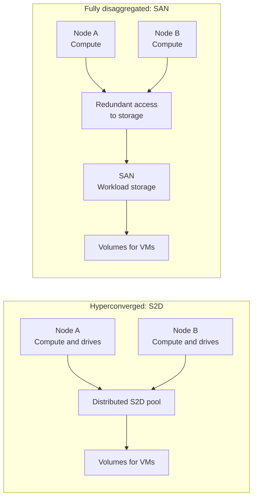
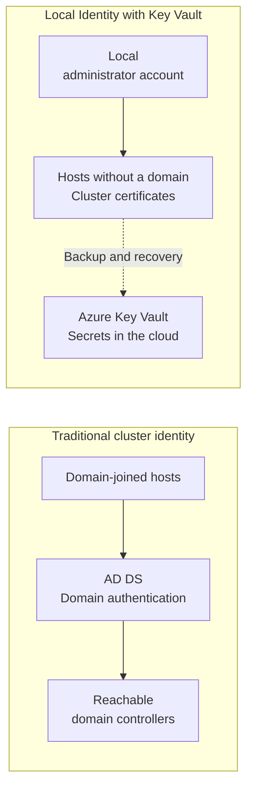

## Introduction: the hybrid model we knew had a limit

Picture a remote factory whose production applications must keep running when the connection to headquarters goes down. The company has a fully depreciated enterprise SAN, a team familiar with that storage, and few people on site. It wants to keep processing and data at the plant while using a management experience close to what it already knows from Azure. This discussion starts in the server room, well before anyone opens the portal.

This fictional scenario will follow us through the article. It captures a familiar question: how do you modernize management without throwing away useful infrastructure or adding dependencies that are difficult to maintain? Another cluster can be easy to approve in a budget and much harder to operate on a Sunday.

If you missed the name change, **Azure Local is the evolution of Azure Stack HCI**, renamed in November 2024. The platform runs applications on customer infrastructure; Azure Arc connects that infrastructure to Azure management. The rename appears in the [official 2024 release history](https://learn.microsoft.com/en-us/azure/azure-local/previous-releases/whats-new-24?wt.mc_id=studentamb_365381), and the [product overview](https://learn.microsoft.com/en-us/azure/azure-local/overview?wt.mc_id=studentamb_365381) explains this distributed approach.

Version 2604, released in April 2026, expanded the available storage and identity options. **This article examines that milestone rather than the latest release.** When checked on September 17, 2026, the [release history](https://learn.microsoft.com/en-us/azure/azure-local/release-information-23h2?wt.mc_id=studentamb_365381) already listed 2609, released on September 11. This sequence includes monthly updates, so assuming a quarterly cadence would be a poor basis for maintenance planning.

The goal is to leave with criteria for choosing S2D or SAN, AD or Local Identity. I assume familiarity with virtualization, storage, and Active Directory. This is a conceptual analysis based on documentation, without lab validation or a deployment procedure.

## The limits of the hyperconverged model

In hyperconverged infrastructure, the same servers provide compute, memory, and storage. **Storage Spaces Direct, or S2D**, organizes local drives across multiple nodes into distributed storage for cluster workloads. This design concentrates expansion and operations in a relatively uniform group of servers.

When the factory needs more nodes, it typically buys more CPU, RAM, and drives together. If memory runs out before storage capacity does, some new drives may sit underused. If data grows much faster than the VMs, the team may end up buying processing capacity it does not yet need.

There is an important technical qualification: **S2D does not require adding servers for every storage expansion**. Additional drives are possible when bays and the supported configuration allow them. The [S2D expansion documentation](https://learn.microsoft.com/en-us/windows-server/storage/storage-spaces/add-nodes?wt.mc_id=studentamb_365381) distinguishes adding servers from adding drives. The coupling matters most when scaling by nodes and when reaching the physical limits of the chosen design.

That is an architectural characteristic. For a small branch with balanced growth and no dedicated storage team, fewer components and a repeatable design may matter more than scaling each layer independently. I would still start many of those assessments with hyperconvergence.

At our factory, however, the SAN already serves other applications. It has spare capacity, redundant paths, and established maintenance procedures. In a design relying exclusively on S2D, that external capacity could not replace the drives in the pool. Modernizing the cluster meant justifying another purchase while a useful asset remained available.

A fully depreciated SAN also deserves an uncomfortable question: how much support coverage and useful performance does it have left? Book value tells you nothing about latency, failure risk, or spare parts availability. Reuse is a sound decision when the equipment can sustain the service throughout the planned operating period.

## Disaggregated architecture in version 2604

In 2604, SAN support reached general availability, or **GA**, and disaggregated deployment made it possible to use external storage alone. The [April release notes](https://learn.microsoft.com/en-us/azure/azure-local/whats-new?wt.mc_id=studentamb_365381#features-and-improvements-in-2604) record that change. The [SAN integration documentation](https://learn.microsoft.com/en-us/azure/azure-local/deploy/enable-external-storage?wt.mc_id=studentamb_365381) describes two ways to use the capability.

With **S2D + SAN**, the cluster retains its distributed storage and gains external volumes. The team chooses where to place each workload. The SAN remains an external layer, separate from the S2D pool, and any replication between them requires its own solution. At the factory, existing applications could remain on S2D while selected workloads use SAN volumes.

In **fully disaggregated mode**, workload storage lives on the SAN, without S2D. Servers provide compute and memory; the array provides persistence. Expanding one layer no longer requires a corresponding expansion of the other. Hosts still need system drives and must meet hardware requirements, so “SAN only” describes the cluster's storage architecture.

The diagram simplifies the paths to show the separation between layers. In the hybrid mode, nodes in the first design also access external volumes. It is not a cabling or sizing diagram; those details depend on the validated solution.

The scale limits also need to be distinguished. The [topology planning documentation](https://learn.microsoft.com/en-us/azure/azure-local/plan/cloud-deployment-network-considerations?wt.mc_id=studentamb_365381#decision-3-determine-cluster-topology) keeps HCI and S2D with additional SAN storage at up to 16 nodes. Disaggregated deployments support up to 64 nodes per cluster across one to eight racks, with up to 16 nodes per rack. Connecting a SAN to a hyperconverged cluster preserves the HCI category and limit.

That physical distribution belongs to the disaggregated model with up to 64 nodes. [Multi-rack deployments](https://learn.microsoft.com/en-us/azure/azure-local/multi-rack/multi-rack-overview?wt.mc_id=studentamb_365381) is a separate category: it uses preintegrated racks of compute, SAN storage, and networking, with a prescriptive configuration that can reach hundreds of servers in one instance. Either model requires the team to revisit networking and failure domains as it grows. For the factory, keeping production running through maintenance matters more than reaching the catalog's maximum scale.

The [official April 27 announcement](https://blogs.microsoft.com/blog/2026/04/27/microsoft-sovereign-private-cloud-scales-to-thousands-of-nodes-with-azure-local/?wt.mc_id=studentamb_365381) lists **Dell Technologies, HPE, Lenovo, NetApp, Hitachi Vantara, DataON, and Everpure** as partners for validated compute and storage platforms. A manufacturer's participation does not qualify every model it sells. The team must confirm the array, servers, adapters, firmware, and configuration against partner documentation and the Azure Local catalog.

Protocol support has a timeline too: the initial April support used Fibre Channel; iSCSI entered preview in 2605 and reached GA in 2607. The [2605 and 2607 release notes](https://learn.microsoft.com/en-us/azure/azure-local/whats-new?wt.mc_id=studentamb_365381#features-and-improvements-in-2607) document that progression. An iSCSI SAN should be assessed against that later support, without applying it retroactively to 2604.

The benefit is more appropriate sizing. Operational responsibility remains: controllers, access paths, and capacity must survive the failures the design accounts for. Disaggregation spreads decisions across layers and teams; someone still has to own the complete service.

## Local Identity: removing Active Directory from the cluster's critical path

April's other change is **Local Identity with Azure Key Vault**, previously known as AD-less deployment and offered in preview. Rack-aware clustering had already reached GA in [version 2601](https://learn.microsoft.com/en-us/azure/azure-local/whats-new?wt.mc_id=studentamb_365381#features-and-improvements-in-2601). In [2604](https://learn.microsoft.com/en-us/azure/azure-local/whats-new?wt.mc_id=studentamb_365381#features-and-improvements-in-2604), Local Identity reached GA and became supported with that topology as well.

In the traditional model, hosts depend on Active Directory Domain Services, or AD DS. This did not necessarily mean running domain controllers inside the cluster itself: they could run on external infrastructure. Local Identity removes the domain dependency for that specific deployment, including when its domain controllers would otherwise be at another location.

The mechanism combines **a local administrator account, certificate-based authentication within the cluster, and secret backups in Azure Key Vault**. The cloud vault stores recovery material, such as BitLocker keys. It does not replace a corporate directory or require a cloud lookup for every internal authentication. The [Local Identity overview](https://learn.microsoft.com/en-us/azure/azure-local/deploy/deployment-local-identity-with-key-vault-overview?wt.mc_id=studentamb_365381) explains this division of responsibilities.

There is concrete administration work involved: the team must create and maintain the local management account, which must not be the built-in Administrator account. The documentation calls for one vault per cluster and backups of recovery secrets. DNS is still required. These requirements appear in the [official deployment guide](https://learn.microsoft.com/en-us/azure/azure-local/deploy/deployment-local-identity-with-key-vault?wt.mc_id=studentamb_365381); what matters here is their operational consequence, without reproducing the steps.

The diagram compares dependencies without describing every protocol exchange. The Key Vault arrow represents secret protection and recovery. It does not place the vault in the path of every VM operation.

For **OT, operational technology**, the opportunity is to reduce identity infrastructure maintained solely to support the cluster. At a remote plant, allowing communication with the headquarters domain or maintaining additional controllers can require changes to segmentation, maintenance, and ownership. Removing that need can simplify a project that already has few operators.

My view is that the savings should be measured in operational dependencies, beyond simply counting removed VMs. Before choosing Local Identity, I would take this checklist into the architecture review:

- Who recovers the environment?
- Who monitors certificates and failed secret backups?
- Who can access the vault during an incident?

[Microsoft's architecture guidance](https://learn.microsoft.com/en-us/azure/well-architected/service-guides/azure-local?wt.mc_id=studentamb_365381) recommends restricting access to secrets and monitoring integration failures. The factory needs to turn those questions into clear responsibilities.

Applications keep their own requirements. A VM that needs domain authentication still needs AD, even if its host uses Local Identity. If the factory already has a well-run domain and applications that depend on it, keeping the traditional model may be simpler. Removing AD from the cluster does not amount to removing it from the company.

## Where this matters: sovereignty and the edge

Sovereignty involves deciding where data, secrets, and operational control reside, as well as who can administer them. Concrete requirements must come before architecture. Having servers inside the building does not, by itself, answer those questions.

In a connected environment, Azure Arc provides consistent management for local infrastructure. Part of the control plane continues to use Azure for management services, telemetry, or secrets. For operation without a connection to the public cloud, **disconnected operations** provides a local control plane with its own requirements. The [documentation for this model](https://learn.microsoft.com/en-us/azure/azure-sovereign-clouds/private/azure-local/disconnected-operations-overview?wt.mc_id=studentamb_365381) makes that distinction explicit.

Local Identity with **Key Vault in the cloud** therefore remains a connected design. Combining it with disaggregated SAN storage, disconnected operations, and Azure services depends on the support matrix for each deployment model. “We need sovereignty” still has to become a verifiable description of permitted data and management flows.

The following examples are possible designs, rather than reports of validated deployments. In government or defense, I would first establish whether the requirement covers data residency alone or also local control and no external connectivity. That answer may change the deployment model before storage selection even begins.

In manufacturing, our factory may simply need applications to keep running through connection outages, with authorized management communication. The discussion then concerns continuity, OT segmentation, and recovery. Treating that requirement as permanent isolation would introduce restrictions nobody may have asked for.

In hospitals, I would assess clinical application processing, image storage, and authentication dependencies separately. If those components grow at different rates, a supported SAN deserves consideration. The decision would still depend on each service's availability requirements.

At branch offices, repeatability and remote support may matter more than scale. A location without a SAN or specialist staff may benefit from compact HCI. Choosing the same topology everywhere for purchasing convenience can shift complexity onto the people handling incidents.

None of these sectors needs to adopt an architecture simply because it reached GA. The advance matters when it satisfies a requirement that previously demanded duplicate infrastructure or an inconvenient dependency.

## What is not ready yet, and why that is normal

The hybrid S2D + SAN path also has two design constraints. The SAN is attached as a [day-2 operation](https://learn.microsoft.com/en-us/azure/azure-local/plan/cloud-deployment-network-considerations?wt.mc_id=studentamb_365381#hybrid-storage-s2d-plus-external-san): first deploy the standard HCI cluster with S2D, then connect the external storage. This hybrid configuration also does not support rack-aware clusters. For the factory, that affects the migration sequence and prevents the team from treating both capabilities as options that can be combined from the initial deployment.

There is a significant networking limitation: **SDN managed through Azure Arc is not supported in fully disaggregated SAN mode in 2604**. The [current planning guidance](https://learn.microsoft.com/en-us/azure/azure-local/plan/cloud-deployment-network-considerations?wt.mc_id=studentamb_365381#decision-11-determine-software-defined-networking-sdn) continues to direct that architecture to SDN in the external fabric and reserves Microsoft SDN for HCI. Native SDN managed through Windows Admin Center exists in [compatible scenarios](https://learn.microsoft.com/en-us/azure/azure-local/concepts/software-defined-networking-23h2?wt.mc_id=studentamb_365381), but should not be presented as a universal alternative for SAN-only deployments. The [Local Identity overview](https://learn.microsoft.com/en-us/azure/azure-local/deploy/deployment-local-identity-with-key-vault-overview?wt.mc_id=studentamb_365381#unsupported-or-limited-support-tools) also states that Windows Admin Center is unsupported with this identity model. The factory must validate the combination of storage, networking, identity, and tools, rather than adding up separately announced capabilities.

Working through the difference between an announcement and a supported configuration is part of the job. GA marks a capability's release status and availability; it does not make every management path equivalent. I would read the documentation for the specific topology and record the version reviewed before approving the design.

## Back to the factory: how to decide

The factory does not have to select storage and identity as a single package. I would work through the decision in four steps, using evidence the team can discuss.

1. **Measure the imbalance.** Gather memory usage, processing demand, capacity, latency, and expected growth. If the current environment performs well and grows evenly, keeping S2D avoids a migration without demonstrated benefit. Where free bays exist, assess supported drive expansion before changing the architecture.
2. **Qualify the existing SAN.** Confirm support coverage, useful life, capacity during failures, and redundant path operation. S2D + SAN makes sense when retaining the cluster and placing selected workloads on external storage meets the need. That leaves two storage systems to operate, which must fit the team's capacity. Because the SAN is attached on day 2, the schedule must also preserve the initial HCI deployment.
3. **Justify full disaggregation.** Consider it when compute and data grow at different rates, the SAN has useful life ahead, and scale or operations justify separating the layers. Establish who investigates each failure, how workloads will move, and how the service will recover before retiring the source environment.
4. **Choose identity around dependencies.** Keep AD when it already serves the environment and required tools well. Assess Local Identity when maintaining a domain for hosts would be a significant operational cost, provided connectivity, secrets, recovery, and tooling meet the site's requirements.

The outcome should fit into a short architecture decision: selected topology, rationale, supported configurations, owners, and conditions that would trigger a review. For migration, I would ask for acceptance criteria tied to the application and a rollback strategy that preserves data. This article does not demonstrate those outcomes; they need to be verified in the company's environment.

My conclusion for the factory is conditional: a healthy SAN and uneven growth justify investigating disaggregation. Healthy HCI, a small team, and balanced expansion justify staying with S2D. Local Identity becomes compelling when it removes an unnecessary dependency while respecting the chosen connectivity and management model.

The hybrid renaissance lies in that greater freedom of design. Microsoft has expanded the available options. The essential competence still belongs to the team: understanding storage, networking, and identity, recognizing their limits, and explaining why a particular combination keeps production running.

## References

Primary sources checked on September 17, 2026. Links in the body connect individual claims to the relevant documentation; these are the main pages to revisit when reviewing a design before deployment:

- [Azure Local release history](https://learn.microsoft.com/en-us/azure/azure-local/release-information-23h2?wt.mc_id=studentamb_365381).
- [What's new, including the 2604 and 2607 milestones](https://learn.microsoft.com/en-us/azure/azure-local/whats-new?wt.mc_id=studentamb_365381).
- [Disaggregated deployment overview](https://learn.microsoft.com/en-us/azure/azure-local/overview/disaggregated-overview?wt.mc_id=studentamb_365381).
- [Multi-rack deployments overview](https://learn.microsoft.com/en-us/azure/azure-local/multi-rack/multi-rack-overview?wt.mc_id=studentamb_365381).
- [External storage integration](https://learn.microsoft.com/en-us/azure/azure-local/deploy/enable-external-storage?wt.mc_id=studentamb_365381).
- [Topology and network planning](https://learn.microsoft.com/en-us/azure/azure-local/plan/cloud-deployment-network-considerations?wt.mc_id=studentamb_365381).
- [Local Identity with Azure Key Vault](https://learn.microsoft.com/en-us/azure/azure-local/deploy/deployment-local-identity-with-key-vault-overview?wt.mc_id=studentamb_365381).
- [Disconnected operations and sovereignty](https://learn.microsoft.com/en-us/azure/azure-sovereign-clouds/private/azure-local/disconnected-operations-overview?wt.mc_id=studentamb_365381).
