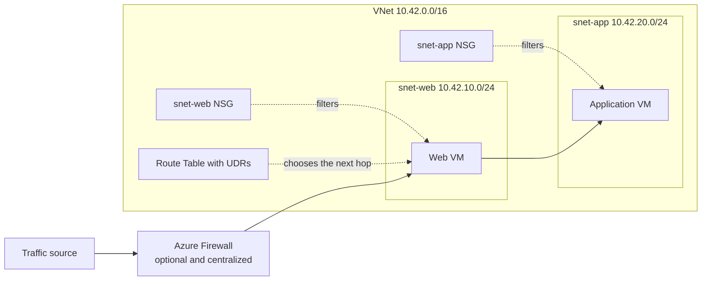
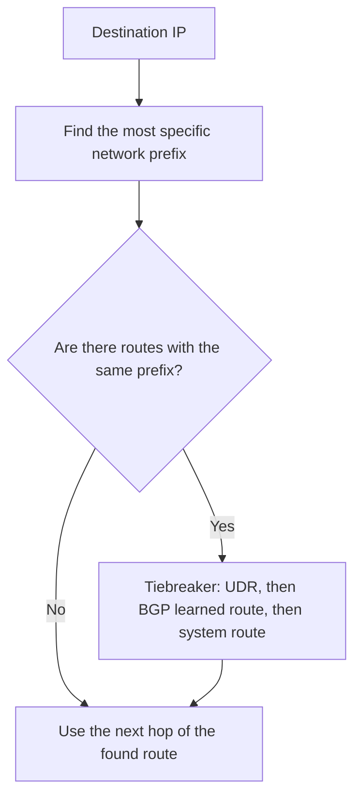
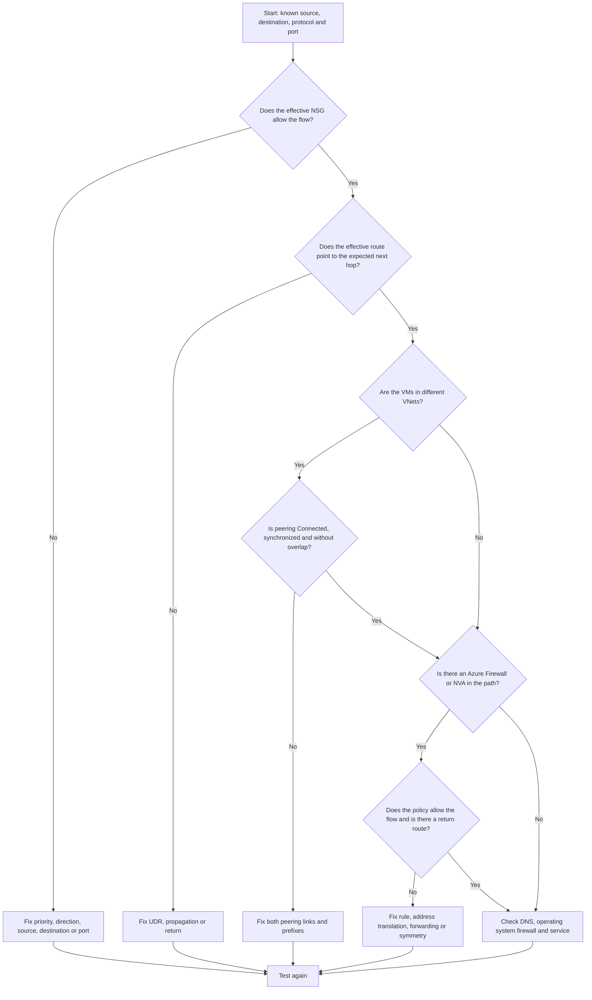

A virtual machine can't talk to another. The natural reaction is to open the portal, stare at fifteen network options and click on something until the icon turns green. It is a strategy similar to pressing all the elevator buttons to get there faster: there's a lot of movement, but it doesn't improve the diagnosis.

Four components explain a good part of the basic connectivity in Azure: **Virtual Network (VNet)**, **subnet**, **Network Security Group (NSG)** and **Route Table**, also called a route table when it contains routes defined by the user, the **User Defined Routes (UDRs)**.

In this article, you will understand the role of each piece, plan IP ranges, build a lab with Azure CLI and follow a predictable order when two VMs refuse to talk.

## Expected result and lab environment

At the end, you will have a VNet `10.42.0.0/16` with a private subnet `10.42.10.0/24`, an NSG associated with the subnet and a Route Table with a drop route to the internet. The lab does not create VMs, NAT Gateway, public IP or Azure Firewall.

You need:

- an Azure subscription intended for studies;
- updated Azure CLI or the Azure Cloud Shell Bash mode;
- **Network Contributor** permission and permission to create the resource group;
- a region authorized by your organization.

> [!IMPORTANT]
> Since the API versions after March 31, 2026, new subnets are private by default and a VM does not receive implicit public outbound access. A route with a next hop of `Internet` also does not create **Source Network Address Translation (SNAT)**, the exchange of the source private IP for a valid address for outbound access. When necessary, configure an explicit method, such as NAT Gateway, outbound rules of a Load Balancer, Azure Firewall or a directly associated public IP.

## Diagrams: how the pieces fit together

Think of the VNet as the grounds of a condominium. The subnets are the streets, the NSG is the security gate and the Route Table is the map app. The map chooses the path, but it doesn't convince the security guard to let you in. If the street ends at a wall, yelling "but the GPS said to turn here" doesn't help either.


The illustration reinforces the analogy. The diagram below separates the technical responsibilities, because no server accepts "I thought the security gate solved it" as a valid configuration.



Azure creates system routes automatically. In hybrid networks, a gateway can also learn paths via **Border Gateway Protocol (BGP)**, a protocol used by routers to announce which networks they can reach. You don't need to configure BGP in this lab. For now, just know that it can add routes to the dispute.

When multiple routes reach the same destination, the selection happens like this:



There are exceptions related to the VNet itself, to private connections between VNets called **peerings**, and to **service endpoints**, which connect the subnet to compatible services. Check the **effective routes** of the network interface, or **NIC**, the virtual card of the resource. The portal shows the card; the effective route tells where the packet will actually wander.

## VNet: the application's private space

The **Virtual Network**, or VNet, is an isolated logical network in an Azure region. It defines one or more address spaces and allows connecting resources to each other, to other VNets, to on-premises networks or to the internet through appropriate components.

Two subnets in the same VNet do not form an automatic security barrier. By default, resources can communicate. If web, application and database need different policies, design the separation with NSGs, routes and, when necessary, centralized inspection.

Choose blocks that do not collide with:

- other VNets that might use peering;
- office or datacenter networks connected by VPN or ExpressRoute;
- other clouds that will participate in the architecture;
- ranges reserved for growth.

Renumbering a network in production is possible, but it has the charm of replacing the plumbing with the building occupied.

## Subnet: a division with a purpose

A **subnet** is a smaller range within the VNet space. The NIC of a VM connects to a subnet, and it is on the subnet that you associate the Route Table and, usually, the NSG shared by the tier.

Separate subnets by function or security requirement, not by a taste for long lists. Web, application, data and platform component tiers might need different rules, routes and sizes. Some services require dedicated names and prefixes, like `AzureFirewallSubnet` for Azure Firewall and `GatewaySubnet` for VPN Gateway or ExpressRoute Gateway.

In IPv4, Azure reserves five addresses from each subnet: the first four and the last one. A `/24` contains 256 addresses, but offers 251 for resources. Also size for updates, automatic scaling and temporary instances.

## CIDR addressing examples

**Classless Inter-Domain Routing (CIDR)** combines the network address with the prefix size. The larger the number after the slash, the smaller the range. A `/16` is larger than a `/24`, even though the number seems to want to play a trick on the beginner.

| Use                     | CIDR             | Total addresses | Available for resources in Azure |
| ----------------------- | ---------------- | --------------: | -------------------------------: |
| Lab VNet                | `10.42.0.0/16`   |          65,536 |      Divided among the subnets   |
| Web tier                | `10.42.10.0/24`  |             256 |                              251 |
| Application tier        | `10.42.20.0/24`  |             256 |                              251 |
| Data tier               | `10.42.30.0/24`  |             256 |                              251 |
| Future Azure Firewall   | `10.42.100.0/26` |              64 |                               59 |

The four subnets fit inside `10.42.0.0/16` and do not overlap. The remaining space allows growing without changing all IPs. Size requirements vary by service and capacity variant, so validate the documentation before deployment.

If the datacenter already uses `10.42.20.0/24`, creating `10.42.0.0/16` in Azure causes an overlap because the smaller range is contained in the larger one.

## NSG: who can talk, to whom and on what port

The **Network Security Group** is a traffic filter with inbound and outbound rules. It doesn't read intent, LinkedIn job titles, or the "it's urgent" message sent in chat. Each rule considers source, source port, destination, destination port and protocol, and then allows or denies the flow.

Custom rules use priorities from `100` to `4096`. **The lower the number, the higher the priority.** Processing stops at the first match, so a `200` deny beats a `300` allow. Creating another rule down there to "compensate" for the first one is like negotiating with an automatic door.

The NSG has a good memory, a characteristic called **stateful**. If it let you out to buy bread, it opens the door for the return of the same trip. It is not necessary to create a rule just for the return. This does not authorize a new visit initiated from the other side: accompanying you to the gate does not turn the baker into a resident.


### NSG on the NIC or on the subnet?

You can associate NSGs to the subnet, to the NIC or to both:

- on inbound, Azure first processes the subnet NSG and then the NIC NSG;
- on outbound, it first processes the NIC NSG and then the subnet NSG;
- when they exist at both levels, the traffic must be allowed by both;
- a relevant deny at any level blocks the new flow.

Use the subnet NSG for common policies and the NIC NSG only for justifiable exceptions. Two levels mean two guards looking at the list. Rules scattered across dozens of NICs become a treasure hunt, with a late night in the portal as a prize.

Default rules include allowances for VNet traffic and a final inbound deny. Custom rules are evaluated before them. Furthermore, an `AllowInternetOutBound` outbound rule does not provide public connectivity alone: a valid route and an explicit outbound method are still needed.

## Routes: where the packet should go

A route answers two questions: what is the destination prefix and what is the next hop. The packet doesn't sniff out the destination or ask for information at the gas station. Azure creates system routes for the VNet itself, for the internet and for other enabled network resources.

A **User Defined Route (UDR)** changes this path. It can send traffic to an Azure Firewall, pass through a **Network Virtual Appliance (NVA)**, a virtual appliance that works as a router or firewall, or drop a range with `None`. A well-planned UDR is a GPS. A wrong UDR is a sign pointing to an empty lot.

The Route Table is associated with one or more subnets, not the entire VNet or directly to the NIC. For each packet that leaves the subnet, Azure looks for the most specific prefix. A `10.42.20.0/24` route beats a `10.42.0.0/16` route for the destination `10.42.20.7`. Only when the prefixes are equal does the route origin break the tie, normally in the order of UDR, BGP and system route.

> [!WARNING]
> A UDR is not a firewall rule. Pointing `0.0.0.0/0` to an appliance also does not guarantee connectivity. The appliance needs to exist, forward packets, allow the flow and possess a coherent return path.

## When to use what: NSG vs Route Table vs Azure Firewall

NSG, UDR and Azure Firewall are not three sizes of the same lock. One filters, another chooses the path and the third inspects centrally. The Firewall also understands **Fully Qualified Domain Names (FQDNs)**, full names like `api.example.com`.

| Component              | Main question                                        | Common scope                      | Use when                                                                                                                  | Do not use as a substitute for                                  |
| ---------------------- | ---------------------------------------------------- | --------------------------------- | ------------------------------------------------------------------------------------------------------------------------- | --------------------------------------------------------------- |
| NSG                    | Can this flow pass?                                  | Subnet and exceptionally NIC      | You need to filter IP, port and protocol in a distributed way                                                             | Routing, inspection by FQDN or web application protection       |
| Route Table with UDR   | Which next hop should the packet follow?             | Subnet                            | You need to force passage through a firewall or NVA, use a gateway or drop a range                                        | Stateful control or content analysis                            |
| Azure Firewall         | Should central traffic be inspected and logged?      | Central VNet with dedicated subnet| You need centralized policies, network and application rules, FQDN, threat intelligence or Premium features               | Basic segmentation that an NSG solves with less complexity      |

The three can work together: the UDR takes the packet to the Firewall, it inspects it, and the NSG limits each tier. Duplicating rules produces three guards with three different spreadsheets. Define who decides what.

## Ready commands in Azure CLI

The scenario creates a private network and adds a `0.0.0.0/0` UDR with a `None` next hop. This route explicitly drops traffic destined for the internet. It serves to make the effect of the Route Table easy to observe and is not a universal recipe for production. Copy the commands, but don't turn off your brain on autopilot: confirm subscription, region and names before executing.

Replace `<SUBSCRIPTION_ID>` and confirm the region:

```bash title="Set the lab context"
SUBSCRIPTION_ID="<SUBSCRIPTION_ID>"
RESOURCE_GROUP="rg-beginner-networks"
LOCATION="brazilsouth"
VNET_NAME="vnet-lab-networks"
SUBNET_NAME="snet-app"
NSG_NAME="nsg-snet-app"
ROUTE_TABLE_NAME="rt-snet-app"

az account set --subscription "$SUBSCRIPTION_ID"

az account show \
  --query "{subscription:name, subscriptionId:id, tenantId:tenantId}" \
  --output table
```

Stop if the subscription or tenant are not as expected. Next, create the components:

```bash title="Create VNet, NSG, Route Table and subnet"
az group create \
  --name "$RESOURCE_GROUP" \
  --location "$LOCATION" \
  --tags environment=lab managed-by=azure-cli

az network vnet create \
  --resource-group "$RESOURCE_GROUP" \
  --name "$VNET_NAME" \
  --location "$LOCATION" \
  --address-prefixes 10.42.0.0/16

az network nsg create \
  --resource-group "$RESOURCE_GROUP" \
  --name "$NSG_NAME" \
  --location "$LOCATION"

az network nsg rule create \
  --resource-group "$RESOURCE_GROUP" \
  --nsg-name "$NSG_NAME" \
  --name allow-https-from-vnet \
  --priority 200 \
  --direction Inbound \
  --access Allow \
  --protocol Tcp \
  --source-address-prefixes VirtualNetwork \
  --source-port-ranges "*" \
  --destination-address-prefixes "*" \
  --destination-port-ranges 443

az network route-table create \
  --resource-group "$RESOURCE_GROUP" \
  --name "$ROUTE_TABLE_NAME" \
  --location "$LOCATION"

az network route-table route create \
  --resource-group "$RESOURCE_GROUP" \
  --route-table-name "$ROUTE_TABLE_NAME" \
  --name drop-internet \
  --address-prefix 0.0.0.0/0 \
  --next-hop-type None

az network vnet subnet create \
  --resource-group "$RESOURCE_GROUP" \
  --vnet-name "$VNET_NAME" \
  --name "$SUBNET_NAME" \
  --address-prefixes 10.42.10.0/24 \
  --network-security-group "$NSG_NAME" \
  --route-table "$ROUTE_TABLE_NAME"

az network vnet subnet update \
  --resource-group "$RESOURCE_GROUP" \
  --vnet-name "$VNET_NAME" \
  --name "$SUBNET_NAME" \
  --default-outbound false
```

The subnet update leaves private outbound explicit in a separate operation. Even with the new standard, we do this because the API version, the interface used by the CLI to talk to Azure, can vary between environments. Declaring the intent is more predictable than relying on implicit behavior. The HTTPS rule is educational and makes the intent explicit, although internal traffic can already be reached by the default `AllowVNetInBound` rule. In production, create rules only when they express a necessary policy. A decorative rule is just another line to investigate when everything is red.

Validate the associations and not just the `Succeeded` return:

```bash title="Validate the configuration"
az network vnet subnet show \
  --resource-group "$RESOURCE_GROUP" \
  --vnet-name "$VNET_NAME" \
  --name "$SUBNET_NAME" \
  --query "{prefix:addressPrefix, defaultOutbound:defaultOutboundAccess, nsg:networkSecurityGroup.id, routeTable:routeTable.id}" \
  --output json

az network nsg rule list \
  --resource-group "$RESOURCE_GROUP" \
  --nsg-name "$NSG_NAME" \
  --query "[].{name:name, priority:priority, direction:direction, action:access, port:destinationPortRange}" \
  --output table

az network route-table route list \
  --resource-group "$RESOURCE_GROUP" \
  --route-table-name "$ROUTE_TABLE_NAME" \
  --output table
```

When there is a running VM, replace the values and query the effective controls of the NIC:

```bash title="Query effective NSGs and routes of a NIC"
az network nic list-effective-nsg \
  --resource-group "<VM_RESOURCE_GROUP>" \
  --name "<NIC_NAME>" \
  --output json

az network nic show-effective-route-table \
  --resource-group "<VM_RESOURCE_GROUP>" \
  --name "<NIC_NAME>" \
  --output table
```

## Checklist of common errors

Use the list before opening an `Any` rule and declaring victory. That kind of victory usually lasts until the first audit.

- [ ] **NSG on NIC vs subnet:** check both levels and both directions. The flow must be allowed by both.
- [ ] **Overlapping CIDR in peering:** compare all prefixes. `10.0.0.0/16` contains `10.0.1.0/24`, even if the texts look different.
- [ ] **System route vs UDR:** look for the most specific prefix. In a tie, UDR normally beats BGP and system. Check the effective routes.
- [ ] **NSG order:** lower number has higher priority, and the first match ends the evaluation.
- [ ] **Transitive peering:** if A connects to B and B connects to C, A does not gain access to C. A network doesn't work through mutual friends.
- [ ] **Forgotten private outbound:** NSG allowing internet and `Internet` route do not create SNAT. Configure explicit outbound.
- [ ] **DNS confused with network:** compare the IP test with the name test before blaming "the cloud".
- [ ] **Ignored application:** confirm process, operating system firewall and listening address. An open gate doesn't make the store open.

## Troubleshooting flowchart: why are my VMs not communicating?

This is an order of investigation, not a literal representation of all the internal steps of the packet. Always test specific IP, protocol and port. The flowchart avoids the esoteric method of changing three things, restarting the VM and attributing the cure to the last of them.



Network Watcher can test IP flow and show the next hop. Effective routes and NSGs are especially useful because they combine subnet, NIC, system and hybrid connectivity settings.

## Mini-glossary: networks translated to everyday life

If the documentation looks like a meeting where everyone agreed to use acronyms to save vowels, this table brings the pieces back to the real world.

| Term           | Practical translation                                                                     |
| -------------- | ----------------------------------------------------------------------------------------- |
| VNet           | The private land where your network streets exist                                         |
| Subnet         | A street or sector reserved for a type of resource                                        |
| NIC            | The network port of the resource, with its IP addresses                                   |
| NSG            | The security gate that allows or denies by source, destination, protocol and port         |
| CIDR           | The compact way of writing where a network starts and what its size is                    |
| Route Table    | The collection of path instructions associated with the subnet                            |
| UDR            | A route instruction created by you to change the default path                             |
| Next hop       | The next point to which the packet will be delivered                                      |
| Peering        | A direct private connection between two VNets, without automatic transitivity             |
| BGP            | The protocol by which routers announce to each other which networks they can reach        |
| Azure Firewall | A central inspection post with advanced policies and logs                                 |
| NVA            | A network virtual appliance, like a firewall or router from a vendor                      |
| SNAT           | The exchange of the source private IP for a valid address to exit the network             |

## Quick cost guide

The VNet has no charge of its own, and NSGs and UDRs do not deploy compute capacity billed per hour. The invoice, however, does not accept "it was just a test" as a discount coupon. The cost appears in the services and traffic you connect to the network.

Keep an eye out mainly for:

- volume and direction of data in VNet peering, including billing on both sides depending on the type of peering;
- transfer between regions, zones and outbound to the internet;
- deployment hours and volume processed by Azure Firewall, NAT Gateway, VPN gateways, ExpressRoute, Bastion and appliances;
- SKU, the service edition, and Azure Firewall features, like Premium capabilities;
- quantity and type of public IP addresses;
- ingestion, retention and querying of logs in Azure Monitor and Log Analytics workspaces;
- region, currency, agreement and benefits applicable to the subscription.

Don't memorize a value seen in an old screenshot, especially if it came accompanied by "in my time it was like this". For current numbers, configure region, SKU and volume in the [official Azure Pricing Calculator](https://azure.microsoft.com/pricing/calculator/?wt.mc_id=studentamb_365381) and also check the [Virtual Network pricing page](https://azure.microsoft.com/pricing/details/virtual-network/?wt.mc_id=studentamb_365381).

## Security, impact and rollback

Before changing NSGs or routes in production, log the expected flow and check the effective configuration. Production is a terrible escape room. A wrong UDR can detour an entire subnet. A high-priority deny can stop new connections, while existing stateful sessions still remain for some time and make it seem like the new rule "didn't take".

To remove the lab, first list the contents and confirm the subscription:

```bash title="Review and remove the lab"
az account show \
  --query "{subscription:name, subscriptionId:id, tenantId:tenantId}" \
  --output table

az resource list \
  --resource-group "$RESOURCE_GROUP" \
  --query "[].{name:name, type:type, location:location}" \
  --output table

az group delete \
  --name "$RESOURCE_GROUP" \
  --yes
```

Deleting the group removes all resources contained in it. Do not run the last command if the listing shows something that needs to be preserved. The `--yes` skips Azure's question, not the responsibility of whoever pressed Enter.

## References

**Concepts and planning**

- [Azure Virtual Network overview](https://learn.microsoft.com/azure/virtual-network/virtual-networks-overview?wt.mc_id=studentamb_365381)
- [Virtual networks and subnets](https://learn.microsoft.com/azure/networking/design-guide/vnets-subnets?wt.mc_id=studentamb_365381)
- [Network Security Groups overview](https://learn.microsoft.com/azure/virtual-network/network-security-groups-overview?wt.mc_id=studentamb_365381)
- [Virtual network traffic routing](https://learn.microsoft.com/azure/virtual-network/virtual-networks-udr-overview?wt.mc_id=studentamb_365381)
- [Virtual network peering overview](https://learn.microsoft.com/azure/virtual-network/virtual-network-peering-overview?wt.mc_id=studentamb_365381)
- [Default outbound access in Azure](https://learn.microsoft.com/azure/virtual-network/ip-services/default-outbound-access?wt.mc_id=studentamb_365381)
- [What is Azure Firewall?](https://learn.microsoft.com/azure/firewall/overview?wt.mc_id=studentamb_365381)

**Operations and diagnostics**

- [Create and manage route tables](https://learn.microsoft.com/azure/virtual-network/manage-route-table?wt.mc_id=studentamb_365381)
- [Diagnose a virtual machine routing problem](https://learn.microsoft.com/azure/virtual-network/diagnose-network-routing-problem?wt.mc_id=studentamb_365381)
- [Azure CLI reference for VNet](https://learn.microsoft.com/cli/azure/network/vnet?view=azure-cli-latest&wt.mc_id=studentamb_365381)
- [Azure CLI reference for subnets](https://learn.microsoft.com/cli/azure/network/vnet/subnet?view=azure-cli-latest&wt.mc_id=studentamb_365381)

## Conclusion

VNet defines the space, subnet organizes, NSG filters and route chooses the path. Azure Firewall comes in when inspection needs to be centralized and deeper. This separation of responsibilities eliminates a good part of the confusion.

When two VMs don't communicate, resist the ritual of allowing everything to `Any`. Define the flow, check effective NSGs and routes, validate peering and only then investigate the firewall and the operating system. Networking becomes much less mysterious when each component answers one question at a time.

Now it's your turn: run the lab, check the effective NSGs and routes and try to predict the outcome before changing a rule. If the packet obeys your prediction, share this article with someone who still blames "the network" by reflex.
