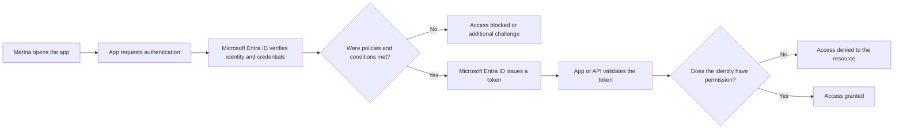

It's 8:57 AM on Marina's first day. The corporate account just arrived and in a few minutes she needs to access Outlook, join a Teams meeting, and open a document in SharePoint.

For Marina, there is only one sign-in screen. For the tech team, however, several questions need to be answered: does the account really belong to her? Should a second factor be requested? Is the device trusted? Can she open that file? And who will log this access attempt?

**Microsoft Entra ID** is at the center of these decisions. It works as the identity and access service that connects people, devices, applications, and resources in the cloud. It's not just a list of users and it's also not "the Microsoft 365 password": it's the control plane that helps decide **who or what can access which resource, under what conditions**.

In this article, you will build a mental map of Microsoft Entra ID, follow the path of a sign-in, and do a safe, read-only reconnaissance of your environment.

## The expected outcome

By the end of the reading, you should be able to:

- explain what identity, tenant, authentication, and authorization are;
- differentiate Microsoft Entra ID, Active Directory Domain Services, and Azure subscription;
- recognize users, groups, devices, and applications in a tenant;
- understand, at a conceptual level, where MFA, Conditional Access, roles, and tokens participate in a sign-in;
- navigate the admin center without changing the environment.

The goal isn't to turn you into an identity administrator in a single read. It's to deliver a reliable foundation so that the upcoming menus, alerts, and projects stop looking like disconnected pieces.

## Before you start

For the practical reconnaissance, you will need:

- a work or school account in a lab tenant;
- an updated browser;
- access to the [Microsoft Entra admin center](https://entra.microsoft.com/);
- permission to view the mentioned areas.

A regular account might not see all menus or details. Options also vary based on assigned roles, licenses, and tenant configurations. This does not prevent the conceptual reading.

Microsoft portals evolve continuously, so menu names and positions might change. If the interface looks different, look for the equivalent area and check the current documentation before concluding that a feature is unavailable.

> [!CAUTION]
> Do not use a production tenant to test changes. Creating policies, swapping authentication methods, or removing permissions can lock out users and administrators. This article's script is read-only.

## After all, what is Microsoft Entra ID?

Microsoft Entra ID is an **identity and access management** service, also known by the acronym IAM, hosted in the cloud. It provides authentication, policy enforcement, and access protection for users, devices, applications, and resources.

If your organization uses Microsoft 365, Azure, Dynamics 365, Power Platform, or Intune, it already uses a Microsoft Entra tenant. It was the one, for example, that recognized Marina's account before Teams loaded.

You will still find the name **Azure Active Directory**, **Azure AD**, or **AAD** in older materials, scripts, and conversations. Microsoft Entra ID is the new name for Azure AD. The rebranding didn't transform the service into another product and didn't change, by itself, features, pricing, or contracts.

There is an important distinction: **Microsoft Entra** is the family of identity and access products, while **Microsoft Entra ID** is one product within that family.

## Identity is not synonymous with password

A digital identity is the set of attributes that represents someone or something in a system. Name, unique identifier, department, job title, and authentication methods can be part of this representation.

The password is just one possible **credential** used to prove an identity. It is not the identity itself.

In Microsoft Entra ID, you will mainly find:

- **users**, such as employees, students, and guests;
- **groups**, used to gather identities and manage access at scale;
- **devices**, like registered or joined laptops and mobile phones;
- **workload identities**, used by applications, services, scripts, and automations;
- **applications**, which can trust Microsoft Entra ID to perform sign-in and gain access to APIs.

This separation matters. If Marina eventually configures an automation to access a secret vault, for example, the ideal approach won't be borrowing a person's account and password. The workload should have its own identity, with only the necessary permissions.

## The tenant is the home of identities

A **tenant** is a dedicated instance of Microsoft Entra ID that represents an organization. It stores objects like users, groups, devices, and app registrations, as well as access policies and configuration data.

Think of the tenant as the condominium in Marina's story:

- the condominium is the organization;
- the registry of residents and service providers represents the identities;
- the front desk rules represent the policies;
- each common area or apartment represents a resource;
- the entry logs represent the logs.

Each tenant has a unique identifier, the **Tenant ID**, and receives an initial domain similar to `contoso.onmicrosoft.com`. The organization can add custom domains, like `company.com`.

The same person can exist in more than one tenant. Marina could be a member in her own company's tenant and a guest in a partner's tenant. This is a typical **B2B collaboration** scenario, a Microsoft Entra External ID feature that allows external users to access shared applications and resources using their own credentials.

B2B and `UserType: Guest` are not absolute synonyms: the user type represents the person's relationship with the tenant, while the identity source indicates where they authenticate. In any case, each organization remains responsible for the policies and access to its own resources.

### Tenant is not an Azure subscription

These concepts appear together, but they are not equivalent:

| Concept                      | Main purpose                            | Examples of what it contains or controls                                 |
| ---------------------------- | --------------------------------------- | ------------------------------------------------------------------------ |
| Microsoft Entra tenant       | Identity and access boundary            | Users, groups, applications, devices, directory roles, and policies      |
| Azure subscription           | Resource, billing, and quota boundary   | Virtual machines, networks, databases, vaults, and storage accounts      |

An Azure subscription maintains a trust relationship with a tenant to authenticate identities. Still, creating a user in the tenant does not automatically grant access to the subscription's resources.

## Microsoft Entra ID is not the on-premises Active Directory

The old name, Azure Active Directory, led many people to imagine that the service would just be a domain controller hosted in the cloud. It's not.

| Aspect                   | Active Directory Domain Services                                | Microsoft Entra ID                                                                  |
| ------------------------ | --------------------------------------------------------------- | ----------------------------------------------------------------------------------- |
| Main design              | Identity and administration for domain-based on-premises setups | Identity and access to applications and resources in the cloud and hybrid setups    |
| Common protocols         | Kerberos, NTLM, and LDAP                                        | OpenID Connect, OAuth 2.0, SAML, and WS-Federation                                  |
| Administrative structure | Domains, forests, and organizational units                      | Tenants, objects, groups, roles, and policies                                       |
| Devices                  | Domain join and Group Policy                                    | Microsoft Entra join or registration and integration with device management         |
| Applications             | Strong integration with traditional resources and applications  | SSO and access control for Microsoft 365, Azure, SaaS, and modern applications      |

The two solutions can coexist. Hybrid organizations can synchronize identities from the on-premises Active Directory to Microsoft Entra ID. Applications that rely on LDAP, Kerberos, NTLM, or Group Policy still require a compatible architecture, like Active Directory Domain Services or, in specific scenarios, Microsoft Entra Domain Services.

In short: Microsoft Entra ID is not an automatic, feature-by-feature replacement for the on-premises Active Directory.

## Authentication and authorization: two different questions

Imagine an event badge:

1. at the entrance, the staff checks your documents to know **who you are**;
2. later, the color of your wristband determines **which areas you can access**.

The first step is **authentication**. The second is **authorization**.

- **Authentication (AuthN):** proves that the presented identity is legitimate.
- **Authorization (AuthZ):** grants or denies an action on a given resource.

Marina could authenticate correctly with a password and Microsoft Authenticator and still not be authorized to open the payroll. A successful sign-in does not mean unrestricted access.

### Where MFA comes in

Multifactor authentication, or MFA, requires evidence from different categories. The factors are typically:

- something you **know**, like a password or PIN;
- something you **have**, like a phone or a security key;
- something you **are**, like a biometric trait.

Two pieces of data from the same category don't necessarily make MFA. Password and secret question, for instance, are still two things the person knows.

Methods also offer different resistances. Passwords, SMS, and codes can be targets of social engineering. FIDO2 passkeys and security keys use cryptography tied to the legitimate service and are phishing-resistant options. The choice should consider risk, licensing, account recovery, and user capability.

### SSO doesn't mean sharing a password

Single sign-on, or **SSO**, allows the person to authenticate once and access different applications that trust the same identity provider, without repeating the sign-in in each of them.

This does not mean all systems receive or store Marina's password. In modern flows, applications work with tokens issued for specific purposes and audiences.

## What happens during a sign-in

The flow below simplifies a modern sign-in. Some details vary based on the application and the protocol.

The token is a signed temporary credential. It allows the application or resource to receive information about the sign-in without needing to know Marina's password. Different types of tokens serve different purposes, but in this first contact, the central point is: **a valid token proves a step of the flow; it doesn't grant unlimited access**.

Tokens are sensitive. They shouldn't be pasted in support tickets (nobody wants a credential sitting in a forgotten Service Desk queue), screenshots, repositories, or public tools.

## Conditional Access: the "if... then" of the front desk

**Microsoft Entra Conditional Access** brings signals together to apply policies. The basic logic is:

> If a given identity tries to access a given resource under certain conditions, then allow, block, or require an additional control.

An organization can, for example:

- require MFA for administrative roles;
- require a compliant device to access sensitive data;
- block legacy authentication protocols;
- react to specific risk levels, when licensing offers that signal;
- limit access based on application, platform, or configured location.

Conditional Access doesn't replace the resource's authorization. It decides whether the session can proceed under those conditions; the user's permissions still determine what can be done next.

## Three permission layers that shouldn't be confused

It's common for someone to receive the title of "administrator" and still be unable to complete a task. The reason might lie in the layer where the permission was granted.

| Layer                                | What it manages                     | Examples                                                              |
| ------------------------------------ | ----------------------------------- | --------------------------------------------------------------------- |
| Microsoft Entra roles                | Directory objects and configurations| Global Administrator, User Administrator, Reports Reader              |
| Azure RBAC                           | Azure resources in a scope          | Owner, Contributor, Reader                                            |
| Application or service permissions   | Data and operations of that product | Exchange, SharePoint, Teams, or custom app roles                      |

A **Global Administrator** has broad powers over Microsoft Entra ID, but doesn't automatically become the **Owner** of all Azure subscriptions. Similarly, a subscription Owner doesn't automatically receive full control over the directory.

Grant the right role, in the smallest possible scope, and for the necessary time. Excess privileges increase the impact of mistakes, compromised credentials, and malicious actions.

## Safe reconnaissance of your tenant

This script does not create, edit, or delete objects.

### Confirm which tenant you are in

Go to [entra.microsoft.com](https://entra.microsoft.com/) and open the Microsoft Entra ID overview. Locate:

- the tenant name;
- the Tenant ID;
- the primary domain.

Log this information only in an appropriate work note. The Tenant ID doesn't work as a password, but that doesn't justify disclosing environment data unnecessarily.

If you manage more than one organization, check the selected tenant before any future activity. Many mistakes start with the right environment open in the wrong tab.

### Observe users and groups

In the users area, identify internal accounts, guests, and the state of each account. Then, open the groups area and observe how the memberships gather people with similar needs.

Ask yourself:

- are there names that make it easy to understand the groups' purpose?
- is access granted by group or directly to many people?
- are there guests who might have already finished their work?

The goal in this step is to learn how to ask questions.

### Recognize enterprise applications

Open the enterprise applications area. These objects represent application instances operating in the tenant, and they can receive assignments, consents, and SSO configurations.

Don't confuse **app registrations** with **enterprise applications**:

- the registration describes the application's definition in the tenant where it was registered;
- the enterprise application normally represents the identity of that application, the _service principal_, within a tenant.

For a first contact, just note that applications also have identities and permissions. They are not invisible exceptions to the access model.

### Look up roles and administrators

Open the roles and administrators area and look for the option that shows your own assignments. Observe the name and scope of each role.

Don't assume that "Global Administrator to make sure it works" is an acceptable solution. If a task requires elevated privilege, find the least privileged role capable of performing it.

### Read the logs

In the monitoring and health area, open the sign-in logs and, if your permission allows it, an event from your own account. Look for:

- date and time;
- application or resource;
- sign-in status;
- IP address and estimated location;
- device and client;
- authentication requirements;
- evaluated Conditional Access policies, when available.

Then, check the audit logs. They answer a different question: **what changed in the directory, who initiated the change, and which object was affected?**

IP-derived location is an approximate signal, not a proof of physical presence. Use the full set of evidence when investigating an event.

## How to validate what you learned

Mentally complete this scenario:

> Marina enters the correct password, confirms a passkey, and receives a token. Upon opening a financial system, she gets an "access denied".

The sequence might be working exactly as it should:

1. Marina's account was **authenticated**;
2. the policy required and accepted an additional method;
3. the application received a valid token;
4. Marina didn't have the necessary role or permission;
5. **authorization** to the resource was denied.

Now check if you can locate, without changing anything:

- your tenant and primary domain;
- your account and the visible groups;
- at least one enterprise application;
- your administrative roles;
- a sign-in event and an audit event.

If these pieces already form a coherent story, the mental map has served its purpose.

## Deepen your reading

You already know how to recognize the pieces and explain how they participate in a sign-in. The next step is to transform this understanding into controls that reduce the chance and impact of a compromise.

> [!TIP]
> Read [From reconnaissance to hardening in Microsoft Entra ID](/posts/do-reconhecimento-ao-hardening-no-microsoft-entra-id/) to go deeper into managed identities, tokens and protocols, Conditional Access, PIM (Privileged Identity Management, used to control and monitor elevated access), licensing, least privilege, and secure deployment. The article builds on the mental map constructed here, but contains enough context to be read independently.

## Primary references

- [What is Microsoft Entra?](https://learn.microsoft.com/entra/fundamentals/what-is-entra?wt.mc_id=studentamb_365381)
- [Identity and access management fundamental concepts](https://learn.microsoft.com/entra/fundamentals/identity-fundamental-concepts?wt.mc_id=studentamb_365381)
- [New name for Azure Active Directory](https://learn.microsoft.com/entra/fundamentals/new-name?wt.mc_id=studentamb_365381)
- [Compare Active Directory to Microsoft Entra ID](https://learn.microsoft.com/entra/fundamentals/compare?wt.mc_id=studentamb_365381)
- [Understand and manage B2B guest user properties](https://learn.microsoft.com/entra/external-id/user-properties?wt.mc_id=studentamb_365381)
- [Security tokens and claims overview](https://learn.microsoft.com/entra/identity-platform/security-tokens?wt.mc_id=studentamb_365381)
- [Authentication vs. authorization](https://learn.microsoft.com/entra/identity-platform/authentication-vs-authorization?wt.mc_id=studentamb_365381)
- [Conditional Access overview](https://learn.microsoft.com/entra/identity/conditional-access/overview?wt.mc_id=studentamb_365381)
- [Monitoring and health overview](https://learn.microsoft.com/entra/identity/monitoring-health/overview-monitoring-health?wt.mc_id=studentamb_365381)

## Conclusion

At the end of her first day, Marina didn't need to know about tokens, roles, or policies to join the meeting. This simplicity was possible because several identity decisions happened behind the scenes.

For those managing the environment, the best question is not just "is the password correct?". The full reasoning is:

> Who or what is requesting access, has the identity been proven, are the conditions acceptable, and is there permission to perform this action?

That is the map of Microsoft Entra ID. Users, groups, devices, applications, policies, roles, and logs stop being isolated menus and start telling the same story: allowing the right work, for the right identity, with the appropriate level of trust and privilege.

## Independence and trademark note

This is independent editorial content and is not affiliated with, authorized, sponsored, or approved by Microsoft Corporation. Microsoft, Microsoft Entra, Microsoft 365, and Azure are trademarks of the Microsoft group of companies. All other trademarks belong to their respective owners.

The text, diagram, and illustration were produced specifically for this RookieOps article.
