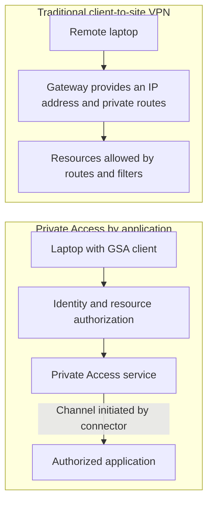
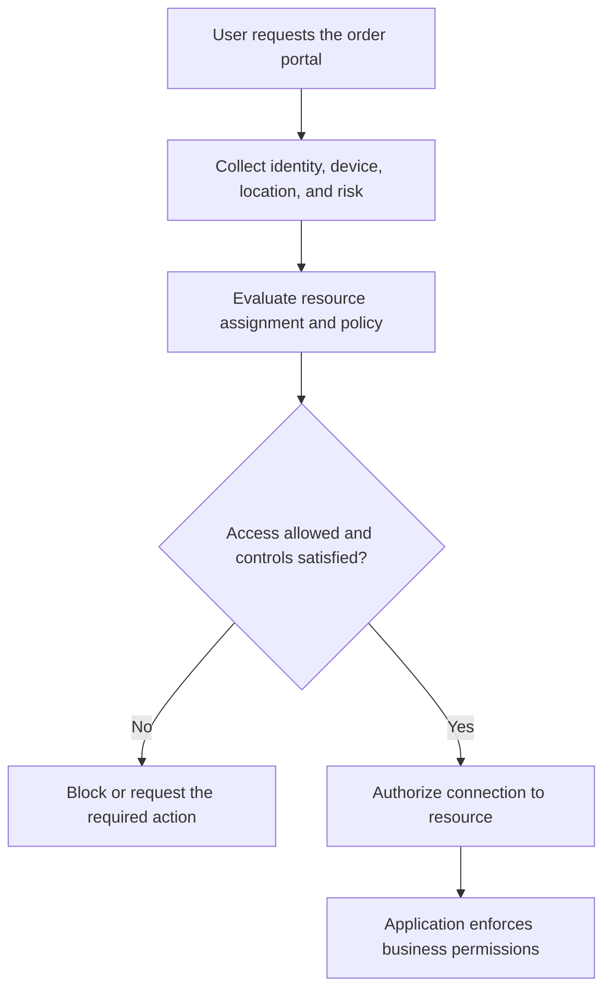

## Introduction: the decision starts with the workflow

Replacing a VPN with Microsoft Entra Private Access is, above all, an architectural shift. A traditional VPN provides network connectivity to a remote device. The Zero Trust Network Access, or ZTNA, model directs authorized connections to specific resources. Before shutting down the gateways, the team needs to know whether its applications and their dependencies work within that level of granularity.

Picture a distributor with a critical internal application for approving orders. Employees split their time between the office and home, and a partner needs to check deliveries. The portal uses HTTPS, but some tasks depend on file shares and a legacy component. Today, everyone starts with the same remote access connection. This fictional scenario will guide our decision.

**Microsoft Entra Private Access can replace VPN access to compatible applications.** Opening the portal is only part of the job: attaching documents, generating reports, and recovering a session must work too. The tunnel can disappear only after those requirements have been validated.

We will compare traditional VPNs, Zero Trust Network Access, Conditional Access, and a gradual migration. The goal is to help infrastructure, security, and cloud professionals choose between application access, coexistence, and keeping the VPN. This article assumes familiarity with remote access and identity policies; in-depth knowledge of Global Secure Access is not required.

This is a conceptual analysis based on primary sources consulted on **September 21, 2026**, with no original lab results or benchmarks. The proposals for our distributor serve as architectural criteria. Check feature availability again before starting a project.

## The decision in 30 seconds

- **Migrate:** the application has known destinations and dependencies, supports the flow mediated by the client and connectors, and can have its own policies by group and risk.
- **Coexist:** part of the work already fits application access, but legacy protocols, server-initiated flows, or poorly understood dependencies still require the VPN.
- **Keep the VPN:** the primary requirement is to connect networks, carry incompatible flows, or preserve an operating model that has not yet been validated with Private Access.

> **Decision rule:** retire the VPN one application and user group at a time, and only after validating the complete workflow with support and rollback procedures in place.

## Traditional VPNs: what they do well and where they hurt

With a remote access, or client-to-site, VPN, the device typically receives an address from a pool and routes to private destinations. It gains IP connectivity to whatever the gateway, routes, and security controls permit. This could be Always On VPN or a solution based on IPsec or TLS, often called an SSL VPN.

A site-to-site VPN connects networks through gateways, while client-to-site access serves individual devices. Replacing an employee's access to the portal leaves connectivity between a branch office and the data center as a separate decision. The [Remote Access overview](https://learn.microsoft.com/en-us/windows-server/remote/remote-access/remote-access?wt.mc_id=studentamb_365381) describes tunnel use for clients and branch offices.

Flexibility is a strength. A VPN operating at the network layer can carry various IP protocols and serve applications that expect conventional connectivity. That helps when software talks to several servers, uses integrated authentication, or depends on services that are difficult to separate. Actual support still depends on the implementation, filters, and network path; “any protocol, in any situation” would be an overpromise.

**A remote VPN requires connectivity between the endpoints.** A solution operated by the company may remain available without depending on a particular cloud ZTNA service, provided the connection, gateway, and authentication continue to work. The ability to work with cached files belongs to the application.

The security problem appears when a configuration grants too much reach. At our distributor, someone who only approves orders receives routes to servers unrelated to their role. A compromised device has more destinations to probe. That increases opportunities for lateral movement, although permissions and other defenses still stand in the way.

A VPN can also provide restricted access. Firewalls, segmentation, filters, and strong authentication reduce its reach. [Always On VPN](https://learn.microsoft.com/windows-server/remote/remote-access/vpn/always-on-vpn/always-on-vpn-enhancements?wt.mc_id=studentamb_365381) itself documents application controls and Conditional Access integration. An honest comparison considers the well-managed VPN the organization could build.

Operations matter too: updating gateways, planning capacity, maintaining redundancy, and troubleshooting clients. Switching between Wi-Fi and cellular networks can affect sessions, depending on the product and configuration. Private Access changes responsibilities and traffic paths. Performance and support improvements need to be measured in each environment.

## The application model: Zero Trust Network Access in practice

> **ZTNA is a market category, not another name for a Microsoft product.**

Zscaler and Palo Alto Networks, among other vendors, offer implementations too. Zero Trust is the broader principle of evaluating access to a resource without granting trust based solely on network location. [NIST SP 800-207](https://csrc.nist.gov/pubs/sp/800/207/final) provides a vendor-independent foundation for this discussion.

With application access, the question becomes which resources a person can reach and under what conditions. Authorization is tied more closely to the work they need to do. This helps reduce excessive permissions, but it depends on the inventory and rules the organization maintains.

**Microsoft Entra Private Access** is Microsoft's ZTNA implementation. It is part of **Global Secure Access**, which also includes Microsoft Entra Internet Access, and is included in Microsoft Entra Suite. Private Access handles private resources; Internet Access has a different scope. The [platform overview](https://learn.microsoft.com/en-us/entra/global-secure-access/overview-what-is-global-secure-access?wt.mc_id=studentamb_365381) explains that distinction. The project also needs to verify applicable licensing requirements.

In the flow discussed here, the device runs the Global Secure Access client. The service authorizes connections to published destinations and forwards them through a **private network connector** that can reach the application. Only selected flows follow this path, and the laptop remains outside the corporate network's routable address space.

The connector is shared with Application Proxy. It initiates outbound connections to the service, removing the need to publish the application directly through inbound firewall connections. It can run on Windows Server on the local network or in a VM with access to the resources. The [connector documentation](https://learn.microsoft.com/en-us/entra/global-secure-access/concept-connectors?wt.mc_id=studentamb_365381) explains its role.

The arrows show the logical access path. In the second flow, the connector initiates the channel to the cloud and carries the authorized session to the resource. The laptop reaches the application without gaining a general presence on the private network.

| Element                   | How it limits access                                   | When it fits                                           |
| ------------------------- | ------------------------------------------------------ | ------------------------------------------------------ |
| Client-to-site VPN        | Gateway routes, filters, firewalls, and policies       | Applications with broad dependencies or open protocols |
| Quick Access              | Group of FQDNs, IPs, ranges, and ports                 | Pilot and initial transition                           |
| Global Secure Access Apps | Destinations, users, and policies for each application | Segmentation and least privilege                       |
| Conditional Access        | Identity, device, location, and risk signals           | Setting the conditions for access to each resource     |

### Quick Access and Global Secure Access Apps

There are two publishing models. **Quick Access** groups destinations defined by fully qualified domain names, or FQDNs, and IP addresses or ranges. It is a practical starting point for the transition. **Global Secure Access Apps** let you separate resources into applications with their own user assignments and policies. The [model comparison](https://learn.microsoft.com/en-us/entra/global-secure-access/concept-private-access?wt.mc_id=studentamb_365381) describes this difference in granularity.

Quick Access keeps the Private Access architecture even when it publishes broad destinations. Assigning a huge address range to a broad group, however, preserves excessive authorization. The intention to let everyone reach everything remains a problem.

For our distributor, I would start with known destinations and a small group. Then I would separate the order portal, administration, and resources needed to check deliveries. An application name should represent a useful access boundary, with an owner and defined users.

Application segmentation limits network destinations. Permissions to approve a discount or export the database remain inside the software. The design combines restricted connectivity and internal authorization, with explicit responsibility for both.

## Conditional Access as the decision engine

The value emerges when a decision considers the user, device, and resource. In our scenario, authorized employees might access the portal using MFA and a compliant device. The administration interface would require stricter conditions. An elevated risk signal could prevent access, depending on the policy.

Conditional Access brings together different signals and controls:

- **MFA:** strengthens authentication and may be satisfied by an earlier valid authentication.
- **Compliance:** requires the device to meet policies defined by the organization, usually evaluated by a management solution such as Intune.
- **Location:** adds the network context used by the policy.
- **Sign-in risk:** considers evidence associated with the authentication attempt and requires the applicable Entra ID Protection capabilities.

The [Conditional Access overview](https://learn.microsoft.com/en-us/entra/identity/conditional-access/overview?wt.mc_id=studentamb_365381) explains these elements. Presence in the office provides location context on its own, while device signals address the health of the equipment.

Policies target the enterprise applications representing Quick Access or the published resources. Choosing the correct resource matters, as the [guidance for applying Conditional Access to Private Access](https://learn.microsoft.com/en-us/entra/global-secure-access/how-to-target-resource-private-access-apps?wt.mc_id=studentamb_365381) explains. A policy applied to another Global Secure Access component does not automatically protect the portal.

The diagram summarizes an access decision without reproducing the service's internal processing order. An earlier valid authentication may satisfy MFA, and the evaluation establishes or maintains access rather than representing a complete Entra query for every network packet.

At the distributor, meaningful testing combines allowed and denied scenarios. Can the analyst complete an order? Is a user from an unrelated department blocked? Is a device that does not meet policy refused? Do the logs explain the decision? That evidence matters more than a screen saying “connected.”

### Partners, BYOD, and access from the office

Our partner only needs to check deliveries. **External User Access and Intelligent Local Access are generally available**, according to the [May 2026 announcement](https://techcommunity.microsoft.com/blog/microsoft-entra-blog/lock-down-ai-web-and-private-apps-what%E2%80%99s-new-in-internet-access-and-private-acce/3847825?wt.mc_id=studentamb_365381). The former lets external identities be included in the access design. Administrators still need to explicitly assign the group, resource, and conditions that match the partner's work.

**Windows BYOD using Entra registration is also GA**, announced in [June 2026](https://learn.microsoft.com/en-us/entra/fundamentals/whats-new?wt.mc_id=studentamb_365381#general-availability---byod-support-for-windows-client-using-entra-registration). The [BYOD documentation](https://learn.microsoft.com/en-us/entra/global-secure-access/concept-bring-your-own-device?wt.mc_id=studentamb_365381) limits support on that platform to private traffic. Registration and compliance are distinct states. The policy needs to decide whether a personal computer may check deliveries or approve a critical order.

When the laptop returns to the office, **Intelligent Local Access** can recognize the network through DNS probes and route configured application traffic locally, avoiding a detour through the cloud. The [ILA guide](https://learn.microsoft.com/en-us/entra/global-secure-access/tutorial-private-access-intelligent-local-access?wt.mc_id=studentamb_365381) states that Conditional Access still applies. The capability optimizes the path for selected applications, while assignments continue to determine access.

## Where traditional VPNs still have a role

Private Access support extends beyond HTTP and includes resources such as SSH, RDP, and SMB, covered in the [application access configuration guide](https://learn.microsoft.com/en-us/entra/global-secure-access/how-to-configure-per-app-access?wt.mc_id=studentamb_365381). An older system can be a viable candidate. The challenge lies in its dependencies and the full behavior of its communications.

Protocols involving dynamic discovery, multiple destinations, callbacks, or flows initiated by the server toward the client deserve specific investigation. If the team only knows the system's home screen, it lacks enough information to conclude that the migration is complete. Our distributor's legacy component stays on the VPN until its workflow is understood and validated.

Entra Private Access provides application access over **TCP and UDP**, according to the [current product overview](https://learn.microsoft.com/en-us/entra/global-secure-access/overview-what-is-global-secure-access?wt.mc_id=studentamb_365381), and Private DNS has been generally available since the [March 2025 announcement](https://techcommunity.microsoft.com/blog/microsoft-entra-blog/replace-your-legacy-vpn-with-an-identity-centric-ztna/4395973?wt.mc_id=studentamb_365381). The documentation consulted confirms current UDP support, although this material does not establish a separate GA date for it.

[Private DNS uses the connector's resolvers](https://learn.microsoft.com/en-us/entra/global-secure-access/concept-private-name-resolution?wt.mc_id=studentamb_365381). The client returns a synthetic IP address to the application to direct the connection through the service, while the laptop remains outside the corporate address space.

Private DNS support needs to be compared with the actual behavior of the resolvers. The [current Windows client limitations](https://learn.microsoft.com/en-us/entra/global-secure-access/reference-current-known-limitations?wt.mc_id=studentamb_365381) include restrictions involving secure DNS, DNS over TCP, and interaction with NRPT policies. Validation should cover every name and mechanism the application uses.

Large transfers and peer-to-peer traffic also call for measurement. I would compare completion time, stability, and behavior under concurrent load, using the same work under representative conditions. One file copy outside business hours says little about the monthly close. The existing path may remain more suitable; demonstrate that rather than assuming it from the product name.

Connectivity between sites and operations without an interactive user need their own evaluations. The client flow described here serves user access to applications. Tunnels between networks may remain necessary even after the employee VPN is retired.

Finally, connectors remain part of the company's infrastructure and require updates, capacity, monitoring, and recovery. For a critical application, I would require an operating model that handles maintenance and failure without depending on a single machine. Operational responsibility remains on the path between the connector and the order system.

## Gradual migration: what it looks like in practice

I would approach the change as a sequence of small decisions, each backed by evidence that its acceptance criteria have been met. The [Private Access deployment guide](https://learn.microsoft.com/en-us/entra/architecture/gsa-deployment-guide-private-access?wt.mc_id=studentamb_365381) organizes planning and the progression toward segmentation. At our distributor, that translates into the following stages.

### 1. Map the work before publishing destinations

The team records who approves orders, which devices they use, what dependencies appear, and who owns the service. Include less frequent tasks such as attaching files, checking history, and reprocessing an approval. If a step only occurs during the monthly close, include it in testing or explicitly record it as pending.

The result is a concise inventory associated with named owners. Each unexplained dependency triggers an investigation instead of automatically justifying publication of an entire network. Security and operations participate alongside someone who actually uses the system.

### 2. Use Quick Access for a controlled pilot

The pilot includes a few users and known destinations. Its purpose is to establish whether the connection path and basic experience meet the application's needs. The [Quick Access guidance](https://learn.microsoft.com/en-us/entra/global-secure-access/quickstart-quick-access?wt.mc_id=studentamb_365381) itself presents this as a transition toward application segmentation.

Before starting, the distributor defines acceptable outcomes: completing essential tasks, explaining failures through logs, and restoring access within the agreed operational window. Loading a page and testing a login are not enough. Support must distinguish between a client failure, a policy decision, and a system outage.

### 3. Separate applications and policies by risk

Once the workflow is understood, the portal and administration receive separate definitions, restricted groups, and appropriate policies. Read-only access has its own requirements and permissions, separate from administration. The team starts by observing policy effects and enforces blocks only after understanding the results.

This separation changes who can reach particular destinations. The [segmentation guidance](https://learn.microsoft.com/en-us/entra/global-secure-access/tutorial-private-access-app-segmentation?wt.mc_id=studentamb_365381) warns that specific segments can take precedence over Quick Access. Test assignments and remove broad permissions that are no longer justified. Creating a second object with a nicer name does not demonstrate least privilege.

### 4. Coexist with the existing solution and preserve rollback

Coexistence can be organized around applications and user groups. Destinations, traffic forwarding, and name resolution need clear ownership to avoid competing paths. Keeping the VPN available also means checking whether it can bypass the restriction just applied to the portal.

#### The specific case of DirectAccess

Microsoft marked **DirectAccess as deprecated in June 2024** and [recommends Always On VPN for new deployments](https://learn.microsoft.com/en-us/windows/whats-new/deprecated-features?wt.mc_id=studentamb_365381#directaccess). Deprecation means the end of active development and possible removal in the future. The feature still appears in documentation that applies to Windows Server 2025, so describing it as removed from that version would be inaccurate.

Private Access offers another path to modernize access based on identity and application. [Microsoft's documented migration from DirectAccess to Private Access](https://learn.microsoft.com/en-us/entra/global-secure-access/how-to-migrate-direct-access-to-private-access?wt.mc_id=studentamb_365381) requires removing DirectAccess from each device before enabling the new traffic forwarding path. The organization can migrate in waves and keep users who have not yet migrated in the old environment, but each endpoint moves from one path to the other.

The rollback plan identifies owners, conditions for stopping a wave, and a tested way to restore the previous access method. With DirectAccess, rollback respects the incompatibility of the two paths on the same device. For finance, the question is straightforward: if order approval stops working, who decides to roll back, and how will work resume?

### 5. Retire the VPN when the exceptions are resolved

Every wave must pass the same criteria, including complete tasks, expected blocks, and incident handling. Remaining dependencies are recorded with an owner and a review date. A group no longer needs the VPN when its members can work and receive support through the new model.

A hybrid architecture can be the right outcome. The problem is an exception with no deadline, owner, or controls. If the legacy component remains for a documented reason, the team can still substantially reduce the broad access granted to the rest of the company.

## Conclusion: the gateway leaves last

At the distributor, I would migrate the order portal first, with separate policies for administration and read-only access. The legacy component would remain temporarily on the VPN, and partner access would receive its own validation. The gateway would be retired only after each wave demonstrated three outcomes: finance can complete orders, the partner can reach only the delivery query, and support can diagnose and recover from failures.

That outcome turns Zero Trust into operations: less network reach, more precise controls, and no dependency removed prematurely.

Which dependency would prevent your company from retiring its VPN today? Share in the comments the challenges that still keep traditional access in production.

## References

Primary sources consulted on September 21, 2026. Links throughout the article support specific claims; these are the central references for revisiting the evaluation:

- [NIST SP 800-207: Zero Trust Architecture](https://csrc.nist.gov/pubs/sp/800/207/final).
- [Global Secure Access and its components](https://learn.microsoft.com/en-us/entra/global-secure-access/overview-what-is-global-secure-access?wt.mc_id=studentamb_365381).
- [Private Access publishing models](https://learn.microsoft.com/en-us/entra/global-secure-access/concept-private-access?wt.mc_id=studentamb_365381).
- [Conditional Access for private applications](https://learn.microsoft.com/en-us/entra/global-secure-access/how-to-target-resource-private-access-apps?wt.mc_id=studentamb_365381).
- [Known limitations](https://learn.microsoft.com/en-us/entra/global-secure-access/reference-current-known-limitations?wt.mc_id=studentamb_365381).
- [Migrating from DirectAccess](https://learn.microsoft.com/en-us/entra/global-secure-access/how-to-migrate-direct-access-to-private-access?wt.mc_id=studentamb_365381).
- [Deprecated Windows features, including DirectAccess](https://learn.microsoft.com/en-us/windows/whats-new/deprecated-features?wt.mc_id=studentamb_365381#directaccess).
