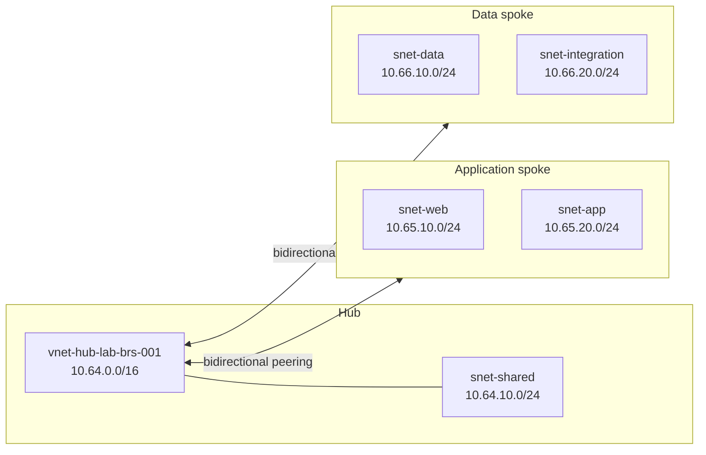

## Introduction

An application started small, gained a VNet, then another team created a second one. Before anyone noticed, each environment had its own copy of everything. Connectivity, DNS, security, and hybrid access were handled in different ways. The network still worked, but any change required an archaeological expedition through the portal.

The **hub and spoke** pattern organizes this growth. A central virtual network, the hub, concentrates shared connectivity. Peripheral virtual networks, the spokes, isolate applications, domains, or environments. This separation reduces coupling and creates a predictable point for common services, without turning all workloads into next-door neighbors.

In this part, we will build only the foundation: a hub VNet, two spoke VNets, subnets, bidirectional peerings, an addressing plan, and the initial Terraform structure. The hub will remain purposely empty. Firewall, NVA (Network Virtual Appliance), VPN Gateway, ExpressRoute, Bastion, Network Security Groups (NSGs), and route policies are out of scope for now. The subnets will have no associated filters until the next part. Trying to install all the furniture before putting up the walls usually produces an interesting architecture, but not in a good way.

The [laboratory repository](https://github.com/tkusal/Laborat-rio-Azure-com-Terraform-Projetando-uma-rede-hub-and-spoke) contains exactly the code presented and the helper files to reproduce the scenario in a fork.

## Expected result

By the end, Terraform will describe 15 resources:

- three resource groups;
- three VNets, one hub and two spokes;
- five subnets;
- four directional VNet peering links.

The two spokes will have peering with the hub, but they will not peer directly with each other. There will also be no spoke-to-spoke transit through the hub, because VNet peering is not transitive and the hub will not yet have a forwarding component. In this step, the goal is to validate the connectivity foundation, not to promise a path that does not yet exist.

## Prerequisites and tested environment

This content assumes you already understand the role of a VNet and have run `terraform apply` in another lab. To follow along, you need:

- an Azure subscription dedicated to studies;
- permissions to create resource groups, VNets, subnets, and peerings;
- [Azure CLI](https://learn.microsoft.com/cli/azure/install-azure-cli?wt.mc_id=studentamb_365381) installed and authenticated;
- [Terraform](https://developer.hashicorp.com/terraform/install) `1.15.8`;
- AzureRM provider `4.79.0`;
- Git to work with your fork.

The code was formatted and validated locally with these versions. No `terraform apply` was executed during the preparation of this article, and no actual resources were created.

The terminal commands in this article use PowerShell, but the Terraform code works on Windows, Linux, and macOS, for any architectures where HashiCorp publishes the binary. In Bash, replace `Set-Location` with `cd` and `Copy-Item` with `cp`.

> [!IMPORTANT]
> Confirm the subscription and tenant before generating the plan. Lab names do not prevent resources from being created in the wrong subscription. Azure does not recognize the loving intention behind the `lab` suffix.

## Architecture

### How the pattern works

The hub is the central VNet. In a complete architecture, it can host shared connectivity and operations services. The spokes host workloads and preserve their own addressing and administration boundaries.

Peering connects two VNets through the Azure backbone network. For each relationship, Terraform creates two resources, one in each direction. Therefore, two spokes result in four links: hub to application, application to hub, hub to data, and data to hub.



The diagram shows hub-to-spoke connectivity. It does not show an arrow between the spokes because that communication does not exist yet. If the application spoke needs to reach the data spoke in a future part, the path and traffic control will need to be explicitly defined.

### Why use it

Hub and spoke makes sense when multiple workloads need to share connectivity, when teams want clear network boundaries, or when the platform needs to grow without putting everything in the same VNet. The pattern also favors distinct responsibilities: a platform team can manage the hub while product teams administer their own spokes within agreed rules.

The main gain in this part is predictability. Each VNet gets a known block, each subnet has a purpose, and each peering has a name that informs origin and destination. This sounds like bureaucracy until the first incident with twenty networks named `vnet-prod-final-2`.

### When it is not worth it

A single small workload, with no shared services and no real prospect of expansion, might work better in a well-segmented VNet. Hub and spoke adds peerings, IPAM decisions, and distributed operation. Creating an empty hub just to check an architecture box does not generate value.

It is also worth evaluating other topologies when the main requirement is total isolation between independent units or managed connectivity at a much larger scale. The pattern is a tool, not a mandatory ceremony.

### Resources and naming convention

The lab uses abbreviations recommended by the Cloud Adoption Framework:

| Type            | Prefix | Example                       |
| --------------- | ------ | ----------------------------- |
| Resource group  | `rg`   | `rg-network-hub-lab-brs-001`  |
| Virtual network | `vnet` | `vnet-hub-lab-brs-001`        |
| Subnet          | `snet` | `snet-web-lab-brs-001`        |
| VNet peering    | `peer` | `peer-hub-to-app-lab-brs-001` |

The rest of the name combines function, environment, regional code, and instance. `brs` represents Brazil South, and `001` allows for a second instance without having to invent a suffix during an incident.

Each VNet is in its own resource group. For a lab, a single group would be enough, but the separation demonstrates the administrative boundary that usually exists between central connectivity and workloads. It also makes it visible that peering can connect VNets in distinct resource groups.

The three names are `rg-network-hub-lab-brs-001`, `rg-network-app-lab-brs-001`, and `rg-network-data-lab-brs-001`.

The actual region and short code sit side by side in the variables file. Azure does not check if `brs` corresponds to `brazilsouth`, so this consistency is part of the review:

```hcl title="Snippet from environments/lab/terraform.tfvars.example"
location      = "brazilsouth"
location_code = "brs"
```

## IP Plan (IPAM)

**IP Address Management (IPAM)** is the discipline of planning, registering, and tracking the addresses used by the organization. Here we reserve the `10.64.0.0/12` superblock as a planning reference. It is not created as a resource in Azure.

| Usage                  | CIDR                             | Capacity and decision              |
| ---------------------- | -------------------------------- | ---------------------------------- |
| Planned superblock     | `10.64.0.0/12`                   | Contains 16 `/16` blocks           |
| Hub VNet               | `10.64.0.0/16`                   | Ample space for hub evolution      |
| Hub shared subnet      | `10.64.10.0/24`                  | 256 addresses, 251 usable in Azure |
| Application spoke      | `10.65.0.0/16`                   | Isolates the application domain    |
| Web subnet             | `10.65.10.0/24`                  | Application entry layer            |
| App subnet             | `10.65.20.0/24`                  | Processing layer                   |
| Data spoke             | `10.66.0.0/16`                   | Isolates data and integrations     |
| Data subnet            | `10.66.10.0/24`                  | Data layer services                |
| Integration subnet     | `10.66.20.0/24`                  | Future private integrations        |
| Reserve for new spokes | `10.67.0.0/16` to `10.79.0.0/16` | Thirteen free `/16` blocks         |

The `/16` blocks are larger than this lab needs. The choice is intentional: the VNet gains space for multiple subnets without needing to be renumbered for each new layer. The `/24` subnets offer a size that is easy to manage in studies and leave gaps between uses.

Azure reserves the five addresses at the edges of each IPv4 subnet. In `10.64.10.0/24`, these are `10.64.10.0` for the network, `10.64.10.1` for the default gateway, `10.64.10.2` and `10.64.10.3` to map Azure DNS addresses, plus `10.64.10.255` as the network broadcast address. This leaves 251 addresses assignable to resources.

This plan should not be blindly copied into production. Before adopting `10.64.0.0/12`, compare the range with datacenters, branches, other clouds, partner networks, and existing VNets. A private block could also be occupied somewhere else in the company.

VNets connected by peering cannot have overlapping address spaces. If the hub uses `10.64.0.0/16` and a spoke uses `10.64.20.0/24`, the spoke's block will be contained within the hub, and the peering will be invalid. Different prefixes in text do not mean different networks in practice. CIDR is precise, sometimes in a somewhat undiplomatic way.

## Repository start

### Folder structure

The reusable module is separated from the environment's root module. This way, the environment decides names, addresses, and tags, while the module implements the VNet and subnets.

```text
.
|-- .github/workflows/terraform-check.yml
|-- environments/
|   `-- lab/
|       |-- backend.tf
|       |-- main.tf
|       |-- outputs.tf
|       |-- providers.tf
|       |-- terraform.tfvars.example
|       |-- variables.tf
|       `-- versions.tf
|-- modules/
|   `-- virtual-network/
|       |-- main.tf
|       |-- outputs.tf
|       `-- variables.tf
|-- .gitignore
|-- LICENSE
`-- README.md
```

The workflow only executes formatting, initialization without backend, and validation. There is no automated deployment.

### Terraform and provider with pinned versions

The `environments/lab/versions.tf` file prevents a silent update from altering the lab's behavior:

```hcl title="environments/lab/versions.tf"
terraform {
  required_version = "= 1.15.8"

  required_providers {
    azurerm = {
      source  = "hashicorp/azurerm"
      version = "= 4.79.0"
    }
  }
}
```

Pinning the version in code and keeping `.terraform.lock.hcl` in Git makes the selection reproducible. Updates remain possible, but they become a reviewable decision. In production root modules, it is common to use `~> 1.15.0` to accept `1.15.x` versions. This does not install fixes automatically, it just allows a compatible patch version to be used after being installed and tested.

As of this article's date, AzureRM `5.0.1` was already available. We kept `4.79.0` because this version was used in the complete validation of the lab, and major 5 brought behavior changes. In v4.x, `resource_provider_registrations` used `legacy` by default; in v5.0 or higher, the default became `none`. A migration to v5 should follow the official upgrade guide and a new round of testing.

The provider uses the subscription provided by a variable and explicitly chooses the `core` set of resource providers. This avoids depending on the `legacy` default of major 4:

```hcl title="environments/lab/providers.tf"
provider "azurerm" {
  features {}

  subscription_id                 = var.subscription_id
  resource_provider_registrations = "core"
}
```

`subscription_id` is not a secret, but it defines the operation's target and deserves validation. The `terraform.tfvars.example` file contains only replaceable values. The `.gitignore` blocks `*.tfvars`, states, and saved plans, as these files can reveal sensitive data.

AzureRM also accepts `ARM_SUBSCRIPTION_ID` when `subscription_id` is not defined in the provider block. The lab keeps the variable explicit to make the destination visible during the study. In a future CI automation, adapt the provider to use the environment variable, and do not write this value in pipeline files.

### Local backend in the lab

```hcl title="environments/lab/backend.tf"
terraform {
  backend "local" {
    path = "terraform.tfstate"
  }
}
```

The local backend reduces dependencies for those studying. It also has important limitations: the state is tied to the machine and does not offer the secure collaboration expected by a team. In production, use a remote backend with access control, encryption, versioning, and locking. The state is part of the system, not a disposable receipt from the last command.

### Network module

The module receives a map of subnets and creates each one with `for_each`:

```hcl title="modules/virtual-network/main.tf"
resource "azurerm_virtual_network" "this" {
  name                = var.name
  resource_group_name = var.resource_group_name
  location            = var.location
  address_space       = var.address_space
  tags                = var.tags
}

resource "azurerm_subnet" "this" {
  for_each = var.subnets

  name                 = each.value.name
  resource_group_name  = var.resource_group_name
  virtual_network_name = azurerm_virtual_network.this.name
  address_prefixes     = each.value.address_prefixes
}
```

Subnets do not accept tags like VNets and resource groups do. Common tags are applied only to resources that offer this field.

### Tagging convention

The environment combines five mandatory tags with an optional map:

```hcl title="Snippet from environments/lab/main.tf"
common_tags = merge(
  {
    environment = var.environment
    owner       = var.owner
    cost-center = var.cost_center
    managed-by  = "terraform"
    project     = "azure-hub-spoke-lab"
  },
  var.extra_tags
)
```

`environment` separates the lifecycle, `owner` points out responsibility, `cost-center` helps with financial allocation, `managed-by` prevents accidental manual editing, and `project` groups the lab. `extra_tags` allows meeting a local policy without modifying the module.

> [!NOTE]
> For the VNets and resource groups in this foundation, the limit is 50 tag pairs per item. The code uses five, but policies can add more. Different resource families might have their own rules.

### Two-way peering

In the root module, the `local.networks` map contains the keys `hub`, `spoke_app`, and `spoke_data`. The `for_each` creates a module instance for each entry:

```hcl title="Snippet from environments/lab/main.tf"
module "virtual_network" {
  source   = "../../modules/virtual-network"
  for_each = local.networks

  name                = each.value.vnet_name
  resource_group_name = azurerm_resource_group.network[each.key].name
  location            = azurerm_resource_group.network[each.key].location
  address_space       = each.value.address_space
  subnets             = each.value.subnets
  tags                = merge(local.common_tags, { network-role = each.value.role })
}
```

Because of this, `module.virtual_network["hub"]` points to the central instance, and `module.virtual_network["spoke_app"]` points to the first spoke. With this origin clarified, here is one of the four peering resources:

```hcl title="Snippet from environments/lab/main.tf"
resource "azurerm_virtual_network_peering" "hub_to_app" {
  name                      = "peer-hub-to-app-${var.environment}-${var.location_code}-001"
  resource_group_name       = module.virtual_network["hub"].resource_group_name
  virtual_network_name      = module.virtual_network["hub"].name
  remote_virtual_network_id = module.virtual_network["spoke_app"].id

  allow_virtual_network_access = true
  allow_forwarded_traffic      = false
  allow_gateway_transit        = false
  use_remote_gateways          = false
}
```

The forwarded traffic and gateway options remain disabled because the corresponding components are outside the scope of this part. Declaring `false` makes the intention readable and prevents someone from interpreting the foundation as a complete topology.

## Validate the result

Fork and clone the repository, then create your local variables file:

```powershell
git clone https://github.com/<YOUR-USER>/Laborat-rio-Azure-com-Terraform-Projetando-uma-rede-hub-and-spoke.git
Set-Location Laborat-rio-Azure-com-Terraform-Projetando-uma-rede-hub-and-spoke
Copy-Item environments/lab/terraform.tfvars.example environments/lab/terraform.tfvars
```

Edit `terraform.tfvars`, fill in `subscription_id` and `owner`, authenticate the Azure CLI, and confirm the context:

```powershell
az login
az account set --subscription "<SUBSCRIPTION_ID>"
az account show --query "{name:name, subscriptionId:id, tenantId:tenantId}" --output table
```

Then format, initialize, validate, and generate the plan:

```powershell
terraform fmt -check -recursive .
Set-Location environments/lab
terraform init
terraform validate
terraform plan -out=plan.tfplan
terraform show plan.tfplan
```

The expected plan contains three resource groups, three VNets, five subnets, and four peerings. Review the 15 resources, the CIDRs, the region, the tags, and the subscription. This article does not advise running `terraform apply`. A valid plan proves that Terraform understood the configuration, not that you understood the costs, policies, and impacts.

## Risks, security, and rollback

VNet peering can generate data transfer charges when real workloads start exchanging traffic. Do not rely on old values from a table or screenshot. Check the [Azure Pricing Calculator](https://azure.microsoft.com/pricing/calculator/?wt.mc_id=studentamb_365381) for your scenario's region and volume.

States and plans can contain sensitive data. Keep `terraform.tfstate`, `*.tfvars`, and `*.tfplan` out of Git. In production, also restrict access to the remote backend and keep an audit log of who can alter the network.

Since no resources are created by the commands in this article, a local rollback consists of deleting the saved plan and, optionally, the `.terraform` folder. If you later choose to apply the lab on your own, the README provides a separate sequence to review and run `terraform destroy`. Confirm the subscription and all resources before destroying anything.

## What comes in part 2

Part 2 evolves this foundation with NSGs on the four workload subnets, explicit rules, and Terraform-managed associations. Part 3 will cover central inspection with Azure Firewall and the route policies that direct traffic through it. Hybrid connectivity via VPN or ExpressRoute is saved for a future chapter, complete with its own requirements and validations.

## References

- [Hub and spoke topology in Azure](https://learn.microsoft.com/azure/networking/design-guide/hub-spoke?wt.mc_id=studentamb_365381)
- [VNet peering overview](https://learn.microsoft.com/azure/virtual-network/virtual-network-peering-overview?wt.mc_id=studentamb_365381)
- [VNets and subnets in the design guide](https://learn.microsoft.com/azure/networking/design-guide/vnets-subnets?wt.mc_id=studentamb_365381)
- [Reserved addresses in Azure subnets](https://learn.microsoft.com/azure/virtual-network/virtual-networks-faq?wt.mc_id=studentamb_365381)
- [Resource abbreviations from the Cloud Adoption Framework](https://learn.microsoft.com/azure/cloud-adoption-framework/ready/azure-best-practices/resource-abbreviations?wt.mc_id=studentamb_365381)
- [Limits and recommendations for Azure tags](https://learn.microsoft.com/azure/azure-resource-manager/management/tag-resources?wt.mc_id=studentamb_365381)
- [Terraform local backend](https://developer.hashicorp.com/terraform/language/backend/local)
- [Terraform version constraints](https://developer.hashicorp.com/terraform/language/expressions/version-constraints)
- [AzureRM Provider 4.79.0](https://registry.terraform.io/providers/hashicorp/azurerm/4.79.0/docs)
- [AzureRM 5.0.1 Changelog](https://github.com/hashicorp/terraform-provider-azurerm/blob/main/CHANGELOG.md)

## Conclusion

A hub and spoke topology begins before the first peering. It starts with clear boundaries, predictable names, and addresses that will not fight for the same space months later.

In this part, we defined a hub, two spokes, five subnets, four directional links, and thirteen `/16` blocks reserved for expansion. We also separated module and environment, pinned versions, standardized tags, and kept the state local just to lower the barrier of entry for the lab.

The next step is not to apply by reflex. Generate the plan, count the resources, check the subscription, and explain the path of each connection. If the architecture only works when no one asks questions, it hasn't finished being designed yet.
