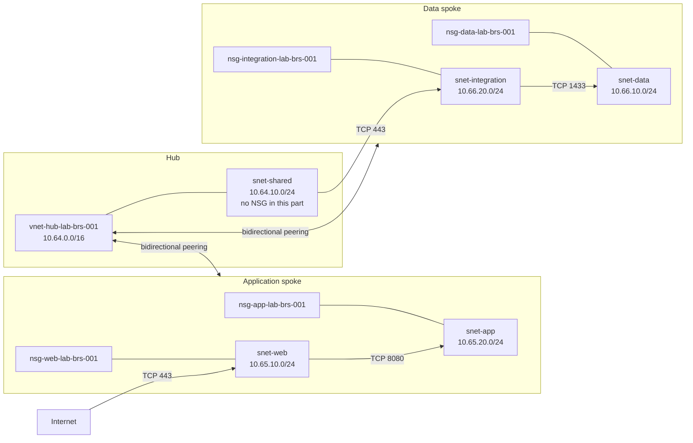

## Introduction

In [part 1 of this series](/posts/rede-hub-and-spoke-azure-terraform-parte-1/), we created the foundation of the topology: three VNets, five subnets, and four directional peering links. The addressing plan is organized and each spoke talks to the hub, but the workload subnets still accept the default Azure rules.

This is the point we will fix now. We will add a Network Security Group (NSG) for each workload subnet, declare only the necessary flows, and associate everything using Terraform. The topology remains without virtual machines, firewalls, hybrid connectivity, or custom routes. Network security does not improve when we mix four major changes and then try to figure out which one blocked port 443.

The [repository for this part](https://github.com/tkusal/Lab-Azure-com-Terraform-NSGs-e-regras-de-seguran-a-Parte-2) starts from the code published in the first lab. Terraform and AzureRM remain fixed at `1.15.8` and `4.79.0`, respectively. The backend remains local and the five common tags do not change either.

## Architecture of this part

An NSG is a list of rules that allows or denies inbound and outbound traffic. Each rule compares protocol, addresses, ports, and direction. Azure processes priorities from lowest to highest number and stops evaluation at the first match.

An NSG can be associated with a subnet, a network interface, or both levels. At the subnet level, the policy reaches all resources connected to it. At the interface level, the policy handles exceptions for a specific workload. When both levels are used, traffic needs to pass both evaluations. This increases precision and also the chance of someone investigating the wrong rule during an incident.

In this lab, each subnet represents a layer with a single contract. Therefore, the association will be made at the subnet level. All future workloads in the web layer receive the same policy, just like the application, data, and integration workloads. There is no exception per interface that justifies another NSG.



Eight Terraform resources will be created: four `azurerm_network_security_group` and four `azurerm_subnet_network_security_group_association`. Rules are inner blocks of the NSGs, so they do not appear as separate resource addresses in the plan.

Names follow the convention from the first part, now with the recommended `nsg` prefix: `nsg-web-lab-brs-001`, `nsg-app-lab-brs-001`, `nsg-data-lab-brs-001`, and `nsg-integration-lab-brs-001`.

The `snet-shared` subnet is left without an NSG in this step. It remains empty and does not yet have a traffic contract that allows writing honest rules. Associating an NSG full of assumptions would just replace a visible gap with a configuration that looks secure. Before placing any service in that subnet, its role and policy must be defined.

Because of this, outbound traffic from `snet-shared` still follows the default Azure rules. In the HTTPS flow shown in the diagram, control depends exclusively on the inbound rule of `nsg-integration-lab-brs-001`. When the shared subnet receives a service and an NSG, the same flow must be allowed on its outbound side as well.

## Security rules

Every NSG in the lab receives a final inbound deny rule and an outbound deny rule with priority `4096`. These are necessary because Azure includes default rules that allow traffic within the `VirtualNetwork` tag and outbound traffic to the Internet. Custom rules are evaluated before the default ones, which use priorities starting at `65000`.

Azure accepts priorities from `100` to `4096` for custom rules. Therefore, `4096` is literally the last available slot before the default rules kick in. Allow rules start at `100`. This leaves room between them and the final deny rule for future requirements without demanding a collective renumbering. In a real network, it is worth reserving ranges by purpose and documenting that convention. Random numbers work fine until the day two teams choose `237` for the exact same mystical reason.

| NSG           | Priority | Direction | Protocol | Source          | Destination     | Destination port | Action |
| ------------- | -------: | --------- | -------- | --------------- | --------------- | ---------------- | ------ |
| `web`         |      100 | Inbound   | TCP      | `Internet`      | `10.65.10.0/24` | 443              | Allow  |
| `web`         |     4096 | Inbound   | Any      | Any             | Any             | Any              | Deny   |
| `web`         |      100 | Outbound  | TCP      | `10.65.10.0/24` | `10.65.20.0/24` | 8080             | Allow  |
| `web`         |     4096 | Outbound  | Any      | Any             | Any             | Any              | Deny   |
| `app`         |      100 | Inbound   | TCP      | `10.65.10.0/24` | `10.65.20.0/24` | 8080             | Allow  |
| `app`         |     4096 | Inbound   | Any      | Any             | Any             | Any              | Deny   |
| `app`         |     4096 | Outbound  | Any      | Any             | Any             | Any              | Deny   |
| `data`        |      100 | Inbound   | TCP      | `10.66.20.0/24` | `10.66.10.0/24` | 1433             | Allow  |
| `data`        |     4096 | Inbound   | Any      | Any             | Any             | Any              | Deny   |
| `data`        |     4096 | Outbound  | Any      | Any             | Any             | Any              | Deny   |
| `integration` |      100 | Inbound   | TCP      | `10.64.10.0/24` | `10.66.20.0/24` | 443              | Allow  |
| `integration` |     4096 | Inbound   | Any      | Any             | Any             | Any              | Deny   |
| `integration` |      100 | Outbound  | TCP      | `10.66.20.0/24` | `10.66.10.0/24` | 1433             | Allow  |
| `integration` |     4096 | Outbound  | Any      | Any             | Any             | Any              | Deny   |

`source_port_range` is `*` in all rules in this lab. The source port chosen by the client is ephemeral, usually a high dynamic port, so it should not be confused with the known service port at the destination. The field uses `optional(string, "*")` in `variables.tf` and can be omitted from each rule without changing this behavior.

The HTTPS input from the Internet demonstrates the logical edge of the web layer. It does not create a public address, a load balancer, or a route to the subnet. An NSG filters an existing path, it does not manufacture connectivity. Without an ingress component, the packet still has no way to reach the private address.

> [!IMPORTANT]
> The web to app flow needs to be allowed on the outbound of `snet-web` and on the inbound of `snet-app`, as there is an NSG on each end. Allowing one side does not guarantee passage through the other. The same logic applies to integration and data.

Returning traffic from an accepted connection does not require mirrored rules. NSGs are stateful and recognize the response flow, even when the response comes back from port 8080 or 1433 to the ephemeral port that initiated the connection.

> [!WARNING]
> The deny rule at priority `4096` also blocks traffic between interfaces in the same subnet when no prior allow rule matches. Two VMs in `snet-web`, for example, will not be able to talk freely just because they share the same prefix. This isolation is intentional in the lab. In an environment that requires internal communication, create specific outbound and inbound allow rules with the subnet's own prefix as source and destination, limited to the necessary protocols and ports.

The application layer does not receive an allow rule for the data spoke. The current peerings do not provide spoke-to-spoke transit and an NSG rule does not alter routing. That path will be handled when there is central inspection and route policies.

> [!NOTE]
> Application Security Groups (ASGs) can group network interfaces by function, such as `web` or `api`, and serve as source or destination in rules without maintaining IP lists. They complement NSGs when workloads exist and change addresses frequently. In this lab there are no interfaces to group yet, so ASGs remain just as an evolution option.

## NSG Terraform module

The new module is located in `modules/network-security-group/`, next to the VNet module. It receives a name, resource group, region, tags, and a map of rules. The `dynamic` block turns each item in the map into an internal rule of the NSG:

```hcl title="modules/network-security-group/main.tf"
resource "azurerm_network_security_group" "this" {
  name                = var.name
  resource_group_name = var.resource_group_name
  location            = var.location
  tags                = var.tags

  dynamic "security_rule" {
    for_each = var.security_rules

    content {
      name                       = security_rule.key
      description                = security_rule.value.description
      priority                   = security_rule.value.priority
      direction                  = security_rule.value.direction
      access                     = security_rule.value.access
      protocol                   = security_rule.value.protocol
      source_port_range          = security_rule.value.source_port_range
      destination_port_range     = security_rule.value.destination_port_range
      source_address_prefix      = security_rule.value.source_address_prefix
      destination_address_prefix = security_rule.value.destination_address_prefix
    }
  }
}
```

The module uses properties in the singular, like `source_address_prefix` and `destination_address_prefix`, because each rule in the lab has a single prefix on each side. If a policy needs to gather multiple addresses or CIDRs in the same rule, adapt the module contract and the dynamic block for the plural properties `source_address_prefixes` and `destination_address_prefixes`.

The validations in `variables.tf` reject direction, action, protocol, and priority outside the accepted values. Another validation combines direction and priority to prevent duplicates in the same set. Inbound and outbound can use the same priority, but two inbound rules in the same NSG cannot compete for the same number.

To avoid repeating the CIDRs in `local.network_security_groups`, the VNet module now exports the prefix of each subnet already declared in part 1:

```hcl title="Trecho de modules/virtual-network/outputs.tf"
output "subnet_prefixes" {
  description = "Mapa de prefixos IPv4 das subnets."
  value       = { for key, subnet in azurerm_subnet.this : key => one(subnet.address_prefixes) }
}
```

The use of `one` expresses a conscious restriction of this lab: each subnet has exactly one IPv4 prefix. A future dual stack topology will need a list output and plural properties for the rules.

In the root module, `local.network_security_groups` holds the configuration of the four layers. This snippet shows the web layer:

```hcl title="Trecho de environments/lab/main.tf"
network_security_groups = {
  web = {
    name        = "nsg-web-${var.environment}-${var.location_code}-001"
    network_key = "spoke_app"
    subnet_key  = "web"
    rules = {
      allow-https-from-internet = {
        description                = "Permite HTTPS da Internet para a camada web."
        priority                   = 100
        direction                  = "Inbound"
        access                     = "Allow"
        protocol                   = "Tcp"
        destination_port_range     = "443"
        source_address_prefix      = "Internet"
        destination_address_prefix = module.virtual_network["spoke_app"].subnet_prefixes["web"]
      }
    }
  }
}
```

The other rules follow the same pattern for `app`, `data`, and `integration`. Changing a prefix in `local.networks` updates the subnet and the NSG references in the same plan. This reference does not create a cycle, as the VNet module does not depend on the NSG configuration.

The `for_each` creates an instance of the module for each key. `network_key` points to one of the VNet module instances inherited from part 1, while `subnet_key` selects the ID exported by that instance:

```hcl title="Trecho de environments/lab/main.tf"
module "network_security_group" {
  source   = "../../modules/network-security-group"
  for_each = local.network_security_groups

  name                = each.value.name
  resource_group_name = module.virtual_network[each.value.network_key].resource_group_name
  location            = var.location
  security_rules      = each.value.rules
  tags                = local.common_tags
}

resource "azurerm_subnet_network_security_group_association" "this" {
  for_each = local.network_security_groups

  subnet_id                 = module.virtual_network[each.value.network_key].subnet_ids[each.value.subnet_key]
  network_security_group_id = module.network_security_group[each.key].id
}
```

References to the IDs create implicit dependencies. Terraform knows it needs to know the subnet and the NSG before creating the association, without an additional `depends_on`.

The complete configuration goes from 15 to 23 managed resources: the 15 from the foundation, four NSGs, and four associations. In a directory without state, the plan shows `23 to add`. When continuing with the local state from part 1, the expectation is `8 to add`, without recreating the 15 already registered resources. Do not copy state to Git and do not try to resolve the difference by blindly importing resources.

## Validation

Starting from the part 2 repository, create only the local variables file:

```powershell
Copy-Item environments/lab/terraform.tfvars.example environments/lab/terraform.tfvars
```

Edit `subscription_id` and `owner`. The commands use PowerShell. In Bash, use `cp` instead of `Copy-Item` and `cd` instead of `Set-Location`.

Format the code, initialize the directory, and validate the configuration:

```powershell
terraform fmt -recursive .
Set-Location environments/lab
terraform init
terraform validate
terraform plan -out=plan.tfplan
terraform show plan.tfplan
```

Before considering any application outside of this article, check:

- the selected subscription and region;
- the absence of replacements or deletions of the 15 resources from part 1;
- the four NSG names and the four associated subnet IDs;
- the priorities `100` and `4096` in their respective directions;
- the CIDRs, protocols, and ports of each allow rule;
- the expected count of 23 resources in the configuration, or eight additions over the previous state;
- the absence of credentials, state, and plans in the Git diff.

Do not execute `terraform apply`. The plan is the review artifact for this part. It shows the intention calculated by Terraform, but it does not replace an impact analysis done in the context of the subscription.

## Risks, security, and rollback

An explicit outbound deny rule can disrupt package updates, telemetry, API access, and custom name resolution when workloads are deployed. Only allow destinations that are proven to be necessary, preferably with service tags maintained by Microsoft when the destination is an Azure service. Do not open `Internet` on outbound just to make a test pass.

The Azure DNS provided by the platform has special behavior and, by default, is not filtered by NSGs, unless the rule uses the `AzurePlatformDNS` tag. If the architecture adopts its own DNS, document the addresses and ports before blocking outbound traffic. Probes from an Azure Load Management will also require an appropriate allow rule when that component exists.

NSGs have no separate direct billing, but the resources that use the network and data transfer via peering can generate costs. Check the [Azure Pricing Calculator](https://azure.microsoft.com/pricing/calculator/?wt.mc_id=studentamb_365381) for the real scenario.

Since this part ends at the plan, the local rollback consists of removing the `plan.tfplan` file and discarding the working directory when it is no longer needed. If a team applies changes on their own, they must generate and review a specific rollback plan. Removing an association without understanding the traffic is not a recovery strategy, it is just returning the network to the previous permissive state.

## What's next in part 3

Part 3 will add central traffic inspection with Azure Firewall and route policies to steer flows through it. Hybrid connectivity via VPN or ExpressRoute is left for a future part, as it needs its own addressing, availability, and operations decisions.

## References

- [Network security groups overview](https://learn.microsoft.com/azure/virtual-network/network-security-groups-overview?wt.mc_id=studentamb_365381)
- [How network security groups filter network traffic](https://learn.microsoft.com/azure/virtual-network/network-security-group-how-it-works?wt.mc_id=studentamb_365381)
- [NSGs and ASGs in the network design guide](https://learn.microsoft.com/azure/networking/design-guide/network-application-security-groups?wt.mc_id=studentamb_365381)
- [Virtual network service tags](https://learn.microsoft.com/azure/virtual-network/service-tags-overview?wt.mc_id=studentamb_365381)
- [What is IP address 168.63.129.16?](https://learn.microsoft.com/azure/virtual-network/what-is-ip-address-168-63-129-16?wt.mc_id=studentamb_365381)
- [Subnet and NSG association in AzureRM 4.79.0](https://registry.terraform.io/providers/hashicorp/azurerm/4.79.0/docs/resources/subnet_network_security_group_association)
- [The for_each Meta-Argument in Terraform](https://developer.hashicorp.com/terraform/language/meta-arguments/for_each)

## Conclusion

The foundation from part 1 now receives verifiable traffic boundaries. Four NSGs protect the workload subnets, specific rules describe the allowed flows, and four associations ensure that the policy reaches every future workload in each layer.

The main benefit is not in the number of rules, but in the explicit intention. Web talks to app on the defined port, integration talks to data on the defined port, and the rest is denied. When a new flow appears, it will need to arrive with source, destination, protocol, and justification. The meeting might even be five minutes longer, but the incident usually gets a few hours shorter.
