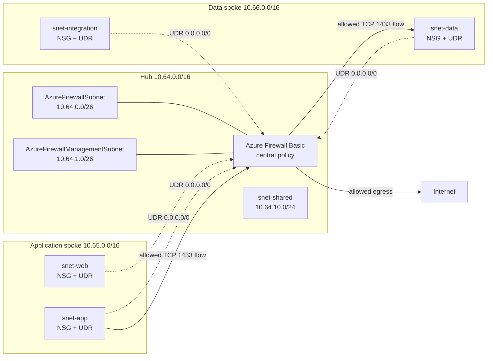

## Introduction

In [part 1 of this series](/posts/rede-hub-and-spoke-azure-terraform-parte-1/), we created three VNets, five subnets, and four directional peering links. In [part 2](/posts/rede-hub-and-spoke-azure-terraform-parte-2/), we associated NSGs to the four workload subnets and replaced broad permissions with explicit flows.

This foundation filters packets in each subnet, but it still does not decide where they go. There is also no central inspection and policy point for traffic between spokes or for internet egress. An NSG answers whether a packet can enter or leave that subnet. It does not turn the hub into a router, it does not understand application FQDNs, and it does not gather the decision in a single service.

In this part, we will add an Azure Firewall Basic to the hub and two User-Defined Routes (UDRs), which are custom route tables. The four workload subnets will use the private IP of the firewall as the next hop for the default route. We will also open a controlled application flow for data and limited egress for Windows updates.

The lab remains without virtual machines, VPN Gateway, ExpressRoute, Bastion, inbound DNAT, or TLS inspection. The goal is to describe and review the inspection layer with `terraform plan`, without running `terraform apply` during the preparation of this content.

## Architecture with central inspection

### Azure Firewall and NSG do not do the same job

The NSG remains close to the workload. It applies layer 3 and 4 rules, using source, destination, protocol, port, and direction. In our design, each workload subnet keeps its own contract. The web tier can talk to the application tier on port 8080, for example, while the rest remains denied.

The Azure Firewall sits in the hub and evaluates the traffic that the routes send to it. Besides network rules, it accepts application rules based on FQDN and tags maintained by Microsoft. The Firewall Policy concentrates these decisions into a reusable resource, and the firewall becomes the point where forwarded flows can generate logs and metrics. Retaining these records still requires Diagnostic Settings and a destination, like Log Analytics. This integration is not in the lab to avoid mixing inspection with a new observability layer.

The two controls work in sequence. The NSG needs to release the packet in the source subnet, the UDR needs to point to the correct path, the peering needs to accept forwarded traffic, and the firewall policy needs to allow the destination. Upon arrival, the destination subnet's NSG also participates in the evaluation. When one of these pieces disagrees, the packet does not negotiate. It just stops (like a ticket stuck in the Service Desk).



The dashed lines represent the routing decision of the UDRs. The solid lines show flows allowed by the policy. The application continues sending the packet to the database's private IP, not to the firewall as an explicit proxy. The Azure infrastructure queries the subnet's route table and delivers the packet to the firewall as the next hop before forwarding it to the original destination.

### Reserved subnets for the Basic SKU

The firewall cannot occupy `snet-shared`. Azure requires a subnet named exactly `AzureFirewallSubnet`, with a minimum prefix of `/26`. The name is not our convention, it is part of the service contract. A dedicated subnet also preserves the addresses needed for scaling and separates the managed appliance from other hub services.

There is a specific detail for the Basic SKU: it also requires `AzureFirewallManagementSubnet`, equally with a minimum size of `/26`, and a public IP configuration for the management plane. Therefore, this step creates two subnets and two static allocation Standard public IPs. Using Basic reduces the relative cost of the lab, but it does not remove the SKU's operational requirements.

The new resources are:

- `AzureFirewallSubnet` and `AzureFirewallManagementSubnet` in the hub;
- two public IPs, one for data and another for management;
- an Azure Firewall with Basic SKU;
- a Basic Firewall Policy;
- a rule collection group with network and application collections;
- two route tables, one per spoke;
- four associations between route table and subnet.

## IP plan adjustment

The hub already uses `10.64.0.0/16`, while `snet-shared` occupies `10.64.10.0/24`. We will reserve `10.64.0.0/26` for firewall data and `10.64.1.0/26` for management. The blocks do not overlap and leave free ranges for other specialized components.

| Network or subnet                   | CIDR            | Role in this part                    |
| ----------------------------------- | --------------- | ------------------------------------ |
| Hub VNet                            | `10.64.0.0/16`  | Central network services             |
| **`AzureFirewallSubnet`**           | `10.64.0.0/26`  | Azure Firewall data plane            |
| **`AzureFirewallManagementSubnet`** | `10.64.1.0/26`  | Management required by Basic SKU     |
| `snet-shared`                       | `10.64.10.0/24` | Future shared services               |
| Application spoke                   | `10.65.0.0/16`  | Application domain                   |
| `snet-web`                          | `10.65.10.0/24` | Web tier                             |
| `snet-app`                          | `10.65.20.0/24` | Application tier                     |
| Data spoke                          | `10.66.0.0/16`  | Data and integrations                |
| `snet-data`                         | `10.66.10.0/24` | Data tier                            |
| `snet-integration`                  | `10.66.20.0/24` | Private integrations                 |

A `/26` contains 64 addresses. Since Azure reserves five addresses in each IPv4 subnet, 59 are left for the service to use. Shrinking the block to save addresses would make the deploy fail. The savings would be akin to removing the fire escape to gain a few meters in the hallway.

In production, also reserve space for `GatewaySubnet`, `AzureBastionSubnet`, and DNS Resolver before filling the hub. They will not be created here, but each service has its own name and size requirements. Planning the range does not force you to contract the service, it just avoids a renumbering when it becomes necessary.

## Routes and firewall rules

### How the UDR forces the path

Each route table receives a `0.0.0.0/0` route with `next_hop_type = "VirtualAppliance"`. The next hop is the private IP exported by the firewall module. We associate `rt-spoke-app-lab-brs-001` with `snet-web` and `snet-app`. The table `rt-spoke-data-lab-brs-001` serves `snet-data` and `snet-integration`.

The default route covers destinations that do not have a more specific route. Since the spokes do not have direct peering and peering is not transitive, the path to the other spoke passes through the next hop in the hub. For the internet, the same route prevents the workload from using the platform's default egress without inspection.

`AzureFirewallSubnet`, `AzureFirewallManagementSubnet`, and `snet-shared` do not receive this UDR. Associating the route to the firewall's data plane could send traffic back to the firewall itself and form a loop. The management subnet needs to reach the platform infrastructure through the path expected by the service. Meanwhile, `snet-shared` is left out because it is still empty and has no traffic contract yet.

The four peerings also change `allow_forwarded_traffic` from `false` to `true`. Without this option, a peering could accept traffic originating in the remote VNet, but reject packets forwarded by the firewall. The route draws the path and the peering authorizes the type of traffic that passes through it.

### Minimal policy and default deny

The Firewall Policy combines a fixed precedence by type with numerical priorities. The Azure Firewall always evaluates DNAT, then network rules, and lastly application rules, regardless of the priorities assigned to the collections. Within each type, groups and collections with lower numbers are processed first. The lab does not have DNAT and uses a network collection at priority 100 and an application collection at priority 200. Even if these two numbers were swapped, the network collection would still be evaluated before the application collection.

If no rule allows the flow, the Azure Firewall denies it by default. We do not need to create a decorative `deny any any` rule to get this behavior.

| Priority | Collection and rule                             | Protocol  | Source                         | Destination              | Action |
| -------: | ----------------------------------------------- | --------- | ------------------------------ | ------------------------ | ------ |
|      100 | `allow-east-west` / `allow-app-to-data`         | TCP 1433  | `10.65.20.0/24`                | `10.66.10.0/24`          | Allow  |
|      200 | `allow-system-updates` / `allow-windows-update` | HTTPS 443 | `10.65.0.0/16`, `10.66.0.0/16` | FQDN Tag `WindowsUpdate` | Allow  |
|  Default | No match                                        | Any       | Any                            | Any                      | Deny   |

### NSG rules added in this part

The central policy does not replace the distributed controls from part 2. These are the allowances added to the NSGs so the packet reaches the firewall and is also accepted in the destination subnet:

| NSG               | Priority | Rule                                                       | Direction | Protocol and port | Source          | Destination     |
| ----------------- | -------: | ---------------------------------------------------------- | --------- | ----------------- | --------------- | --------------- |
| `nsg-web`         | 110 & 120| `allow-windows-update-http` & `allow-windows-update-https` | Outbound  | TCP 80 & 443      | `10.65.10.0/24` | `Internet`      |
| `nsg-app`         |      100 | `allow-data-outbound`                                      | Outbound  | TCP 1433          | `10.65.20.0/24` | `10.66.10.0/24` |
| `nsg-app`         | 110 & 120| `allow-windows-update-http` & `allow-windows-update-https` | Outbound  | TCP 80 & 443      | `10.65.20.0/24` | `Internet`      |
| `nsg-data`        |      110 | `allow-app-inbound`                                        | Inbound   | TCP 1433          | `10.65.20.0/24` | `10.66.10.0/24` |
| `nsg-data`        | 110 & 120| `allow-windows-update-http` & `allow-windows-update-https` | Outbound  | TCP 80 & 443      | `10.66.10.0/24` | `Internet`      |
| `nsg-integration` | 110 & 120| `allow-windows-update-http` & `allow-windows-update-https` | Outbound  | TCP 80 & 443      | `10.66.20.0/24` | `Internet`      |

The flow between spokes demonstrates east-west inspection: `snet-app` reaches `snet-data` only on TCP 1433. Both Azure Firewall and NSGs are stateful and recognize the return of an allowed connection. Therefore, we do not need to allow ephemeral response ports in the NSGs. The UDRs in both spokes remain essential so that round trips traverse the firewall, which needs to observe both directions of the flow to preserve session state.

The update rule uses the `WindowsUpdate` FQDN tag, maintained by Microsoft. It prevents hardcoding a list of domains that would age out before the next coffee break. The documentation itself warns that an FQDN tag might authorize required HTTP endpoints even when the rule declares HTTPS. For this reason, the NSGs allow TCP 80 and 443 to the `Internet` service tag; the Firewall Policy continues to restrict the destination to the tag's endpoints.

The lab uses the DNS provided by Azure. The virtual address `168.63.129.16` has special treatment and does not follow the default UDR up to the firewall. Creating a DNS rule in the policy would give a sense of control without putting the packet on that path. An implementation with central DNS inspection must enable DNS Proxy and configure the spokes to query it, which deserves a separate change and its own tests.

We did not create NAT or DNAT collections. The firewall's public IP handles the service and controlled egress, but does not publish a private workload. Internet ingress, destination translation, and TLS inspection remain out of scope.

## Terraform modules

### Firewall module

The `modules/firewall/` directory contains `main.tf`, `variables.tf`, and `outputs.tf`. It creates two `azurerm_public_ip` resources with `for_each`, the policy, the rule collection group, and the firewall. The collections arrive as maps, while the name and SKU tier arrive via variables. This way, the environment declares its choices without hiding them inside the resource.

```hcl title="Snippet from modules/firewall/main.tf"
resource "azurerm_firewall" "this" {
  name                = var.name
  resource_group_name = var.resource_group_name
  location            = var.location
  sku_name            = var.sku_name
  sku_tier            = var.sku_tier
  firewall_policy_id  = azurerm_firewall_policy.this.id
  tags                = var.tags

  ip_configuration {
    name                 = "data-ip-configuration"
    subnet_id            = var.firewall_subnet_id
    public_ip_address_id = azurerm_public_ip.this["data"].id
  }

  management_ip_configuration {
    name                 = "management-ip-configuration"
    subnet_id            = var.management_subnet_id
    public_ip_address_id = azurerm_public_ip.this["management"].id
  }
}
```

In the lab environment, the module receives `sku_name = "AZFW_VNet"` and `sku_tier = "Basic"`. The Firewall Policy uses the same `sku_tier` variable, avoiding an incompatible combination between a Basic policy and a firewall of another tier. The validations in `variables.tf` limit the values to the set accepted by the provider.

The `private_ip_address` output reads the address from the first data configuration. This value feeds the route module, creating an implicit dependency. Terraform knows it cannot finish the next hop before knowing the firewall's IP.

### Route table module

The `modules/route-table/` directory also follows the split into `main.tf`, `variables.tf`, and `outputs.tf`. The route is embedded in `azurerm_route_table`, while the associations use `for_each` over the subnet map:

```hcl title="modules/route-table/main.tf"
resource "azurerm_route_table" "this" {
  name                = var.name
  resource_group_name = var.resource_group_name
  location            = var.location
  tags                = var.tags

  route {
    name                   = "default-via-azure-firewall"
    address_prefix         = "0.0.0.0/0"
    next_hop_type          = "VirtualAppliance"
    next_hop_in_ip_address = var.next_hop_ip_address
  }
}

resource "azurerm_subnet_route_table_association" "this" {
  for_each = var.subnet_ids

  subnet_id      = each.value
  route_table_id = azurerm_route_table.this.id
}
```

In the environment, `local.route_tables` binds each spoke to its subnets. The `for_each` creates two instances of the module, and the map comprehension selects the IDs exported by the VNet module:

```hcl title="Snippet from environments/lab/main.tf"
module "route_table" {
  source   = "../../modules/route-table"
  for_each = local.route_tables

  name                 = each.value.name
  resource_group_name  = module.virtual_network[each.value.network_key].resource_group_name
  location             = var.location
  next_hop_ip_address  = module.firewall.private_ip_address
  subnet_ids = {
    for subnet_key in each.value.subnet_keys :
    subnet_key => module.virtual_network[each.value.network_key].subnet_ids[subnet_key]
  }
  tags = local.common_tags
}
```

The complete configuration goes from 23 to 36 resources. In a directory without state, the expected plan is `36 to add`. When continuing with the local state from part 2, expect `13 to add` and `8 to change`: the four NSGs receive new allowances and the four peerings will now accept forwarded traffic. Recreations or deletions of the 23 previous resources deserve investigation before any decision.

## Validation and cost

Starting from the part 3 repository, create only the local variables file:

```powershell
Copy-Item environments/lab/terraform.tfvars.example environments/lab/terraform.tfvars
```

Edit `subscription_id` and `owner`. In Bash, use `cp` instead of `Copy-Item` and `cd` instead of `Set-Location`. Then format, initialize, validate, and generate the plan:

```powershell
terraform fmt -check -recursive .
Set-Location environments/lab
terraform init
terraform validate
terraform plan -out=plan.tfplan
terraform show plan.tfplan
```

Before accepting the plan as evidence for this step, check:

- the two `/26` subnets with the exact reserved names;
- the two static Standard public IPs;
- the Basic SKU on the firewall and the Firewall Policy;
- the `0.0.0.0/0` route pointing to the firewall's private IP;
- the four associations only on the workload subnets;
- `allow_forwarded_traffic = true` on the four peerings;
- the corresponding allowances in the NSGs and the policy;
- the absence of NAT, DNAT, VPN, ExpressRoute, Bastion, and TLS inspection;
- the subscription, the region, and the tags before considering any future action.

Do not run `terraform apply` as part of this article. The inherited workflow also remains limited to `fmt`, `init -backend=false`, and `validate`, with no deployment credentials and no automatic resource creation.

The cost warning for this part is more serious than in the previous two. Azure Firewall generates a continuous hourly charge as long as it remains provisioned, even when no packets cross the service. There is also a charge related to data processing and public IPs depending on the scenario. Check the [Azure Pricing Calculator](https://azure.microsoft.com/pricing/calculator/?wt.mc_id=studentamb_365381) for your region and current conditions, rather than trusting values copied from an old article.

If you apply the lab on your own after an independent review, destroy the resources as soon as you finish testing. Confirm the subscription and read the destroy plan before approving it. Automating creation and forgetting the firewall turned on is a very efficient way to turn learning into a recurring line item on your invoice.

## What's next in part 4

Part 4 will add hybrid connectivity to the hub via VPN or ExpressRoute. The next chapter will address this decision with the gateway, route, and availability requirements it entails.

## References

- [Hub and spoke topology in Azure](https://learn.microsoft.com/azure/networking/design-guide/hub-spoke?wt.mc_id=studentamb_365381)
- [Azure Firewall Basic](https://learn.microsoft.com/azure/firewall/overview?wt.mc_id=studentamb_365381#azure-firewall-basic)
- [Subnet requirements for a secure hub and spoke architecture](https://learn.microsoft.com/azure/networking/cross-service-scenarios/design-secure-hub-spoke-network?wt.mc_id=studentamb_365381)
- [Virtual network traffic routing](https://learn.microsoft.com/azure/virtual-network/virtual-networks-udr-overview?wt.mc_id=studentamb_365381)
- [Firewall Policy rule processing](https://learn.microsoft.com/azure/firewall/policy-rule-sets?wt.mc_id=studentamb_365381)
- [Azure Firewall FQDN tags](https://learn.microsoft.com/azure/firewall/fqdn-tags?wt.mc_id=studentamb_365381)
- [Network security groups overview](https://learn.microsoft.com/azure/virtual-network/network-security-groups-overview?wt.mc_id=studentamb_365381)
- [Azure Firewall in AzureRM 4.79.0](https://registry.terraform.io/providers/hashicorp/azurerm/4.79.0/docs/resources/firewall)
- [Rule collection group in AzureRM 4.79.0](https://registry.terraform.io/providers/hashicorp/azurerm/4.79.0/docs/resources/firewall_policy_rule_collection_group)
- [Route table in AzureRM 4.79.0](https://registry.terraform.io/providers/hashicorp/azurerm/4.79.0/docs/resources/route_table)

## Conclusion

The hub is no longer just the common point of peerings; it now concentrates the inspection of the chosen paths. The UDRs send traffic from the spokes to the private IP of the Azure Firewall, the policy allows only the declared flows, and the NSGs continue to protect each subnet at both ends.

The most important outcome is a verifiable path. Communication between application and data must agree with NSG, route, peering, and Firewall Policy. This adds pieces, but it also turns scattered permissions into a trackable decision. When the network says no, at least we will have a short and honest list of places to investigate.
