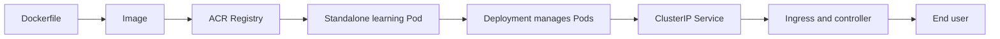

## Introduction

Your application runs well with `docker run` on your laptop. You close the terminal, open it again, and it still behaves as expected. The next question usually comes quickly: how do you keep more than one copy running, replace an instance that failed, and provide a reliable address for people on the internet?

Kubernetes solves this type of operational problem by declaring the desired state of the application. Instead of starting each container manually, you specify how many copies you want, which ports they expose, and how traffic should reach them. Azure Kubernetes Service (AKS) manages the Kubernetes cluster control plane for you in Azure.

In this lab, a Node.js API that returns a fixed message will start in a Dockerfile, pass through Azure Container Registry (ACR), and reach an AKS cluster. Along the way, you will create a Pod for learning purposes, replace that Pod with a Deployment, add a Service, and expose the application with Ingress.

At the end, a `curl` request to the public IP should return something like this:

```json title="Expected response"
{
  "status": "running",
  "message": "Hello from AKS! Your container became an application in Kubernetes."
}
```

This is a temporary lab, not a production architecture. The cluster will have a single node to reduce consumption. Two application replicas help demonstrate Deployment behavior, but they do not provide high availability if that single node fails.

## Fundamental concepts and the journey architecture

A **cluster** is the combination of the Kubernetes control plane and the computers that run workloads. In AKS, Microsoft manages the control plane. The **nodes** are virtual machines in your subscription where containers actually run.

Inside the cluster, we will use these components:

| Resource   | Practical role                                                                                    |
| ---------- | ------------------------------------------------------------------------------------------------- |
| Pod        | The smallest deployable unit. It groups one or more containers that share networking and storage. |
| Deployment | Maintains the desired number of Pods and coordinates updates and replacements.                    |
| Service    | Provides a stable address for a set of Pods selected by labels.                                   |
| Ingress    | Declares HTTP or HTTPS rules that route external traffic to a Service.                            |

For a short analogy, the Pod is the apartment where the container lives. The Service is the front desk that knows which apartments are available. The Ingress is the main entrance that reads the address on each request. The Deployment is the building management team that restores working apartments when one stops responding. The analogy ends here before someone starts charging YAML maintenance fees.

Labels and selectors form the contract between these components. The Deployment places `app: rookie-api` on the Pods. The Service looks for that exact label. If the text does not match, both resources may look healthy on their own while no request finds a backend. Kubernetes is very disciplined about what you declare, including declarations with a typo.

Another important concept is reconciliation. A Deployment does not execute the YAML once and leave. A controller continuously compares the current state with the desired state. If you requested two replicas and only one exists, it tries to create the second. This behavior separates an orchestrator from a sequence of commands that starts containers.

Our sequence will look like this:



The official diagram helps place this lab inside a complete cluster:


_Source: [Kubernetes Authors](https://kubernetes.io/docs/concepts/overview/components/), distributed under [CC BY 4.0](https://github.com/kubernetes/website/blob/main/LICENSE)._

You will use Azure CLI to create resources, Docker to build and push the image, `kubectl` to communicate with the cluster, and Helm only to install a controller for the lab.

## Preparing the environment and creating the AKS cluster

The starting point is an active Azure subscription, a completed `az login`, Docker running, Helm installed, and `kubectl` available. If only `kubectl` is missing, `az aks install-cli` installs it. The identity used by Azure CLI must also be able to create role assignments at the ACR scope so that `--attach-acr` works. Confirm the versions and the active context before creating anything:

```bash title="Check tools and subscription"
az --version
docker version
kubectl version --client
helm version
az account show \
  --query "{subscription:name, subscriptionId:id, tenantId:tenantId}" \
  --output table
```

The examples were prepared on August 26, 2026, using the current AKS and Kubernetes documentation. Because the preparation process did not execute commands in a real subscription, validate the lab from start to finish before publishing or presenting it. APIs, SKUs, and regional availability change.

Define the names. `ACR_NAME` must be globally unique and may contain only lowercase letters and numbers:

```bash title="Define lab values"
RESOURCE_GROUP="rg-aks-lab-beginners"
LOCATION="brazilsouth"
AKS_NAME="aks-rookieops-lab"
ACR_NAME="acrrookieops<YOUR_SUFFIX>"
NODE_VM_SIZE="Standard_D2as_v5"
```

The documented minimum for a system node pool VM is two vCPUs and four GiB of memory. The example SKU provides two vCPUs and eight GiB, keeping the minimum vCPU count while offering extra memory for cluster components and the lab. Microsoft recommends avoiding B-series VMs in this pool. Check regional availability and verify your subscription quota separately:

```bash title="Check the node SKU"
az vm list-skus \
  --location "$LOCATION" \
  --size "$NODE_VM_SIZE" \
  --output table
```

We will not pin `--kubernetes-version` or the network plugin. The lab uses stable APIs and does not depend on a specific network model. A pinned version can leave the AKS support window and break the tutorial even when the manifests remain valid. In a team that must reproduce the exact environment, check `az aks get-versions`, record the approved version, and declare the network options as well.

Create the resource group and the cluster:

```bash title="Create the lab AKS cluster"
az group create \
  --name "$RESOURCE_GROUP" \
  --location "$LOCATION" \
  --tags environment=lab managed-by=azure-cli

az aks create \
  --resource-group "$RESOURCE_GROUP" \
  --name "$AKS_NAME" \
  --location "$LOCATION" \
  --tier free \
  --node-count 1 \
  --node-vm-size "$NODE_VM_SIZE" \
  --generate-ssh-keys
```

The Free tier is appropriate for learning and has no financial SLA. It removes the cluster management charge, but node VMs, disks, ACR, the public IP, and traffic may still generate charges.

We use AKS Standard mode so that we can see the node pool and control its capacity directly. AKS Automatic provides a more managed experience and production-oriented defaults, but it would add decisions that do not help explain this lab sequence. A single node is also a deliberate cost choice. In production, reliability guidance starts with multiple nodes in the system node pool, proper distribution, and a tier with an SLA.

Connect `kubectl` and confirm that the node is `Ready`:

```bash title="Connect to and validate the cluster"
az aks get-credentials \
  --resource-group "$RESOURCE_GROUP" \
  --name "$AKS_NAME" \
  --overwrite-existing

kubectl config current-context
kubectl get nodes -o wide
```

## From the image to the registry

Create a directory named `aks-lab` with this structure. You can copy the files shown in the article or clone the [complete lab repository](https://github.com/tkusal/Kubernetes-na-pr-tica-com-AKS-do-container-ao-Pod-Service-e-Ingress):

```text title="Lab structure"
aks-lab/
├── manifests/
│   ├── deployment.yaml
│   ├── ingress.yaml
│   ├── pod.yaml
│   └── service.yaml
├── app.js
├── Dockerfile
└── package.json
```

The `package.json` file enables ES modules so that the `import` statement in `app.js` is interpreted correctly:

```json title="package.json"
{
  "name": "rookie-api",
  "version": "1.0.0",
  "private": true,
  "type": "module",
  "engines": {
    "node": ">=24"
  }
}
```

The API uses only the native Node.js HTTP module. Therefore, it has no external dependencies and the Dockerfile does not need to run `npm install`. Create `app.js`:

```javascript title="app.js"
import { createServer } from 'node:http';

const port = Number.parseInt(process.env.PORT ?? '3000', 10);

createServer((request, response) => {
  const isHealthCheck = request.url === '/health';

  response.writeHead(200, { 'Content-Type': 'application/json; charset=utf-8' });
  response.end(
    JSON.stringify({
      status: isHealthCheck ? 'ok' : 'running',
      message: isHealthCheck
        ? 'rookie-api is healthy'
        : 'Hello from AKS! Your container became an application in Kubernetes.'
    })
  );
}).listen(port, '0.0.0.0');
```

The Dockerfile runs the process as an unprivileged user:

```dockerfile title="Dockerfile"
FROM node:24-alpine

ENV NODE_ENV=production \
    PORT=3000
WORKDIR /app
COPY --chown=10001:10001 package.json app.js ./
USER 10001
EXPOSE 3000
CMD ["node", "app.js"]
```

Build and test locally:

```bash title="Build and test the image"
cd aks-lab
docker build -t rookie-api:v1 .
docker run --rm --detach --name rookie-api-local \
  --publish 3000:3000 \
  rookie-api:v1
curl http://localhost:3000/
docker stop rookie-api-local
```

Create the Basic ACR, retrieve the actual login server address, and push the image. Retrieving this address is better than assuming its format because registries with DNS name protection may receive a hash:

```bash title="Create ACR and push the image"
az acr create \
  --resource-group "$RESOURCE_GROUP" \
  --name "$ACR_NAME" \
  --location "$LOCATION" \
  --sku Basic

az acr login --name "$ACR_NAME"
ACR_LOGIN_SERVER="$(az acr show \
  --name "$ACR_NAME" \
  --query loginServer \
  --output tsv)"

docker tag rookie-api:v1 "$ACR_LOGIN_SERVER/rookie-api:v1"
docker push "$ACR_LOGIN_SERVER/rookie-api:v1"
az acr repository show-tags --name "$ACR_NAME" --repository rookie-api --output table
```

Attach ACR to AKS. The command grants the cluster managed identity permission to pull images without storing a password in the manifest:

```bash title="Allow AKS to read ACR"
az aks update \
  --resource-group "$RESOURCE_GROUP" \
  --name "$AKS_NAME" \
  --attach-acr "$ACR_NAME"
```

> [!IMPORTANT]
> Before applying any manifest, replace `ACR_LOGIN_SERVER` with the returned value in `manifests/pod.yaml` and `manifests/deployment.yaml`. Confirm the replacement with `grep -R "ACR_LOGIN_SERVER" manifests`. The command should not find any occurrence.

In production, prefer an immutable tag or the image digest and scan for vulnerabilities. The `v1` tag is kept here to make the lab easy to read.

## From Pod to Deployment

Start with a standalone Pod to see the smallest deployable unit:

```yaml title="manifests/pod.yaml"
apiVersion: v1
kind: Pod
metadata:
  name: rookie-api-pod
  labels:
    app: rookie-api-pod-demo
spec:
  securityContext:
    runAsNonRoot: true
    seccompProfile:
      type: RuntimeDefault
  containers:
    - name: rookie-api
      # IMPORTANT: replace ACR_LOGIN_SERVER before applying.
      image: ACR_LOGIN_SERVER/rookie-api:v1
      ports:
        - name: http
          containerPort: 3000
      resources:
        requests:
          cpu: 50m
          memory: 64Mi
        limits:
          cpu: 200m
          memory: 128Mi
```

```bash title="Apply and remove the learning Pod"
kubectl apply -f manifests/pod.yaml
kubectl get pod rookie-api-pod -o wide
kubectl logs pod/rookie-api-pod
kubectl delete -f manifests/pod.yaml
```

A Pod by itself does not maintain its own replacement. In practice, use a Deployment. The Deployment selector must exactly match the template labels:

```yaml title="manifests/deployment.yaml"
apiVersion: apps/v1
kind: Deployment
metadata:
  name: rookie-api
spec:
  replicas: 2
  selector:
    matchLabels:
      app: rookie-api
  template:
    metadata:
      labels:
        app: rookie-api
    spec:
      securityContext:
        runAsNonRoot: true
        seccompProfile:
          type: RuntimeDefault
      containers:
        - name: rookie-api
          # IMPORTANT: replace ACR_LOGIN_SERVER before applying.
          image: ACR_LOGIN_SERVER/rookie-api:v1
          ports:
            - name: http
              containerPort: 3000
          readinessProbe:
            httpGet:
              path: /health
              port: http
            initialDelaySeconds: 3
            periodSeconds: 5
          livenessProbe:
            httpGet:
              path: /health
              port: http
            initialDelaySeconds: 10
            periodSeconds: 10
```

The readiness probe prevents the Service from sending traffic before the container is ready. The liveness probe requests a restart when the process stops responding. The initial delays give the application time to start and should be adjusted to the actual behavior of each service. The complete file also drops capabilities, prevents privilege escalation, uses a read-only filesystem, and defines limits. Apply it and wait for the rollout:

```bash title="Apply the Deployment"
kubectl apply -f manifests/deployment.yaml
kubectl rollout status deployment/rookie-api
kubectl get deployments
kubectl get pods -l app=rookie-api -o wide
```

The result should show two rows with `READY` equal to `1/1` and `STATUS` equal to `Running`:

```text title="Condensed expected output"
NAME                          READY   STATUS    RESTARTS   AGE
rookie-api-<HASH>-<SUFFIX1>   1/1     Running   0          30s
rookie-api-<HASH>-<SUFFIX2>   1/1     Running   0          30s
```

If you delete one of the Pods, the Deployment creates another to return to two replicas. This is the first moment when Kubernetes stops looking like a collection of YAML files and starts looking like an operator working for you.

## Exposing the application with a Service

Pods receive addresses that can change. A Service provides a stable endpoint and selects backends through labels.

| Type         | When it makes sense                                                                   |
| ------------ | ------------------------------------------------------------------------------------- |
| ClusterIP    | Internal communication, the default used in this lab.                                 |
| NodePort     | Exposes a high port on every node, commonly used for tests and specific integrations. |
| LoadBalancer | Requests an external cloud load balancer, with its own cost and IP address in AKS.    |

Create a ClusterIP that listens on port 80 and forwards to the container port named `http`:

```yaml title="manifests/service.yaml"
apiVersion: v1
kind: Service
metadata:
  name: rookie-api
spec:
  type: ClusterIP
  selector:
    app: rookie-api
  ports:
    - name: http
      port: 80
      targetPort: http
```

```bash title="Apply and test the Service"
kubectl apply -f manifests/service.yaml
kubectl get service rookie-api
kubectl get endpointslice \
  -l kubernetes.io/service-name=rookie-api
kubectl port-forward service/rookie-api 8080:80
```

In another terminal, run `curl http://localhost:8080/`. If it works, the Deployment, labels, Pods, and Service are communicating. Stop the port forward with `Ctrl+C`.

## Reaching the internet with Ingress

The Ingress resource contains rules, but it does not serve traffic by itself. It requires an Ingress controller, a process that watches those rules and configures the actual networking component.

This distinction prevents a common misunderstanding. `kubectl apply -f ingress.yaml` creates only the routing intent. Without a controller compatible with `ingressClassName: nginx`, nothing implements that intent. In the other direction, installing the controller without creating an Ingress resource leaves the entrance running but without a rule that reaches our API.

> [!CAUTION]
> The community Ingress NGINX project ended maintenance in March 2026. It no longer receives bug fixes or vulnerability patches. The Helm installation below exists only to demonstrate, in a portable way, the relationship between an Ingress resource and its controller in a disposable cluster. Do not reuse this installation or adopt this controller for a new production workload.

Install the last available artifact and confirm that the controller is ready:

```bash title="Install Ingress NGINX for the lab"
helm upgrade --install ingress-nginx ingress-nginx \
  --repo https://kubernetes.github.io/ingress-nginx \
  --namespace ingress-nginx \
  --create-namespace

kubectl rollout status \
  deployment/ingress-nginx-controller \
  --namespace ingress-nginx
```

The chart creates a `LoadBalancer` Service, which requests an Azure Load Balancer and a public IP. Now apply the rule that sends `/` to the `rookie-api` Service:

```yaml title="manifests/ingress.yaml"
apiVersion: networking.k8s.io/v1
kind: Ingress
metadata:
  name: rookie-api
spec:
  ingressClassName: nginx
  rules:
    - http:
        paths:
          - path: /
            pathType: Prefix
            backend:
              service:
                name: rookie-api
                port:
                  number: 80
```

```bash title="Expose and test the API"
kubectl apply -f manifests/ingress.yaml
kubectl get ingress rookie-api

PUBLIC_IP="$(kubectl get service ingress-nginx-controller \
  --namespace ingress-nginx \
  --output jsonpath='{.status.loadBalancer.ingress[0].ip}')"

curl "http://$PUBLIC_IP/"
```

The IP address may take a few minutes to move past `<pending>`. If `PUBLIC_IP` is empty, wait and repeat the query commands. The example accepts any hostname and uses open HTTP. A real service should configure DNS, restrict the expected behavior, and use TLS. `cert-manager` is a common next step, but it will not be installed here.

AKS provides a managed application routing add-on with NGINX, enabled by `az aks approuting enable`. It uses the `webapprouting.kubernetes.azure.com` class and receives critical patches from Microsoft only until November 2026. For a new production architecture, Microsoft's recommended direction is application routing based on Kubernetes Gateway API. We continue with Ingress here because it is the object we are learning.

## Validation, troubleshooting, and cleanup

Validate one layer at a time. Start with the Pod and move toward the public entry point:

```bash title="Essential diagnostics"
kubectl get deployments,pods,services,ingress -o wide
kubectl describe deployment rookie-api
kubectl describe pod -l app=rookie-api
kubectl describe service rookie-api
kubectl describe ingress rookie-api
kubectl logs deployment/rookie-api --tail=100
kubectl exec deployment/rookie-api -- \
  node -e "fetch('http://127.0.0.1:3000/health').then(r => r.text()).then(console.log)"
kubectl get events --sort-by=.metadata.creationTimestamp
```

The most common errors leave specific clues:

| Symptom                  | Likely cause                                       | First adjustment                                                                     |
| ------------------------ | -------------------------------------------------- | ------------------------------------------------------------------------------------ |
| `ImagePullBackOff`       | wrong image address or AKS has no access           | check `ACR_LOGIN_SERVER`, the tag, and `az aks update --attach-acr`.                 |
| `CrashLoopBackOff`       | the process exits repeatedly                       | read `kubectl logs` and `kubectl describe pod`; validate the image port and command. |
| Service has no endpoints | selector does not match the Pod labels             | compare the Service `spec.selector` with the template `metadata.labels`.             |
| Ingress has no address   | controller is not ready or has no public IP        | check Pods and Service in the `ingress-nginx` namespace and wait for provisioning.   |
| HTTP 502 or 503          | Service has no ready backend or ports do not match | validate EndpointSlices, the readiness probe, `port`, and `targetPort`.              |

If your ACR was created in repository-level ABAC permission mode, `--attach-acr` does not use the expected classic roles. The lab creates the registry in the default RBAC mode. In another environment, follow the integration documentation for the selected mode instead of placing a username and password in YAML.

### Risks, costs, and rollback

AKS charges for nodes as VMs. ACR, disks, the public IP, Azure Load Balancer, data egress, and logs may also generate costs. Application Gateway and Application Gateway for Containers, if you add them in another scenario, have their own charges. Check the [official AKS pricing page](https://azure.microsoft.com/pricing/details/kubernetes-service/) and the [Azure Pricing Calculator](https://azure.microsoft.com/pricing/calculator/) for your region and agreement.

Before deleting anything, confirm the subscription and list every resource in the group:

```bash title="Review and delete the lab"
az account show \
  --query "{subscription:name, subscriptionId:id, tenantId:tenantId}" \
  --output table

az resource list \
  --resource-group "$RESOURCE_GROUP" \
  --query "[].{name:name, type:type, location:location}" \
  --output table

az group delete \
  --name "$RESOURCE_GROUP" \
  --yes
```

Deleting the group removes AKS, ACR, the managed infrastructure, and everything else inside it. Do not run the final command if the list contains anything that must be preserved.

## References

- [AKS core concepts](https://learn.microsoft.com/azure/aks/core-aks-concepts?wt.mc_id=studentamb_365381)
- [AKS quickstart with Azure CLI](https://learn.microsoft.com/azure/aks/learn/quick-kubernetes-deploy-cli?wt.mc_id=studentamb_365381)
- [AKS Free, Standard, and Premium tiers](https://learn.microsoft.com/azure/aks/free-standard-pricing-tiers?wt.mc_id=studentamb_365381)
- [Virtual machine SKUs in AKS](https://learn.microsoft.com/azure/aks/aks-virtual-machine-sizes?wt.mc_id=studentamb_365381)
- [Push images to Azure Container Registry](https://learn.microsoft.com/azure/container-registry/container-registry-get-started-docker-cli?wt.mc_id=studentamb_365381)
- [Pods and workloads in Kubernetes](https://kubernetes.io/docs/concepts/workloads/)
- [Deployments](https://kubernetes.io/docs/concepts/workloads/controllers/deployment/)
- [Services](https://kubernetes.io/docs/concepts/services-networking/service/)
- [Ingress](https://kubernetes.io/docs/concepts/services-networking/ingress/)
- [Ingress NGINX retirement](https://kubernetes.io/blog/2025/11/11/ingress-nginx-retirement/)
- [Application routing with NGINX in AKS](https://learn.microsoft.com/azure/aks/app-routing?wt.mc_id=studentamb_365381)
- [Application routing with Gateway API in AKS](https://learn.microsoft.com/azure/aks/app-routing-gateway-api?wt.mc_id=studentamb_365381)

## Conclusion

You started with a local image and reached a public API in AKS. The Pod showed where the container runs, the Deployment began maintaining replicas, the Service created a stable address, and the Ingress described how HTTP reaches the application.

The main lesson is not memorizing four YAML files. It is understanding the question each resource answers. Who maintains the copies? Deployment. Who finds the current Pods? Service. Who decides the inbound HTTP route? Ingress and its controller.

After validating the public response, delete the resource group. Natural next steps include TLS with `cert-manager`, autoscaling with HPA, and the managed AKS Gateway API. One topic at a time. Kubernetes already has enough abstractions without inviting all of them to your first coffee.
