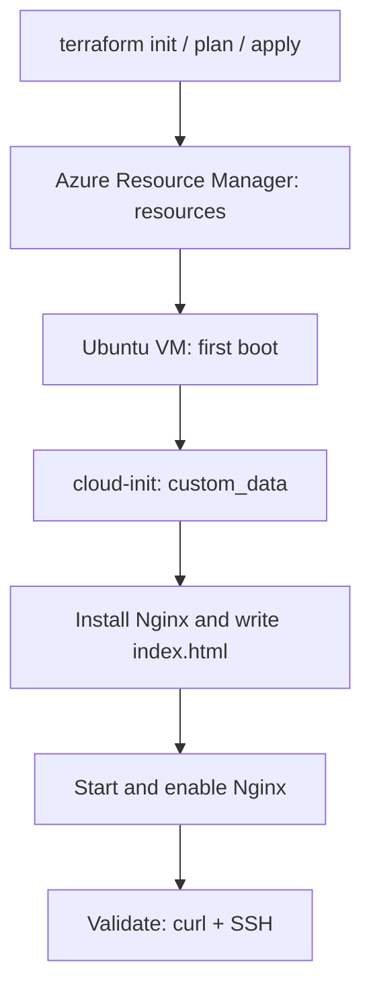

## Introduction

Your first VM through the Azure portal usually works. So does the second, until someone asks which image you selected, who opened SSH, and how Nginx got there. Browser history makes a surprisingly poor infrastructure runbook.

When those decisions live in one person's memory, recreating the environment becomes guesswork. Accumulated differences in VM size, networking, and configuration between the expected environment and the actual one are called **configuration drift**.

Infrastructure as Code, or **IaC**, records infrastructure in reviewable, versioned files. In this lab, Terraform describes the Azure resources, while cloud-init prepares Ubuntu on first boot, ending with a page served by Nginx.

All code used in this article is available in the [lab repository on GitHub](https://github.com/tkusal/VM-Linux-no-Azure-com-Terraform-e-Cloud-Init).

### What you should know first

This guide is for readers who have created a VM through the portal, understand basic SSH access and TCP ports, and are getting started with Terraform. CIDR and NSGs are explained as we go.

Local commands use **PowerShell on Windows**. In Bash, adapt variable assignments and replace `Copy-Item` with `cp` and `curl.exe` with `curl`; HCL and YAML stay the same.

### Expected result

After `terraform apply` and initial configuration, you will have an Ubuntu VM serving Nginx on port 80 with SSH key access, without portal clicks. When finished, remove the lab with `terraform destroy`.

The focus is Azure Compute Infrastructure: provisioning, initialization, and the lifecycle of a VM. This example uses public HTTP and a single instance without high availability. It is not a production architecture.

For administrative access without a public IP on the VM, consider [Azure Bastion](https://learn.microsoft.com/en-us/azure/bastion/bastion-overview). Its setup and cost assessment are outside this lab's scope.

## Fundamentals: what Terraform does and what cloud-init does

Terraform reads files written in HCL, a configuration language, and uses a **provider**, the component that talks to a service's API. Here, `azurerm` connects Terraform to Azure Resource Manager, Azure's resource management layer.

| Tool       | Responsibility in this lab                                       |
| ---------- | ---------------------------------------------------------------- |
| Terraform  | Create the resource group, network, rules, IP, interface, and VM |
| cloud-init | Install packages, write the page, and start Nginx inside Ubuntu  |

The selected image already includes cloud-init. We will not install Terraform inside the VM. Terraform runs on your computer and sends the infrastructure configuration to Azure.



Infrastructure readiness and application readiness are separate milestones. Azure can report successful provisioning before cloud-init finishes. That is why the HTTP check is part of the procedure, as explained in the [custom data documentation](https://learn.microsoft.com/en-us/azure/virtual-machines/custom-data).

### Prerequisites and reference environment

- An Azure lab subscription with Contributor permissions at the required scope. Because we create a resource group, access limited to an existing group is insufficient.
- The `Microsoft.Compute` and `Microsoft.Network` resource providers already registered in the subscription. Ask your administrator to register them if needed.
- Terraform CLI `1.15.8`, Azure CLI installed, and PowerShell with `ssh` and `curl.exe` available.
- A local SSH key pair: the public key goes to the VM, and the private key stays with you. The example uses `~/.ssh/id_ed25519.pub`.
- Quota and availability for the VM size in your chosen region.

We use ED25519, one of the [key formats supported by Azure](https://learn.microsoft.com/en-us/azure/virtual-machines/linux/mac-create-ssh-keys). If you do not already have this key pair, generate it locally:

```powershell
ssh-keygen -t ed25519
```

Protect the private key with a passphrase. Accept the default path only if no key already exists there; do not overwrite a key you use elsewhere.

The code was formatted and validated locally with Terraform `1.15.8` and AzureRM [`5.3.0`](https://github.com/hashicorp/terraform-provider-azurerm/releases/tag/v5.3.0) on Windows. **No Azure resources were provisioned while preparing this article.** Local validation does not establish regional availability or demonstrate a working cloud server.

## Provisioning the network foundation and resource group with Terraform

Use the repository files or create a `vmlinux` directory with the examples below. Terraform loads every `.tf` file in the directory as one configuration.

```text
vmlinux/
  providers.tf
  variables.tf
  network.tf
  vm.tf
  outputs.tf
  cloud-init.yaml
  terraform.tfvars.example
  .gitignore
  .terraform.lock.hcl
  LICENSE
  README.md
```

### Provider and authentication

`providers.tf` pins the provider version. Automatic resource provider registration is disabled, so the configuration will not attempt to enable services in the subscription during planning. This behavior is documented in the [AzureRM provider reference](https://registry.terraform.io/providers/hashicorp/azurerm/5.3.0/docs).

```hcl title="providers.tf"
# Educational example. Replace placeholders in terraform.tfvars.example locally.
terraform {
  required_version = ">= 1.15.8, < 2.0.0"

  required_providers {
    azurerm = {
      source  = "hashicorp/azurerm"
      version = "5.3.0"
    }
  }
}

provider "azurerm" {
  features {}

  subscription_id                 = var.subscription_id
  tenant_id                       = var.tenant_id
  resource_provider_registrations = "none"
}
```

Authenticate through Azure CLI and check the selected context. Replace the angle-bracket identifiers with your subscription values only in your local environment:

```powershell
az login --tenant "<TENANT_ID>"
az account set --subscription "<SUBSCRIPTION_ID>"
az account show --query "{subscription:name,id:id,tenant:tenantId}" --output table
az provider show --namespace Microsoft.Compute --query registrationState --output tsv
az provider show --namespace Microsoft.Network --query registrationState --output tsv
```

The last two commands should return `Registered`. Service Principal authentication is an option for future automation, but it is outside this lab's scope.

Check quota usage and limits before running `apply`:

```powershell
az vm list-usage --location brazilsouth --output table
```

Compare usage against both regional and VM family vCPU limits, as described in [Azure's quota documentation](https://learn.microsoft.com/en-us/azure/virtual-machines/quotas). Use the same region as `location`. Sufficient quota does not guarantee available capacity for the selected size.

### Variables and local values

`variables.tf` declares the inputs. `location` selects the region, `prefix` organizes resource names, and CIDRs describe network address ranges. The subnet must fit inside the VNet and should not overlap networks you intend to connect later.

```hcl title="variables.tf"
# Educational example. No real identifiers or private keys belong in this file.
variable "subscription_id" {
  type        = string
  description = "Azure subscription ID. Replace <SUBSCRIPTION_ID> locally."
}

variable "tenant_id" {
  type        = string
  description = "Microsoft Entra tenant ID. Replace <TENANT_ID> locally."
}

variable "location" {
  type        = string
  description = "Azure region. Check VM size availability and your quota."
  default     = "brazilsouth"
}

variable "prefix" {
  type        = string
  description = "Short prefix for a dedicated lab, not an existing environment."
  default     = "rookie-vm-lab"

  validation {
    condition     = can(regex("^[a-z][a-z0-9-]{1,19}$", var.prefix))
    error_message = "Use 2 to 20 lowercase letters, digits or hyphens; start with a letter."
  }
}

variable "vnet_cidr" {
  type        = string
  description = "Private IPv4 network range."
  default     = "10.42.0.0/16"
}

variable "subnet_cidr" {
  type        = string
  description = "Subnet range, contained within vnet_cidr."
  default     = "10.42.1.0/24"
}

variable "admin_source_cidr" {
  type        = string
  description = "Your current public IPv4 address followed by /32."

  validation {
    condition     = can(cidrnetmask(var.admin_source_cidr)) && endswith(var.admin_source_cidr, "/32")
    error_message = "Use a single valid IPv4 address with /32, not 0.0.0.0/0."
  }
}

variable "ssh_public_key_path" {
  type        = string
  description = "Public key path only. Example: ~/.ssh/id_ed25519.pub."
}

variable "vm_size" {
  type        = string
  description = "Example VM size; availability and pricing vary by subscription and region."
  default     = "Standard_B2s"
}

variable "image_version" {
  type        = string
  description = "Use a specific image version when a fixed base image is required."
  default     = "latest"
}
```

Next, save `terraform.tfvars.example`:

```hcl title="terraform.tfvars.example"
# Educational example. Copy to terraform.tfvars and replace placeholders locally.
# Never commit the populated terraform.tfvars file.
subscription_id     = "<SUBSCRIPTION_ID>"
tenant_id           = "<TENANT_ID>"
location            = "brazilsouth"
prefix              = "rookie-vm-lab"
vnet_cidr           = "10.42.0.0/16"
subnet_cidr         = "10.42.1.0/24"
admin_source_cidr   = "<YOUR_PUBLIC_IPV4>/32"
ssh_public_key_path = "~/.ssh/id_ed25519.pub"
vm_size             = "Standard_B2s"
image_version       = "latest"
```

Make a local copy on your computer:

```powershell
Copy-Item terraform.tfvars.example terraform.tfvars
```

Edit the copy and replace every placeholder. For `admin_source_cidr`, use your current public outbound IPv4 address followed by `/32`, which identifies one address. Do not use your laptop's private IP. If you connect through a VPN, account for its outbound address.

To look up your outbound IPv4 in PowerShell, use the external service [ifconfig.me](https://ifconfig.me/):

```powershell
curl.exe -4 --fail --silent --show-error https://ifconfig.me/ip
```

In Bash:

```bash
curl -4 --fail --silent --show-error https://ifconfig.me/ip
```

Copy the returned address and append `/32`. `-4` forces IPv4, and `/ip` returns only the address. Follow your organization's policies for external lookups; proxies or VPNs with different routes may show an address different from the one SSH uses.

Adjust the public key path. `Standard_B2s` is an example subject to availability in your subscription and region, with no guarantee of the lowest price.

### Network and inbound rules

A Network Security Group, or **NSG**, filters traffic using source, destination, protocol, and port. For connections from the internet, we allow SSH only from your `/32` and HTTP on port 80. The NSG's default rules remain in effect, including those allowing traffic within the VNet.

```hcl title="network.tf"
# Educational example. Public HTTP is intentional; SSH is restricted to your IPv4 /32.
locals {
  tags = {
    project     = "azure-vm-terraform-cloudinit"
    environment = "lab"
    managed_by  = "terraform"
  }
}

resource "azurerm_resource_group" "lab" {
  name     = "rg-${var.prefix}"
  location = var.location
  tags     = local.tags
}

resource "azurerm_virtual_network" "lab" {
  name                = "vnet-${var.prefix}"
  location            = azurerm_resource_group.lab.location
  resource_group_name = azurerm_resource_group.lab.name
  address_space       = [var.vnet_cidr]
  tags                = local.tags
}

resource "azurerm_subnet" "web" {
  name                            = "snet-web"
  resource_group_name             = azurerm_resource_group.lab.name
  virtual_network_name            = azurerm_virtual_network.lab.name
  address_prefixes                = [var.subnet_cidr]
  default_outbound_access_enabled = false
}

resource "azurerm_network_security_group" "web" {
  name                = "nsg-${var.prefix}"
  location            = azurerm_resource_group.lab.location
  resource_group_name = azurerm_resource_group.lab.name
  tags                = local.tags

  security_rule {
    name                       = "AllowSshFromAdmin"
    priority                   = 100
    direction                  = "Inbound"
    access                     = "Allow"
    protocol                   = "Tcp"
    source_port_range          = "*"
    destination_port_range     = "22"
    source_address_prefix      = var.admin_source_cidr
    destination_address_prefix = "*"
  }

  security_rule {
    name                       = "AllowHttpFromInternet"
    priority                   = 110
    direction                  = "Inbound"
    access                     = "Allow"
    protocol                   = "Tcp"
    source_port_range          = "*"
    destination_port_range     = "80"
    source_address_prefix      = "Internet"
    destination_address_prefix = "*"
  }
}

resource "azurerm_public_ip" "web" {
  name                = "pip-${var.prefix}"
  location            = azurerm_resource_group.lab.location
  resource_group_name = azurerm_resource_group.lab.name
  allocation_method   = "Static"
  sku                 = "Standard"
  tags                = local.tags
}

resource "azurerm_network_interface" "web" {
  name                = "nic-${var.prefix}"
  location            = azurerm_resource_group.lab.location
  resource_group_name = azurerm_resource_group.lab.name
  tags                = local.tags

  ip_configuration {
    name                          = "primary"
    subnet_id                     = azurerm_subnet.web.id
    private_ip_address_allocation = "Dynamic"
    public_ip_address_id          = azurerm_public_ip.web.id
  }
}

resource "azurerm_network_interface_security_group_association" "web" {
  network_interface_id      = azurerm_network_interface.web.id
  network_security_group_id = azurerm_network_security_group.web.id
}
```

Reserve `rg-rookie-vm-lab` exclusively for this exercise. Prefixes such as `vnet`, `nsg`, and `nic` identify a resource's purpose. The NIC is the network interface connecting the VM to its subnet, with the public IP and NSG associated with it.

The public IP uses the `Standard` SKU and `Static` allocation. The subnet disables implicit outbound access with `default_outbound_access_enabled = false`, but the VM has an explicit outbound path through the public IP attached to its NIC. This allows package downloads while keeping the NSG's default outbound rules. See the [outbound connectivity documentation](https://learn.microsoft.com/en-us/azure/virtual-network/ip-services/default-outbound-access).

## Creating the Linux VM with SSH key authentication

Save the complete `vm.tf` file. It references the YAML file from the next section, so finish creating all files before validating:

```hcl title="vm.tf"
# Educational example. Only the public SSH key is passed to Azure.
resource "azurerm_linux_virtual_machine" "web" {
  name                            = "vm-${var.prefix}"
  computer_name                   = "vm-${var.prefix}"
  location                        = azurerm_resource_group.lab.location
  resource_group_name             = azurerm_resource_group.lab.name
  size                            = var.vm_size
  admin_username                  = "azureuser"
  disable_password_authentication = true
  network_interface_ids           = [azurerm_network_interface.web.id]
  custom_data                     = filebase64("${path.module}/cloud-init.yaml")
  tags                            = local.tags

  admin_ssh_key {
    username   = "azureuser"
    public_key = file(pathexpand(var.ssh_public_key_path))
  }

  os_disk {
    name                 = "osdisk-${var.prefix}"
    caching              = "ReadWrite"
    storage_account_type = "StandardSSD_LRS"
  }

  source_image_reference {
    publisher = "Canonical"
    offer     = "ubuntu-24_04-lts"
    sku       = "server"
    version   = var.image_version
  }

  boot_diagnostics {}

  # Attach the NSG before boot so the VM starts with its inbound rules in place.
  depends_on = [azurerm_network_interface_security_group_association.web]
}
```

The image is Ubuntu Server 24.04 LTS, generation 2, x64. The `Canonical:ubuntu-24_04-lts:server` combination follows [Canonical's official image catalog](https://ubuntu.com/azure/docs/azure-how-to/instances/find-ubuntu-images/). We are choosing an established LTS release without requiring it to be the newest one.

`latest` keeps the lab approachable, but it may resolve to a different image on another date. To repeat a specific base image, set `image_version` to a version available in your region. Ubuntu packages also change over time: reproducible infrastructure does not mean a byte-for-byte identical operating system.

`file(pathexpand(...))` expands `~` and reads only the public key. There is no administrator password in this example, and `disable_password_authentication = true` disables SSH password authentication. Never put a private key in HCL, YAML, or outputs.

The empty `boot_diagnostics` block enables boot diagnostics with managed storage. `depends_on` ensures that the NSG association exists before the VM is created. References between resources already establish the other dependencies.

In `outputs.tf`, expose only the values needed for validation and cleanup:

```hcl title="outputs.tf"
# Educational example. Outputs contain no private keys or passwords.
output "public_ip_address" {
  description = "Public IPv4 address used for HTTP and SSH validation."
  value       = azurerm_public_ip.web.ip_address
}

output "resource_group_name" {
  description = "Dedicated resource group to check before and after cleanup."
  value       = azurerm_resource_group.lab.name
}
```

## Automating with cloud-init: Nginx on first boot

Create `cloud-init.yaml` in the same directory:

```yaml title="cloud-init.yaml"
#cloud-config
# Educational example. Never put secrets in custom_data; base64 is not encryption.
package_update: true
packages:
  - nginx

write_files:
  - path: /var/www/html/index.html
    owner: root:root
    permissions: '0644'
    # Write after packages are installed, before runcmd runs.
    defer: true
    content: |
      <!doctype html>
      <html lang="en">
        <head>
          <meta charset="utf-8">
          <meta name="viewport" content="width=device-width, initial-scale=1">
          <title>RookieOps Azure VM Lab</title>
        </head>
        <body>
          <h1>RookieOps: Nginx is ready!</h1>
          <p>Provisioned with Terraform. Configured with cloud-init.</p>
        </body>
      </html>

runcmd:
  - [nginx, -t]
  - [systemctl, enable, --now, nginx]
```

The first line identifies the document as cloud-init configuration. `package_update` refreshes the package index without requesting a full system upgrade. `packages` installs Nginx and its dependencies.

`write_files` creates the page, readable by the server and writable only by the administrator. With `defer: true`, writing waits until packages are installed. The `runcmd` commands check the configuration and enable Nginx now and on subsequent boots.

The `runcmd` module belongs to the _config_ stage, but only writes a script there. The `scripts_user` module executes it during the _final_ stage. Ubuntu's default configuration orders these modules as `package_update_upgrade_install`, `write_files_deferred`, then `scripts_user`: packages, page, and commands. See the [module reference](https://docs.cloud-init.io/en/latest/reference/modules.html#runcmd).

On Ubuntu, installing Nginx normally starts and enables the service, depending on package scripts and local policies. This is not a general guarantee of `apt`. We keep `systemctl enable --now nginx` explicit, even when the service is already active. See the [Debian policy for services](https://www.debian.org/doc/debian-policy/ch-opersys.html#starting-system-services).

In Terraform, `filebase64()` reads the YAML and encodes it for `custom_data`, as required by the API. Base64 provides no confidentiality. Keep tokens, passwords, and private keys out of this payload.

The modules used here run once per instance during initial configuration. Cloud-init also has stages that execute on later boots, but restarting the VM does not automatically reapply this recipe. Azure's Custom Script Extension is a separate mechanism for running scripts and is not used in this example.

Changing `custom_data` on this resource forces VM replacement, as documented in the [`azurerm_linux_virtual_machine` reference](https://registry.terraform.io/providers/hashicorp/azurerm/5.3.0/docs/resources/linux_virtual_machine). Review the plan before confirming a YAML change: this lab's operating system disk is disposable.

## Validation and troubleshooting

After saving all files and filling in `terraform.tfvars`, run:

```powershell
terraform init
terraform fmt -check -recursive
terraform validate
terraform plan
terraform apply
```

`init` installs the provider and creates `.terraform.lock.hcl`, which belongs in version control. `validate` checks the local configuration. The plan queries Azure and shows the proposed changes; it does not test the Nginx installation.

For a fresh directory without existing resources, expect eight Terraform resources to be created. The operating system disk is part of the VM definition. During `apply`, check the subscription, region, rules, and proposed actions again before entering `yes`. We do not use automatic approval.

### Confirming the result

Get the IP address, connect through SSH, and wait for cloud-init:

```powershell
$publicIp = terraform output -raw public_ip_address
$sshKeyPath = Join-Path $env:USERPROFILE '.ssh\id_ed25519'
ssh -i "$sshKeyPath" "azureuser@$publicIp" 'sudo cloud-init status --wait --long'
curl.exe --fail --show-error --include --connect-timeout 5 --max-time 15 "http://$publicIp"
ssh -i "$sshKeyPath" "azureuser@$publicIp"
```

In PowerShell on Windows, `Join-Path` builds the path from `$env:USERPROFILE`, without relying on `~` expansion for native commands. In Bash, use `~/.ssh/id_ed25519` as the `-i` argument.

Use the private key matching the public key you supplied. On the first connection, verify the server's identity before accepting its host key. If SSH is not available yet, wait briefly and try again.

Success means cloud-init has completed without errors, HTTP returns `200` with `RookieOps: Nginx is ready!`, and you can log in as `azureuser`. A default Nginx page proves the HTTP server is working, but does not prove that your custom page was written.

Inside the SSH session, these commands help locate failures:

```bash
sudo cloud-init status --long
sudo cloud-init schema --system
sudo tail -n 100 /var/log/cloud-init-output.log
sudo tail -n 100 /var/log/cloud-init.log
sudo nginx -t
systemctl is-active nginx
systemctl is-enabled nginx
sudo ss -ltnp 'sport = :80'
curl --fail --show-error http://127.0.0.1
exit
```

| Symptom                                       | What to check first                                                                   |
| --------------------------------------------- | ------------------------------------------------------------------------------------- |
| SSH times out                                 | Current public IP, source `/32`, NSG association, and any VPN                         |
| `Permission denied (publickey)`               | Username `azureuser` and whether the key pair matches                                 |
| HTTP fails externally but works inside the VM | Inbound TCP/80 rule, target IP, and local firewall                                    |
| cloud-init reports a YAML error               | Space indentation, first line, and `schema` output                                    |
| Package installation fails                    | DNS, repository connectivity, and package manager logs                                |
| VM creation fails                             | Permissions, Azure Policy, provider registration, quota, image, and size availability |

Read the error before repeating `apply`: fixing HCL does not automatically repair a failed package installation inside an existing VM. An SSH session can help with diagnosis, but useful configuration changes should go back into code instead of becoming another undocumented adjustment.

If SSH is unavailable, Boot diagnostics can help investigate startup. The [Serial Console](https://learn.microsoft.com/en-us/troubleshoot/azure/virtual-machines/linux/serial-console-linux) is another option, but interactive login requires a local account with a password and appropriate permissions. This lab does not create that account, so the console is not a ready-to-use alternative login method.

## Terraform state, sensitive variables, and good practices

`terraform.tfstate` maps addresses in your code to existing resources. Without it, Terraform loses the relationship needed to manage what it created. Do not delete state to try to fix an error, and do not commit it to Git.

State and saved plans can contain sensitive data. `sensitive = true` hides values in some output, but does not encrypt them in storage. `terraform.tfvars` is also plain text: excluding it from Git prevents accidental repository exposure, but does not replace access controls. See [HashiCorp's guidance on sensitive data](https://developer.hashicorp.com/terraform/language/manage-sensitive-data).

In this example, IDs identify the context and are not credentials. No secrets are needed in the files. For teamwork, later adopt an Azure Storage remote backend with access controls and state locking.

Use this `.gitignore` from the start:

```text title=".gitignore"
# Terraform cache and local state
.terraform/
terraform.tfstate.d/
*.tfstate
*.tfstate.*
.terraform.tfstate.lock.info

# Local input values and backend settings
*.tfvars
*.tfvars.json
*.tfbackend
!*.tfvars.example
!*.tfvars.json.example
!*.tfbackend.example

# Saved plans can contain sensitive values; use the .tfplan extension
*.tfplan
*.tfplan.*
*.plan
*.plan.*
tfplan
tfplan.*
plan.out

# Terraform crash reports and local overrides
crash.log
crash.*.log
override.tf
override.tf.json
*_override.tf
*_override.tf.json

# Local credentials and environment settings
.terraformrc
terraform.rc
.terraform.d/
.azure/
.ssh/
.env
.env.*
!.env.example
*.pem
*.key
*.pfx
*.p12
id_rsa
id_dsa
id_ecdsa
id_ecdsa_sk
id_ed25519
id_ed25519_sk

# Editor and operating system files
.vscode/
.idea/
*.swp
*.swo
*~
.DS_Store
Thumbs.db
Desktop.ini

# Keep the provider lock file and example inputs in version control
!.terraform.lock.hcl
```

Keep `.tf` files, YAML, the example variables file, and `.terraform.lock.hcl` in version control. Your recurring workflow is to format with `terraform fmt`, validate, review the plan, and then apply. The private key stays out of that workflow.

## Cleaning up resources and managing costs

The VM, disk, public IP, and traffic can incur charges. Consult the [official Azure pricing calculator](https://azure.microsoft.com/en-us/pricing/calculator/) before creating the environment. Shutting down Ubuntu does not remove resources, and deallocating the VM does not stop disk charges.

The **Standard/Static** public IPv4 used here is billed hourly, including when the VM is stopped or deallocated and when the IP is unassociated. To stop those charges, delete the public IP resource, as this lab's `terraform destroy` does. See the [official IP address billing rules](https://azure.microsoft.com/en-us/pricing/details/ip-addresses/).

Before cleanup, save the resource group name: the outputs will be removed.

```powershell
$resourceGroup = terraform output -raw resource_group_name
terraform plan -destroy
terraform destroy
az group exists --name $resourceGroup
terraform state list
```

Review the plan and confirm destruction only for this lab. The expected result is `false` for the group's existence and no entries in state. If the operation fails or is interrupted, investigate the remaining resources before treating cleanup as complete.

`destroy` removes the VM and operating system disk, so any files you created there will be lost. Do not mix manually created resources into this group. Terraform does not automatically discover everything created outside its configuration, and deleting resource groups deserves extra care.

Before running the lab, confirm:

- subscription, permissions, registered providers, and quota;
- estimated cost, region, and selected VM size;
- correct public key, restricted SSH, and absence of secrets;
- demonstration-only HTTP content with no personal data;
- state preserved until cleanup finishes and resource removal checked in Azure.

## References

- [Microsoft Learn: Linux VM with Terraform](https://learn.microsoft.com/en-us/azure/virtual-machines/linux/quick-create-terraform).
- [HashiCorp: Linux VM resource in AzureRM 5.3.0](https://registry.terraform.io/providers/hashicorp/azurerm/5.3.0/docs/resources/linux_virtual_machine).
- [Microsoft Learn: cloud-init on Azure](https://learn.microsoft.com/en-us/azure/virtual-machines/linux/using-cloud-init).
- [cloud-init: module reference](https://docs.cloud-init.io/en/latest/reference/modules.html).
- [Canonical: Ubuntu images on Azure](https://ubuntu.com/azure/docs/azure-how-to/instances/find-ubuntu-images/).

## Conclusion

The decisions behind your VM, its network, and its initial configuration are now recorded in reviewable files. The exercise is complete when you verify Nginx, know where to investigate a failure, and confirm that the resources have been removed.

For a next step, change only the page in the YAML and inspect the replacement plan without applying it. Understanding a change's impact before executing it is a useful skill far beyond this first server.
