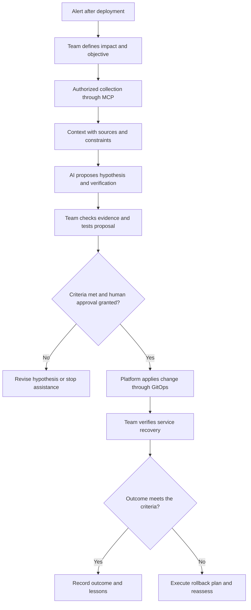

## What changes in Cloud and DevOps work

Using artificial intelligence (AI) in operations starts with knowing how to investigate a problem and assess a solution. In Cloud, or cloud computing, and DevOps, which brings development and operations together, AI can help explain errors and review configurations. You still need to understand the service and what a change would affect.

If you're studying Linux, networking, or identity and wondering where AI fits, that's a useful place to start. That knowledge helps you notice when a suggestion overlooks a dependency or gets permissions wrong. Working with AI also means taking care of the information it receives, the access it has, and how we check its results.

I use the term **new stack** to organize these skills: fundamentals, automation, agents, context, and governance. I want to show how they fit together and help you choose what to learn next, based on the problems you encounter at work.

The [2025 report from DORA, DevOps Research and Assessment](https://dora.dev/research/2025/dora-report/), a research program on software delivery, describes AI as an amplifier of organizational strengths and weaknesses. As of September 3, 2026, it remains the [latest annual edition](https://dora.dev/research/). Its [capabilities model](https://dora.dev/ai/capabilities-model/report/) details practices such as data quality, version control, and internal platforms. Applying it to incident diagnosis is my interpretation.

I wrote this for beginner to intermediate practitioners in infrastructure, systems administration, Cloud, and DevOps. Some familiarity with terminals, servers, networking, and Git is enough. I'll introduce the agent concepts as we go.

## The fundamentals behind sound decisions

Before accepting an AI suggestion, ask what it changes in the system. Restarting a process, raising a limit, and granting a permission have different effects. A good explanation needs to fit the problem you're investigating.

In operating systems such as Linux and Windows, that means understanding processes, services, files, memory, and users. A running process might be unable to handle requests. Likewise, free disk space won't fix a permission that prevents writes. We need to recognize those differences before changing production.

In networking, we need to follow the connection's path. The Domain Name System, or DNS, associates names with information such as Internet Protocol, or IP, addresses. Routes, ports, and access rules also determine how services communicate. A name resolution failure calls for a different investigation than a refused connection or an access denial.

Let's work through those differences with a fictional example. An order service starts failing when accessing objects in storage after a deployment, the release of a new application version. The team looks through the logs, the application's event records, to find what changed and which calls are failing.

The calls use HTTP, the Hypertext Transfer Protocol. In the logs, [status code 403 indicates that a request was understood and refused](https://www.rfc-editor.org/rfc/rfc9110.html#section-15.5.4). I'd investigate authorization and check which component responded, since an intermediary can also deny access. The status doesn't identify the credential used or establish which permission is missing. A DNS failure hypothesis also needs to fit that evidence.

Identity answers **who is making the call**. Authentication verifies that identity. Authorization determines which actions it may perform on each resource. If the deployment changed the application's identity, storage can be healthy while refusing a read operation that previously worked.

Storage involves persistence, latency (response time), capacity, and recovery. A volume, a storage area available to an application, can be temporary or persistent. Reversing a change, known as a rollback, does not necessarily restore the data. A rollback proposal needs to account for that difference.

Container images package applications and dependencies. Containers run those images using operating system isolation mechanisms. Understanding processes, volumes, and resource limits helps with diagnosis. Kubernetes can coordinate containers when the problem calls for it and the team can operate it. The same fundamentals apply on a single virtual machine.

Providers such as AWS (Amazon Web Services), Microsoft Azure, and Google Cloud implement these concepts differently, as does on-premises infrastructure. Understanding the concept behind a product name helps you transfer what you've learned.

One way to study with AI is to ask for a hypothesis, the evidence you'd expect to see, and a condition that would contradict it. Then check the documentation and what happens in the environment. You're practicing a useful skill: disagreeing with a polished answer and being able to explain the technical reason.

## From isolated automation to controlled delivery

Many people start with a script, a file of commands that automates a task. That's already useful. Problems emerge when it depends on your machine, a forgotten credential, or an execution order only you know. At that point, the automation still needs you to be available.

**Infrastructure as code, or IaC**, lets teams describe resources in versioned files. Terraform, OpenTofu, and Pulumi are examples of tools in this area. Ansible is used for automation and configuration management. Some capabilities overlap. When choosing, I'd look at the environment, the problem, and who will maintain the result.

With files in version control, the team can consult the history and review why changes are needed. Comparing current and planned state helps anticipate impact. A valid plan can still remove an important resource; the reviewer needs to understand its role in the service.

**Continuous integration, or CI**, brings together frequent changes and automated checks. **CD** can mean continuous delivery, which keeps changes ready for release, or continuous deployment, which automates release after the required controls. A pipeline is the execution flow connecting those steps. The team needs to make the placement of tests, approvals, and environment access explicit.

**GitOps** adds a specific approach to managing state. The [OpenGitOps principles, version 1.0.0](https://opengitops.dev/), call for declarative desired state, stored in immutable versions that preserve its history, pulled automatically by software agents, and reconciled continuously. Reconciliation means observing differences between actual and desired state and attempting to resolve them. The software agents doing this do not need to use AI.

A pipeline that runs commands after a commit, a recorded set of repository changes, can be part of CI/CD without implementing GitOps. In the order service, a reconciler might undo a manual change if the source of desired state still points to the problematic configuration.

**Platform Engineering** organizes internal capabilities as a product for teams. The [Cloud Native Computing Foundation, or CNCF, technical paper on platforms](https://tag-app-delivery.cncf.io/whitepapers/platforms/) starts with users' needs. Portals, project templates, documentation, and self-service capabilities can all contribute to that experience.

A paved road is a supported way to perform a recurring task. For the order service, it could provide deployment with identity configuration, signals to understand service behavior (observability), and a rollback procedure. The team remains responsible for the application and can reuse the delivery capabilities.

Once that process is working, it's easier to see where AI fits. It can propose a fix, and the team has a familiar way to review it, test its effect, and apply it. Checks and ownership are already part of the delivery routine.

## Where AI fits, and what the different concepts mean

Generative AI produces content using learned patterns and the context it receives. In operations, it can help explain an error message, review a script, compare configurations, or summarize an incident ticket, the record used to track an issue. Its output needs to be checked against the sources.

To understand what a solution offers, it helps to distinguish four concepts:

| Concept   | Role                                                         | Example in the incident                                               |
| --------- | ------------------------------------------------------------ | --------------------------------------------------------------------- |
| Model     | The engine that produces responses from its inputs           | Connect an access error with possible causes                          |
| Assistant | An application with an interface for human collaboration     | Discuss the records with the engineer on call                         |
| Workflow  | A flow with predefined steps and paths                       | Collect authorized data, generate a summary, and submit it for review |
| Agent     | A system that lets the model choose next steps within limits | Decide which authorized query helps distinguish two hypotheses        |

A **large language model, or LLM**, does not query your cloud on its own. The surrounding application supplies context and can execute tool calls. An assistant can incorporate workflows and agents; these terms describe different aspects of a system.

The distinction between predefined paths and dynamic decisions follows [Anthropic's discussion of workflows and agents](https://www.anthropic.com/engineering/building-effective-agents). This is a conceptual reference: the article itself notes that the tools described have evolved since December 2024. In practice, ask which decisions belong to the model, which are fixed, and which require a person.

For the order service, a workflow might always retrieve the latest deployment, select a time window of logs, and assemble a summary. The steps are predefined, but the text generated by the model can still vary. An agent might receive that summary and choose between checking the active identity and comparing storage access, depending on the evidence.

That freedom can also lead to repeated queries, unproductive paths, or different conclusions from similar inputs. That's why I prefer to start with the least autonomy that solves the task. If collection always follows the same steps, a predictable workflow is often easier to evaluate and maintain.

**AIOps**, the application of AI to information technology, or IT, operations, also includes uses such as anomaly detection and event correlation. A chat interface can present some of those results, but the field is broader. Our focus here is generative AI helping the people who operate services and make decisions about them.

## Context Engineering and connecting to the real environment

If you asked a colleague “why is the service down?”, they'd ask which service, in which environment, what failed, and what changed. They'd also need to know which data they can consult. AI needs that same information.

**Context Engineering** is the work of preparing the information available to a model at each step. [LangChain introduces the concept](https://www.langchain.com/blog/context-engineering-for-agents) in terms of selecting, organizing, and managing context. Its [documentation on agents](https://docs.langchain.com/oss/python/langchain/context-engineering) also includes tools, response formats, and execution state among the elements that need to be controlled.

To investigate the order service failure, I'd start by noting the environment, time range, deployed version, and known dependencies. I'd add the runbook, the documented operating procedure. The objective and limits would also be explicit: investigate storage access denials, consult only authorized sources, and present hypotheses with supporting evidence.

I'd also say what's missing. Missing identity provider records or delayed metrics need to be visible, so the summary doesn't sound more confident than the data supports.

Every piece of evidence should retain its origin, timestamp, and scope. A log from staging, an environment used to validate changes, does not establish production behavior. A runbook written before an authentication change can send the investigation in the wrong direction. Version awareness and provenance matter to both human readers and AI.

**Retrieval-Augmented Generation, or RAG**, combines information retrieval with response generation. An application can find relevant documentation excerpts and supply them to the model during a task. That lookup does not change the parameters learned during training. [LangChain's retrieval documentation](https://docs.langchain.com/oss/python/deepagents/retrieval) provides a useful explanation of the mechanism.

In the incident, retrieval might find a page about the previous identity. If it's out of date, the answer will draw on information that no longer applies to the service. We need to check the document, its version, and whether the requester is allowed to access it. That authorization check must happen before the content reaches the model.

The **Model Context Protocol, or MCP**, is an open standard for connecting AI applications to external tools and information sources. It was [introduced by Anthropic on November 25, 2024](https://www.anthropic.com/news/model-context-protocol). It can connect an application to repositories, metrics, or application programming interfaces, known as APIs, through which systems communicate.

In [December 2025, Anthropic announced the donation of MCP to the Agentic AI Foundation](https://www.anthropic.com/news/donating-the-model-context-protocol-and-establishing-of-the-agentic-ai-foundation), under the Linux Foundation. Products such as Visual Studio Code and Cursor already supported the protocol at that point.

In the [MCP architecture](https://modelcontextprotocol.io/docs/learn/architecture), the application uses clients to communicate with local or remote servers. They can offer executable tools, information resources, and prompts, reusable instruction templates. The model proposes a call; the application and integration handle its execution.

The [July 28, 2026 revision](https://blog.modelcontextprotocol.io/posts/2026-07-28/) removed persistent sessions from the protocol core, an approach called stateless. This makes it easier to distribute calls across HTTP servers. Network and authorization controls remain necessary, and the application can still maintain its own state.

For the order service, I'd offer specific queries: retrieve errors within a time range and compare deployed configurations. The results would return to the investigation context. With clearly defined operations, the team can check the access required and understand what each call does.

MCP [defines an authorization flow for HTTP connections](https://modelcontextprotocol.io/specification/2026-07-28/basic/authorization). The integration needs to apply the controls: check credentials, permissions, configuration, and the parameters sent to tools. Calling a tool “read-only” won't prevent a write. The restriction must apply to the identity used and be checked by the service receiving the call.

## Harness Engineering: designing the work around the model

Once we've organized the context, we still need to decide where AI can work, how far it can go, and how we'll check what it produces. I'll use **harness** for that combination: the execution environment, tools, limits, and checks around the model.

In [Harness engineering for coding agent users, published on April 2, 2026](https://martinfowler.com/articles/harness-engineering.html), **Birgitta Böckeler** explores guidance and verification mechanisms around coding agents. She distinguishes computational controls from model-based assessments, which are probabilistic. Drawing on that analysis, I propose applying the idea to our infrastructure example.

For the order service, the harness would begin with a limited objective: produce a proposal about the access failure supported by evidence. The session would receive specific query tools, its own identity, and an isolated environment for analyzing files or preparing a change. It would not inherit the administrative credentials of the engineer on call.

When assessing isolation, I'd check files, processes, networking, and credentials. A container with broad production network access or mounted secrets can still cause damage. We need to know what it can reach and where it can send data.

Another component is the operating budget. The team sets limits on time, calls, attempts, and consumption. If the log tool fails repeatedly, the system stops that path and reports the limitation. It should not expand its permissions on its own to complete the task.

Agree on acceptance criteria before requesting an answer. The proposal must identify the resource, connect the hypothesis to evidence, specify an independent check, and explain impact and rollback. If data is missing, a useful answer can point out what still needs to be obtained.

Böckeler explores this verification further in her [study of maintainability sensors](https://martinfowler.com/articles/sensors-for-coding-agents.html), mechanisms that give an agent feedback about problems in the code. In our example, checking syntax cannot confirm access to the object. A test based on a flawed hypothesis may repeat the mistake. The team should maintain known cases and verify both required access and access that must remain blocked.

Asking a second AI to review the proposal can help, but agreement between them doesn't replace testing. We also need to see when a query failed, a document was out of date, evidence conflicted, or the session stopped because it reached a limit. The harness should make those situations clear to whoever is following the work.

**A documented rule needs technical enforcement when it protects a security boundary.** Writing “do not change production” guides behavior; the service's authorization controls must deny writes to the identity actually used, without alternative paths using broader credentials. Required reviews must be enforced through the delivery process. Consumption limits need to be imposed by the system controlling the calls.

If you already prepare environments, set up access, or test recovery, some of this work will feel familiar. The new vocabulary helps us discuss how to apply those skills to systems that use AI. Knowing where a task can fail helps you decide which controls it needs.

## Observability and governance: who owns the outcome?

I'd look at both the health of the service and the work done with AI. Latency, errors, request volume, and saturation, how close resources are to their limits, help us assess impact and recovery. These are the four signals in [Google's reference on Site Reliability Engineering, or SRE](https://sre.google/sre-book/monitoring-distributed-systems/).

For AI assistance, check whether the queries helped, whether the references support the proposal, and how much rework was needed. Track hypotheses that conflict with the evidence, duration, tool failures, and token consumption. Tokens are the model's input and output units, and their consumption can affect limits and billing.

A quick answer can take work to review; an investigation with more calls might prevent an unnecessary change. DORA's [2026 guide to return on investment in AI-assisted software development](https://dora.dev/ai/roi/report/) helps structure the assessment of costs and benefits. In operations, I'd compare similar tasks with and without assistance, looking at total time, errors, and review effort.

In the incident, records should show which sources were consulted, which parameters were sent to tools, what proposal was generated, and who approved the change. Identifying model, instruction, and integration versions helps investigate worsening behavior. This does not require recording a supposed internal reasoning process from the model.

The assistance system's own records also need protection. Logs may contain personal data, customer information, or secrets. Define which data may leave the environment, who can access the history, and how long it is retained. Where possible, use only the fields and time ranges needed for the task.

**Least privilege** means granting only the access needed for authorized work. This connects to Zero Trust, an architecture that avoids implicit trust based solely on a resource's location or ownership, as described in [NIST SP 800-207](https://csrc.nist.gov/pubs/sp/800/207/final), published by the US National Institute of Standards and Technology. Being inside the corporate network is insufficient justification for broad access.

Another concern is **prompt injection**: external content attempts to make the model follow unauthorized instructions. A log field may contain text supplied by an outsider, including a fake instruction to send data elsewhere. [OWASP, the application security foundation, describes this risk](https://cheatsheetseries.owasp.org/cheatsheets/LLM_Prompt_Injection_Prevention_Cheat_Sheet.html). Retrieved content must be treated as untrusted, with access limits and validation enforced outside the model.

Even a query needs some care: excessive searches can incur costs or overload a service. When a proposal involves changing configuration, we also need to assess the effect of that write. In our example, the team requires explicit human approval of the specific change, independent checks, and a rollback path. The investigation identity stays separate from the deployment identity.

Managing these costs falls within [**FinOps**](https://www.finops.org/introduction/what-is-finops/), a practice that brings engineering, finance, and business teams together to manage technology costs and value. Extensive, repeated queries can increase spending on the model and the cloud. Limits on attempts, data scanned, and consumption help contain that spending. **[A budget alert alone doesn't stop execution](https://docs.cloud.google.com/billing/docs/how-to/budgets).**

The team also needs to be able to disable assistance and follow the manual procedure when AI or an integration is unavailable.

## Applying the skills to diagnosis and getting started

With those pieces in place, we can work through the order service diagnosis. The team confirms which operations are failing and records the deployment time. The collection workflow queries logs, configuration, and change events through authorized MCP servers. The context retains the sources, limitations, and investigation objective.

AI identifies a difference: the reference to the identity used to read storage objects changed during deployment. It presents that change as a hypothesis and points to the supporting records. It also states that the identity making the rejected calls still needs to be confirmed.

An engineer checks the active identity, authorization events, and effective permissions, considering the grants and denials that apply to the resource. In this fictional scenario, that check confirms the use of the new identity without the required read access. The conclusion rests on this verification, performed outside the model's answer.

The proposal is to restore the reference to the previous identity. Before accepting it, the team verifies that the identity remains approved, that the change was not part of a security revocation, and that rollback is compatible with the current version. Granting broad permissions to the new identity would create a different impact and require a separate assessment.

In a validation environment, the team reproduces the failure and checks the candidate fix. The change goes through a pull request, a request for repository review, with evidence, tests, and a rollback plan. Following human approval, the change is incorporated into the source of desired state. The GitOps reconciler retrieves that version and applies the configuration through the platform's capabilities.

The harness limits queries, execution, and tests throughout this flow. The team confirms recovery by observing completed orders, errors, and latency over a window defined for the service. Fewer alerts alone do not close the investigation. Afterward, the team records why delivery controls allowed the incorrect reference and what needs to improve.

To bring this into your own work, I'd start with small tasks and expand the scope as the results justify it:

1. **Assistance with nonsensitive data.** Ask for explanations of public documentation or fictional examples. Check the answer and practice identifying unsupported claims.
2. **An isolated lab.** Use known scenarios to observe queries, test limits, and check whether the system recognizes missing or contradictory information.
3. **Limited queries at work.** After organizational authorization, choose a small task with permitted sources, a read-only identity, and human review.
4. **Automation with a defined scope.** Expand only when there is evidence of usefulness, failure testing, verifiable limits, and clear maintenance ownership. Changes continue to pass through approval and recovery controls.

Record how you investigated, why you rejected a hypothesis, what you improved in the runbook, and how you justified access. That helps you explain your decisions to colleagues and in career conversations, including when you decided to stop the automation.

Start with the fundamentals you're already studying and a task you can check from beginning to end. Context, tools, and limits become part of that learning. **Investigation, judgment, and accountability for the outcome remain human responsibilities.**

## References

Content and primary sources reviewed on **September 3, 2026**. Older references remain useful when they support the concepts discussed. The incident and the application of these concepts to infrastructure are original illustrations.

- [DORA: 2025 report](https://dora.dev/research/2025/dora-report/)
- [DORA: annual research archive](https://dora.dev/research/)
- [DORA: 2025 report errata](https://dora.dev/research/2025/errata/)
- [DORA: AI Capabilities Model, 2025 guide](https://dora.dev/ai/capabilities-model/report/)
- [DORA: ROI of AI-assisted Software Development, 2026](https://dora.dev/ai/roi/report/)
- [HTTP: status code 403, RFC 9110 section 15.5.4](https://www.rfc-editor.org/rfc/rfc9110.html#section-15.5.4)
- [OpenGitOps: principles, version 1.0.0](https://opengitops.dev/)
- [CNCF: Platforms White Paper](https://tag-app-delivery.cncf.io/whitepapers/platforms/)
- [Anthropic: Building effective agents, conceptual reference from December 2024](https://www.anthropic.com/engineering/building-effective-agents)
- [LangChain: Context Engineering, July 2, 2025](https://www.langchain.com/blog/context-engineering-for-agents)
- [LangChain: context engineering in agents](https://docs.langchain.com/oss/python/langchain/context-engineering)
- [LangChain: retrieval](https://docs.langchain.com/oss/python/deepagents/retrieval)
- [Anthropic: introducing MCP, November 25, 2024](https://www.anthropic.com/news/model-context-protocol)
- [Anthropic: donating MCP to the Agentic AI Foundation, December 9, 2025](https://www.anthropic.com/news/donating-the-model-context-protocol-and-establishing-of-the-agentic-ai-foundation)
- [MCP: architecture consulted, revision 2026-07-28](https://modelcontextprotocol.io/docs/2026-07-28/learn/architecture), with [access to the current documentation](https://modelcontextprotocol.io/docs/learn/architecture)
- [MCP: authorization, revision 2026-07-28](https://modelcontextprotocol.io/specification/2026-07-28/basic/authorization)
- [MCP: release of the 2026-07-28 specification](https://blog.modelcontextprotocol.io/posts/2026-07-28/)
- [Birgitta Böckeler: Harness engineering for coding agent users, April 2, 2026](https://martinfowler.com/articles/harness-engineering.html)
- [Birgitta Böckeler: Maintainability sensors for coding agents, May 27, 2026 version](https://martinfowler.com/articles/sensors-for-coding-agents.html)
- [Google SRE: monitoring distributed systems](https://sre.google/sre-book/monitoring-distributed-systems/)
- [NIST SP 800-207: Zero Trust Architecture, final 2020 edition](https://csrc.nist.gov/pubs/sp/800/207/final)
- [OWASP: prompt injection prevention](https://cheatsheetseries.owasp.org/cheatsheets/LLM_Prompt_Injection_Prevention_Cheat_Sheet.html)
- [FinOps Foundation: FinOps definition, updated March 2026](https://www.finops.org/introduction/what-is-finops/)
- [Google Cloud: billing budgets and alerts](https://docs.cloud.google.com/billing/docs/how-to/budgets)
