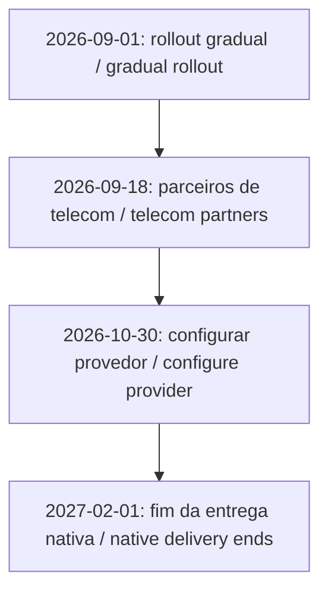
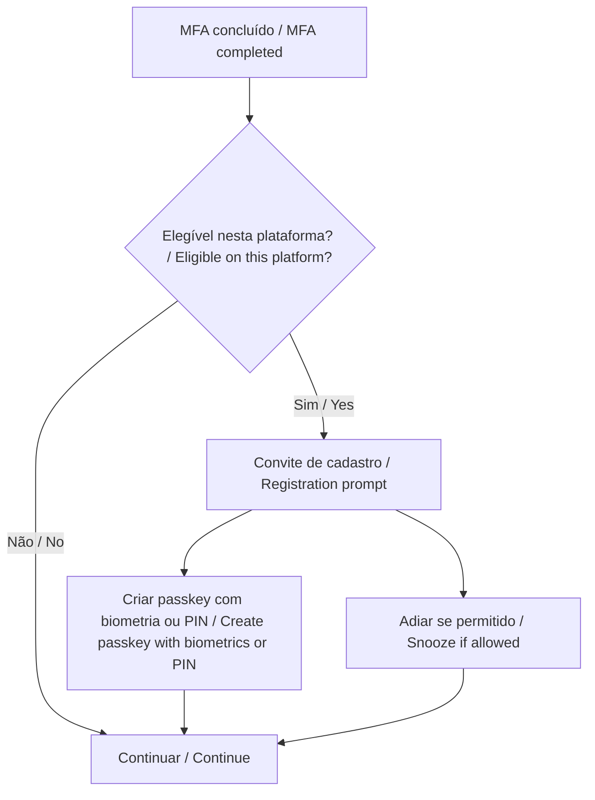

## 0. Introduction: the announcement and this week's decision

A user completes multifactor authentication and immediately sees a prompt to register a passkey. Minutes later, the help desk gets the question no one wants to answer on the fly: “Is this from our company?” That scenario alone is reason enough to prepare the communication before the prompt appears.

On [July 13, 2026, Microsoft announced the transition](https://www.microsoft.com/en-us/security/blog/2026/07/13/microsoft-entra-id-security-updates-passkeys-are-the-default-authentication-method-in-entra-id/?wt.mc_id=studentamb_365381). The gradual rollout began on September 1. As it reaches an organization, users enabled for SMS or voice enter passkey scope and may see a registration prompt after completing **multifactor authentication**, or MFA. Users still need to register their own credential.

This guide continues the work from [Identity Governance in Microsoft 365](/en/posts/identity-governance-m365-entra-id/), where I introduced Temporary Access Pass for onboarding. Here, the conversation moves to changing the authentication method: understand the situation first, then build a controlled pilot.

If you have only five minutes, start with the tenant notice. Then find out who is enabled for phone methods, who truly depends on them, which group will join the pilot, and how recovery will work. By the end, you should have a list of actions, owners, and evidence. The full checklist is in section 5.

### Prerequisites and validation environment

This article is for beginner and intermediate administrators who already know the basics of MFA and Conditional Access. To follow the lab, use PowerShell 7, the Microsoft Graph PowerShell SDK, and a test tenant. Passkey registration and reporting have different prerequisites: **Usage and insights requires Entra ID P1 or P2**. Before you begin, review the [license and role planning guidance](https://learn.microsoft.com/en-us/entra/identity/authentication/how-to-plan-prerequisites-phishing-resistant-passwordless-authentication?wt.mc_id=studentamb_365381).

I checked the scripts' syntax and ran offline tests with mocked Graph responses. They have not been run against a real tenant, so registration, platform compatibility, and recovery still need to pass through your lab.

## 1. What changes and when: the complete timeline

Sources were checked on **September 10, 2026**. September 18, October 30, and February remain future milestones. This bilingual table is shared with the Portuguese article to keep the timeline synchronized.

| Data / Date | Marco / Milestone                                                                                                                                                                                                                                                                                                   |
| ----------- | ------------------------------------------------------------------------------------------------------------------------------------------------------------------------------------------------------------------------------------------------------------------------------------------------------------------- |
| 2026-09-01  | Início gradual: usuários habilitados para SMS/voz entram em passkeys; campanha Microsoft managed, com adiamentos ilimitados por padrão. / Gradual start: SMS/voice-enabled users enter passkey scope; Microsoft-managed campaign, unlimited snoozes by default.                                                     |
| 2026-09-18  | Divulgação prevista de parceiros de telecom para SMS/voz, orientações e termos comerciais no Microsoft Security Store. / Planned publication of SMS/voice telecom partners, guidance and commercial terms in Microsoft Security Store.                                                                              |
| 2026-10-30  | Seleção e configuração previstas de provedor de telecom gerenciado pelo cliente. / Planned availability of customer-managed telecom provider selection and configuration.                                                                                                                                           |
| 2027-02-01  | Fim da entrega nativa Microsoft; sem provedor configurado, quem depende exclusivamente de SMS/voz enfrenta cadastro obrigatório de passkey para prosseguir. / Microsoft-native delivery ends; without a configured provider, users relying exclusively on SMS/voice face required passkey registration to continue. |

The [announcement](https://www.microsoft.com/en-us/security/blog/2026/07/13/microsoft-entra-id-security-updates-passkeys-are-the-default-authentication-method-in-entra-id/?wt.mc_id=studentamb_365381) introduces the change, while the [retirement documentation](https://learn.microsoft.com/en-us/entra/identity/authentication/concept-sms-voice-retirement?wt.mc_id=studentamb_365381) explains what each milestone means for operations. In February, the affected population will see a blocking prompt with no opt-out. Users who already rely on another phishing-resistant method can continue using it. The [FAQ](https://learn.microsoft.com/en-us/entra/identity/authentication/concept-sms-voice-retirement-faq?wt.mc_id=studentamb_365381) also explains how SMS and voice can continue when the organization contracts its own provider.



This timeline applies to the public cloud. Government and sovereign clouds will receive separate communication. Azure AD B2C was left out of the announcement, and Microsoft Entra External ID will have a separate one. Corporate-tenant B2B guests deserve their own review rather than an assumption that they are out of scope.

Check **Microsoft 365 admin center > Health > Message center**, alongside your Entra policy and campaign configuration. Confirm the rollout from the state observed in your tenant.

The documentation also offers a temporary opt-out from automatic enablement through `optOutSettings.passkeyDynamicMigration = true` in Graph beta. It does not change February's deadline. Use it only as part of a transition plan; the lab scripts do not configure it. With September 1 already behind us, the first step now is to check the tenant's actual state.

## 2. Passkeys for administrators who have never configured one

A passkey works with a pair of keys. The service stores the public key, while the authenticator protects the private one. At sign-in, you unlock that authenticator with biometrics or a **personal identification number**, or PIN. It signs a challenge, the service verifies the signature, and the private key stays on the authenticator.

**FIDO2**, part of the Fast Identity Online family, combines standards for this authentication. **WebAuthn**, Web Authentication, is the browser interface; **CTAP**, Client to Authenticator Protocol, handles communication with authenticators. Binding the credential to the legitimate service prevents a lookalike website from simply reusing it. See [Entra passkey fundamentals](https://learn.microsoft.com/en-us/entra/identity/authentication/concept-authentication-passkeys-fido2?wt.mc_id=studentamb_365381).

SMS, Short Message Service, and voice calls depend on channels and codes that can be intercepted or handed to an impostor. In many scenarios they are still better than a password alone, but they do not provide the phishing resistance of passkeys. In its announcement, Microsoft cites the **Digital Defense Report 2025** and reports AI-powered campaigns that reached a 54% click rate, compared with about 12% for traditional campaigns. Those numbers provide context for the announcement; they do not measure your tenant's risk or compare MFA methods in a controlled experiment.


Image: Microsoft, [provisioning documentation](https://learn.microsoft.com/en-us/entra/identity/authentication/how-to-authentication-passkeys-fido2?wt.mc_id=studentamb_365381), unmodified, [MIT license](/images/posts/passkeys-microsoft-entra-id-setembro-2026/LICENSE-Microsoft.txt).

### Choose by user population

**Synced passkeys** live in credential managers such as iCloud Keychain or Google Password Manager and follow the devices authorized by the provider. **Device-bound passkeys** stay with the chosen authenticator, such as Microsoft Authenticator, Microsoft Entra passkey on Windows, or a physical FIDO2 security key. Sync makes continuity easier; device binding gives you more control over where the credential resides.

| Population                                                        | My starting recommendation for the pilot                                                                                                                        |
| ----------------------------------------------------------------- | --------------------------------------------------------------------------------------------------------------------------------------------------------------- |
| Managed corporate device                                          | Evaluate a device-bound passkey and required controls; retain Windows Hello for Business where it already meets the scenario.                                   |
| BYOD, Bring Your Own Device                                       | Assess synchronization, ownership of the credential-manager account, recovery, and offboarding before allowing that type.                                       |
| Retail, factory, or reception staff without a personal smartphone | Test an individually assigned FIDO2 key, compatible connectors, custody, and replacement. A personal phone should not quietly become a condition of employment. |

Passkey profiles are where those choices take shape. **Attestation** verifies the authenticator's provenance during registration, but it is not available for synced passkeys. Requiring it changes which types can be used. In Authenticator, also confirm the registered credential type, because the same application provides push notifications and codes.

## 3. Preparation: finding dependence on SMS and voice

### Policies and people answer different questions

The **Authentication Methods Policy**, or AMP, shows which methods are allowed. Under **Entra ID > Authentication methods > Policies**, open SMS and Voice call and check the state, included groups, exclusions, and any individual targets. To reach the actual number of enabled users, you still need to resolve group membership and apply the exclusions.

Microsoft's [entra-sms-voice-usage-analyzer](https://github.com/microsoft/entra-sms-voice-usage-analyzer) helps with this first assessment. It documents the Global Reader, Authentication Policy Administrator, and Security Reader roles, but it does not expand groups, inventory credentials, or inspect sign-ins. The lab's original `05` script follows the same boundary: it sees policy, not actual usage.

To look at individual users, open **Authentication methods > Activity > Registration**, within Usage and insights, or query the [`userRegistrationDetails` report](https://learn.microsoft.com/en-us/graph/api/authenticationmethodsroot-list-userregistrationdetails?view=graph-rest-1.0&wt.mc_id=studentamb_365381). The lab separates people with phone only, phone plus recovery email, and phone plus other registered methods. Remember that a recovery email does not solve sign-in MFA.

<div class="overflow-x-auto" role="region" aria-label="Microsoft Graph permissions and roles" tabindex="0">

| Step                            | Delegated Graph permission              | Reference role                                       |
| ------------------------------- | --------------------------------------- | ---------------------------------------------------- |
| Read policies in these examples | `Policy.Read.AuthenticationMethod`      | Global Reader or Authentication Policy Administrator |
| Read the report                 | `AuditLog.Read.All`                     | Reports Reader, Security Reader, or Global Reader    |
| Read pilot membership           | `Group.Read.All`                        | An account authorized to read the group              |
| Change policy/campaign          | `Policy.ReadWrite.AuthenticationMethod` | Authentication Policy Administrator                  |

</div>

There is an easy distinction to miss here: Graph consent and the administrative role are separate checks. Having Authentication Policy Administrator, for example, does not grant report access by itself.

The scripts are available in [Lab-Passkeys-Entra-ID](https://github.com/tkusal/Lab-Passkeys-Entra-ID). Read the prerequisites in the README, clone the project, and enter the directory containing the numbered files:

```powershell
git clone https://github.com/tkusal/Lab-Passkeys-Entra-ID.git
Set-Location .\Lab-Passkeys-Entra-ID
.\00-connect-graph.ps1 -TenantId '<TENANT_ID>'
.\05-check-sms-voice-policy-scope.ps1 -TenantId '<TENANT_ID>'
# Reconnect with the inventory report read scope (AuditLog.Read.All).
.\00-connect-graph.ps1 -TenantId '<TENANT_ID>' -ReadProfile Inventory
$inventory = .\10-get-phone-only-users.ps1 -TenantId '<TENANT_ID>'
$inventory | Where-Object Classification -in 'PhoneOnlyInReport', 'PhoneWithRecoveryOnly'
```

The script follows every page, but the result still needs context. The [activity report](https://learn.microsoft.com/en-us/entra/identity/authentication/howto-authentication-methods-activity?wt.mc_id=studentamb_365381) usually updates within 36 hours, although some exceptions run past that window, and the API excludes disabled users. `methodsRegistered` lists what was registered; sign-in logs show what was used. `isPasswordlessCapable` can also include methods without phishing resistance. For that reason, cross-check the list against policy and devices, and investigate both empty results and missing data.

### Legacy settings and the pilot group

Per-user MFA and legacy policies can leave people eligible outside AMP. Check `policyMigrationState`: only `migrationComplete` indicates that legacy MFA/SSPR method policies have been set aside. **SSPR** means self-service password reset. Even then, this migration does not replace a review of per-user MFA enforcement status. The [migration guide](https://learn.microsoft.com/en-us/entra/identity/authentication/how-to-authentication-methods-manage?wt.mc_id=studentamb_365381) helps separate those two tasks.

Create a dedicated assigned-membership security group, `Passkeys-Pilot`, with direct user members. Bring in support staff, mix device types, and represent the three populations discussed earlier. Keep emergency accounts outside the group and review relevant exclusions. Also set an owner, a testing window, acceptance criteria, and a rollback procedure. A pilot made up only of colleagues who already use passkeys tends to look better than it really is.

## 4. Registration and recovery: running the pilot

### Enable through the portal and inspect through Graph

Under **Authentication methods > Policies > Passkey (FIDO2)**, pause to record the current state before saving. In profile configuration, select or create `Passkeys-Pilot-Profile` with the approved types. Where opting into passkey profiles is still necessary, remember that it is irreversible. Treat that step as a decision of its own and record it using the [enablement guide](https://learn.microsoft.com/en-us/entra/identity/authentication/how-to-authentication-passkeys-fido2?wt.mc_id=studentamb_365381).

Under **Configure**, allow self-service setup. Under **Enable and target**, enable the method, select the pilot group, and assign its profile. Do not replace an existing production scope with the pilot. If the organization already has profiles and enabled users, incorporate the test into that design through a reviewed change.


Image: Microsoft, the same [enablement guide](https://learn.microsoft.com/en-us/entra/identity/authentication/how-to-authentication-passkeys-fido2?wt.mc_id=studentamb_365381), unmodified, [MIT](/images/posts/passkeys-microsoft-entra-id-setembro-2026/LICENSE-Microsoft.txt). The screenshot illustrates the controls; UI labels and limits can change.

For the PowerShell alternative, create or select the profile in the portal first. Script `20` uses the [FIDO2 v1.0 API](https://learn.microsoft.com/en-us/graph/api/fido2authenticationmethodconfiguration-update?view=graph-rest-1.0&wt.mc_id=studentamb_365381), requires its identifier, and preserves the profile's settings:

```powershell
.\00-connect-graph.ps1 -TenantId '<TENANT_ID>' -WriteProfile AuthenticationPolicy
$pilot = @{
    TenantId = '<TENANT_ID>'
    PilotGroupId = '<PILOT_GROUP_ID>'
    PasskeyProfileId = '<PASSKEY_PROFILE_ID>'
}
.\20-enable-passkey-policy-pilot.ps1 @pilot
.\20-enable-passkey-policy-pilot.ps1 @pilot -Apply -WhatIf
.\20-enable-passkey-policy-pilot.ps1 @pilot -Apply
```

Without `-Apply`, the script reads the current state and displays the proposed body. `-WhatIf` keeps writes blocked. The final line requests confirmation, saves the previous state under `exports/`, and only then applies the change. If it finds scope beyond the pilot, existing exclusions, or a missing profile, the script stops for manual review. The goal is to prevent an example from quietly reshaping a real policy.

### Configure the campaign deliberately

Open **Authentication methods > Registration campaign > Edit**. Select **Enabled**, choose **Passkey**, and limit the target to the pilot. With Microsoft managed, Microsoft controls the method and snoozes. Enabled puts those choices in your hands. Snooze duration applies across the tenant.

For example, begin with three days between prompts and unlimited snoozes. Once support and recovery are validated, enable **Limited number of snoozes** if you want registration required after three snoozes. The counter persists across campaign restarts. Check the rules in the [campaign documentation](https://learn.microsoft.com/en-us/entra/identity/authentication/how-to-mfa-registration-campaign?wt.mc_id=studentamb_365381).

```powershell
$campaign = @{
    TenantId = '<TENANT_ID>'
    PilotGroupId = '<PILOT_GROUP_ID>'
    SnoozeDays = 3
}
.\30-configure-registration-campaign-pilot.ps1 @campaign
.\30-configure-registration-campaign-pilot.ps1 @campaign -Apply -WhatIf
.\30-configure-registration-campaign-pilot.ps1 @campaign -Apply
# Optional, after recovery and support validation:
.\30-configure-registration-campaign-pilot.ps1 @campaign -EnforceAfterSnoozes -Apply -WhatIf
```

Not every sign-in will show the prompt. The experience depends on the person's eligibility, profile, device, and browser. An existing **SSO**, Single Sign-On, session might continue without it, and Linux users do not receive this nudge. The conceptual flow looks like this:



### Recovery, validation, and rollback

A **Temporary Access Pass**, or TAP, helps with both the first registration and recovery after an authenticator is lost. Before issuing one, verify the person's identity, choose a short lifetime, and use a controlled channel. Authentication Administrator can issue TAPs for members; administrative accounts require Privileged Authentication Administrator. The scripts perform none of these actions. The [TAP guide](https://learn.microsoft.com/en-us/entra/identity/authentication/howto-authentication-temporary-access-pass?wt.mc_id=studentamb_365381) covers the process.

Register the replacement method, test access, and remove the lost authenticator following your incident procedure. [Account Recovery](https://learn.microsoft.com/en-us/entra/identity/authentication/concept-account-recovery-overview?wt.mc_id=studentamb_365381), which uses identity-verification providers, is a separate capability; enabling passkeys does not automatically deploy it.

```powershell
.\00-connect-graph.ps1 -TenantId '<TENANT_ID>' -ReadProfile Pilot
.\40-validate-pilot-registration.ps1 -TenantId '<TENANT_ID>' -PilotGroupId '<PILOT_GROUP_ID>'
Disconnect-MgGraph
```

Treat the pilot as accepted only after you have four pieces of evidence: completed registration, an actual sign-in on the intended device, confirmation of the method in logs, and a recovery drill. Script `40` also highlights members with no report data so support can investigate each case.

Before removing SMS, validate SSPR as well: anyone relying on it to reset their password needs to register and test allowed alternatives, with enough methods to meet the recovery policy. Check the [SSPR requirements](https://learn.microsoft.com/en-us/entra/identity/authentication/concept-sspr-howitworks?wt.mc_id=studentamb_365381). Registering a passkey alone does not satisfy that check.

If you need to go back, suspend the pilot campaign and compare the snapshots under `exports/` with the current state. Review concurrent changes and restore only the fields changed by the pilot. Disabling passkeys can lock out people who have come to depend on them, so test the rollback before deleting credentials or removing alternatives. The snapshots are comparison material, not ready-to-submit PATCH bodies. The lab's `.gitignore` excludes CSVs, snapshots, and credentials; keep local access and retention under control as well.

As of September 10, 2026, the Conditional Access Optimization Agent's **passkey adoption campaigns** are in preview and target privileged administrators. They require Entra ID P1, Security Administrator, and **SCUs**, security compute units. They offer a future path to scale, not a replacement for this pilot. Review the [prerequisites](https://learn.microsoft.com/en-us/entra/security-copilot/conditional-access-agent-optimization-passkeys?wt.mc_id=studentamb_365381) and [release status](https://learn.microsoft.com/en-us/entra/fundamentals/whats-new?wt.mc_id=studentamb_365381).

## 5. Administrator checklist: what to verify this week

- [ ] Read Message Center and record the observed rollout state.
- [ ] Review SMS/voice, inclusions, exclusions, legacy settings, and `policyMigrationState`.
- [ ] Cross-check registration against policy; investigate exclusive phone dependence.
- [ ] Separate corporate devices, BYOD, and staff without smartphones; approve devices and replacement procedures.
- [ ] Confirm the group, profile, campaign, and emergency accounts outside the pilot.
- [ ] Choose snooze behavior and any registration requirement deliberately.
- [ ] Test sign-in, device loss, TAP, SSPR alternatives, and rollback before expanding.
- [ ] Assign owners for communication, support, and the next timeline reviews.

Tell users why the change is happening, which device they need, when the prompt may appear, and where to get help. Provide the known [Security info](https://mysignins.microsoft.com/security-info?wt.mc_id=studentamb_365381) address, with instructions appropriate to each population. Adapt the [official templates](https://www.microsoft.com/en-us/download/details.aspx?id=57600&wt.mc_id=studentamb_365381) linked by the documentation; inspect their contents before sending them. Never ask for codes, PINs, or TAPs in replies to the announcement. Base reminders on outstanding registrations while accounting for report latency.

## 6. Closing, primary references, and independence

The time to expand comes when representative users can register a passkey, sign in, and recover access, and the help desk knows how to read the evidence from each step. This work connects to the lifecycle covered in the [governance article](/en/posts/identity-governance-m365-entra-id/). If you want a deeper look at enforcing authentication methods through Conditional Access, continue with [From reconnaissance to hardening in Microsoft Entra ID](/en/posts/from-reconnaissance-to-hardening-in-microsoft-entra-id/).

### Primary references

- [July 13, 2026 announcement](https://www.microsoft.com/en-us/security/blog/2026/07/13/microsoft-entra-id-security-updates-passkeys-are-the-default-authentication-method-in-entra-id/?wt.mc_id=studentamb_365381).
- [SMS/voice retirement](https://learn.microsoft.com/en-us/entra/identity/authentication/concept-sms-voice-retirement?wt.mc_id=studentamb_365381) and [FAQ](https://learn.microsoft.com/en-us/entra/identity/authentication/concept-sms-voice-retirement-faq?wt.mc_id=studentamb_365381).
- [Fundamentals](https://learn.microsoft.com/en-us/entra/identity/authentication/concept-authentication-passkeys-fido2?wt.mc_id=studentamb_365381), [planning](https://learn.microsoft.com/en-us/entra/identity/authentication/how-to-plan-prerequisites-phishing-resistant-passwordless-authentication?wt.mc_id=studentamb_365381), and [enablement](https://learn.microsoft.com/en-us/entra/identity/authentication/how-to-authentication-passkeys-fido2?wt.mc_id=studentamb_365381).
- [Registration campaign](https://learn.microsoft.com/en-us/entra/identity/authentication/how-to-mfa-registration-campaign?wt.mc_id=studentamb_365381) and [official scanner](https://github.com/microsoft/entra-sms-voice-usage-analyzer).
- [Graph registration report](https://learn.microsoft.com/en-us/graph/api/resources/userregistrationdetails?view=graph-rest-1.0&wt.mc_id=studentamb_365381), [TAP](https://learn.microsoft.com/en-us/entra/identity/authentication/howto-authentication-temporary-access-pass?wt.mc_id=studentamb_365381), and [Account Recovery](https://learn.microsoft.com/en-us/entra/identity/authentication/concept-account-recovery-overview?wt.mc_id=studentamb_365381).
- [Identity Governance in Microsoft 365](/en/posts/identity-governance-m365-entra-id/).

### Independence and trademark note

This is independent editorial content and is not affiliated with, authorized by, sponsored by, or approved by Microsoft Corporation. Microsoft, Microsoft Entra, Microsoft Entra ID, Microsoft 365, Azure, Windows, and PowerShell are trademarks of the Microsoft group of companies. FIDO and FIDO2 are trademarks of the FIDO Alliance. All other trademarks belong to their respective owners.
