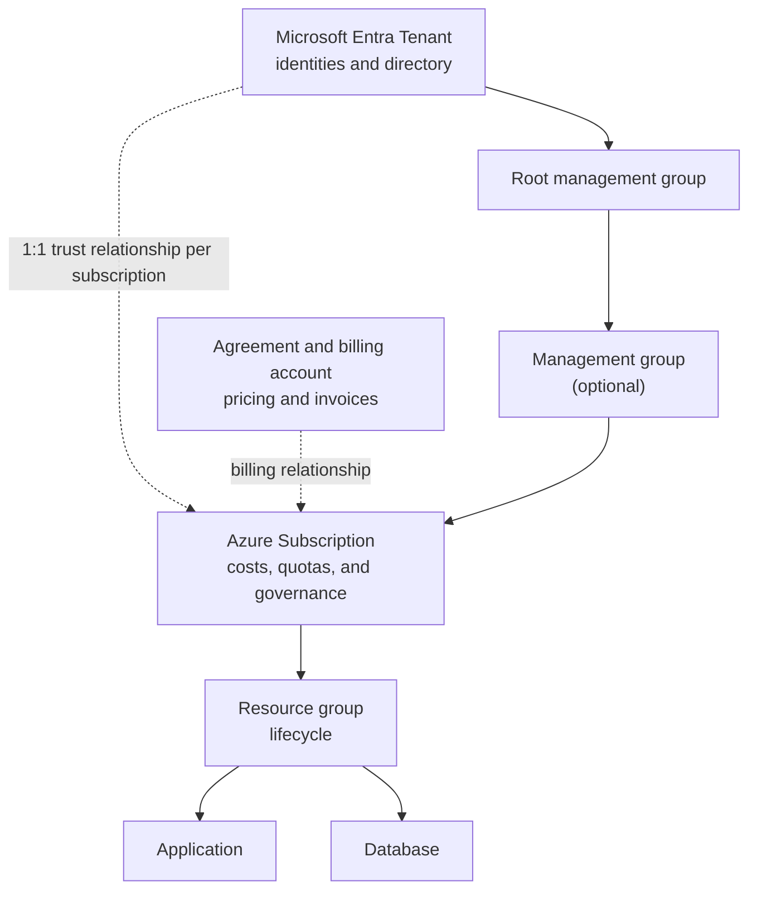

A team receives a mission to deploy a new application on Azure. The meeting starts well, until three questions pop up:

- "Which tenant are we creating this in?"
- "Do we need another subscription?"
- "Isn't it enough to just create a resource group?"

These three terms appear close to each other in the portal, but they represent different boundaries. The Microsoft Entra ID tenant is the identity directory that the Azure subscription trusts; the subscription defines boundaries for resources, governance, and consumption; and the resource group bundles components that share an operational lifecycle.

Imagine the application as a new coffee shop in a chain. The tenant gathers the identities that can be granted access to resources through Azure RBAC. The subscription establishes which cost center and under what rules the operation runs. The resource group gathers the equipment that will be managed as a single unit. The analogy helps to start, but Azure adds trust relationships, permission inheritance, and deletion effects that you need to understand without shortcuts.

By the end of this article, you will be able to locate each layer, explain what it controls, and choose where to separate environments and workloads.

## Before spinning up the first resource

This content assumes:

- an existing Microsoft Entra ID tenant;
- at least one active Azure subscription;
- access to the [Azure portal](https://portal.azure.com/) or Azure Cloud Shell;
- **Reader** role to view the environment;
- **Contributor** role, or equivalent permissions, at the subscription scope to create the optional lab resource group.

The lab uses the Azure Cloud Shell Bash mode and creates only an empty resource group. It does not provision virtual machines, databases, or other billed services. The commands were not executed against a real tenant during this editorial review; validate them in a lab subscription subject to your organization's policies.

> The portal might translate role names, while the CLI and Infrastructure as Code files frequently use English names. Always use a lab account and apply the principle of least privilege.

## The thirty-second overview

| Layer                  | Question it answers                                 | What it bounds                                           |
| ---------------------- | --------------------------------------------------- | -------------------------------------------------------- |
| Microsoft Entra tenant | Which directory provides the authorized identities? | Directory, authentication, and trust relationship        |
| Azure subscription     | Where will the resources be governed and billed?    | Resources, costs, quotas, policies, and access           |
| Resource group         | What will be managed in the same lifecycle?         | Deployment, operation, and deletion of related resources |

A subscription trusts **one Microsoft Entra tenant at a time**, while a tenant can be associated with multiple subscriptions. Within the subscription, each resource belongs to a single resource group, although it can communicate with resources from other groups.

## Tenant: the identity boundary

A tenant is a dedicated instance of [Microsoft Entra ID](/posts/identidade-na-nuvem-microsoft-entra-id-para-iniciantes/). In Azure, it provides the directory whose security principals can receive role assignments in the subscriptions that trust it. The `tenantId` value displayed by `az account show` identifies this directory.

When someone tries to manage a virtual machine via the portal or an automation, Microsoft Entra ID authenticates the identity. Azure RBAC then evaluates the role assignment, which combines a security principal, a role, and a scope.

Three built-in roles appear frequently:

- **Reader** views resources but does not make changes;
- **Contributor** manages resources but does not grant access via Azure RBAC;
- **Owner** manages resources and can also assign roles.

These are Azure RBAC roles. They should not be confused with Microsoft Entra directory roles, like Global Administrator.

This difference explains two common situations:

1. a person might exist in the tenant and have no access to any Azure subscription;
2. an external person might be invited to the tenant and receive a role in a single resource group.

If the organization uses Microsoft 365, it can use the same Microsoft Entra tenant for identities. This does not create an Azure subscription or turn Microsoft 365 licenses into credit for infrastructure resources: in Azure, the subscription is the container where resources are provisioned, governed, and accounted for based on consumption.

In cross-organization managed service scenarios, [Azure Lighthouse](https://learn.microsoft.com/azure/lighthouse/overview?wt.mc_id=studentamb_365381) allows delegating subscriptions or resource groups to identities from a management tenant. This delegation does not merge directories or change the tenant to which the customer subscription is associated.

## Azure subscription: governance, consumption, and isolation

The subscription is the boundary that gathers the resources consumed in Azure. It has its own identifier, the `subscriptionId`, and is linked to both a tenant, for identity trust, and a billing agreement. These relationships serve different functions.

In practice, the subscription is an important scope to:

- analyze costs and configure budgets and alerts with [Microsoft Cost Management](https://learn.microsoft.com/azure/cost-management-billing/?wt.mc_id=studentamb_365381);
- apply Azure Policy, with definitions such as `Allowed locations` and `Require a tag on resources`, in addition to Azure RBAC assignments;
- control quotas and service limits;
- separate environments, teams, or regulatory requirements;
- group resources under the same administrative boundary.

Creating more than one subscription does not mean creating more than one tenant. An organization can keep identities in the same directory and separate, for example:

```text title="Separation by environment"
sub-platform-prod
sub-platform-non-prod
sub-connectivity
```

This division offers stronger isolation between production and development than just creating two resource groups. A policy applied to the production subscription can restrict regions, resource types, or configurations without affecting the lab. Budgets, quotas, and delegations can also be handled separately.

However, there is no universal structure. One subscription per small application can multiply processes and permissions with no real benefit. The decision should consider criticality, operational responsibility, scale limits, compliance, and cost model.

## Resource group: a lifecycle unit

A resource group is an Azure Resource Manager container within a subscription. The most useful criteria to decide what goes into it is simple:

> Should these resources be deployed, updated, and removed together?

If the answer is yes, they probably share a resource group. Our coffee shop application could start like this:

```text title="Groups by responsibility and lifecycle"
rg-coffeeshop-prod-app
rg-coffeeshop-prod-data
rg-coffeeshop-prod-monitoring
```

Separating application, data, and monitoring might make sense when each part has different owners, permissions, or retention cycles. A database that needs to survive an application replacement shouldn't be deleted along with it for aesthetic convenience.

A few facts help avoid traps:

- each resource belongs to only one resource group;
- resources from different groups can communicate;
- a group can contain resources deployed in different regions;
- the group's region dictates where its metadata is stored, it does not force all resources to use that region;
- deleting the group initiates the deletion of the resources within it.

> [!WARNING]
> **Tag inheritance:** tags applied to the resource group are not automatically inherited by the resources it contains. Use Azure Policy to require tags or copy values to resources with the `modify` effect.

The last point turns the resource group into an excellent unit for disposable labs, and a dangerous boundary when resources with different retention requirements are mixed.

## How the layers relate

The tenant shouldn't be seen just as a folder above the subscription. It provides the identity directory that the subscription maintains a trust relationship with. Billing also relates to the subscription, but through a different path.

Although the focus is the main triad, environments with multiple subscriptions add **Management Groups**. They provide a governance scope above subscriptions: Azure Policy and Azure RBAC assignments applied to the group can be inherited by the subscriptions, resource groups, and descendant resources. This way, the organization maintains consistent controls without repeating each setting across all subscriptions.



Solid lines represent the management hierarchy. Dotted lines represent trust or billing relationships.

Every directory has a root management group. Additional groups are optional and deserve their own article when an organization needs to design governance for many subscriptions.

In Azure Resource Manager scopes, the order is:

```text title="Management scopes"
management group → subscription → resource group → resource
```

Settings applied at higher levels can reach descendants. A role assignment on the subscription, for instance, can grant access to its resource groups and resources. That's why granting **Owner** at the top "to solve it quickly" expands the risk surface far beyond the resource that prompted the ticket.

The same hierarchy guides Infrastructure as Code. Bicep files use `targetScope` to declare whether a deployment starts at the tenant, management group, subscription, or resource group. The default scope is the resource group; to create groups, policies, or assignments at the subscription level, for example:

```bicep title="Set subscription as the deployment scope"
targetScope = 'subscription'
```

The other values are `tenant`, `managementGroup`, and `resourceGroup`. ARM templates offer the same deployment levels, but not every resource type can be created at every scope, and the identity running the deployment must have the corresponding permissions.

## A scenario: from rush to architecture

The coffee shop team could put production and testing in the same subscription and the same resource group. Technically, many services would work. Operationally, the team would create four problems:

1. testing and production costs would be harder to separate;
2. temporary development permissions would reach critical resources;
3. a production-specific policy would lack a clear boundary;
4. deleting the lab might hit data that should remain.

A possible organization would be:


The tenant remains singular because the organization wants centralized identities and access policies. Subscriptions separate production from non-production. Resource groups, in turn, track different lifecycles within each environment.

This structure is not a mandatory recipe. It is a justifiable decision for the scenario: common identity, administrative isolation between environments, and data lifecycle protection.

The design also aligns with the [Cloud Adoption Framework Azure Landing Zones principles](https://learn.microsoft.com/azure/cloud-adoption-framework/ready/landing-zone/design-principles?wt.mc_id=studentamb_365381), which treat subscriptions as management units and recommend separating application environments, like development, testing, and production. This does not mean creating a subscription for each resource: an application landing zone might use one or more subscriptions depending on scale, security, and service limit requirements.

With the design set, the next step is to confirm if the CLI is pointing to the intended tenant and subscription before creating any structure.

## Check the context before running any command

IDs are safer than display names for automation. Two subscriptions might have similar names, but their identifiers are unique.

In Azure Cloud Shell, list the contexts your identity has access to:

```bash title="List available tenants and subscriptions"
az account list \
  --all \
  --query "[].{subscription:name, subscriptionId:id, tenantId:tenantId, state:state}" \
  --output table
```

Explicitly define the lab subscription. Replace the indicated value:

```bash title="Select and validate the subscription"
SUBSCRIPTION_ID="<SUBSCRIPTION_ID>"

az account set --subscription "$SUBSCRIPTION_ID"

az account show \
  --query "{subscription:name, subscriptionId:id, tenantId:tenantId}" \
  --output table
```

Stop if the returned `subscriptionId` or `tenantId` does not match the authorized environment. Switching contexts before validating is one of the easiest ways to create a resource in the wrong client, environment, or cost center.

## Create a lab resource group

Choose a name and region allowed by your organization:

```bash title="Create an empty resource group"
RESOURCE_GROUP="<RESOURCE_GROUP>"
LOCATION="<AZURE_REGION>"

az group create \
  --name "$RESOURCE_GROUP" \
  --location "$LOCATION" \
  --tags environment=lab managed-by=manual
```

The command does not create an "identity subdivision". It creates a management scope in the currently selected subscription. Identities still come from the tenant, and access will depend on RBAC assignments.

Validate the output and log the identifiers:

```bash title="Validate the created group"
az group show \
  --name "$RESOURCE_GROUP" \
  --query "{name:name, location:location, state:properties.provisioningState, id:id}" \
  --output json
```

The `id` field should follow this structure:

```text
/subscriptions/<SUBSCRIPTION_ID>/resourceGroups/<RESOURCE_GROUP>
```

This path highlights the hierarchy: the resource group is inside a specific subscription.

## Security, impact, and rollback

Before adopting the structure in production:

- assign roles at the narrowest scope that meets the need;
- avoid using Global Administrator accounts for routine Azure tasks;
- apply policies and locks only after evaluating inheritance and impact;
- separate resources with different retention cycles;
- set budgets and cost alerts in Microsoft Cost Management;
- validate if a resource type supports moving before reorganizing it;
- treat tenant and subscription IDs as operational identifiers, not secret credentials.

Moving resources between groups or subscriptions might require additional dependencies and temporarily lock the source and destination groups for changes. Plan and validate the operation instead of assuming it is like dragging a file between folders.

To remove **only the empty group created in the lab**, confirm the context and name again:

```bash title="Review the target before deletion"
az account show \
  --query "{subscription:name, subscriptionId:id, tenantId:tenantId}" \
  --output table

az resource list \
  --resource-group "$RESOURCE_GROUP" \
  --output table
```

If the list is not empty, do not proceed until you identify each resource and its retention requirement. When the target is correct:

```bash title="Delete the lab group"
az group delete \
  --name "$RESOURCE_GROUP" \
  --yes
```

Deleting a resource group is a destructive operation and tries to delete everything inside it. In production, a deletion lock can reduce accidents, but it does not replace least privilege, change review, and tested backups.

## Misinterpretations that cost dearly

### "I'll create another tenant to isolate production"

Another tenant creates a new identity boundary and increases collaboration, administration, and automation complexity. If the goal is to separate costs, quotas, policies, or operations, distinct subscriptions in the same tenant are usually the first design to evaluate.

### "Resource groups are just to organize the screen"

They are a real Azure Resource Manager scope. Permissions, policies, locks, deployments, and deletions can operate at this level.

## A checklist to decide

Before creating any layer, answer:

**Tenant**

- Do the identities belong to the same organization and trust boundary?
- Is there a real requirement for directory isolation?
- How will emergency access and guests be managed?

**Subscription**

- Does production need administrative isolation from development?
- Do costs, quotas, policies, or compliance require separation?
- Who will be responsible for consumption and permissions?

**Resource group**

- Do the resources share deployment and deletion?
- Do data and application have the same retention?
- Does the team need to delegate access only to this workload?

If the justification is just "it looks nicer in the portal", go back to the problem. A good hierarchy isn't the one with the most layers; it's the one that makes access, cost, and change predictable.

## References

**Identity and access**

- [What is Microsoft Entra?](https://learn.microsoft.com/entra/fundamentals/what-is-entra?wt.mc_id=studentamb_365381)
- [Subscriptions, licenses, accounts, and tenants for Microsoft's cloud offerings](https://learn.microsoft.com/microsoft-365/enterprise/subscriptions-licenses-accounts-and-tenants-for-microsoft-cloud-offerings?view=o365-worldwide&wt.mc_id=studentamb_365381)
- [Understand scope for Azure RBAC](https://learn.microsoft.com/azure/role-based-access-control/scope-overview?wt.mc_id=studentamb_365381)
- [Azure built-in roles](https://learn.microsoft.com/azure/role-based-access-control/built-in-roles?wt.mc_id=studentamb_365381)
- [What is Azure Lighthouse?](https://learn.microsoft.com/azure/lighthouse/overview?wt.mc_id=studentamb_365381)

**Governance and architecture**

- [Understand the billing account and tenant relationship](https://learn.microsoft.com/azure/cost-management-billing/understand/understand-billing-tenant-relationship?wt.mc_id=studentamb_365381)
- [What is Azure Resource Manager?](https://learn.microsoft.com/azure/azure-resource-manager/management/overview?wt.mc_id=studentamb_365381)
- [What are Azure management groups?](https://learn.microsoft.com/azure/governance/management-groups/overview?wt.mc_id=studentamb_365381)
- [Azure landing zone design principles](https://learn.microsoft.com/azure/cloud-adoption-framework/ready/landing-zone/design-principles?wt.mc_id=studentamb_365381)
- [Manage tag governance with Azure Policy](https://learn.microsoft.com/azure/governance/policy/tutorials/govern-tags?wt.mc_id=studentamb_365381)

**Automation and operation**

- [Resource group deployments with Bicep files](https://learn.microsoft.com/azure/azure-resource-manager/bicep/deploy-to-resource-group?wt.mc_id=studentamb_365381)
- [Move Azure resources to a new resource group or subscription](https://learn.microsoft.com/azure/azure-resource-manager/management/move-resource-group-and-subscription?wt.mc_id=studentamb_365381)
- [Get subscription and tenant IDs in the Azure portal](https://learn.microsoft.com/azure/azure-portal/get-subscription-tenant-id?wt.mc_id=studentamb_365381)

## Conclusion

Tenant, subscription, and resource group form complementary relationships:

- the Microsoft Entra tenant provides the identity directory that the subscription trusts;
- the subscription bounds resources, governance, quotas, and consumption;
- the resource group gathers components with a coherent operational lifecycle.

In the coffee shop story, the best decision wasn't to create more folders. It was to separate the questions: **who can enter, where the operation will be controlled, and what should change together**. When these answers are clear, the hierarchy stops being bureaucracy and becomes a safeguard for people, budget, and production.
