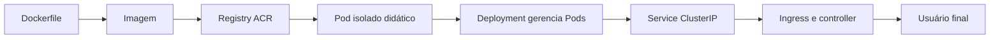

## Introdução

Sua aplicação roda bem com `docker run` no notebook. Você fecha o terminal, abre de novo e ela continua obedecendo. A próxima pergunta costuma chegar rápido: como manter mais de uma cópia em execução, substituir uma instância que falhou e oferecer um endereço confiável para quem está na internet?

Kubernetes resolve esse tipo de operação declarando o estado desejado da aplicação. Em vez de iniciar cada container manualmente, você informa quantas cópias quer, quais portas elas oferecem e como o tráfego deve chegar até elas. O Azure Kubernetes Service (AKS) cuida da parte gerenciada do cluster Kubernetes na Azure.

Neste laboratório, uma API Node.js que responde uma mensagem fixa sairá de um Dockerfile, passará pelo Azure Container Registry (ACR) e chegará a um cluster AKS. No caminho, você criará um Pod didático, trocará esse Pod por um Deployment, adicionará um Service e publicará a aplicação com Ingress.

Ao final, um `curl` para o IP público deverá retornar algo parecido com isto:

```json title="Resposta esperada"
{
  "status": "running",
  "message": "Olá do AKS! Seu container virou uma aplicação no Kubernetes."
}
```

Este é um laboratório temporário, não uma arquitetura de produção. O cluster terá um único nó para reduzir o consumo. Duas réplicas da aplicação ajudam a observar o comportamento do Deployment, mas não oferecem alta disponibilidade se esse único nó falhar.

## Conceitos fundamentais e a arquitetura da jornada

Um **cluster** é o conjunto formado pelo plano de controle do Kubernetes e pelos computadores que executam as cargas. No AKS, a Microsoft gerencia o plano de controle. Os **nodes**, ou nós, são máquinas virtuais da sua assinatura onde os containers realmente rodam.

Dentro deles, as peças que usaremos são estas:

| Recurso    | Função prática                                                                                 |
| ---------- | ---------------------------------------------------------------------------------------------- |
| Pod        | Menor unidade implantável. Agrupa um ou mais containers que compartilham rede e armazenamento. |
| Deployment | Mantém a quantidade desejada de Pods e coordena atualizações e substituições.                  |
| Service    | Oferece um endereço estável para um conjunto de Pods selecionado por labels.                   |
| Ingress    | Declara regras HTTP ou HTTPS para encaminhar tráfego externo até um Service.                   |

Se quiser uma analogia curta, o Pod é o apartamento onde o container mora. O Service é a portaria que sabe quais apartamentos estão disponíveis. O Ingress é a entrada principal que lê o endereço do pedido. O Deployment é a administração que repõe apartamentos funcionais quando algum deixa de responder. A analogia termina aqui antes que alguém cobre taxa de condomínio do YAML.

Labels e selectors formam o contrato entre essas peças. O Deployment coloca `app: rookie-api` nos Pods. O Service procura exatamente essa label. Se os textos não coincidirem, ambos podem aparecer como saudáveis isoladamente enquanto nenhum pedido encontra um backend. Kubernetes é muito disciplinado com o que você declarou, inclusive quando a declaração contém um erro de digitação.

Outro conceito importante é a reconciliação. O Deployment não executa o YAML uma única vez e vai embora. Um controller compara continuamente o estado atual com o estado desejado. Se você pediu duas réplicas e existe apenas uma, ele tenta criar a segunda. Essa diferença separa um orquestrador de uma sequência de comandos para iniciar containers.

Nossa sequência será esta:



O diagrama oficial ajuda a posicionar o laboratório dentro de um cluster completo:


_Fonte: [Kubernetes Authors](https://kubernetes.io/docs/concepts/overview/components/), distribuída sob [CC BY 4.0](https://github.com/kubernetes/website/blob/main/LICENSE)._

Você usará Azure CLI para criar recursos, Docker para construir e enviar a imagem, `kubectl` para conversar com o cluster e Helm apenas para instalar um controller de laboratório.

## Preparando o ambiente e criando o cluster AKS

O ponto de partida é uma assinatura Azure ativa, `az login` já concluído, Docker em execução, Helm instalado e `kubectl` disponível. Se faltar apenas o último, `az aks install-cli` faz a instalação. A identidade usada pela Azure CLI também precisa criar atribuições de papel no escopo do ACR para que `--attach-acr` funcione. Confirme as versões e o contexto antes de criar qualquer coisa:

```bash title="Conferir ferramentas e assinatura"
az --version
docker version
kubectl version --client
helm version
az account show \
  --query "{assinatura:name, subscriptionId:id, tenantId:tenantId}" \
  --output table
```

Os exemplos foram preparados em 26 de agosto de 2026 contra as documentações atuais do AKS e do Kubernetes. Como a elaboração não executou comandos em uma assinatura real, valide o laboratório ponta a ponta antes da publicação. APIs, SKUs e disponibilidade regional mudam.

Defina os nomes. `ACR_NAME` deve ser globalmente único e aceitar somente letras e números em minúsculas:

```bash title="Definir valores do laboratório"
RESOURCE_GROUP="rg-aks-lab-iniciantes"
LOCATION="brazilsouth"
AKS_NAME="aks-rookieops-lab"
ACR_NAME="acrrookieops<SEU_SUFIXO>"
NODE_VM_SIZE="Standard_D2as_v5"
```

O mínimo documentado para uma VM de system node pool é duas vCPUs e quatro GiB de memória. A SKU do exemplo oferece duas vCPUs e oito GiB, mantendo a quantidade mínima de vCPUs e oferecendo folga de memória para os componentes do cluster e o laboratório. A Microsoft recomenda não usar VMs da série B nesse pool. Confira a disponibilidade regional e verifique a cota da assinatura separadamente:

```bash title="Consultar a SKU do nó"
az vm list-skus \
  --location "$LOCATION" \
  --size "$NODE_VM_SIZE" \
  --output table
```

Não fixaremos `--kubernetes-version` nem o plugin de rede. O laboratório usa APIs estáveis e não depende de um modelo específico de rede. Uma versão fixada pode sair da janela de suporte do AKS e quebrar o tutorial mesmo quando os manifests continuam válidos. Em uma equipe que precisa repetir exatamente o ambiente, consulte `az aks get-versions`, registre a versão homologada e declare também as opções de rede.

Crie o grupo e o cluster:

```bash title="Criar o AKS de laboratório"
az group create \
  --name "$RESOURCE_GROUP" \
  --location "$LOCATION" \
  --tags environment=lab managed-by=azure-cli

az aks create \
  --resource-group "$RESOURCE_GROUP" \
  --name "$AKS_NAME" \
  --location "$LOCATION" \
  --tier free \
  --node-count 1 \
  --node-vm-size "$NODE_VM_SIZE" \
  --generate-ssh-keys
```

O tier Free é apropriado para aprendizado e não tem SLA financeiro. Ele remove a cobrança do gerenciamento do cluster, mas as VMs dos nós, os discos, o ACR, o IP público e o tráfego continuam sujeitos a cobrança.

Usamos o modo Standard do AKS para enxergar o node pool e controlar sua capacidade diretamente. AKS Automatic oferece uma experiência mais gerenciada e defaults voltados a produção, mas adicionaria decisões que não ajudam a entender a sequência deste laboratório. Um único node também é uma escolha consciente de custo. Em produção, a recomendação de confiabilidade começa com múltiplos nodes no system node pool, distribuição adequada e tier com SLA.

Conecte o `kubectl` e confirme que o node está `Ready`:

```bash title="Conectar e validar o cluster"
az aks get-credentials \
  --resource-group "$RESOURCE_GROUP" \
  --name "$AKS_NAME" \
  --overwrite-existing

kubectl config current-context
kubectl get nodes -o wide
```

## Da imagem ao registry

Crie uma pasta chamada `aks-lab` com esta estrutura. O artigo contém todos os arquivos necessários para executar o caminho principal, então você não depende de um repositório complementar:

```text title="Estrutura do laboratório"
aks-lab/
├── manifests/
│   ├── deployment.yaml
│   ├── ingress.yaml
│   ├── pod.yaml
│   └── service.yaml
├── app.js
├── Dockerfile
└── package.json
```

O `package.json` ativa ES modules para que o `import` de `app.js` seja interpretado corretamente:

```json title="package.json"
{
  "name": "rookie-api",
  "version": "1.0.0",
  "private": true,
  "type": "module",
  "engines": {
    "node": ">=24"
  }
}
```

A API usa apenas o módulo HTTP nativo do Node.js. Por isso, não existem dependências externas e o Dockerfile não precisa executar `npm install`. Crie `app.js`:

```javascript title="app.js"
import { createServer } from 'node:http';

const port = Number.parseInt(process.env.PORT ?? '3000', 10);

createServer((request, response) => {
  const isHealthCheck = request.url === '/health';

  response.writeHead(200, { 'Content-Type': 'application/json; charset=utf-8' });
  response.end(
    JSON.stringify({
      status: isHealthCheck ? 'ok' : 'running',
      message: isHealthCheck
        ? 'rookie-api está saudável'
        : 'Olá do AKS! Seu container virou uma aplicação no Kubernetes.'
    })
  );
}).listen(port, '0.0.0.0');
```

O Dockerfile executa o processo com um usuário sem privilégios:

```dockerfile title="Dockerfile"
FROM node:24-alpine

ENV NODE_ENV=production \
    PORT=3000
WORKDIR /app
COPY --chown=10001:10001 package.json app.js ./
USER 10001
EXPOSE 3000
CMD ["node", "app.js"]
```

Construa e teste localmente:

```bash title="Construir e testar a imagem"
cd aks-lab
docker build -t rookie-api:v1 .
docker run --rm --detach --name rookie-api-local \
  --publish 3000:3000 \
  rookie-api:v1
curl http://localhost:3000/
docker stop rookie-api-local
```

Crie o ACR Basic, recupere o endereço real do login server e envie a imagem. Buscar esse endereço é melhor do que presumir o formato, pois registries com proteção de nome DNS podem receber um hash:

```bash title="Criar o ACR e enviar a imagem"
az acr create \
  --resource-group "$RESOURCE_GROUP" \
  --name "$ACR_NAME" \
  --location "$LOCATION" \
  --sku Basic

az acr login --name "$ACR_NAME"
ACR_LOGIN_SERVER="$(az acr show \
  --name "$ACR_NAME" \
  --query loginServer \
  --output tsv)"

docker tag rookie-api:v1 "$ACR_LOGIN_SERVER/rookie-api:v1"
docker push "$ACR_LOGIN_SERVER/rookie-api:v1"
az acr repository show-tags --name "$ACR_NAME" --repository rookie-api --output table
```

Anexe o ACR ao AKS. O comando concede à identidade gerenciada do cluster permissão para puxar imagens, sem senha gravada no manifest:

```bash title="Permitir que o AKS leia o ACR"
az aks update \
  --resource-group "$RESOURCE_GROUP" \
  --name "$AKS_NAME" \
  --attach-acr "$ACR_NAME"
```

> [!IMPORTANT]
> Antes de aplicar qualquer manifest, substitua `ACR_LOGIN_SERVER` pelo valor retornado nos arquivos `manifests/pod.yaml` e `manifests/deployment.yaml`. Confirme com `grep -R "ACR_LOGIN_SERVER" manifests`. O comando não deve encontrar nenhuma ocorrência.

Em produção, prefira uma tag imutável ou o digest da imagem e faça varredura de vulnerabilidades. A tag `v1` foi mantida para deixar o laboratório legível.

## Do Pod ao Deployment

Comece com um Pod isolado para enxergar a unidade mínima:

```yaml title="manifests/pod.yaml"
apiVersion: v1
kind: Pod
metadata:
  name: rookie-api-pod
  labels:
    app: rookie-api-pod-demo
spec:
  securityContext:
    runAsNonRoot: true
    seccompProfile:
      type: RuntimeDefault
  containers:
    - name: rookie-api
      # IMPORTANTE: substitua ACR_LOGIN_SERVER antes de aplicar.
      image: ACR_LOGIN_SERVER/rookie-api:v1
      ports:
        - name: http
          containerPort: 3000
      resources:
        requests:
          cpu: 50m
          memory: 64Mi
        limits:
          cpu: 200m
          memory: 128Mi
```

```bash title="Aplicar e remover o Pod didático"
kubectl apply -f manifests/pod.yaml
kubectl get pod rookie-api-pod -o wide
kubectl logs pod/rookie-api-pod
kubectl delete -f manifests/pod.yaml
```

Um Pod sozinho não mantém sua própria substituição. Na prática, use um Deployment. O selector do Deployment deve corresponder exatamente às labels do template:

```yaml title="manifests/deployment.yaml"
apiVersion: apps/v1
kind: Deployment
metadata:
  name: rookie-api
spec:
  replicas: 2
  selector:
    matchLabels:
      app: rookie-api
  template:
    metadata:
      labels:
        app: rookie-api
    spec:
      securityContext:
        runAsNonRoot: true
        seccompProfile:
          type: RuntimeDefault
      containers:
        - name: rookie-api
          # IMPORTANTE: substitua ACR_LOGIN_SERVER antes de aplicar.
          image: ACR_LOGIN_SERVER/rookie-api:v1
          ports:
            - name: http
              containerPort: 3000
          readinessProbe:
            httpGet:
              path: /health
              port: http
            initialDelaySeconds: 3
            periodSeconds: 5
          livenessProbe:
            httpGet:
              path: /health
              port: http
            initialDelaySeconds: 10
            periodSeconds: 10
```

A readiness probe impede que o Service envie tráfego antes de o container estar pronto. A liveness probe pede a reinicialização quando o processo deixa de responder. Os atrasos iniciais dão tempo para a aplicação iniciar, e devem ser ajustados ao comportamento real de cada serviço. O arquivo completo também remove capabilities, impede elevação de privilégio, usa filesystem somente leitura e define limites. Aplique e espere o rollout:

```bash title="Aplicar o Deployment"
kubectl apply -f manifests/deployment.yaml
kubectl rollout status deployment/rookie-api
kubectl get deployments
kubectl get pods -l app=rookie-api -o wide
```

O resultado deve mostrar duas linhas com `READY` igual a `1/1` e `STATUS` igual a `Running`:

```text title="Saída esperada resumida"
NAME                          READY   STATUS    RESTARTS   AGE
rookie-api-<HASH>-<SUFIXO1>   1/1     Running   0          30s
rookie-api-<HASH>-<SUFIXO2>   1/1     Running   0          30s
```

Se você apagar um dos Pods, o Deployment criará outro para voltar a duas réplicas. Esse é o primeiro momento em que Kubernetes deixa de parecer uma coleção de YAML e começa a parecer um operador trabalhando por você.

## Expondo a aplicação com Service

Os Pods recebem endereços que podem mudar. O Service oferece um ponto estável e seleciona os backends pelas labels.

| Tipo         | Quando faz sentido                                                                |
| ------------ | --------------------------------------------------------------------------------- |
| ClusterIP    | Comunicação interna, padrão usado neste laboratório.                              |
| NodePort     | Expõe uma porta alta em cada node, comum em testes e integrações específicas.     |
| LoadBalancer | Pede ao provedor de nuvem um balanceador externo, com custo e IP próprios no AKS. |

Crie um ClusterIP que recebe na porta 80 e encaminha para a porta nomeada `http` do container:

```yaml title="manifests/service.yaml"
apiVersion: v1
kind: Service
metadata:
  name: rookie-api
spec:
  type: ClusterIP
  selector:
    app: rookie-api
  ports:
    - name: http
      port: 80
      targetPort: http
```

```bash title="Aplicar e testar o Service"
kubectl apply -f manifests/service.yaml
kubectl get service rookie-api
kubectl get endpointslice \
  -l kubernetes.io/service-name=rookie-api
kubectl port-forward service/rookie-api 8080:80
```

Em outro terminal, execute `curl http://localhost:8080/`. Se funcionar, Deployment, labels, Pods e Service estão conversando. Encerre o port-forward com `Ctrl+C`.

## Chegando na internet com Ingress

O recurso Ingress contém regras, mas não atende tráfego sozinho. Ele precisa de um Ingress controller, processo que observa essas regras e configura o componente de rede real.

Essa distinção evita uma confusão comum. `kubectl apply -f ingress.yaml` cria apenas a intenção de roteamento. Sem um controller compatível com `ingressClassName: nginx`, nada implementa essa intenção. Na direção oposta, instalar o controller sem criar um recurso Ingress deixa a porta de entrada de pé, mas sem uma regra para alcançar nossa API.

> [!CAUTION]
> O Ingress NGINX comunitário encerrou a manutenção em março de 2026. Não há novas correções de bugs ou vulnerabilidades. A instalação via Helm abaixo existe somente para mostrar, de forma portátil, a relação entre um recurso Ingress e seu controller em um cluster descartável. Não reutilize essa instalação nem adote esse controller em uma nova carga de produção.

Instale o último artefato disponível e confirme que o controller ficou pronto:

```bash title="Instalar o Ingress NGINX para o laboratório"
helm upgrade --install ingress-nginx ingress-nginx \
  --repo https://kubernetes.github.io/ingress-nginx \
  --namespace ingress-nginx \
  --create-namespace

kubectl rollout status \
  deployment/ingress-nginx-controller \
  --namespace ingress-nginx
```

O chart cria um Service `LoadBalancer`, que solicita um Azure Load Balancer e um IP público. Agora aplique a regra que envia `/` ao Service `rookie-api`:

```yaml title="manifests/ingress.yaml"
apiVersion: networking.k8s.io/v1
kind: Ingress
metadata:
  name: rookie-api
spec:
  ingressClassName: nginx
  rules:
    - http:
        paths:
          - path: /
            pathType: Prefix
            backend:
              service:
                name: rookie-api
                port:
                  number: 80
```

```bash title="Publicar e testar a API"
kubectl apply -f manifests/ingress.yaml
kubectl get ingress rookie-api

PUBLIC_IP="$(kubectl get service ingress-nginx-controller \
  --namespace ingress-nginx \
  --output jsonpath='{.status.loadBalancer.ingress[0].ip}')"

curl "http://$PUBLIC_IP/"
```

O IP pode levar alguns minutos para sair de `<pending>`. Se `PUBLIC_IP` vier vazio, espere e repita os comandos de consulta. O exemplo aceita qualquer hostname e usa HTTP aberto. Um serviço real deve configurar DNS, restringir o comportamento esperado e usar TLS. `cert-manager` é um próximo passo comum, mas não será instalado aqui.

No AKS, existe o add-on gerenciado de application routing com NGINX, habilitado por `az aks approuting enable`. Ele usa a classe `webapprouting.kubernetes.azure.com` e recebe correções críticas da Microsoft somente até novembro de 2026. Para uma nova arquitetura de produção, a direção recomendada pela Microsoft é o application routing baseado em Kubernetes Gateway API. Aqui continuamos com Ingress porque ele é o objeto que estamos aprendendo.

## Validação, troubleshooting e limpeza

Valide por camadas. Comece no Pod e avance até a entrada pública:

```bash title="Diagnóstico essencial"
kubectl get deployments,pods,services,ingress -o wide
kubectl describe deployment rookie-api
kubectl describe pod -l app=rookie-api
kubectl describe service rookie-api
kubectl describe ingress rookie-api
kubectl logs deployment/rookie-api --tail=100
kubectl exec deployment/rookie-api -- \
  node -e "fetch('http://127.0.0.1:3000/health').then(r => r.text()).then(console.log)"
kubectl get events --sort-by=.metadata.creationTimestamp
```

Os erros mais comuns deixam pistas bem específicas:

| Sintoma               | Causa provável                                 | Primeiro ajuste                                                                  |
| --------------------- | ---------------------------------------------- | -------------------------------------------------------------------------------- |
| `ImagePullBackOff`    | endereço da imagem errado ou AKS sem acesso    | confira `ACR_LOGIN_SERVER`, tag e `az aks update --attach-acr`.                  |
| `CrashLoopBackOff`    | processo encerra repetidamente                 | leia `kubectl logs` e `kubectl describe pod`; valide porta e comando da imagem.  |
| Service sem endpoints | selector não corresponde às labels dos Pods    | compare `spec.selector` do Service com `metadata.labels` do template.            |
| Ingress sem endereço  | controller ainda não está pronto ou sem IP     | confira Pods e Service no namespace `ingress-nginx` e aguarde o provisionamento. |
| HTTP 502 ou 503       | Service sem backend pronto ou porta divergente | valide EndpointSlices, readiness probe, `port` e `targetPort`.                   |

Se seu ACR foi criado no modo de permissões ABAC por repositório, `--attach-acr` não usa os papéis clássicos esperados. O laboratório cria o registry no modo RBAC padrão. Em outro ambiente, siga a documentação de integração correspondente ao modo escolhido em vez de colocar usuário e senha no YAML.

### Riscos, custos e reversão

AKS cobra os nodes como VMs. ACR, discos, IP público, Azure Load Balancer, saída de dados e logs também podem gerar custo. Application Gateway e Application Gateway for Containers, se você os adicionar em outro cenário, possuem cobranças próprias. Consulte a [página oficial de preços do AKS](https://azure.microsoft.com/pricing/details/kubernetes-service/) e a [Calculadora de Preços do Azure](https://azure.microsoft.com/pricing/calculator/) para sua região e contrato.

Antes de excluir, confirme assinatura e liste tudo no grupo:

```bash title="Revisar e excluir o laboratório"
az account show \
  --query "{assinatura:name, subscriptionId:id, tenantId:tenantId}" \
  --output table

az resource list \
  --resource-group "$RESOURCE_GROUP" \
  --query "[].{nome:name, tipo:type, localizacao:location}" \
  --output table

az group delete \
  --name "$RESOURCE_GROUP" \
  --yes
```

Excluir o grupo remove o AKS, o ACR, a infraestrutura gerenciada e tudo mais que estiver dentro dele. Não execute o último comando se a listagem mostrar algo que precisa ser preservado.

## Referências

- [Conceitos centrais do AKS](https://learn.microsoft.com/azure/aks/core-aks-concepts?wt.mc_id=studentamb_365381)
- [Quickstart do AKS com Azure CLI](https://learn.microsoft.com/azure/aks/learn/quick-kubernetes-deploy-cli?wt.mc_id=studentamb_365381)
- [Tiers Free, Standard e Premium do AKS](https://learn.microsoft.com/azure/aks/free-standard-pricing-tiers?wt.mc_id=studentamb_365381)
- [SKUs de máquinas virtuais no AKS](https://learn.microsoft.com/azure/aks/aks-virtual-machine-sizes?wt.mc_id=studentamb_365381)
- [Enviar imagens ao Azure Container Registry](https://learn.microsoft.com/azure/container-registry/container-registry-get-started-docker-cli?wt.mc_id=studentamb_365381)
- [Pods e workloads no Kubernetes](https://kubernetes.io/docs/concepts/workloads/)
- [Deployments](https://kubernetes.io/docs/concepts/workloads/controllers/deployment/)
- [Services](https://kubernetes.io/docs/concepts/services-networking/service/)
- [Ingress](https://kubernetes.io/docs/concepts/services-networking/ingress/)
- [Aposentadoria do Ingress NGINX](https://kubernetes.io/blog/2025/11/11/ingress-nginx-retirement/)
- [Application routing com NGINX no AKS](https://learn.microsoft.com/azure/aks/app-routing?wt.mc_id=studentamb_365381)
- [Application routing com Gateway API no AKS](https://learn.microsoft.com/azure/aks/app-routing-gateway-api?wt.mc_id=studentamb_365381)

## Conclusão

Você saiu de uma imagem local e chegou a uma API pública no AKS. O Pod mostrou onde o container roda, o Deployment passou a manter réplicas, o Service criou um endereço estável e o Ingress descreveu como o HTTP chega à aplicação.

O principal aprendizado não é decorar quatro arquivos YAML. É saber qual pergunta cada recurso responde. Quem mantém as cópias? Deployment. Quem encontra os Pods atuais? Service. Quem decide a rota HTTP de entrada? Ingress e seu controller.

Depois de validar a resposta pública, exclua o grupo de recursos. Para continuar estudando, os próximos passos naturais são TLS com `cert-manager`, autoscaling com HPA e a Gateway API gerenciada do AKS. Um assunto por vez. Kubernetes já tem abstrações suficientes sem convidar todas para o primeiro café.
