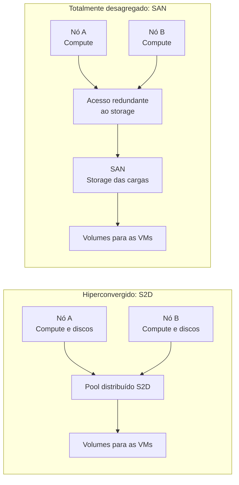
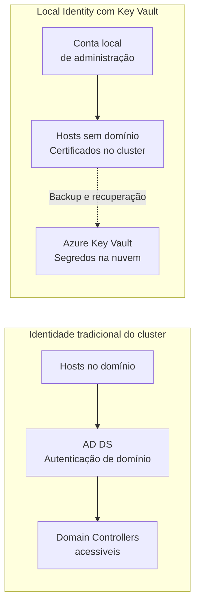

## Introdução: o híbrido que a gente já conhecia tinha um limite

Imagine uma fábrica remota com aplicações de produção que precisam continuar funcionando quando o link com a matriz cai. A empresa tem uma SAN corporativa amortizada, equipe que conhece esse storage e pouca gente disponível no local. Quer manter processamento e dados na planta, com uma experiência de gestão próxima daquela que já utiliza no Azure. A discussão começa na sala de infraestrutura, bem antes de abrir o portal.

Esse cenário é fictício e vai acompanhar o artigo. Ele reúne uma dúvida comum: como modernizar a gestão sem descartar infraestrutura útil nem acrescentar dependências difíceis de sustentar? Comprar outro cluster pode ser simples no orçamento e complicado na operação de domingo.

Para quem não acompanhou a mudança de nome, **Azure Local é a evolução do Azure Stack HCI**, renomeado em novembro de 2024. A plataforma executa aplicações na infraestrutura do cliente; o Azure Arc integra essa infraestrutura à gestão do Azure. A renomeação está no [histórico oficial de 2024](https://learn.microsoft.com/en-us/azure/azure-local/previous-releases/whats-new-24?wt.mc_id=studentamb_365381), e a [visão geral do produto](https://learn.microsoft.com/en-us/azure/azure-local/overview?wt.mc_id=studentamb_365381) situa essa proposta distribuída.

A versão 2604, de abril de 2026, ampliou as escolhas de storage e identidade. **Este texto analisa esse marco, não a versão mais recente.** Na consulta de 17/09/2026, o [histórico de releases](https://learn.microsoft.com/en-us/azure/azure-local/release-information-23h2?wt.mc_id=studentamb_365381) já listava a 2609, disponibilizada em 11/09. Há atualizações mensais nessa sequência; planejar manutenção supondo apenas uma cadência trimestral seria inadequado.

O objetivo é sair daqui com critérios para escolher S2D ou SAN, AD ou Local Identity. Pressuponho familiaridade com virtualização, storage e Active Directory. A análise é conceitual, baseada em documentação, sem validação em laboratório nem procedimento de implantação.

## O limite do modelo hiperconvergido

Na hiperconvergência, os mesmos servidores oferecem processamento, memória e armazenamento. O **Storage Spaces Direct, ou S2D**, organiza discos locais de vários nós em armazenamento distribuído para as cargas do cluster. Esse desenho concentra a expansão e a operação em um conjunto relativamente uniforme de servidores.

Quando a fábrica precisa adicionar nós, normalmente compra mais CPU, RAM e discos juntos. Se a memória acaba antes da capacidade de storage, parte dos discos novos pode ficar sem uso. Se os dados crescem muito mais rápido que as VMs, a equipe pode acabar comprando processamento de que não precisava naquele momento.

Existe uma precisão técnica aqui: **S2D não obriga toda expansão de storage a incluir servidores**. Havendo baias e uma configuração suportada, é possível adicionar discos. A [documentação de expansão do S2D](https://learn.microsoft.com/en-us/windows-server/storage/storage-spaces/add-nodes?wt.mc_id=studentamb_365381) distingue expansão por servidores e por unidades. O acoplamento pesa principalmente no crescimento por nós e nos limites físicos do desenho escolhido.

Isso é uma característica arquitetural. Para uma filial pequena, com crescimento equilibrado e sem equipe dedicada de storage, ter poucos componentes e um padrão repetível pode valer mais que escalar cada camada separadamente. Eu continuaria começando a avaliação de muitos desses ambientes pela hiperconvergência.

Na fábrica do nosso exemplo, porém, a SAN já atende outras aplicações. Há capacidade disponível, caminhos redundantes e processos de manutenção conhecidos. No modelo apoiado exclusivamente em S2D, essa capacidade externa não substituía os discos do pool. Modernizar o cluster exigia justificar outra compra enquanto um ativo útil permanecia disponível.

A SAN amortizada também merece uma pergunta incômoda: quanto tempo de suporte e desempenho útil ainda resta? Valor contábil não mede latência, risco de falha ou disponibilidade de peças. Reaproveitar equipamento é uma boa decisão quando ele sustenta o serviço durante o horizonte planejado.

## A arquitetura desagregada da versão 2604

Na 2604, o suporte a SAN passou à disponibilidade geral, ou **GA**, e a implantação desagregada permitiu usar somente storage externo. As [notas de abril](https://learn.microsoft.com/en-us/azure/azure-local/whats-new?wt.mc_id=studentamb_365381#features-and-improvements-in-2604) registram a mudança. A [documentação de integração de SAN](https://learn.microsoft.com/en-us/azure/azure-local/deploy/enable-external-storage?wt.mc_id=studentamb_365381) apresenta duas formas de aproveitar essa capacidade.

Na **combinação S2D + SAN**, o cluster mantém seu armazenamento distribuído e ganha volumes externos. A equipe escolhe onde colocar cada carga. A SAN permanece uma camada externa, separada do pool S2D, e qualquer replicação entre os dois exige uma solução própria. Na fábrica, aplicações existentes poderiam permanecer no S2D enquanto cargas selecionadas utilizariam volumes da SAN.

No **modo totalmente desagregado**, o armazenamento das cargas fica na SAN, sem S2D. Os servidores entregam compute e memória; o array fornece persistência. A expansão de uma camada deixa de exigir expansão equivalente da outra. Continuam existindo discos de sistema e requisitos de hardware nos hosts, portanto “SAN only” descreve a arquitetura de armazenamento do cluster.

O diagrama simplifica os caminhos para mostrar a separação das camadas. No modo híbrido, os nós do primeiro desenho também acessam volumes externos. Ele não representa cabeamento nem dimensionamento: esses dependem da solução validada.

Também é preciso separar os limites de escala. O [planejamento de topologia](https://learn.microsoft.com/en-us/azure/azure-local/plan/cloud-deployment-network-considerations?wt.mc_id=studentamb_365381#decision-3-determine-cluster-topology) mantém até 16 nós para HCI e para S2D com SAN adicional. O desagregado admite até 64 nós por cluster, distribuídos em um a oito racks, com até 16 nós por rack. Conectar uma SAN a um cluster hiperconvergido preserva a categoria e o limite do modelo HCI.

Essa distribuição física pertence ao modelo desagregado de até 64 nós. A oferta [Multi-rack deployments](https://learn.microsoft.com/en-us/azure/azure-local/multi-rack/multi-rack-overview?wt.mc_id=studentamb_365381) é outra categoria: utiliza racks pré-integrados de compute, SAN e rede, com uma configuração prescritiva capaz de chegar a centenas de servidores em uma instância. Em qualquer um dos modelos, crescer exige rever rede e domínios de falha. Para a fábrica, importa mais manter a produção durante uma manutenção que alcançar o máximo do catálogo.

O [anúncio oficial de 27 de abril](https://blogs.microsoft.com/blog/2026/04/27/microsoft-sovereign-private-cloud-scales-to-thousands-of-nodes-with-azure-local/?wt.mc_id=studentamb_365381) inclui **Dell Technologies, HPE, Lenovo, NetApp, Hitachi Vantara, DataON e Everpure** como parceiros de plataformas de compute e storage validadas. A participação de um fabricante não homologa todos os seus modelos. A equipe precisa confirmar array, servidores, adaptadores, firmware e configuração na documentação do parceiro e no catálogo do Azure Local.

O protocolo também tem data: o suporte inicial de abril usava Fibre Channel; iSCSI entrou em preview na 2605 e chegou à GA na 2607. Esse histórico consta nas [notas das versões 2605 e 2607](https://learn.microsoft.com/en-us/azure/azure-local/whats-new?wt.mc_id=studentamb_365381#features-and-improvements-in-2607). Uma SAN iSCSI merece uma avaliação baseada no suporte posterior, sem projetá-lo retroativamente sobre a 2604.

O ganho é poder dimensionar melhor. A responsabilidade operacional continua: controladoras, caminhos de acesso e capacidade precisam sobreviver às falhas previstas. Desagregar distribui decisões entre camadas e equipes; alguém ainda precisa responder pelo serviço completo.

## Local Identity: tirando o Active Directory do caminho crítico do cluster

A outra mudança de abril é **Local Identity com Azure Key Vault**, antes conhecida como implantação sem AD e oferecida em preview. O clustering com reconhecimento de rack já estava em GA desde a [versão 2601](https://learn.microsoft.com/en-us/azure/azure-local/whats-new?wt.mc_id=studentamb_365381#features-and-improvements-in-2601). Na [2604](https://learn.microsoft.com/en-us/azure/azure-local/whats-new?wt.mc_id=studentamb_365381#features-and-improvements-in-2604), Local Identity chegou à GA e passou a funcionar também nessa topologia.

No modelo tradicional, os hosts dependem de Active Directory Domain Services, ou AD DS. Isso não significava obrigatoriamente executar Domain Controllers dentro do próprio cluster: eles podiam estar em infraestrutura externa. Local Identity remove a dependência de domínio desse deployment específico, inclusive quando os controladores estariam em outro local.

O mecanismo combina **conta de administrador local, autenticação por certificados no cluster e backup de segredos no Azure Key Vault**. O cofre na nuvem guarda material de recuperação, como chaves BitLocker. Ele não substitui um diretório corporativo nem representa uma consulta obrigatória à nuvem em cada autenticação interna. Essa divisão está na [visão geral de Local Identity](https://learn.microsoft.com/en-us/azure/azure-local/deploy/deployment-local-identity-with-key-vault-overview?wt.mc_id=studentamb_365381).

Há trabalho administrativo concreto: a conta local usada para gestão precisa ser criada e mantida pela equipe, e não deve ser a conta Administrator interna. A documentação prevê um cofre por cluster e backup de segredos de recuperação. DNS continua necessário. Esses requisitos constam no [guia oficial de deployment](https://learn.microsoft.com/en-us/azure/azure-local/deploy/deployment-local-identity-with-key-vault?wt.mc_id=studentamb_365381); aqui interessa sua consequência operacional, sem reproduzir os passos.

O desenho compara dependências, sem descrever cada troca de protocolo. A seta para o Key Vault representa proteção e recuperação de segredos. Ela não coloca o cofre no caminho de toda operação das VMs.

Para **OT, Operational Technology**, a oportunidade é reduzir infraestrutura de identidade mantida só para viabilizar o cluster. Na planta remota, abrir comunicação com o domínio da matriz ou sustentar controladores adicionais pode exigir revisão de segmentação, manutenção e responsáveis. Remover essa necessidade pode simplificar um projeto que já tinha poucos operadores.

Minha leitura é que a economia deve ser medida em dependências operacionais, não somente em VMs removidas. Antes de escolher Local Identity, eu levaria este checklist para a revisão de arquitetura:

- Quem recupera o ambiente?
- Quem acompanha certificados e falhas de backup dos segredos?
- Quem consegue acessar o cofre durante um incidente?

A [orientação de arquitetura da Microsoft](https://learn.microsoft.com/en-us/azure/well-architected/service-guides/azure-local?wt.mc_id=studentamb_365381) recomenda restringir o acesso aos segredos e acompanhar falhas de integração. A fábrica precisa transformar essas perguntas em responsabilidades claras.

As aplicações mantêm suas próprias exigências. Uma VM que precisa de autenticação de domínio continua precisando de AD, mesmo que o host use Local Identity. Se a fábrica já tem um domínio bem operado e aplicações dependentes dele, conservar o modelo tradicional pode ser a escolha mais simples. Retirar AD do cluster não é um projeto de retirar AD da empresa.

## Onde isso realmente importa: soberania e borda

Soberania envolve decidir onde ficam dados, segredos e controle operacional, além de quem pode administrá-los. O requisito concreto precisa vir antes da arquitetura. Ter servidores dentro do prédio, por si só, não responde a essas perguntas.

Em um ambiente conectado, Azure Arc oferece gestão consistente para infraestrutura local. Parte do plano de controle continua usando o Azure para serviços de gestão, telemetria ou segredos. Para operação sem conexão com a nuvem pública, existe **disconnected operations**, com plano de controle local e requisitos próprios. A [documentação desse modelo](https://learn.microsoft.com/en-us/azure/azure-sovereign-clouds/private/azure-local/disconnected-operations-overview?wt.mc_id=studentamb_365381) explicita essa separação.

Portanto, Local Identity com **Key Vault na nuvem** continua sendo um desenho conectado. A combinação com SAN desagregada, operação desconectada e serviços Azure depende da matriz de suporte de cada modalidade. “Quero soberania” ainda precisa virar uma descrição verificável dos fluxos permitidos.

Os exemplos a seguir são possibilidades de desenho, não relatos de implantações validadas. Em governo ou defesa, eu começaria identificando se a exigência inclui apenas residência dos dados ou também controle local e ausência de conectividade externa. Essa resposta pode mudar a modalidade de implantação antes da escolha do storage.

Em manufatura, a fábrica do exemplo pode precisar apenas manter aplicações funcionando durante interrupções do link, com comunicação de gestão autorizada. Nesse caso, a conversa é sobre continuidade, segmentação de OT e recuperação. Equiparar esse requisito a isolamento permanente adicionaria restrições que talvez ninguém tenha pedido.

Em hospitais, eu avaliaria separadamente processamento de aplicações clínicas, armazenamento de imagens e dependências de autenticação. Se esses componentes têm ritmos diferentes de crescimento, uma SAN suportada merece consideração. A decisão continuaria dependente das exigências de disponibilidade de cada serviço.

Em filiais, repetibilidade e capacidade de atendimento remoto podem pesar mais que escala. Uma unidade sem SAN e sem equipe especializada pode se beneficiar de HCI compacto. Escolher a mesma topologia para todas as unidades por conveniência de compra pode transferir complexidade para quem atende os incidentes.

Nenhum desses setores precisa adotar uma arquitetura apenas porque ela ganhou GA. O avanço interessa quando permite cumprir um requisito que antes exigia duplicar infraestrutura ou aceitar uma dependência inconveniente.

## O que ainda não está pronto e por que isso é normal

O caminho híbrido S2D + SAN também tem duas restrições de desenho. A SAN é anexada como uma [operação de dia 2](https://learn.microsoft.com/en-us/azure/azure-local/plan/cloud-deployment-network-considerations?wt.mc_id=studentamb_365381#hybrid-storage-s2d-plus-external-san): primeiro se implanta o cluster HCI padrão com S2D, depois se conecta o storage externo. Essa configuração híbrida também não oferece suporte a clusters rack-aware. Para a fábrica, isso afeta a sequência da migração e impede tratar as duas capacidades como opções combináveis desde o primeiro deployment.

Há uma limitação relevante de rede: **SDN gerenciado via Azure Arc não é suportado no modo SAN totalmente desagregado da 2604**. O [planejamento atual](https://learn.microsoft.com/en-us/azure/azure-local/plan/cloud-deployment-network-considerations?wt.mc_id=studentamb_365381#decision-11-determine-software-defined-networking-sdn) continua direcionando essa arquitetura para SDN no fabric externo e reserva o Microsoft SDN para HCI. SDN nativo administrado por Windows Admin Center existe em [cenários compatíveis](https://learn.microsoft.com/en-us/azure/azure-local/concepts/software-defined-networking-23h2?wt.mc_id=studentamb_365381), mas não deve ser apresentado como alternativa universal para SAN only. Além disso, o [overview de Local Identity](https://learn.microsoft.com/en-us/azure/azure-local/deploy/deployment-local-identity-with-key-vault-overview?wt.mc_id=studentamb_365381#unsupported-or-limited-support-tools) informa que Windows Admin Center não é suportado nesse modelo de identidade. A fábrica precisa validar a combinação de storage, rede, identidade e ferramentas, em vez de somar capacidades anunciadas separadamente.

Essa diferença entre anúncio e configuração suportada é parte do trabalho. GA informa maturidade e disponibilidade de uma capacidade; não torna equivalentes todos os caminhos de administração. Eu leria a documentação específica da topologia e registraria a versão consultada antes de aprovar o desenho.

## Retomando o cenário e como decidir

A fábrica não precisa escolher storage e identidade no mesmo pacote. Eu conduziria a decisão em quatro etapas, com evidências que a equipe consiga discutir.

1. **Medir o desequilíbrio.** Reunir consumo de memória, processamento, capacidade, latência e crescimento esperado. Se o ambiente atual atende bem e cresce de forma equilibrada, manter S2D evita uma migração sem benefício demonstrado. Havendo baias livres, avaliar expansão suportada dos discos antes de trocar a arquitetura.
2. **Qualificar a SAN existente.** Confirmar suporte, vida útil, capacidade durante falhas e operação dos caminhos redundantes. S2D + SAN faz sentido quando preservar o cluster e direcionar algumas cargas ao storage externo resolve a necessidade. Isso mantém duas formas de armazenamento para operar, algo que precisa caber na equipe. Como a SAN é anexada no dia 2, o cronograma também precisa preservar a implantação HCI inicial.
3. **Justificar a desagregação completa.** Considerá-la quando compute e dados crescem em ritmos distintos, a SAN tem horizonte útil e a escala ou a operação justificam separar as camadas. Definir quem investiga cada falha, como migrar as cargas e como recuperar o serviço antes de desativar a origem.
4. **Escolher a identidade pelas dependências.** Manter AD quando ele já atende bem ao ambiente e às ferramentas necessárias. Avaliar Local Identity quando sustentar domínio para os hosts seria um custo operacional relevante, desde que conectividade, segredos, recuperação e ferramentas sejam compatíveis com o requisito do site.

O resultado dessa avaliação deveria caber em uma decisão arquitetural curta: topologia escolhida, motivo, configurações suportadas, responsáveis e condições que exigiriam rever a escolha. Para a migração, eu pediria critérios de aceitação ligados à aplicação e uma estratégia de retorno que preserve os dados. Este artigo não comprova esses resultados; eles precisam ser verificados no ambiente da empresa.

Minha conclusão para a fábrica é condicional: SAN em boas condições e crescimento desigual justificam investigar desagregação. HCI saudável, equipe pequena e expansão equilibrada justificam permanecer em S2D. Local Identity ganha força quando remove uma dependência desnecessária, respeitando o modelo de conectividade e gestão escolhido.

O renascimento do híbrido está nessa liberdade maior de desenho. A Microsoft ampliou as opções disponíveis. A competência central continua com a equipe: entender storage, rede e identidade, reconhecer seus limites e conseguir explicar por que determinada combinação mantém a produção funcionando.

## Referências

Fontes primárias consultadas em 17/09/2026. Os links no corpo associam cada afirmação à documentação correspondente; estas são as principais páginas para revisar o desenho antes de implantar:

- [Histórico de versões do Azure Local](https://learn.microsoft.com/en-us/azure/azure-local/release-information-23h2?wt.mc_id=studentamb_365381).
- [Novidades, incluindo os marcos de 2604 e 2607](https://learn.microsoft.com/en-us/azure/azure-local/whats-new?wt.mc_id=studentamb_365381).
- [Visão geral de deployments desagregados](https://learn.microsoft.com/en-us/azure/azure-local/overview/disaggregated-overview?wt.mc_id=studentamb_365381).
- [Visão geral de Multi-rack deployments](https://learn.microsoft.com/en-us/azure/azure-local/multi-rack/multi-rack-overview?wt.mc_id=studentamb_365381).
- [Integração de storage externo](https://learn.microsoft.com/en-us/azure/azure-local/deploy/enable-external-storage?wt.mc_id=studentamb_365381).
- [Planejamento de topologia e rede](https://learn.microsoft.com/en-us/azure/azure-local/plan/cloud-deployment-network-considerations?wt.mc_id=studentamb_365381).
- [Local Identity com Azure Key Vault](https://learn.microsoft.com/en-us/azure/azure-local/deploy/deployment-local-identity-with-key-vault-overview?wt.mc_id=studentamb_365381).
- [Operações desconectadas e soberania](https://learn.microsoft.com/en-us/azure/azure-sovereign-clouds/private/azure-local/disconnected-operations-overview?wt.mc_id=studentamb_365381).
