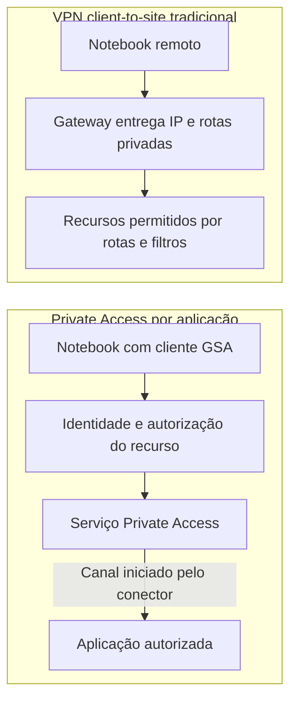
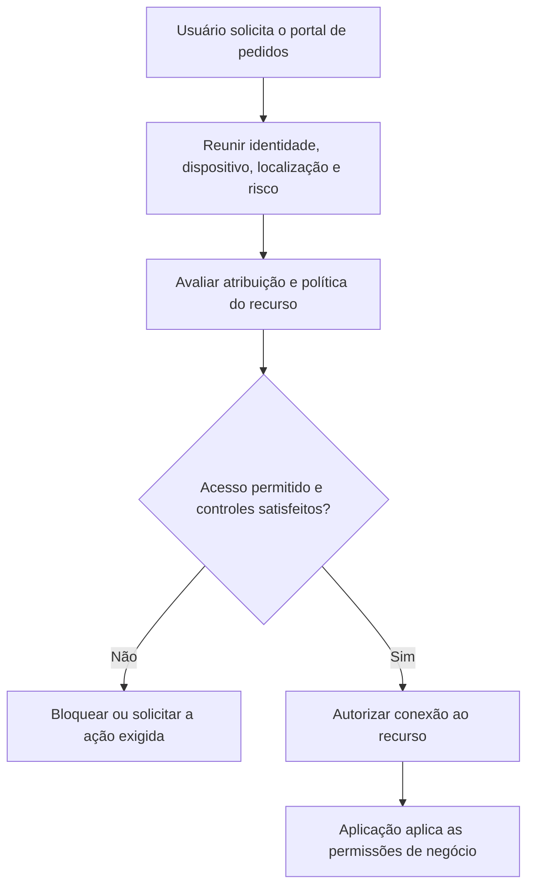

## Introdução: a decisão começa no fluxo de trabalho

Substituir a VPN pelo Microsoft Entra Private Access é, antes de tudo, uma mudança de arquitetura. A VPN tradicional entrega conectividade de rede ao dispositivo remoto. O modelo de Zero Trust Network Access, ou ZTNA, direciona conexões autorizadas para recursos específicos. Antes de encerrar os gateways, a equipe precisa saber se as aplicações e suas dependências funcionam dentro dessa granularidade.

Imagine uma distribuidora com uma aplicação interna crítica para aprovar pedidos. Funcionários trabalham entre escritório e casa; um parceiro precisa consultar entregas. O portal usa HTTPS, mas algumas tarefas dependem de arquivos compartilhados e de um componente legado. Hoje, todos começam pela mesma conexão de acesso remoto. O cenário é fictício e vai acompanhar nossa decisão.

**Microsoft Entra Private Access pode substituir a VPN no acesso a aplicações compatíveis.** Abrir o portal é apenas uma parte: anexar documentos, emitir relatórios e recuperar uma sessão também precisam funcionar. O túnel só pode desaparecer depois que essas respostas forem validadas.

Vamos comparar VPN tradicional, Zero Trust Network Access, Conditional Access e uma migração gradual. O objetivo é ajudar profissionais de infraestrutura, segurança e cloud a escolher entre acesso por aplicação, convivência ou manutenção da VPN. Parto da premissa de que você tem familiaridade com acesso remoto e políticas de identidade; não é preciso conhecer Global Secure Access a fundo.

Esta é uma análise conceitual, baseada em fontes primárias consultadas em **21/09/2026**, sem laboratório ou benchmark próprio. As propostas para a distribuidora funcionam como critérios de arquitetura. A disponibilidade dos recursos merece nova consulta antes de um projeto.

## Decisão em 30 segundos

- **Migrar:** a aplicação tem destinos e dependências conhecidos, aceita o fluxo mediado pelo cliente e pelos conectores e pode receber políticas próprias por grupo e risco.
- **Conviver:** parte do trabalho já cabe no acesso por aplicação, mas protocolos legados, fluxos iniciados pelo servidor ou dependências pouco conhecidas ainda exigem a VPN.
- **Manter a VPN:** o requisito principal é interligar redes, transportar fluxos incompatíveis ou preservar um modelo operacional que ainda não foi validado no Private Access.

> **Regra de decisão:** retire a VPN por aplicação e por grupo somente quando o fluxo de trabalho completo estiver validado, com suporte e retorno definidos.

## VPN tradicional: o que ela resolve bem e onde ela dói

Na VPN de acesso remoto, ou client-to-site, o dispositivo normalmente recebe um endereço de um pool e rotas para destinos privados. Ele passa a ter conectividade IP com aquilo que o gateway, as rotas e os controles de segurança permitem. Pode ser Always On VPN ou uma solução baseada em IPsec ou TLS, frequentemente chamada de SSL VPN.

Uma VPN site-to-site liga redes por gateways, enquanto o acesso client-to-site atende dispositivos individuais. Substituir o acesso de um funcionário ao portal deixa a conectividade entre uma filial e o datacenter como uma decisão separada. A [visão geral de Remote Access](https://learn.microsoft.com/en-us/windows-server/remote/remote-access/remote-access?wt.mc_id=studentamb_365381) situa os usos de túneis para clientes e escritórios.

A vantagem é a flexibilidade. Uma VPN de camada de rede pode transportar diversos protocolos IP e atender aplicações que esperam conectividade convencional. Isso ajuda quando o software conversa com vários servidores, usa autenticação integrada ou depende de serviços difíceis de separar. O suporte concreto continua dependendo da implementação, dos filtros e do caminho de rede; “qualquer protocolo, em qualquer situação” seria uma promessa excessiva.

**A VPN remota exige conectividade entre as pontas.** Uma solução operada pela empresa pode continuar disponível sem depender de um serviço específico de ZTNA na nuvem, desde que enlace, gateway e autenticação funcionem. A capacidade de trabalhar com arquivos em cache pertence à aplicação.

A dor de segurança aparece quando a configuração concede alcance demais. Na distribuidora, alguém que só precisa aprovar pedidos recebe rotas para servidores sem relação com sua função. Um dispositivo comprometido encontra mais destinos para tentar explorar. Isso aumenta a superfície para movimento lateral, embora ainda existam permissões e outras defesas no caminho.

VPN também pode oferecer acesso restrito. Firewalls, segmentação, filtros e autenticação forte reduzem o alcance concedido. O próprio [Always On VPN](https://learn.microsoft.com/windows-server/remote/remote-access/vpn/always-on-vpn/always-on-vpn-enhancements?wt.mc_id=studentamb_365381) documenta controles por aplicação e integração com Conditional Access. Uma comparação honesta considera a VPN bem administrada que a empresa consegue construir.

A operação também pesa: atualizar gateways, planejar capacidade, manter redundância e atender problemas de cliente. Trocas entre Wi-Fi e rede móvel podem afetar sessões, conforme produto e configuração. Private Access muda responsabilidades e caminhos. Ganhos de desempenho e suporte precisam ser medidos em cada ambiente.

## O modelo por aplicação: Zero Trust Network Access na prática

> **ZTNA é uma categoria de mercado, não outro nome para um produto Microsoft.**

Zscaler e Palo Alto Networks, entre outros fornecedores, também oferecem implementações. Zero Trust é o princípio mais amplo de avaliar o acesso ao recurso sem conceder confiança apenas pela localização na rede. O [NIST SP 800-207](https://csrc.nist.gov/pubs/sp/800/207/final) oferece uma base independente de fornecedor para essa discussão.

No acesso por aplicação, a pergunta passa a ser quais recursos uma pessoa pode alcançar e sob quais condições. A unidade de autorização se aproxima do trabalho que ela precisa executar. Isso ajuda a reduzir permissões excessivas, mas depende do inventário e das regras que a organização mantém.

O **Microsoft Entra Private Access** é a implementação de ZTNA da Microsoft. Compõe o **Global Secure Access**, que também abrange o Microsoft Entra Internet Access, e está incluído no Microsoft Entra Suite. Private Access trata recursos privados; Internet Access tem outro escopo. A [visão geral da plataforma](https://learn.microsoft.com/en-us/entra/global-secure-access/overview-what-is-global-secure-access?wt.mc_id=studentamb_365381) esclarece essa divisão. O projeto também precisa verificar os requisitos de licenciamento aplicáveis.

No fluxo considerado aqui, o dispositivo usa o cliente Global Secure Access. O serviço autoriza conexões para os destinos publicados e as encaminha por um **private network connector** que alcança a aplicação. Somente os fluxos selecionados seguem esse caminho; o notebook permanece fora do espaço de endereçamento roteável da rede corporativa.

O conector é o componente compartilhado com o Application Proxy. Ele inicia conexões de saída para o serviço, dispensando a publicação direta da aplicação por conexões de entrada no firewall. Pode rodar em Windows Server na rede local ou em uma VM com acesso aos recursos. A [documentação dos conectores](https://learn.microsoft.com/en-us/entra/global-secure-access/concept-connectors?wt.mc_id=studentamb_365381) explica esse papel.

As setas representam o caminho lógico do acesso. No segundo fluxo, o conector inicia o canal com a nuvem e transporta a sessão autorizada até o recurso. O notebook alcança a aplicação sem receber presença geral na rede privada.

| Elemento                  | Como limita o acesso                                   | Quando faz sentido                                      |
| ------------------------- | ------------------------------------------------------ | ------------------------------------------------------- |
| VPN client-to-site        | Rotas, filtros, firewalls e políticas do gateway       | Aplicações com dependências amplas ou protocolos livres |
| Quick Access              | Grupo de FQDNs, IPs, faixas e portas                   | Piloto e transição inicial                              |
| Global Secure Access Apps | Destinos, usuários e políticas por aplicação           | Segmentação e menor privilégio                          |
| Conditional Access        | Sinais de identidade, dispositivo, localização e risco | Decidir as condições para acessar cada recurso          |

### Quick Access e Global Secure Access Apps

Há dois modelos de publicação. **Quick Access** agrupa destinos definidos por nomes completos, os FQDNs, ou endereços e faixas IP. É uma forma prática de iniciar a transição. **Global Secure Access Apps** permitem separar recursos em aplicações com atribuições de usuários e políticas próprias. A [comparação dos modelos](https://learn.microsoft.com/en-us/entra/global-secure-access/concept-private-access?wt.mc_id=studentamb_365381) descreve essa diferença de granularidade.

Quick Access mantém a arquitetura do Private Access mesmo quando publica destinos amplos. Uma faixa enorme atribuída a um grupo amplo, porém, preserva uma autorização excessiva. A intenção de “deixar todo mundo alcançar tudo” continua problemática.

Para a distribuidora, eu começaria com destinos conhecidos e um grupo pequeno. Depois, separaria o portal de pedidos, a administração e os recursos necessários à consulta de entregas. Um nome de aplicação precisa representar uma fronteira útil de acesso, com responsável e usuários definidos.

A segmentação por aplicação limita destinos de rede. As permissões para aprovar um desconto ou exportar a base continuam dentro do software. O projeto reúne conectividade restrita e autorização interna, com responsabilidades explícitas para ambas.

## Conditional Access como motor de decisão

O valor aparece quando a decisão considera usuário, dispositivo e recurso. No nosso cenário, funcionários autorizados poderiam acessar o portal com MFA e dispositivo conforme. O painel administrativo exigiria condições mais restritas. Um sinal de risco elevado poderia impedir o acesso, conforme a política adotada.

Conditional Access reúne sinais e controles diferentes:

- **MFA:** reforça a autenticação e pode ser satisfeita por uma autenticação anterior válida.
- **Conformidade:** exige que o dispositivo atenda às políticas definidas pela organização, normalmente avaliadas por uma solução de gerenciamento como o Intune.
- **Localização:** acrescenta o contexto de rede usado pela política.
- **Risco de sign-in:** considera indícios associados à tentativa de autenticação e exige os recursos de Entra ID Protection aplicáveis.

A [visão geral de Conditional Access](https://learn.microsoft.com/en-us/entra/identity/conditional-access/overview?wt.mc_id=studentamb_365381) detalha esses elementos. A presença no escritório, isoladamente, oferece contexto de localização e deixa a integridade do equipamento para os sinais de dispositivo.

As políticas são direcionadas às aplicações empresariais que representam Quick Access ou os recursos publicados. É importante escolher o recurso correto, como explica a [aplicação de Conditional Access ao Private Access](https://learn.microsoft.com/en-us/entra/global-secure-access/how-to-target-resource-private-access-apps?wt.mc_id=studentamb_365381). Uma política aplicada a outro componente do Global Secure Access não protege automaticamente o portal.

O diagrama resume uma decisão de acesso, sem reproduzir a ordem interna do serviço. Uma autenticação anterior válida pode satisfazer MFA, e a avaliação ocorre para estabelecer ou manter o acesso, em vez de representar uma consulta completa ao Entra para cada pacote de rede.

Na distribuidora, o teste relevante combina casos positivos e negativos. A analista consegue concluir um pedido? Um usuário de outro setor recebe bloqueio? Um equipamento fora da política é recusado? Os registros permitem explicar qual decisão ocorreu? Essa evidência vale mais que uma tela dizendo “conectado”.

### Parceiros, BYOD e acesso dentro do escritório

O parceiro do cenário precisa somente da consulta de entregas. **External User Access e Intelligent Local Access chegaram à disponibilidade geral**, conforme o [anúncio de maio de 2026](https://techcommunity.microsoft.com/blog/microsoft-entra-blog/lock-down-ai-web-and-private-apps-what%E2%80%99s-new-in-internet-access-and-private-acce/3847825?wt.mc_id=studentamb_365381). O primeiro permite considerar identidades externas no desenho de acesso. Administradores ainda precisam atribuir explicitamente grupo, recurso e condições compatíveis com o trabalho do parceiro.

**BYOD para Windows com registro no Entra também está em GA**, anunciado em [junho de 2026](https://learn.microsoft.com/en-us/entra/fundamentals/whats-new?wt.mc_id=studentamb_365381#general-availability---byod-support-for-windows-client-using-entra-registration). A [documentação de BYOD](https://learn.microsoft.com/en-us/entra/global-secure-access/concept-bring-your-own-device?wt.mc_id=studentamb_365381) delimita o suporte a tráfego privado nessa plataforma. Registro e conformidade são estados distintos. A política deve decidir se um computador pessoal pode consultar entregas ou executar uma aprovação crítica.

Quando o notebook volta ao escritório, **Intelligent Local Access** pode reconhecer a rede por sondagens DNS e direcionar localmente o tráfego das aplicações configuradas, evitando o desvio pela nuvem. O [guia de ILA](https://learn.microsoft.com/en-us/entra/global-secure-access/tutorial-private-access-intelligent-local-access?wt.mc_id=studentamb_365381) afirma que Conditional Access continua aplicável. A capacidade otimiza o caminho das aplicações escolhidas; as atribuições continuam determinando o acesso.

## Onde a VPN tradicional ainda ganha espaço

O suporte do Private Access vai além de HTTP e inclui recursos como SSH, RDP e SMB, documentados na [configuração de acesso por aplicação](https://learn.microsoft.com/en-us/entra/global-secure-access/how-to-configure-per-app-access?wt.mc_id=studentamb_365381). Um sistema antigo pode ser candidato viável. A dificuldade está nas dependências e no comportamento completo da comunicação.

Protocolos com descoberta dinâmica, múltiplos destinos, callbacks ou fluxos iniciados do servidor para o cliente merecem investigação específica. Se a equipe só conhece a tela inicial do sistema, falta informação para concluir que ele migrou. O componente legado da distribuidora fica na VPN até que seu fluxo seja conhecido e validado.

O Entra Private Access oferece acesso por aplicação em **TCP e UDP**, conforme a [visão geral atual do produto](https://learn.microsoft.com/en-us/entra/global-secure-access/overview-what-is-global-secure-access?wt.mc_id=studentamb_365381), e o Private DNS está em disponibilidade geral desde o [anúncio de março de 2025](https://techcommunity.microsoft.com/blog/microsoft-entra-blog/replace-your-legacy-vpn-with-an-identity-centric-ztna/4395973?wt.mc_id=studentamb_365381). A documentação consultada confirma suporte atual a UDP, embora não estabeleça nesse material uma data independente para sua GA.

O [Private DNS usa os resolvedores do conector](https://learn.microsoft.com/en-us/entra/global-secure-access/concept-private-name-resolution?wt.mc_id=studentamb_365381). O cliente devolve um IP sintético à aplicação para direcionar a conexão pelo serviço, enquanto o notebook permanece fora do espaço de endereçamento corporativo.

O suporte a Private DNS precisa ser comparado ao comportamento real dos resolvedores. As [limitações atuais do cliente Windows](https://learn.microsoft.com/en-us/entra/global-secure-access/reference-current-known-limitations?wt.mc_id=studentamb_365381) incluem restrições a DNS seguro, DNS sobre TCP e interação com políticas NRPT. A validação deve cobrir todos os nomes e mecanismos usados pela aplicação.

Grandes transferências e tráfego ponto a ponto também pedem medição. Eu compararia tempo de conclusão, estabilidade e comportamento sob concorrência, usando o mesmo trabalho e condições representativas. Uma cópia isolada fora do horário de pico diz pouco sobre o fechamento mensal. O caminho atual pode continuar mais adequado; isso precisa ser demonstrado, não presumido pelo nome do produto.

Conectividade entre sites e operações sem usuário interativo são avaliações próprias. O fluxo com cliente descrito neste artigo atende acesso de usuários a aplicações. Túneis entre redes podem continuar necessários mesmo depois que a VPN dos funcionários for aposentada.

Finalmente, os conectores continuam como infraestrutura da empresa e exigem atualização, capacidade, monitoramento e recuperação. Para a aplicação crítica, eu exigiria uma operação que suporte manutenção e falha sem depender de uma única máquina. A responsabilidade operacional permanece no trecho entre o conector e o sistema de pedidos.

## Migração gradual: como isso funciona na prática

Eu trataria a mudança como uma sequência de decisões pequenas, cada uma com evidência de aceitação. O [guia de implantação do Private Access](https://learn.microsoft.com/en-us/entra/architecture/gsa-deployment-guide-private-access?wt.mc_id=studentamb_365381) organiza planejamento e evolução da segmentação. Na distribuidora, isso se traduz nas etapas abaixo.

### 1. Mapear o trabalho antes de publicar destinos

A equipe registra quem aprova pedidos, quais dispositivos usa, quais dependências aparecem e quem responde pelo serviço. Inclui tarefas menos frequentes, como anexar arquivos, consultar histórico e reprocessar uma aprovação. Se uma etapa só acontece no fechamento mensal, ela precisa entrar no teste ou ficar explicitamente pendente.

O resultado é um inventário curto, associado a responsáveis. Cada dependência sem explicação recebe uma investigação, em vez de justificar automaticamente a publicação de uma rede inteira. Segurança e operação participam junto com alguém que realmente utiliza o sistema.

### 2. Usar Quick Access como piloto controlado

O piloto reúne poucos usuários e destinos conhecidos. Sua pergunta é se o caminho de conectividade e a experiência básica atendem à aplicação. A própria [orientação de Quick Access](https://learn.microsoft.com/en-us/entra/global-secure-access/quickstart-quick-access?wt.mc_id=studentamb_365381) o apresenta como fase de transição para segmentação por aplicação.

Antes de começar, a distribuidora define o que considera aceitável: concluir as tarefas essenciais, explicar falhas nos registros e recuperar acesso dentro da janela operacional acordada. Uma tela carregada e um teste de login não bastam. O suporte precisa reconhecer a diferença entre falha do cliente, decisão de política e indisponibilidade do sistema.

### 3. Separar aplicações e políticas por risco

Com o fluxo conhecido, o portal e a administração ganham definições próprias, grupos restritos e políticas adequadas. Acesso de consulta não herda automaticamente as exigências nem as permissões de administração. A equipe começa observando o efeito das políticas e só aplica bloqueios depois de entender os resultados.

Essa separação altera quem pode acessar determinados destinos. A [orientação de segmentação](https://learn.microsoft.com/en-us/entra/global-secure-access/tutorial-private-access-app-segmentation?wt.mc_id=studentamb_365381) alerta que segmentos específicos podem assumir precedência sobre Quick Access. É preciso testar atribuições e retirar permissões amplas que perderam a justificativa. Criar um segundo objeto com nome mais bonito não comprova menor privilégio.

### 4. Conviver com a solução existente e preservar retorno

A convivência pode ocorrer por aplicações e grupos de usuários. Destinos, captura de tráfego e resolução de nomes precisam ter responsabilidade definida para evitar caminhos concorrentes. Manter VPN disponível também exige revisar se ela permite contornar a restrição recém-aplicada ao portal.

#### O caso específico do DirectAccess

A Microsoft marcou o **DirectAccess como preterido em junho de 2024** e [recomenda Always On VPN para novas implantações](https://learn.microsoft.com/en-us/windows/whats-new/deprecated-features?wt.mc_id=studentamb_365381#directaccess). Preterido indica fim do desenvolvimento ativo e possível remoção futura. O recurso ainda aparece na documentação aplicável ao Windows Server 2025, por isso descrevê-lo como removido nessa versão seria impreciso.

Private Access oferece outro caminho para modernizar o acesso, baseado em identidade e aplicação. A [migração de DirectAccess para Private Access documentada pela Microsoft](https://learn.microsoft.com/en-us/entra/global-secure-access/how-to-migrate-direct-access-to-private-access?wt.mc_id=studentamb_365381) exige remover o DirectAccess de cada dispositivo antes de ativar o novo encaminhamento. A organização pode migrar em ondas, mantendo usuários ainda não migrados no ambiente antigo, mas cada endpoint muda de um caminho para o outro.

O plano de retorno define responsáveis, condições para interromper a onda e uma forma testada de recuperar o acesso anterior. No caso de DirectAccess, o retorno respeita a incompatibilidade dos dois caminhos no mesmo dispositivo. Para o financeiro, a pergunta é simples: se a aprovação de pedidos parar, quem decide voltar e como o trabalho será retomado?

### 5. Encerrar a VPN quando as exceções estiverem resolvidas

Cada onda precisa passar pelos mesmos critérios, incluindo tarefas completas, bloqueios esperados e atendimento de falhas. Dependências remanescentes ficam registradas com dono e data de revisão. A VPN deixa de ser necessária para um grupo quando esse grupo consegue trabalhar e ser atendido pelo novo modelo.

Uma arquitetura híbrida pode ser o resultado correto. O problema é a exceção sem prazo, sem responsável e sem controles. Se o componente legado permanecer por uma razão documentada, a equipe ainda pode reduzir bastante o acesso amplo concedido ao restante da empresa.

## Conclusão: o gateway sai por último

Na distribuidora, eu migraria primeiro o portal de pedidos, com políticas distintas para administração e consulta. O componente legado permaneceria temporariamente na VPN, e o acesso do parceiro teria validação própria. O gateway só sairia quando cada onda comprovasse três resultados: o financeiro conclui os pedidos, o parceiro alcança somente a consulta e o suporte consegue diagnosticar e recuperar falhas.

Esse desfecho traduz Zero Trust em operação: menos alcance de rede, controles mais precisos e nenhuma dependência retirada antes da hora.

Qual dependência impediria hoje sua empresa de aposentar a VPN? Compartilhe nos comentários os desafios que ainda mantêm o acesso tradicional em produção.

## Referências

Fontes primárias consultadas em 21/09/2026. Os links no corpo sustentam as afirmações específicas; estas são as referências centrais para retomar a avaliação:

- [NIST SP 800-207: Zero Trust Architecture](https://csrc.nist.gov/pubs/sp/800/207/final).
- [Global Secure Access e seus componentes](https://learn.microsoft.com/en-us/entra/global-secure-access/overview-what-is-global-secure-access?wt.mc_id=studentamb_365381).
- [Modelos de publicação do Private Access](https://learn.microsoft.com/en-us/entra/global-secure-access/concept-private-access?wt.mc_id=studentamb_365381).
- [Conditional Access para aplicações privadas](https://learn.microsoft.com/en-us/entra/global-secure-access/how-to-target-resource-private-access-apps?wt.mc_id=studentamb_365381).
- [Limitações conhecidas](https://learn.microsoft.com/en-us/entra/global-secure-access/reference-current-known-limitations?wt.mc_id=studentamb_365381).
- [Migração de DirectAccess](https://learn.microsoft.com/en-us/entra/global-secure-access/how-to-migrate-direct-access-to-private-access?wt.mc_id=studentamb_365381).
- [Recursos preteridos do Windows, incluindo DirectAccess](https://learn.microsoft.com/en-us/windows/whats-new/deprecated-features?wt.mc_id=studentamb_365381#directaccess).
