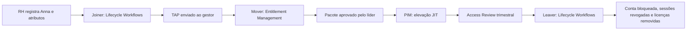

## 0. Introdução: Quando o acesso funciona, mas a operação não

O tenant já exige autenticação multifator. As políticas de Acesso Condicional estão em produção. Mesmo assim, a equipe de TI começa toda segunda-feira copiando dados de chamados, adicionando pessoas a grupos e perguntando quem aprovou determinado acesso. Na sexta-feira, alguém descobre uma conta administrativa ativa desde o projeto do ano passado. A segurança melhorou, mas a operação continua dependente de memória, planilha e sorte.

É aqui que segurança e governança se separam. Segurança decide se uma tentativa de acesso pode prosseguir. Governança responde quem deveria ter acesso, por qual motivo, durante quanto tempo e quem precisa revisar essa decisão.

Dra. Anna Bette Bírquin será nossa referência. Ela foi contratada como Pesquisadora Sênior pela empresa fictícia Umbrella do Brasil S.A. e trabalhará no departamento Laboratório NEST. Durante sua jornada, assume novas responsabilidades, precisa administrar o Exchange Online em uma manutenção e, algum tempo depois, deixa a organização. O objetivo é tornar a TI quase invisível para Anna: o acesso certo aparece no momento necessário, pede aprovação quando deve e desaparece quando perde a justificativa.

Chamaremos essa jornada de **JML**, sigla para *Joiner, Mover e Leaver*: entrada, movimentação e saída. Usaremos Lifecycle Workflows para tarefas orientadas a datas, Entitlement MAnnagement para autoatendimento governado, Access Reviews para recertificação e Privileged Identity Management, ou PIM, para privilégio temporário.

### Resultado esperado

Ao final, você terá um laboratório verificável para:

- preparar a entrada de Anna a partir de `employeeHireDate`;
- entregar um pacote de acesso aprovado pelo gestor quando ela mudar de função;
- tornar Exchange Administrator elegível, sem privilégio ativo permanente;
- revisar trimestralmente as atribuições do pacote;
- bloquear a conta, revogar sessões e remover licenças diretas na saída.

Os scripts estão no repositório [Automatizando o ciclo de vida JML e PIM com Entra ID Governance](https://github.com/tkusal/-Automatizando-o-ciclo-de-vida-JML-e-PIM-com-Entra-ID-Governance). Eles começam em modo de simulação e não incluem credenciais, segredos nem identificadores reais.

## 1. A jornada da identidade e a arquitetura JML

O Joiner começa antes do primeiro login. Dados como área, gestor e data de contratação precisam estar corretos para que uma regra encontre Anna. O Mover acontece quando cargo, projeto ou responsabilidade mudam. É a fase em que surge o *privilege creep*, o acúmulo silencioso de permissões antigas. O Leaver encerra acessos e sessões conforme a data e o risco do desligamento.

PIM e Access Reviews atravessam essas três fases. PIM reduz o tempo durante o qual um privilégio fica ativo. A revisão pergunta periodicamente se uma decisão passada ainda é válida.



| Componente | Decisão automatizada |
| --- | --- |
| Lifecycle Workflows | Quando executar tarefas de entrada ou saída e para quais pessoas |
| Entitlement Management | Quais recursos formam um pacote, quem solicita e quem aprova |
| PIM | Quando um privilégio elegível pode ficar ativo e por quanto tempo |
| Access Reviews | Quem confirma periodicamente se o acesso continua necessário |
| Microsoft Graph PowerShell | Como consultar, criar e validar configurações de forma repetível |

Esse desenho pressupõe usuários já existentes no Microsoft Entra ID e atributos padronizados. Não construiremos uma integração de RH com Workday, SAP ou API própria. A fonte autorizada preenche os atributos e a governança reage a eles.

## 2. Pré-requisitos e preparação do laboratório

Use uma identidade fictícia, um departamento piloto e recursos sem dados de produção. Mantenha duas contas de emergência fora de filtros, grupos e unidades administrativas do laboratório. As políticas de MFA e Acesso Condicional já devem existir, pois configurá-las não faz parte deste artigo.

### Licenças, funções e escopos

Para reproduzir todo o cenário, considere Microsoft Entra ID Governance ou Microsoft Entra Suite para a população abrangida. Algumas capacidades de Entitlement Management, PIM e Access Reviews também existem no Microsoft Entra ID P2, mas Lifecycle Workflows não está incluído em P2 isoladamente. Valide os direitos do contrato da organização antes do piloto.

| Etapa | Função administrativa de menor privilégio | Escopo delegado principal |
| --- | --- | --- |
| Lifecycle Workflows | Lifecycle Workflows Administrator | `LifecycleWorkflows.ReadWrite.All` |
| Catálogo e pacote | Identity Governance Administrator ou Catalog owner | `EntitlementManagement.ReadWrite.All` |
| Política do pacote | Access Package Manager ou função superior no catálogo | `EntitlementManagement.ReadWrite.All` |
| Elegibilidade e política PIM | Privileged Role Administrator | `RoleEligibilitySchedule.ReadWrite.Directory` |
| Ativação pela própria Anna | Usuária elegível | `RoleAssignmentSchedule.ReadWrite.Directory` |
| Descoberta dos recursos | Leitor adequado para cada objeto | `User.Read.All`, `Group.Read.All` e `Application.Read.All` |
| Consulta de licenças | Directory Reader ou função equivalente | `Organization.Read.All` |

Escopo OAuth não concede sozinho a função administrativa. A conta precisa das duas autorizações. Catalog owner pode adicionar recursos ao catálogo; Access Package Manager cria pacotes com recursos já disponíveis, mas não adiciona novos recursos ao catálogo.

### Estação administrativa

PowerShell 7 é o ambiente recomendado. O Microsoft Graph PowerShell SDK também funciona no Windows PowerShell 5.1, mas misturar versões e perfis durante o laboratório dificulta o diagnóstico.

```powershell
$PSVersionTable.PSVersion
Install-Module Microsoft.Graph -Scope CurrentUser
Get-InstalledModule Microsoft.Graph* |
  Sort-Object Name |
  Select-Object Name, Version

git clone https://github.com/tkusal/-Automatizando-o-ciclo-de-vida-JML-e-PIM-com-Entra-ID-Governance.git iam-governance-lab
Set-Location .\iam-governance-lab
.\scripts\00-connect-graph.ps1
```

O último comando solicita apenas escopos de leitura. Para escrita, escolha o perfil mínimo entre `Lifecycle`, `Entitlement`, `PimEligibility` e `PimActivation`. Por exemplo: `.\scripts\00-connect-graph.ps1 -WriteProfile Lifecycle`. Confirme conta, tenant e consentimentos com `Get-MgContext` antes de continuar.

### Preparar Anna e os recursos

Lifecycle Workflows não cria Ana. Um processo autorizado de RH, provisionamento ou administração deve criar a conta e preencher os dados. Para o laboratório, confirme:

| Dado | Valor de exemplo | Por que importa |
| --- | --- | --- |
| `department` | `Laboratório NEST` | Limita o escopo dos workflows |
| `employeeHireDate` | `2026-09-01T12:00:00Z` | Aciona o Joiner |
| `employeeLeaveDateTime` | `2026-12-18T22:00:00Z` | Aciona o Leaver |
| `manager` | ID do gestor de Anna | Recebe o TAP, aprova e revisa |
| `mail` do gestor | Endereço válido | Permite a entrega das notificações |
| `usageLocation` | `BR` | Evita falhas posteriores na atribuição de licenças |

Use UTC nos atributos de data e escolha um horário coerente com o expediente. Em produção, corrija o dado na fonte autoritativa em vez de criar uma segunda forma manual de manutenção. Em ambientes sincronizados com Active Directory local, valide o mapeamento e o ciclo de sincronização antes de depender desses atributos.

```powershell
$Anna = Get-MgUser -UserId '<ANA_USER_PRINCIPAL_NAME>' `
  -Property Id,DisplayName,Department,EmployeeHireDate,EmployeeLeaveDateTime,Mail,UsageLocation

$Anna | Format-List
Get-MgUserManager -UserId $ana.Id | Format-List Id,AdditionalProperties
Get-MgSubscribedSku | Select-Object SkuPartNumber, ConsumedUnits
```

Prepare também um catálogo `Laboratório NEST`, um grupo do Microsoft 365 associado ao Teams, um site do SharePoint, um aplicativo corporativo integrado ao Entra e usuários diferentes para aprovação, fallback e administração PIM. O aplicativo precisa expor uma função atribuível, como `Default Access`.

## 3. O primeiro dia: Lifecycle Workflows no Joiner

Um **Temporary Access Pass**, ou TAP, é uma credencial temporária usada no primeiro registro de métodos de autenticação. No nosso fluxo, uma tarefa nativa gera um TAP de uso único por oito horas e o envia ao gestor. A política de TAP precisa permitir 480 minutos e incluir Anna ou o grupo piloto.

### Antes de configurar

No centro de administração do Microsoft Entra, abra **Entra ID > Authentication methods > Policies > Temporary Access Pass**. Habilite o método para o grupo piloto. Em **Configure**, defina mínimo igual ou inferior a 480 minutos, máximo igual ou superior a 480, uso único compatível com o laboratório e comprimento conforme a política interna. Não inclua contas de emergência.

A tarefa `Generate TAP and Send Email` exige gestor e email válidos. Ela também foi desenhada para identidades novas sem métodos de autenticação, sessões anteriores ou funções administrativas. Se Anna já usou a conta, crie outra identidade descartável para o teste.

### Configurar pelo portal

1. Acesse **ID Governance > Lifecycle workflows > Workflows > Create workflow**.
2. Selecione o modelo de entrada que gera TAP e envia email ao gestor.
3. Nomeie como `JML | Onboarding | Laboratório NEST` e mantenha o workflow habilitado.
4. Em escopo, use uma regra limitada a `department eq 'Laboratório NEST'`.
5. Escolha o gatilho baseado em `employeeHireDate`, com deslocamento de zero dia.
6. Na tarefa de TAP, informe duração de 480 minutos e uso único.
7. Conclua com o agendamento desligado.

### Automatizar com simulação

O script consulta a definição nativa da tarefa, monta o payload e só cria o workflow com `-Apply`. O primeiro comando abaixo apenas imprime o JSON. O segundo passa pela proteção `WhatIf` e também não altera o tenant.

```powershell
.\scripts\10-new-joiner-workflow.ps1 -Department 'Laboratório NEST'

.\scripts\10-new-joiner-workflow.ps1 `
  -Department 'Laboratório NEST' `
  -Apply `
  -WhatIf
```

Depois da revisão, execute com `-Apply`, ainda sem `-EnableSchedule`. No portal, abra o workflow e escolha **Run on demand > Add users > Anna > Run workflow**. A execução sob demanda ignora o filtro e a data, portanto confira a identidade selecionada. Aguarde o histórico indicar `Completed` e confirme que o gestor recebeu o TAP. Só então habilite a agenda.

### Validar e reverter

Em **Workflow history**, confira os resumos por usuário, execução e tarefa. Um workflow criado não prova que encontrou a pessoa correta. Se houver erro, mantenha a agenda desligada, corrija atributo, gestor ou política de TAP e repita com uma identidade nova. Para reverter o piloto, desabilite o agendamento, exclua o workflow de teste e remova o TAP da usuária em **Authentication methods**. Um TAP já usado ou expirado não deve ser reutilizado.

## 4. A mudança de responsabilidade e o autoatendimento no Mover

Meses depois, Anna assume uma nova linha de pesquisa dentro do Laboratório NEST. O cargo continua Pesquisadora Sênior, mas o conjunto de recursos muda. O modelo manual adicionaria novos grupos e deixaria os antigos para uma limpeza futura. O Entitlement Management muda a unidade da decisão. Em vez de conceder recursos isolados, publicamos o pacote `Laboratório NEST | Pesquisadora Sênior` com associação ao Teams, acesso ao SharePoint e uma função no aplicativo corporativo.

O pacote não deve incluir Exchange Administrator. Acesso de negócio e privilégio administrativo têm riscos diferentes e merecem fluxos diferentes.

### Localizar os identificadores

O script precisa de IDs reais do catálogo, grupo, service principal e fallback. Consulte-os, não copie valores de outra documentação.

```powershell
Get-MgEntitlementManagementCatalog -All |
  Select-Object DisplayName, Id

Get-MgGroup -Filter "displayName eq 'Laboratório NEST | Teams'" |
  Select-Object DisplayName, Id, GroupTypes

Get-MgServicePrincipal -Filter "displayName eq 'Aplicativo NEST'" |
  Select-Object DisplayName, Id, AppId

Get-MgUser -UserId '<APPROVER_USER_PRINCIPAL_NAME>' |
  Select-Object DisplayName, Id, UserPrincipalName
```

O ID esperado para a aplicação é o `Id` do **service principal**, não o `AppId` do registro de aplicativo. Para SharePoint, use a URL completa do site, sem página ou biblioteca no final.

### Configurar pelo portal

1. Abra **ID Governance > Entitlement management > Catalogs** e crie ou selecione `Laboratório NEST`.
2. Em **Resources**, adicione o grupo ou Teams, o aplicativo corporativo e o site do SharePoint.
3. Abra **Access packages > New access package**. Informe `Laboratório NEST | Pesquisadora Sênior`, a descrição e o catálogo.
4. Em **Resource roles**, escolha `Member` para grupo e SharePoint e a função definida pelo aplicativo.
5. Em **Requests**, selecione usuários do diretório e habilite solicitação pelo próprio usuário.
6. Exija aprovação, escolha **Manager as approver**, adicione o fallback e dê cinco dias para a decisão.
7. Exija justificativa do aprovador e defina expiração da atribuição em 180 dias.
8. Crie a política e mantenha o pacote visível apenas para a população que deve solicitá-lo.

O gestor é localizado pelo atributo `manager`. Sem gestor ou fallback, o pedido fica sem o responsável esperado. Teste no portal **My Access** com Anna e confirme que o aprovador recebe a notificação.

### Automatizar com simulação

```powershell
.\scripts\20-new-access-package.ps1 `
  -CatalogId '<CATALOG_ID>' `
  -GroupId '<TEAM_GROUP_ID>' `
  -ApplicationServicePrincipalId '<SERVICE_PRINCIPAL_ID>' `
  -SharePointSiteUrl '<SHAREPOINT_SITE_URL>' `
  -FallbackApproverUserId '<APPROVER_USER_ID>' `
  -AccessPackageName 'Laboratório NEST | Pesquisadora Sênior' `
  -ApplicationRoleName '<APPLICATION_ROLE_NAME>'
```

No DryRun, recursos ausentes são mostrados como solicitações propostas. Use `-Apply -WhatIf` para conferir alvos e depois `-Apply` somente no tenant de laboratório. A saída aplicada informa `AccessPackageId` e `AssignmentPolicyId`. Guarde ambos para a revisão trimestral.

### Validar e reverter

Solicite o pacote como Ana, aprove como gestor e confirme a atribuição nos três recursos. Verifique também a data de expiração e o histórico da solicitação. Para desfazer, remova primeiro a atribuição de Ana. Depois oculte ou desabilite a política. Exclua pacote e recursos do catálogo somente após confirmar que não existem outras políticas ou atribuições dependentes. Apagar o catálogo cedo demais transforma uma correção simples em caça ao acesso órfão.

## 5. Zero Standing Privileges com PIM

**Zero Standing Privileges** significa não manter privilégios administrativos ativos sem necessidade. Um Privileged Role Administrator torna Anna elegível para Exchange Administrator por 90 dias. Anna ativa a função por até duas horas antes da manutenção. A política da função decide se a plataforma exige MFA, justificativa, chamado e aprovação.

### Configurar a política e a elegibilidade

1. Acesse **ID Governance > Privileged Identity Management > Microsoft Entra roles > Roles**.
2. Abra **Exchange Administrator > Role settings > Edit**.
3. Defina duração máxima de ativação em duas horas.
4. Exija MFA e justificativa. Se a empresa usa chamados, exija também o número do ticket, lembrando que o PIM não valida esse número no sistema de Service Desk.
5. Exija aprovação e escolha pelo menos dois aprovadores específicos.
6. Revise notificações para ativação, atribuição e renovação, depois selecione **Update**.
7. Em **Assignments > Add assignments**, selecione Anna e marque **Eligible**, com início e expiração em 90 dias. Não use `Active`.

Evite um bloqueio administrativo: mantenha contas de emergência e aprovadores ativos capazes de processar a solicitação. As configurações são específicas por função, então alterar Exchange Administrator não muda as demais funções.

### Automatizar e ativar

Faça as operações em sessões separadas. A primeira pertence ao Privileged Role Administrator. A segunda pertence à própria Ana.

```powershell
# Sessão administrativa, apenas simulação
.\scripts\30-configure-pim-exchange.ps1 `
  -UserId '<ANA_USER_ID>' `
  -RoleDisplayName 'Exchange Administrator' `
  -CreateEligibility `
  -EligibilityJustification '<JUSTIFICATIVA_APROVADA>'

# Sessão de Ana, apenas simulação
.\scripts\30-configure-pim-exchange.ps1 `
  -UserId '<ANA_USER_ID>' `
  -RoleDisplayName 'Exchange Administrator' `
  -Activate `
  -ActivationHours 2 `
  -Justification '<CHAMADO_E_MOTIVO>'
```

Acrescente `-Apply -WhatIf` antes da aplicação real. Anna também pode abrir **PIM > My roles > Microsoft Entra roles > Eligible assignments > Activate**, informar duração, justificativa e ticket, concluir MFA e aguardar aprovação.

### Validar e reverter

Confirme que a atribuição aparece como elegível antes da ativação, como ativa durante a janela e como expirada ao final. Valide os logs de auditoria e a aprovação. Anna pode desativar a função antecipadamente em **My roles**. Para revogar o desenho, remova a elegibilidade em **PIM > Microsoft Entra roles > Assignments**. Não exclua nem altere a definição interna da função.

## 6. Auditoria contínua com Access Reviews

Uma aprovação responde ao contexto de hoje. A revisão de acesso pergunta se a resposta continua válida três meses depois. Para o pacote do Laboratório NEST, o gestor será o revisor primário e um usuário específico será o fallback.

### Configurar pelo portal

1. Abra **ID Governance > Entitlement management > Access packages > Laboratório NEST | Pesquisadora Sênior > Policies**.
2. Edite a política e, em **Lifecycle**, habilite uma revisão recorrente.
3. Escolha o gestor da pessoa como revisor e configure o fallback.
4. Defina recorrência a cada três meses, duração de 14 dias, recomendações habilitadas e justificativa obrigatória.
5. No piloto, escolha **Keep access** quando ninguém responder. Depois de medir notificações e participação dos gestores, avalie **Remove access**.
6. Salve e confirme a data da primeira ocorrência.

O modo padrão do script também usa `keepAccess`. A remoção automática precisa ser solicitada explicitamente.

```powershell
.\scripts\40-enable-quarterly-access-review.ps1 `
  -AssignmentPolicyId '<ASSIGNMENT_POLICY_ID>' `
  -AccessPackageId '<ACCESS_PACKAGE_ID>' `
  -FallbackReviewerUserId '<REVIEWER_USER_ID>' `
  -ReviewStartDate '2026-09-05'
```

Depois de validar o payload, use `-Apply -WhatIf` e então `-Apply`. Para adotar remoção automática, acrescente `-ExpirationBehavior removeAccess` e trate isso como uma mudança de maior risco.

### Validar e reverter

Confirme que a ocorrência foi criada, que o gestor recebeu email e consegue registrar decisão e justificativa em My Access. Compare a decisão com a atribuição do pacote ao término. Para reverter, desabilite `reviewSettings` ou restaure a configuração anterior da política. Se uma revisão já removeu acesso, a reversão exige nova solicitação ou atribuição aprovada. Não existe um botão que desfaça todas as decisões expiradas.

## 7. O desligamento e a limpeza com Lifecycle Workflows

Na saída de Ana, a ordem importa. Primeiro bloqueamos a conta. Depois invalidamos tokens de atualização e sessões de navegador. Por fim, removemos licenças atribuídas diretamente. O gatilho usa `employeeLeaveDateTime`, preenchido pela fonte autorizada antes da saída.

Antes de automatizar, inventarie propriedade de grupos, Teams, sites, caixas compartilhadas, aplicativos e recursos do Azure. Transfira responsabilidades e aplique retenção antes de remover licenças. Licenças herdadas por grupo permanecem enquanto Anna continuar no grupo. Acesso local de uma identidade sincronizada também depende do processo no Active Directory e do ciclo de sincronização.

### Configurar pelo portal

1. Abra **ID Governance > Lifecycle workflows > Create workflow** e escolha um modelo Leaver.
2. Nomeie como `JML | Offboarding | Laboratório NEST`.
3. Use `department eq 'Laboratório NEST'` apenas no piloto.
4. Configure `employeeLeaveDateTime` com deslocamento de zero dia.
5. Ordene as tarefas: **Disable user account**, **Revoke all refresh tokens for user** e **Remove all licenses for user**.
6. Mantenha `continueOnError` desabilitado no bloqueio e avalie-o nas tarefas seguintes.
7. Crie com a agenda desligada.

```powershell
.\scripts\50-new-leaver-workflow.ps1 -Department 'Laboratório NEST'

.\scripts\50-new-leaver-workflow.ps1 `
  -Department 'Laboratório NEST' `
  -Apply `
  -WhatIf
```

Para um desligamento emergencial, execute sob demanda após conferir a identidade. Lembre que essa execução ignora data e filtro. Para saída planejada, teste com uma conta descartável, revise o histórico e só depois habilite a agenda com `-Apply -EnableSchedule` ou pelo portal.

### Validar e reverter

Confirme `accountEnabled = false`, falha de novo login, revogação registrada, remoção das licenças diretas e encerramento das atribuições do pacote e PIM. Revogar sessões reduz a janela de uso de tokens, mas alguns aplicativos podem não reagir imediatamente. O bloqueio da conta continua sendo o controle principal.

Se o workflow atingir a pessoa errada, desligue a agenda antes de qualquer correção. Reative a conta, restaure licenças e associações a partir do inventário e refaça as aprovações necessárias. A revogação de sessões não pode ser desfeita; a pessoa terá de autenticar novamente. Em usuários sincronizados, corrija também a fonte autoritativa para evitar que a próxima sincronização reverta sua recuperação.

## 8. Validação integrada, riscos e licenciamento

Ao fim do piloto, reúna evidências de cada controle, não apenas prints da tela de criação.

```powershell
Get-MgContext | Select-Object Account, TenantId, Scopes

Get-MgIdentityGovernanceLifecycleWorkflow -All |
  Select-Object DisplayName, Category, IsEnabled, IsSchedulingEnabled

Get-MgEntitlementManagementAccessPackage -All |
  Select-Object DisplayName, Id

Get-MgRoleManagementDirectoryRoleEligibilitySchedule `
  -Filter "principalId eq '<ANA_USER_ID>'" -All
```

O aceite do laboratório deve provar:

- Joiner executado para a Anna de teste, com TAP entregue ao gestor e histórico concluído;
- solicitação, aprovação, expiração e três recursos do pacote registrados;
- elegibilidade PIM sem atribuição ativa permanente e ativação encerrada após duas horas;
- revisão criada com gestor, fallback, recorrência e comportamento de expiração corretos;
- Leaver executado na ordem prevista, com conta bloqueada e licenças diretas removidas;
- procedimento de reversão ensaiado com a conta descartável.

Há impacto de custo, pois as pessoas que recebem, solicitam, aprovam ou revisam acesso podem entrar na contagem de licenças, conforme o recurso. Não use preço fixo como critério de arquitetura. Valide os fundamentos oficiais de licenciamento e o contrato da organização.

> [!CAUTION]
> Não teste remoção automática, bloqueio de conta ou políticas PIM diretamente em produção. Use identidades descartáveis, mantenha contas de emergência fora do escopo, exporte o estado anterior e registre quem pode desligar a agenda ou restaurar uma atribuição.

## 9. Conclusão

No começo, Anna era mais um conjunto de tarefas espalhadas por chamados. Com atributos confiáveis, JML, pacotes de acesso, PIM e revisões, sua jornada passa a ter gatilhos, responsáveis, prazos, validações e evidências.

A automação não elimina decisões humanas. O RH informa datas e atributos. O gestor aprova a necessidade de negócio. A plataforma aplica regras repetíveis. A segurança limita privilégios e observa exceções. A auditoria recebe histórico em vez de uma planilha reconstruída às pressas.

Comece com um departamento, um pacote, uma função privilegiada e uma revisão. Amplie somente quando o piloto provar que atributos, aprovadores, notificações e reversão funcionam. A TI invisível não é a que desaparece. É a que deixa de ser gargalo sem perder controle.

## Referências primárias

- [Planejar uma implantação de Lifecycle Workflows](https://learn.microsoft.com/entra/id-governance/lifecycle-workflows-deployment?wt.mc_id=studentamb_365381)
- [Executar um workflow sob demanda](https://learn.microsoft.com/entra/id-governance/on-demand-workflow?wt.mc_id=studentamb_365381)
- [Configurar Temporary Access Pass](https://learn.microsoft.com/entra/identity/authentication/howto-authentication-temporary-access-pass?wt.mc_id=studentamb_365381)
- [Criar um pacote de acesso](https://learn.microsoft.com/entra/id-governance/entitlement-management-access-package-create?wt.mc_id=studentamb_365381)
- [Criar uma política de atribuição](https://learn.microsoft.com/graph/api/entitlementmanagement-post-assignmentpolicies?view=graph-rest-1.0&wt.mc_id=studentamb_365381)
- [Configurar definições de função no PIM](https://learn.microsoft.com/entra/id-governance/privileged-identity-management/pim-how-to-change-default-settings?wt.mc_id=studentamb_365381)
- [Ativar funções do Microsoft Entra no PIM](https://learn.microsoft.com/entra/id-governance/privileged-identity-management/pim-how-to-activate-role?wt.mc_id=studentamb_365381)
- [Criar revisão de acesso para um pacote](https://learn.microsoft.com/entra/id-governance/entitlement-management-access-reviews-create?wt.mc_id=studentamb_365381)
- [Histórico de Lifecycle Workflows](https://learn.microsoft.com/entra/id-governance/lifecycle-workflow-history?wt.mc_id=studentamb_365381)
- [Fundamentos de licenciamento do Microsoft Entra ID Governance](https://learn.microsoft.com/entra/id-governance/licensing-fundamentals?wt.mc_id=studentamb_365381)

## Nota de independência e marcas

Este é um conteúdo editorial independente e não é afiliado, autorizado, patrocinado ou aprovado pela Microsoft Corporation. Microsoft, Microsoft Entra, Microsoft 365, Azure, Teams, SharePoint e PowerShell são marcas do grupo de empresas Microsoft. Todas as demais marcas pertencem aos respectivos titulares.
