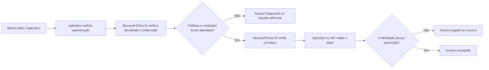

São 8h57 no primeiro dia de Marina. A conta corporativa acabou de chegar e, em poucos minutos, ela precisa acessar o Outlook, participar de uma reunião no Teams e abrir um documento no SharePoint.

Para Marina, existe apenas uma tela de entrada. Para a equipe de tecnologia, porém, várias perguntas precisam ser respondidas: a conta realmente pertence a ela? Um segundo fator deve ser solicitado? O dispositivo é confiável? Ela pode abrir aquele arquivo? E quem registrará essa tentativa de acesso?

O **Microsoft Entra ID** está no centro dessas decisões. Ele funciona como o serviço de identidade e acesso que conecta pessoas, dispositivos, aplicativos e recursos na nuvem. Não é apenas uma lista de usuários e também não é “a senha do Microsoft 365”: é o plano de controle que ajuda a decidir **quem ou o que pode acessar qual recurso, sob quais condições**.

Neste artigo, você construirá um mapa mental do Microsoft Entra ID, acompanhará o caminho de uma entrada e fará um reconhecimento seguro, somente leitura, do seu ambiente.

## O resultado esperado

Ao final da leitura, você deverá ser capaz de:

- explicar o que são identidade, locatário, autenticação e autorização;
- diferenciar Microsoft Entra ID, Active Directory Domain Services e assinatura Azure;
- reconhecer usuários, grupos, dispositivos e aplicativos em um locatário;
- entender, em nível conceitual, onde MFA, Acesso Condicional, funções e tokens participam de uma entrada;
- navegar pelo centro de administração sem alterar o ambiente.

O objetivo não é transformar você em administrador de identidade em uma única leitura. É entregar uma base confiável para que os próximos menus, alertas e projetos deixem de parecer peças desconectadas.

## Antes de começar

Para o reconhecimento prático, você precisará de:

- uma conta corporativa ou de estudante em um locatário de laboratório;
- um navegador atualizado;
- acesso ao [centro de administração do Microsoft Entra](https://entra.microsoft.com/);
- permissão para visualizar as áreas mencionadas.

Uma conta comum pode não enxergar todos os menus ou detalhes. As opções também variam conforme as funções atribuídas, as licenças e as configurações do locatário. Isso não impede a leitura conceitual.

Os portais da Microsoft evoluem continuamente, por isso nomes e posições dos menus podem mudar. Se a interface estiver diferente, procure a área equivalente e consulte a documentação atual antes de concluir que um recurso não está disponível.

> [!CAUTION]
> Não use um locatário de produção para experimentar alterações. Criar políticas, trocar métodos de autenticação ou remover permissões pode bloquear usuários e administradores. O roteiro deste artigo é somente leitura.

## Afinal, o que é o Microsoft Entra ID?

O Microsoft Entra ID é um serviço de **gerenciamento de identidades e acesso**, também conhecido pela sigla IAM, hospedado na nuvem. Ele fornece autenticação, aplicação de políticas e proteção de acesso para usuários, dispositivos, aplicativos e recursos.

Se sua organização usa Microsoft 365, Azure, Dynamics 365, Power Platform ou Intune, ela já usa um locatário do Microsoft Entra. Foi ele, por exemplo, que reconheceu a conta de Marina antes que o Teams carregasse.

Você ainda encontrará o nome **Azure Active Directory**, **Azure AD** ou **AAD** em materiais antigos, scripts e conversas. Microsoft Entra ID é o novo nome do Azure AD. A mudança de marca não transformou o serviço em outro produto e não alterou, por si só, funcionalidades, preços ou contratos.

Há uma distinção importante: **Microsoft Entra** é a família de produtos de identidade e acesso; **Microsoft Entra ID** é um produto dessa família.

## Identidade não é sinônimo de senha

Uma identidade digital é o conjunto de atributos que representa alguém ou alguma coisa em um sistema. Nome, identificador exclusivo, departamento, cargo e métodos de autenticação podem fazer parte dessa representação.

A senha é apenas uma possível **credencial** usada para provar uma identidade. Ela não é a identidade em si.

No Microsoft Entra ID, você encontrará principalmente:

- **usuários**, como funcionários, estudantes e convidados;
- **grupos**, usados para reunir identidades e administrar acesso em escala;
- **dispositivos**, como notebooks e celulares registrados ou ingressados;
- **identidades de carga de trabalho**, usadas por aplicativos, serviços, scripts e automações;
- **aplicativos**, que podem confiar no Microsoft Entra ID para realizar entrada e obter acesso a APIs.

Essa separação importa. Se Marina futuramente configurar uma automação para acessar um cofre de segredos, por exemplo, o ideal não será emprestar a conta e a senha de uma pessoa. A carga de trabalho deverá possuir uma identidade própria, com apenas as permissões necessárias.

## O locatário é a casa das identidades

Um **locatário**, ou _tenant_, é uma instância dedicada do Microsoft Entra ID que representa uma organização. Ele armazena objetos como usuários, grupos, dispositivos e registros de aplicativos, além de políticas de acesso e dados de configuração.

Pense no locatário como o condomínio da história de Marina:

- o condomínio é a organização;
- o cadastro de moradores e prestadores representa as identidades;
- as regras da portaria representam as políticas;
- cada área comum ou apartamento representa um recurso;
- os registros de entrada representam os logs.

Cada locatário possui um identificador exclusivo, o **ID do locatário**, e recebe um domínio inicial semelhante a `contoso.onmicrosoft.com`. A organização pode adicionar domínios personalizados, como `empresa.com.br`.

Uma mesma pessoa pode existir em mais de um locatário. Marina pode ser membro no locatário da própria empresa e convidada no locatário de um parceiro. Esse é um cenário típico de **colaboração B2B**, um recurso do Microsoft Entra External ID que permite a usuários externos acessar os aplicativos e recursos compartilhados usando as próprias credenciais.

B2B e `UserType: Guest` não são sinônimos absolutos: o tipo de usuário representa a relação da pessoa com o locatário, enquanto a origem da identidade indica onde ela se autentica. Em qualquer caso, cada organização continua responsável pelas políticas e pelo acesso aos próprios recursos.

### Locatário não é assinatura Azure

Esses conceitos aparecem juntos, mas não são equivalentes:

| Conceito                     | Função principal                        | Exemplos do que contém ou controla                                            |
| ---------------------------- | --------------------------------------- | ----------------------------------------------------------------------------- |
| Locatário do Microsoft Entra | Fronteira de identidade e acesso        | Usuários, grupos, aplicativos, dispositivos, funções do diretório e políticas |
| Assinatura Azure             | Fronteira de recursos, cobrança e cotas | Máquinas virtuais, redes, bancos de dados, cofres e contas de armazenamento   |

Uma assinatura Azure mantém uma relação de confiança com um locatário para autenticar identidades. Ainda assim, criar um usuário no locatário não concede automaticamente acesso aos recursos da assinatura.

## Microsoft Entra ID não é o Active Directory local

O nome antigo, Azure Active Directory, levou muita gente a imaginar que o serviço seria apenas um controlador de domínio hospedado na nuvem. Não é.

| Aspecto                  | Active Directory Domain Services                                   | Microsoft Entra ID                                                                     |
| ------------------------ | ------------------------------------------------------------------ | -------------------------------------------------------------------------------------- |
| Projeto principal        | Identidade e administração de ambientes locais baseados em domínio | Identidade e acesso a aplicativos e recursos na nuvem e em ambientes híbridos          |
| Protocolos comuns        | Kerberos, NTLM e LDAP                                              | OpenID Connect, OAuth 2.0, SAML e WS-Federation                                        |
| Estrutura administrativa | Domínios, florestas e unidades organizacionais                     | Locatários, objetos, grupos, funções e políticas                                       |
| Dispositivos             | Ingresso em domínio e Política de Grupo                            | Registro ou ingresso no Microsoft Entra e integração com gerenciamento de dispositivos |
| Aplicativos              | Forte integração com recursos e aplicativos tradicionais           | SSO e controle de acesso para Microsoft 365, Azure, SaaS e aplicativos modernos        |

As duas soluções podem coexistir. Organizações híbridas podem sincronizar identidades do Active Directory local com o Microsoft Entra ID. Aplicativos que dependem de LDAP, Kerberos, NTLM ou Política de Grupo continuam exigindo uma arquitetura compatível, como Active Directory Domain Services ou, em cenários específicos, Microsoft Entra Domain Services.

Em resumo: Microsoft Entra ID não é uma substituição automática e recurso por recurso do Active Directory local.

## Autenticação e autorização: duas perguntas diferentes

Imagine a credencial de um evento:

1. na entrada, a equipe confere seus documentos para saber **quem é você**;
2. depois, a cor da pulseira determina **quais áreas você pode acessar**.

A primeira etapa é **autenticação**. A segunda é **autorização**.

- **Autenticação (AuthN):** comprova que a identidade apresentada é legítima.
- **Autorização (AuthZ):** concede ou nega uma ação sobre determinado recurso.

Marina pode autenticar corretamente com senha e Microsoft Authenticator e, ainda assim, não estar autorizada a abrir a folha de pagamento. Uma entrada bem-sucedida não significa acesso irrestrito.

### Onde entra a MFA

A autenticação multifator, ou MFA, exige evidências de categorias diferentes. Os fatores normalmente são:

- algo que você **sabe**, como uma senha ou PIN;
- algo que você **possui**, como um telefone ou uma chave de segurança;
- algo que você **é**, como uma característica biométrica.

Dois dados da mesma categoria não formam necessariamente MFA. Senha e pergunta secreta, por exemplo, continuam sendo duas coisas que a pessoa sabe.

Métodos também oferecem resistências diferentes. Senhas, SMS e códigos podem ser alvos de engenharia social. Passkeys FIDO2 e chaves de segurança usam criptografia vinculada ao serviço legítimo e são opções resistentes a phishing. A escolha deve considerar risco, licenciamento, recuperação de conta e capacidade dos usuários.

### SSO não significa compartilhar senha

O logon único, ou **SSO**, permite que a pessoa se autentique uma vez e acesse diferentes aplicativos que confiam no mesmo provedor de identidade, sem repetir a entrada em cada um deles.

Isso não significa que todos os sistemas recebem ou armazenam a senha de Marina. Em fluxos modernos, os aplicativos trabalham com tokens emitidos para finalidades e destinatários específicos.

## O que acontece durante uma entrada

O fluxo abaixo simplifica uma entrada moderna. Alguns detalhes variam conforme o aplicativo e o protocolo.

O token é uma credencial temporária assinada. Ele permite que o aplicativo ou recurso receba informações sobre a entrada sem precisar conhecer a senha de Marina. Diferentes tipos de token atendem a finalidades diferentes, mas, neste primeiro contato, o ponto central é: **um token válido comprova uma etapa do fluxo; ele não concede acesso ilimitado**.

Tokens são sensíveis. Não devem ser colados em chamados, capturas de tela, repositórios ou ferramentas públicas.

## Acesso Condicional: o “se... então” da portaria

O **Acesso Condicional do Microsoft Entra** reúne sinais para aplicar políticas. A lógica básica é:

> Se determinada identidade tentar acessar determinado recurso sob certas condições, então permita, bloqueie ou exija um controle adicional.

Uma organização pode, por exemplo:

- exigir MFA para funções administrativas;
- exigir um dispositivo compatível para acessar dados sensíveis;
- bloquear protocolos de autenticação herdados;
- reagir a determinados níveis de risco, quando o licenciamento oferecer esse sinal;
- limitar o acesso conforme aplicativo, plataforma ou localização configurada.

O Acesso Condicional não substitui a autorização do recurso. Ele decide se a sessão pode prosseguir sob aquelas condições; as permissões do usuário ainda determinam o que poderá ser feito depois.

## Três camadas de permissão que não devem ser confundidas

É comum alguém receber o título de “administrador” e ainda assim não conseguir concluir uma tarefa. O motivo pode estar na camada em que a permissão foi concedida.

| Camada                              | O que administra                     | Exemplos                                                              |
| ----------------------------------- | ------------------------------------ | --------------------------------------------------------------------- |
| Funções do Microsoft Entra          | Objetos e configurações do diretório | Administrador Global, Administrador de Usuários, Leitor de Relatórios |
| Azure RBAC                          | Recursos Azure em um escopo          | Proprietário, Colaborador, Leitor                                     |
| Permissões do aplicativo ou serviço | Dados e operações daquele produto    | Funções do Exchange, SharePoint, Teams ou de um aplicativo próprio    |

Um **Administrador Global** possui amplos poderes sobre o Microsoft Entra ID, mas não se torna automaticamente **Proprietário** de todas as assinaturas Azure. Da mesma forma, um Proprietário de assinatura não recebe automaticamente controle total sobre o diretório.

Conceda a função certa, no menor escopo possível e pelo tempo necessário. O excesso de privilégios aumenta o impacto de erros, credenciais comprometidas e ações maliciosas.

## Reconhecimento seguro do seu locatário

Este roteiro não cria, edita ou exclui objetos.

### Confirme em qual locatário você está

Entre em [entra.microsoft.com](https://entra.microsoft.com/) e abra a visão geral do Microsoft Entra ID. Localize:

- nome do locatário;
- ID do locatário;
- domínio principal.

Registre essas informações apenas em uma anotação de trabalho apropriada. O ID do locatário não funciona como senha, mas isso não justifica divulgar dados do ambiente sem necessidade.

Se você administra mais de uma organização, confira o locatário selecionado antes de qualquer atividade futura. Muitos erros começam no ambiente certo aberto na guia errada.

### Observe usuários e grupos

Na área de usuários, identifique contas internas, convidados e o estado de cada conta. Depois, abra a área de grupos e observe como as associações reúnem pessoas com necessidades semelhantes.

Pergunte:

- existem nomes que permitam entender a finalidade dos grupos?
- o acesso é concedido por grupo ou diretamente a muitas pessoas?
- há convidados que talvez já tenham concluído o trabalho?

O objetivo nesta etapa é aprender a formular perguntas.

### Reconheça aplicativos empresariais

Abra a área de aplicativos empresariais. Esses objetos representam instâncias de aplicativos que operam no locatário e podem receber atribuições, consentimentos e configurações de SSO.

Não confunda **registros de aplicativo** com **aplicativos empresariais**:

- o registro descreve a definição do aplicativo no locatário onde ele foi registrado;
- o aplicativo empresarial normalmente representa a identidade dessa aplicação, o _service principal_, dentro de um locatário.

Para um primeiro contato, basta notar que aplicativos também possuem identidade e permissões. Eles não são exceções invisíveis ao modelo de acesso.

### Consulte funções e administradores

Abra a área de funções e administradores e procure a opção que mostra suas próprias atribuições. Observe o nome e o escopo de cada função.

Não presuma que “Administrador Global para garantir que funcione” seja uma solução aceitável. Se uma tarefa exige privilégio elevado, descubra a função menos privilegiada capaz de realizá-la.

### Leia os logs

Na área de monitoramento e integridade, abra os logs de entrada e, se sua permissão permitir, um evento da sua própria conta. Procure:

- data e hora;
- aplicativo ou recurso;
- resultado da entrada;
- endereço IP e localização estimada;
- dispositivo e cliente;
- requisitos de autenticação;
- políticas de Acesso Condicional avaliadas, quando disponíveis.

Depois, consulte os logs de auditoria. Eles respondem a outra pergunta: **o que mudou no diretório, quem iniciou a mudança e qual objeto foi afetado?**

Localização derivada de IP é um sinal aproximado, não uma prova de presença física. Use o conjunto de evidências ao investigar um evento.

## Como validar o que você aprendeu

Complete mentalmente este cenário:

> Marina informa a senha correta, confirma uma passkey e recebe um token. Ao abrir um sistema financeiro, encontra “acesso negado”.

A sequência pode estar funcionando como deveria:

1. a conta de Marina foi **autenticada**;
2. a política exigiu e aceitou um método adicional;
3. o aplicativo recebeu um token válido;
4. Marina não possuía a função ou permissão necessária;
5. a **autorização** ao recurso foi negada.

Agora verifique se você consegue localizar, sem alterar nada:

- seu locatário e domínio principal;
- sua conta e os grupos visíveis;
- pelo menos um aplicativo empresarial;
- suas funções administrativas;
- um evento de entrada e um evento de auditoria.

Se essas peças já formam uma história coerente, o mapa mental cumpriu seu papel.

## Aprofunde a leitura

Você já sabe reconhecer as peças e explicar como elas participam de uma entrada. O passo seguinte é transformar esse entendimento em controles que reduzam a chance e o impacto de um comprometimento.

> [!TIP]
> Leia [Do reconhecimento ao hardening no Microsoft Entra ID](/posts/do-reconhecimento-ao-hardening-no-microsoft-entra-id/) para aprofundar identidades gerenciadas, tokens e protocolos, Acesso Condicional, PIM, licenciamento, menor privilégio e implantação segura. O artigo parte do mapa mental construído aqui, mas contém contexto suficiente para ser lido de forma independente.

## Referências primárias

- [O que é Microsoft Entra?](https://learn.microsoft.com/entra/fundamentals/what-is-entra?wt.mc_id=studentamb_365381)
- [Conceitos fundamentais de gerenciamento de identidade e acesso](https://learn.microsoft.com/entra/fundamentals/identity-fundamental-concepts?wt.mc_id=studentamb_365381)
- [Novo nome para o Azure Active Directory](https://learn.microsoft.com/entra/fundamentals/new-name?wt.mc_id=studentamb_365381)
- [Comparar o Active Directory com o Microsoft Entra ID](https://learn.microsoft.com/entra/fundamentals/compare?wt.mc_id=studentamb_365381)
- [Entender e gerenciar as propriedades de usuários convidados B2B](https://learn.microsoft.com/entra/external-id/user-properties?wt.mc_id=studentamb_365381)
- [Visão geral de tokens e declarações](https://learn.microsoft.com/entra/identity-platform/security-tokens?wt.mc_id=studentamb_365381)
- [Autenticação versus autorização](https://learn.microsoft.com/entra/identity-platform/authentication-vs-authorization?wt.mc_id=studentamb_365381)
- [Visão geral do Acesso Condicional](https://learn.microsoft.com/entra/identity/conditional-access/overview?wt.mc_id=studentamb_365381)
- [Visão geral de monitoramento e integridade](https://learn.microsoft.com/entra/identity/monitoring-health/overview-monitoring-health?wt.mc_id=studentamb_365381)

## Conclusão

No fim do primeiro dia, Marina não precisou conhecer tokens, funções ou políticas para participar da reunião. Essa simplicidade foi possível porque várias decisões de identidade aconteceram nos bastidores.

Para quem administra o ambiente, a melhor pergunta não é apenas “a senha está correta?”. O raciocínio completo é:

> Quem ou o que está solicitando acesso, a identidade foi comprovada, as condições são aceitáveis e existe permissão para realizar esta ação?

Esse é o mapa do Microsoft Entra ID. Usuários, grupos, dispositivos, aplicativos, políticas, funções e logs deixam de ser menus isolados e passam a contar a mesma história: permitir o trabalho certo, para a identidade certa, com o nível de confiança e privilégio adequados.

## Nota de independência e marcas

Este é um conteúdo editorial independente e não é afiliado, autorizado, patrocinado ou aprovado pela Microsoft Corporation. Microsoft, Microsoft Entra, Microsoft 365 e Azure são marcas do grupo de empresas Microsoft. Todas as demais marcas pertencem aos respectivos titulares.

O texto, o diagrama e a ilustração foram produzidos especificamente para este artigo do RookieOps.
