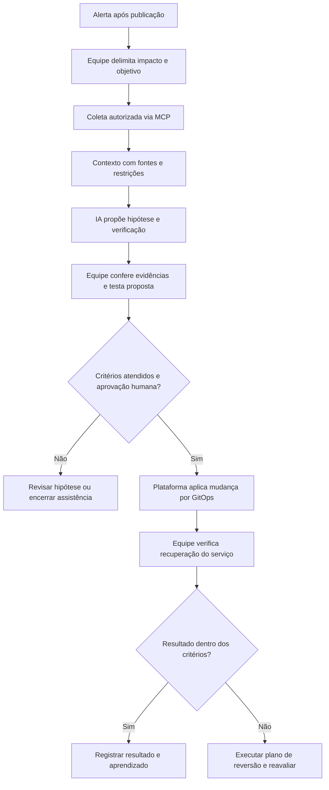

## O que muda no trabalho de Cloud e DevOps

Usar inteligência artificial (IA) em operações começa por saber investigar um problema e avaliar uma solução. Em Cloud, a computação em nuvem, e em DevOps, que aproxima desenvolvimento e operações, a IA pode ajudar a explicar erros e revisar configurações. Você ainda precisa entender o serviço e o impacto da mudança.

Se você está estudando Linux, redes ou identidade e se pergunta como encaixar IA nessa rotina, vale partir daí. Esse conhecimento ajuda a perceber quando uma sugestão ignora uma dependência ou confunde permissões. Ao usar IA, também precisamos cuidar das informações que ela recebe, dos acessos disponíveis e da forma de conferir o resultado.

Uso o termo **nova stack** para organizar essas competências: fundamentos, automação, agentes, contexto e governança. Quero mostrar como elas se conectam e ajudar você a escolher o que estudar a seguir, conforme os problemas que encontra no trabalho.

O [relatório de 2025 do DORA, DevOps Research and Assessment](https://dora.dev/research/2025/dora-report/), programa de pesquisa sobre entrega de software, apresenta a IA como amplificadora das forças e fragilidades das organizações. Em 3 de setembro de 2026, segue como a [edição anual mais recente](https://dora.dev/research/). Seu [modelo de capacidades](https://dora.dev/ai/capabilities-model/report/) detalha práticas como qualidade dos dados, controle de versão e plataformas internas. A aplicação ao diagnóstico de incidentes é uma interpretação minha.

Escrevi para profissionais de infraestrutura, administração de sistemas, Cloud e DevOps em nível iniciante ou intermediário. Alguma familiaridade com terminal, servidores, redes e Git basta. Os conceitos de agentes entram na conversa aos poucos.

## Os fundamentos que sustentam as decisões

Antes de aceitar uma sugestão da IA, vale perguntar o que ela muda no sistema. Reiniciar um processo, aumentar um limite e conceder uma permissão produzem efeitos diferentes. Uma boa explicação precisa fazer sentido para o problema que você está investigando.

Nos sistemas operacionais Linux e Windows, isso passa por processos, serviços, arquivos, memória e usuários. Um processo em execução pode estar incapaz de atender requisições. Da mesma forma, ter espaço livre em disco não resolve uma permissão que impede a gravação. Precisamos reconhecer essas diferenças antes de mexer em produção.

Em redes, precisamos acompanhar o caminho da conexão. O DNS, sistema de nomes de domínio, associa nomes a informações como endereços do protocolo de internet, ou IP. Depois entram rotas, portas e regras de acesso na comunicação entre serviços. Uma falha ao resolver um nome pede uma investigação diferente de uma conexão recusada ou de uma resposta de acesso negado.

Vamos usar um exemplo fictício para trabalhar essas diferenças. Um serviço de pedidos passa a falhar ao acessar objetos no armazenamento depois de um deploy, a publicação de uma nova versão. Nos logs, os registros de eventos da aplicação, a equipe procura o que mudou e quais chamadas estão falhando.

As chamadas usam HTTP, o protocolo de transferência de hipertexto. Nos logs, o [código 403 indica uma requisição entendida e recusada](https://www.rfc-editor.org/rfc/rfc9110.html#section-15.5.4). Eu investigaria autorização e conferiria quem respondeu, pois um intermediário também pode bloquear o acesso. O código não revela a credencial usada nem comprova qual permissão falta. Qualquer hipótese de falha de DNS precisa ser compatível com essas evidências.

Identidade responde **quem está fazendo a chamada**. Autenticação verifica essa identidade. Autorização determina quais ações ela pode realizar sobre cada recurso. Se a aplicação passou a usar outra identidade durante o deploy, o armazenamento pode estar saudável e, mesmo assim, recusar uma leitura que antes funcionava.

Armazenamento envolve persistência, latência (tempo de resposta), capacidade e recuperação. Um volume, área de armazenamento disponível à aplicação, pode ser temporário ou persistente. Reverter uma mudança, o chamado rollback, não necessariamente restaura os dados. A proposta de reversão precisa considerar essa diferença.

Imagens de container empacotam aplicações e dependências. Containers executam essas imagens com mecanismos de isolamento do sistema operacional. Entender processos, volumes e limites de recursos ajuda no diagnóstico. Kubernetes pode coordenar containers quando o problema justifica seu uso e a equipe consegue operá-lo. Essa base também vale em uma única máquina virtual.

Provedores como AWS (Amazon Web Services), Microsoft Azure e Google Cloud implementam esses conceitos de formas diferentes, assim como a infraestrutura local, ou on-premises. Entender o conceito por trás do nome comercial ajuda a transferir o aprendizado.

Uma forma de estudar com IA é pedir uma hipótese, as evidências esperadas e uma condição que a contradiga. Depois, confira a documentação e o que acontece no ambiente. Ao fazer isso, você pratica algo valioso no trabalho: discordar de uma resposta bem escrita e conseguir explicar tecnicamente o motivo.

## Da automação isolada à entrega controlada

Muita gente começa com um script, um arquivo de comandos que automatiza uma tarefa. Já ajuda bastante. A dor aparece quando ele depende da sua máquina, de uma credencial esquecida ou de uma ordem que só você conhece. Nesse ponto, a automação ainda precisa consultar a sua agenda.

A infraestrutura como código, ou **IaC**, descreve recursos em arquivos versionados. Terraform, OpenTofu e Pulumi são exemplos de ferramentas nessa área. Ansible é usado para automação e gerenciamento de configuração. Algumas capacidades se sobrepõem; eu escolheria considerando o problema, o ambiente e quem manterá o trabalho.

Com os arquivos versionados, a equipe consulta o histórico e revisa o motivo das mudanças. Comparar o estado atual com o planejado ajuda a antecipar o impacto. Um plano válido pode remover um recurso importante; quem revisa precisa entender sua função no serviço.

A integração contínua, **CI**, reúne mudanças frequentes e verificações automatizadas. **CD** pode significar entrega contínua, que mantém mudanças prontas para publicação, ou implantação contínua, que automatiza essa publicação após os controles definidos. O pipeline é o fluxo de execução dessas etapas. A equipe precisa deixar explícito onde entram testes, aprovações e acesso ao ambiente.

O **GitOps** acrescenta uma forma específica de gerir estado. Os [princípios do OpenGitOps, versão 1.0.0](https://opengitops.dev/), pedem estado desejado declarativo, armazenado em versões imutáveis, que preservam o histórico, obtido automaticamente por agentes de software e reconciliado continuamente. Reconciliação é o processo de observar diferenças entre o estado real e o desejado e tentar corrigi-las. Os agentes de software que fazem isso não precisam utilizar IA.

Um pipeline que executa comandos após um commit, registro de alterações no repositório, pode fazer parte de CI/CD sem implementar GitOps. No serviço de pedidos, uma mudança manual pode ser desfeita pelo reconciliador se a fonte do estado desejado continuar apontando para a configuração problemática.

**Platform Engineering**, ou engenharia de plataforma, organiza capacidades internas como um produto para as equipes. O [documento técnico da Cloud Native Computing Foundation, CNCF](https://tag-app-delivery.cncf.io/whitepapers/platforms/), parte das necessidades dos usuários. Portais, modelos de projeto, documentação e serviços de autoatendimento podem compor essa experiência.

Um caminho pavimentado é uma maneira suportada de realizar uma tarefa recorrente. Para o serviço de pedidos, poderia incluir publicação com identidade configurada, sinais para entender o comportamento do serviço (observabilidade) e reversão. A equipe continua responsável pela aplicação e pode reutilizar a infraestrutura de entrega.

Com esse processo funcionando, fica mais claro onde encaixar a IA. Ela pode propor uma correção, e a equipe tem um caminho conhecido para revisá-la, testar seu efeito e aplicá-la. As verificações e os responsáveis já fazem parte da rotina de entrega.

## Onde a IA entra no trabalho e a diferença de conceitos

A IA generativa produz conteúdo a partir de padrões aprendidos e do contexto recebido. No trabalho operacional, isso pode ajudar a explicar uma mensagem de erro, revisar um script, comparar configurações ou resumir um ticket de incidente, o registro usado para acompanhar a ocorrência. O resultado precisa ser confrontado com as fontes.

Para entender o que uma solução oferece, vale separar quatro conceitos:

| Conceito   | Papel                                                                    | Exemplo no incidente                                               |
| ---------- | ------------------------------------------------------------------------ | ------------------------------------------------------------------ |
| Modelo     | Motor que produz respostas a partir das entradas recebidas               | Relacionar um erro de acesso a possíveis causas                    |
| Assistente | Aplicação com uma interface de colaboração humana                        | Conversar com a pessoa de plantão sobre os registros               |
| Workflow   | Fluxo com etapas e caminhos previamente definidos                        | Coletar dados autorizados, gerar resumo e encaminhar para revisão  |
| Agente     | Sistema que permite ao modelo escolher próximos passos dentro de limites | Decidir qual consulta autorizada ajuda a distinguir duas hipóteses |

Um modelo de linguagem de grande porte, ou **LLM**, não consulta sua cloud por conta própria. A aplicação ao redor dele fornece contexto e pode executar chamadas de ferramentas. O assistente pode incorporar workflows e agentes; esses nomes descrevem aspectos diferentes do sistema.

A distinção entre caminhos predefinidos e decisões dinâmicas segue a discussão da [Anthropic sobre workflows e agentes](https://www.anthropic.com/engineering/building-effective-agents). Essa referência é conceitual: o próprio artigo sinaliza que as ferramentas descritas evoluíram desde dezembro de 2024. Na prática, convém perguntar quais decisões ficam com o modelo, quais são fixas e quais exigem uma pessoa.

No serviço de pedidos, um workflow pode sempre buscar a última publicação, selecionar uma janela de logs e montar um resumo. As etapas são predefinidas, mas o texto gerado pelo modelo ainda pode variar. Um agente pode receber esse resumo e escolher entre examinar a identidade ativa ou comparar o acesso ao armazenamento, conforme as evidências encontradas.

Essa liberdade também pode levar a consultas repetidas, caminhos improdutivos ou conclusões diferentes para entradas parecidas. Por isso, prefiro começar pela menor autonomia que resolva a tarefa. Se a coleta segue sempre os mesmos passos, um workflow previsível costuma ser mais fácil de avaliar e manter.

A expressão **AIOps**, aplicação de IA a operações de tecnologia da informação, ou TI, também abrange usos como detecção de anomalias e correlação de eventos. Uma interface de chat pode apresentar parte desses resultados, mas o campo é mais amplo. Aqui, o recorte é a IA generativa ajudando quem opera serviços e toma decisões sobre eles.

## Engenharia de contexto e a conexão com o ambiente real

Diante de “por que o serviço caiu?”, um colega perguntaria qual serviço, em qual ambiente, o que falhou e o que mudou. Também precisaria saber quais dados pode consultar. A IA precisa dessas mesmas informações.

**Engenharia de Contexto**, ou Context Engineering, é o trabalho de preparar a informação disponível ao modelo em cada etapa. A [LangChain apresenta o conceito](https://www.langchain.com/blog/context-engineering-for-agents) em termos de selecionar, organizar e administrar esse contexto. Sua [documentação sobre agentes](https://docs.langchain.com/oss/python/langchain/context-engineering) também inclui ferramentas, formato das respostas e estado da execução entre os elementos que precisam ser controlados.

Para investigar a falha do serviço de pedidos, eu começaria reunindo o ambiente, o intervalo de tempo, a versão publicada e as dependências conhecidas. Acrescentaria o runbook, o procedimento operacional documentado. O objetivo e os limites também ficariam explícitos: investigar os acessos negados ao armazenamento, consultar somente fontes autorizadas e apresentar hipóteses acompanhadas de evidências.

Também diria o que falta. Registros ausentes do provedor de identidade ou métricas atrasadas precisam aparecer, para que o resumo não passe uma confiança que os dados ainda não sustentam.

Cada evidência deve manter origem, horário e escopo. Um log de homologação, ambiente usado para validar mudanças, não comprova o comportamento de produção. Um runbook escrito antes da troca de autenticação pode orientar a consulta errada. O cuidado com versões e procedência vale tanto para quem lê quanto para a IA.

**RAG**, sigla de Retrieval-Augmented Generation, combina recuperação de informações com geração de respostas. Uma aplicação pode buscar trechos de documentação e fornecê-los ao modelo durante a tarefa. Essa consulta não altera os parâmetros aprendidos no treinamento. A [documentação de recuperação da LangChain](https://docs.langchain.com/oss/python/deepagents/retrieval) ajuda a situar esse mecanismo.

No incidente, a busca pode encontrar uma página sobre a identidade antiga. Se ela estiver desatualizada, a resposta será construída sobre uma informação que já não vale para o serviço. Por isso, precisamos conferir o documento encontrado, sua versão e se quem fez a solicitação pode acessá-lo. Essa autorização deve ser verificada antes de entregar o conteúdo ao modelo.

O **Model Context Protocol, MCP**, é um padrão aberto para conectar aplicações de IA a ferramentas e fontes externas. Ele foi [apresentado pela Anthropic em 25 de novembro de 2024](https://www.anthropic.com/news/model-context-protocol). Pode conectar uma aplicação a repositórios, métricas ou APIs, interfaces de comunicação entre sistemas.

Em [dezembro de 2025, a Anthropic anunciou a doação do MCP à Agentic AI Foundation](https://www.anthropic.com/news/donating-the-model-context-protocol-and-establishing-of-the-agentic-ai-foundation), vinculada à Linux Foundation. Naquele momento, produtos como Visual Studio Code e Cursor já adotavam o protocolo.

Na [arquitetura do MCP](https://modelcontextprotocol.io/docs/learn/architecture), a aplicação usa clientes para conversar com servidores locais ou remotos. Eles podem oferecer ferramentas executáveis, recursos de informação e prompts, modelos de instruções reutilizáveis. O modelo sugere uma chamada; a aplicação e a integração cuidam da execução.

A [revisão de 28 de julho de 2026](https://blog.modelcontextprotocol.io/posts/2026-07-28/) dispensou sessões persistentes no núcleo do protocolo, o chamado modelo stateless. Isso facilita distribuir chamadas entre servidores HTTP. Os controles de rede e autorização continuam necessários, e a aplicação ainda pode manter seu próprio estado.

Para o serviço de pedidos, eu ofereceria consultas específicas: buscar erros em um intervalo e comparar configurações publicadas. Os resultados voltariam ao contexto da investigação. Com operações bem definidas, a equipe consegue conferir o acesso necessário e entender o que cada chamada faz.

O MCP [define um fluxo de autorização para conexões HTTP](https://modelcontextprotocol.io/specification/2026-07-28/basic/authorization). A integração precisa aplicar os controles: confira credenciais, permissões, configuração e os parâmetros enviados às ferramentas. Descrever uma ferramenta como “somente leitura” não impede uma escrita. A restrição precisa valer para a identidade usada e ser verificada no serviço que recebe a chamada.

## Harness Engineering: projetando o trabalho ao redor do modelo

Depois de organizar o contexto, ainda precisamos decidir onde a IA pode trabalhar, até onde pode ir e como vamos conferir o que ela entrega. Vou usar **harness** para falar desse conjunto: ambiente de execução, ferramentas, limites e verificações ao redor do modelo.

Em [Harness engineering for coding agent users, publicado em 2 de abril de 2026](https://martinfowler.com/articles/harness-engineering.html), **Birgitta Böckeler** explora mecanismos de orientação e verificação ao redor de agentes de programação. A autora distingue controles computacionais de avaliações feitas por modelos, que são probabilísticas. A partir dessa análise, proponho aplicar a ideia ao nosso exemplo de infraestrutura.

Para o serviço de pedidos, o harness começaria com um objetivo restrito: produzir uma proposta fundamentada sobre a falha de acesso. A sessão receberia ferramentas de consulta específicas, uma identidade própria e um ambiente isolado para analisar arquivos ou preparar uma alteração. Não herdaria as credenciais administrativas da pessoa de plantão.

Ao avaliar o isolamento, eu conferiria arquivos, processos, rede e credenciais. Um container com acesso amplo à rede de produção ou com segredos montados continua podendo causar impacto. Precisamos saber aonde ele consegue chegar e para quais destinos pode enviar dados.

Outro componente é o orçamento operacional. A equipe define limites de tempo, chamadas, tentativas e consumo. Se a ferramenta de logs falhar repetidamente, o sistema interrompe aquele caminho e informa a limitação. Ele não deve ampliar permissões por iniciativa própria para conseguir terminar a tarefa.

Combine os critérios de aceite antes de pedir uma resposta. A proposta deve identificar o recurso, relacionar hipótese e evidências, indicar uma verificação independente e explicar impacto e reversão. Se faltarem dados, uma resposta útil pode apontar o que ainda precisa ser obtido.

Böckeler aprofunda essa verificação em seu [estudo sobre sensores de qualidade do código](https://martinfowler.com/articles/sensors-for-coding-agents.html), mecanismos que devolvem ao agente sinais de problemas no código. No nosso exemplo, conferir sintaxe não confirma o acesso ao objeto. Um teste baseado na hipótese errada pode repetir o engano. A equipe deve manter casos conhecidos e verificar tanto acessos necessários quanto os que precisam continuar bloqueados.

Pedir a uma segunda IA que revise a proposta pode ajudar, mas a concordância entre elas não substitui os testes. Também precisamos enxergar quando a consulta falhou, o documento estava antigo, as evidências se contradiziam ou a sessão parou por atingir um limite. O harness deve deixar essas situações claras para quem acompanha o trabalho.

**Uma regra documentada precisa de uma trava técnica quando protege uma fronteira de segurança.** Escrever “não altere produção” orienta o comportamento; a autorização do serviço deve negar escrita à identidade efetivamente usada, sem caminhos alternativos com credenciais mais amplas. Revisão obrigatória deve ser aplicada pelo fluxo de entrega. Limites de consumo precisam ser impostos pelo sistema que controla as chamadas.

Se você já prepara ambientes, define acessos ou testa recuperação, parte desse trabalho vai ser familiar. O vocabulário novo ajuda a discutir como aplicar essas competências a sistemas que usam IA. Entender onde uma tarefa pode falhar ajuda a escolher os controles necessários.

## Observabilidade e governança: quem responde pelo resultado?

Eu acompanharia tanto a saúde do serviço quanto o trabalho feito com IA. Latência, erros, volume de requisições e saturação, a proximidade dos recursos de seus limites, ajudam a avaliar impacto e recuperação. São os quatro sinais apresentados na [referência do Google sobre engenharia de confiabilidade de sites, ou SRE](https://sre.google/sre-book/monitoring-distributed-systems/).

Na assistência de IA, confira se as consultas ajudaram, se as referências sustentam a proposta e quanto retrabalho houve. Acompanhe hipóteses incompatíveis com as evidências, duração, falhas de ferramentas e consumo de tokens, as unidades de entrada e saída do modelo que podem influenciar limites e cobrança.

Uma resposta rápida pode dar trabalho para revisar; uma investigação com mais chamadas pode evitar uma mudança desnecessária. O [guia do DORA sobre retorno do investimento em desenvolvimento assistido por IA](https://dora.dev/ai/roi/report/), de 2026, ajuda a organizar a avaliação de custos e benefícios. Em operações, eu compararia tarefas semelhantes com e sem assistência, observando tempo total, erros e esforço de revisão.

No incidente, os registros devem mostrar as fontes consultadas, os parâmetros enviados às ferramentas, a proposta gerada e quem aprovou a mudança. Identificar versões do modelo, das instruções e das integrações ajuda a investigar pioras de comportamento. Isso não exige registrar um suposto raciocínio interno do modelo.

Os registros da própria assistência também precisam de proteção. Logs podem conter dados pessoais, informações de clientes ou segredos. Defina quais dados podem sair do ambiente, quem acessa o histórico e por quanto tempo ele é mantido. Sempre que possível, use somente os campos e intervalos necessários à tarefa.

**Privilégio mínimo** significa conceder apenas o acesso necessário ao trabalho autorizado. Isso se relaciona a Zero Trust, uma arquitetura que evita confiança implícita baseada apenas na localização ou propriedade de um recurso, conforme o [NIST SP 800-207](https://csrc.nist.gov/pubs/sp/800/207/final), do instituto norte-americano de padrões e tecnologia. Estar dentro da rede da empresa não basta para justificar acesso amplo.

Há ainda a **injeção de prompt**: conteúdo externo tenta fazer o modelo seguir instruções indevidas. Um campo de log pode conter texto enviado por alguém de fora, incluindo uma falsa ordem para enviar dados a outro destino. A [OWASP, fundação de segurança de aplicações, descreve esse risco](https://cheatsheetseries.owasp.org/cheatsheets/LLM_Prompt_Injection_Prevention_Cheat_Sheet.html). Dados recuperados devem ser tratados como não confiáveis, com limites de acesso e validação fora do modelo.

Mesmo uma consulta merece cuidado: buscas excessivas podem gerar custo ou sobrecarregar um serviço. Quando a proposta envolve alterar configuração, precisamos avaliar também o efeito da escrita. No nosso exemplo, a equipe exige aprovação humana explícita sobre a mudança concreta, verificações independentes e um caminho de reversão. A identidade que investiga permanece separada da que publica.

Essa gestão de custos integra o escopo de [**FinOps**](https://www.finops.org/introduction/what-is-finops/), prática que reúne engenharia, finanças e negócio para gerir custos e valor da tecnologia. Consultas extensas e repetidas podem elevar o gasto com o modelo e a nuvem. Limites de tentativas, volume consultado e consumo ajudam a conter esse gasto. **[Um alerta de orçamento, sozinho, não interrompe a execução](https://docs.cloud.google.com/billing/docs/how-to/budgets).**

A equipe também precisa conseguir desligar a assistência e seguir o procedimento manual quando a IA ou uma integração estiver indisponível.

## Aplicação no diagnóstico e primeiros passos

Com essas peças definidas, podemos acompanhar o diagnóstico do serviço de pedidos. A equipe confirma quais operações estão falhando e registra o horário da publicação. O workflow de coleta consulta logs, configuração e eventos de mudança pelos servidores MCP autorizados. O contexto mantém as fontes, as limitações e o objetivo da investigação.

A IA identifica uma diferença: a referência à identidade usada para ler objetos no armazenamento mudou no deploy. Ela apresenta a troca como hipótese e aponta quais registros a sustentam. Também informa que ainda falta confirmar qual identidade efetivamente fez as chamadas recusadas.

Uma pessoa da equipe confere a identidade ativa, os eventos de autorização e as permissões efetivas, considerando concessões e bloqueios aplicáveis ao recurso. Neste cenário fictício, a verificação confirma o uso da identidade nova sem o acesso de leitura necessário. A conclusão se apoia nessa conferência, feita fora da resposta do modelo.

A proposta é restaurar a referência à identidade anterior. Antes de aceitar, a equipe verifica que ela continua aprovada, que a troca não fazia parte de uma revogação de segurança e que a reversão é compatível com a versão atual. Conceder permissões amplas à identidade nova criaria um impacto diferente e precisaria de outra análise.

Em um ambiente de validação, a equipe reproduz a falha e verifica a correção candidata. A mudança segue por um pull request, uma solicitação de revisão no repositório, com evidências, testes e plano de reversão. Depois da aprovação humana, a alteração é incorporada à fonte de estado desejado. O reconciliador GitOps obtém essa versão e aplica a configuração pelas capacidades da plataforma.

O harness limita as consultas, a execução e os testes durante esse fluxo. A equipe confirma a recuperação observando pedidos concluídos, erros e latência durante uma janela definida para o serviço. A redução dos alertas, isoladamente, não encerra a análise. Depois, registra por que os controles de entrega permitiram a referência incorreta e o que precisa melhorar.

Para levar isso à sua rotina, eu começaria com tarefas pequenas e ampliaria o escopo conforme os resultados:

1. **Assistência com dados não sensíveis.** Peça explicações sobre documentação pública ou exemplos fictícios. Confira a resposta e pratique identificar afirmações sem evidência.
2. **Laboratório isolado.** Use cenários conhecidos para observar consultas, testar limites e verificar se o sistema reconhece informações ausentes ou contraditórias.
3. **Consultas delimitadas no trabalho.** Após autorização da organização, escolha uma tarefa pequena, com fontes permitidas, identidade de leitura e revisão humana.
4. **Automações com escopo definido.** Amplie somente quando houver evidências de utilidade, testes de falha, limites verificáveis e responsáveis pela manutenção. Mudanças continuam passando pelos controles de aprovação e recuperação.

Registre como investigou, por que descartou uma hipótese, o que melhorou no runbook e como justificou os acessos. Isso ajuda a explicar suas decisões a colegas e em conversas de carreira, inclusive quando você decidiu interromper a automação.

Comece com os fundamentos que já está estudando e uma tarefa que consiga conferir do início ao fim. Contexto, ferramentas e limites entram nesse aprendizado. **Investigar, avaliar e responder pelo impacto continuam sendo responsabilidades humanas.**

## Referências

Conteúdo e fontes primárias revisados em **3 de setembro de 2026**. Referências anteriores continuam úteis quando sustentam os conceitos discutidos. O incidente e a aplicação dos conceitos à infraestrutura são ilustrações autorais.

- [DORA: relatório de 2025](https://dora.dev/research/2025/dora-report/)
- [DORA: arquivo anual](https://dora.dev/research/)
- [DORA: errata do relatório de 2025](https://dora.dev/research/2025/errata/)
- [DORA: modelo de capacidades para IA, guia de 2025](https://dora.dev/ai/capabilities-model/report/)
- [DORA: retorno do investimento em desenvolvimento assistido por IA, 2026](https://dora.dev/ai/roi/report/)
- [HTTP: definição do código 403, seção 15.5.4 da RFC 9110](https://www.rfc-editor.org/rfc/rfc9110.html#section-15.5.4)
- [OpenGitOps: princípios, versão 1.0.0](https://opengitops.dev/)
- [CNCF: Platforms White Paper](https://tag-app-delivery.cncf.io/whitepapers/platforms/)
- [Anthropic: Building effective agents, referência conceitual de dezembro de 2024](https://www.anthropic.com/engineering/building-effective-agents)
- [LangChain: Context Engineering, 2 de julho de 2025](https://www.langchain.com/blog/context-engineering-for-agents)
- [LangChain: contexto em agentes](https://docs.langchain.com/oss/python/langchain/context-engineering)
- [LangChain: recuperação de informações](https://docs.langchain.com/oss/python/deepagents/retrieval)
- [Anthropic: apresentação do MCP, 25 de novembro de 2024](https://www.anthropic.com/news/model-context-protocol)
- [Anthropic: doação do MCP à Agentic AI Foundation, 9 de dezembro de 2025](https://www.anthropic.com/news/donating-the-model-context-protocol-and-establishing-of-the-agentic-ai-foundation)
- [MCP: arquitetura consultada, revisão 2026-07-28](https://modelcontextprotocol.io/docs/2026-07-28/learn/architecture), com [acesso à documentação atual](https://modelcontextprotocol.io/docs/learn/architecture)
- [MCP: autorização, revisão 2026-07-28](https://modelcontextprotocol.io/specification/2026-07-28/basic/authorization)
- [MCP: lançamento da especificação 2026-07-28](https://blog.modelcontextprotocol.io/posts/2026-07-28/)
- [Birgitta Böckeler: Harness engineering for coding agent users, 2 de abril de 2026](https://martinfowler.com/articles/harness-engineering.html)
- [Birgitta Böckeler: Maintainability sensors for coding agents, versão de 27 de maio de 2026](https://martinfowler.com/articles/sensors-for-coding-agents.html)
- [Google SRE: monitoramento de sistemas distribuídos](https://sre.google/sre-book/monitoring-distributed-systems/)
- [NIST SP 800-207: Zero Trust Architecture, edição final de 2020](https://csrc.nist.gov/pubs/sp/800/207/final)
- [OWASP: prevenção de injeção de prompt](https://cheatsheetseries.owasp.org/cheatsheets/LLM_Prompt_Injection_Prevention_Cheat_Sheet.html)
- [FinOps Foundation: definição de FinOps, atualizada em março de 2026](https://www.finops.org/introduction/what-is-finops/)
- [Google Cloud: orçamentos e alertas de cobrança](https://docs.cloud.google.com/billing/docs/how-to/budgets)
