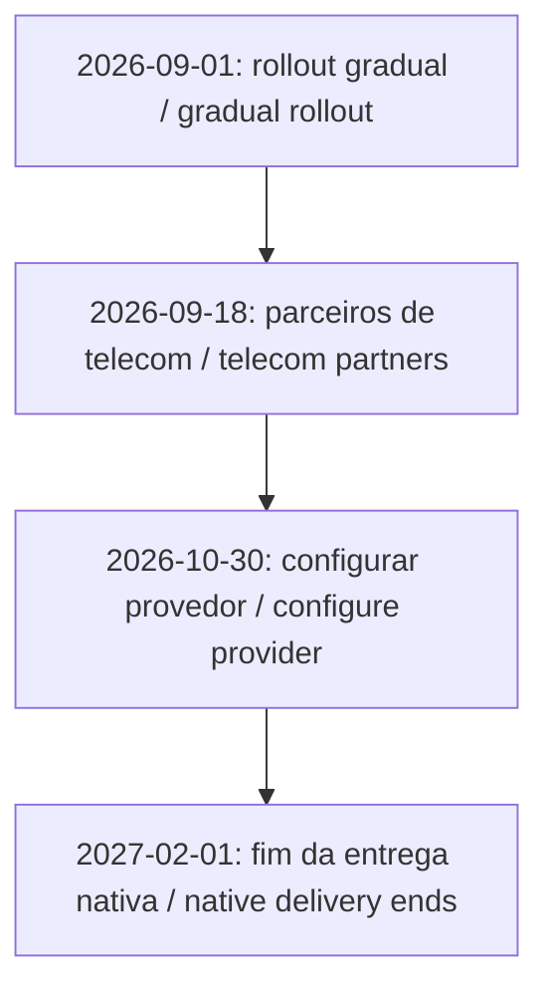
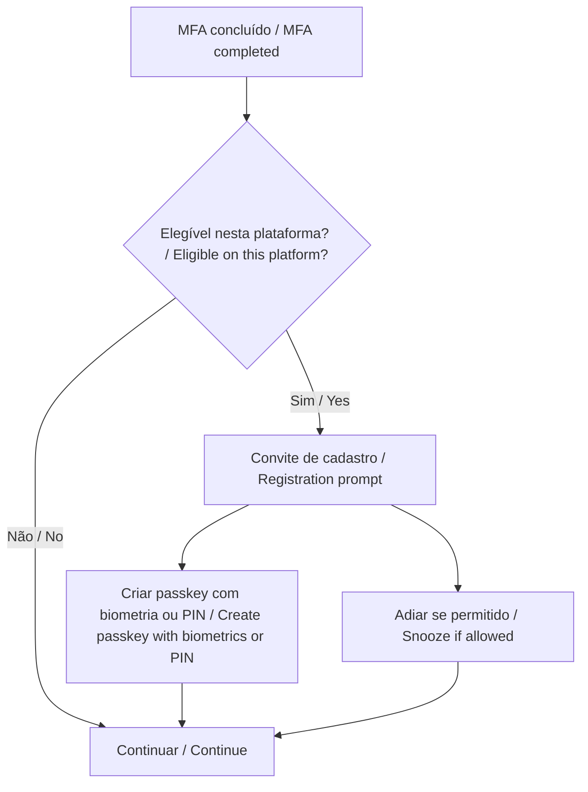

## 0. Introdução: o anúncio e a decisão desta semana

Uma pessoa conclui a autenticação multifator e, logo depois, encontra um convite para cadastrar uma passkey. Minutos depois, chega ao suporte a pergunta que ninguém quer responder de improviso: “isso é da empresa?”. Só esse cenário já justifica preparar a comunicação antes de o convite aparecer.

Em [13 de julho de 2026, a Microsoft anunciou a transição](https://www.microsoft.com/en-us/security/blog/2026/07/13/microsoft-entra-id-security-updates-passkeys-are-the-default-authentication-method-in-entra-id/?wt.mc_id=studentamb_365381). O rollout começou em 1º de setembro, gradualmente por organização. Conforme chega ao tenant, usuários habilitados para SMS ou voz entram no escopo de passkeys e podem receber o convite após concluir a autenticação multifator, ou **MFA**. O usuário ainda precisa cadastrar a própria credencial.

Este guia continua o trabalho apresentado em [Governança de Identidades no Microsoft 365](/posts/governanca-identidades-m365-entra-id/), onde usei o Temporary Access Pass no onboarding. Aqui, a conversa avança para a troca do método de autenticação: primeiro entender o cenário, depois montar um piloto controlado.

Se você só tem cinco minutos, comece pelo comunicado do tenant. Depois descubra quem está habilitado para telefone, quem realmente depende dele, qual grupo participará do piloto e como será feita a recuperação. Ao final, você deve ter uma lista de ações, responsáveis e evidências. O checklist completo está na seção 5.

### Pré-requisitos e ambiente de validação

Este conteúdo foi pensado para administradores iniciantes e intermediários que já conhecem o básico de MFA e Acesso Condicional. Para acompanhar o laboratório, use PowerShell 7, Microsoft Graph PowerShell SDK e um tenant de testes. Cadastro de passkeys e relatórios têm requisitos diferentes: **Usage and insights exige Entra ID P1 ou P2**. Antes de começar, confira o [planejamento de licenças e funções](https://learn.microsoft.com/en-us/entra/identity/authentication/how-to-plan-prerequisites-phishing-resistant-passwordless-authentication?wt.mc_id=studentamb_365381).

Validei a sintaxe dos scripts e rodei testes offline com respostas simuladas do Graph. Eles não foram executados contra um tenant real. Por isso, cadastro, compatibilidade e recuperação ainda precisam passar pelo seu laboratório.

## 1. O que muda e quando: a linha do tempo completa

As fontes foram verificadas em **10/09/2026**. Os marcos de 18/09, 30/10 e fevereiro continuam futuros. Esta tabela bilíngue é compartilhada com a versão em inglês para manter o cronograma sincronizado.

| Data / Date | Marco / Milestone                                                                                                                                                                                                                                                                                                   |
| ----------- | ------------------------------------------------------------------------------------------------------------------------------------------------------------------------------------------------------------------------------------------------------------------------------------------------------------------- |
| 2026-09-01  | Início gradual: usuários habilitados para SMS/voz entram em passkeys; campanha Microsoft managed, com adiamentos ilimitados por padrão. / Gradual start: SMS/voice-enabled users enter passkey scope; Microsoft-managed campaign, unlimited snoozes by default.                                                     |
| 2026-09-18  | Divulgação prevista de parceiros de telecom para SMS/voz, orientações e termos comerciais no Microsoft Security Store. / Planned publication of SMS/voice telecom partners, guidance and commercial terms in Microsoft Security Store.                                                                              |
| 2026-10-30  | Seleção e configuração previstas de provedor de telecom gerenciado pelo cliente. / Planned availability of customer-managed telecom provider selection and configuration.                                                                                                                                           |
| 2027-02-01  | Fim da entrega nativa Microsoft; sem provedor configurado, quem depende exclusivamente de SMS/voz enfrenta cadastro obrigatório de passkey para prosseguir. / Microsoft-native delivery ends; without a configured provider, users relying exclusively on SMS/voice face required passkey registration to continue. |

O [anúncio](https://www.microsoft.com/en-us/security/blog/2026/07/13/microsoft-entra-id-security-updates-passkeys-are-the-default-authentication-method-in-entra-id/?wt.mc_id=studentamb_365381) apresenta a mudança, enquanto a [documentação de aposentadoria](https://learn.microsoft.com/en-us/entra/identity/authentication/concept-sms-voice-retirement?wt.mc_id=studentamb_365381) explica como cada marco afeta a operação. Em fevereiro, a população afetada verá um bloqueio sem opção de recusa. Quem já usa outro método resistente a phishing poderá continuar com ele. A [FAQ](https://learn.microsoft.com/en-us/entra/identity/authentication/concept-sms-voice-retirement-faq?wt.mc_id=studentamb_365381) também explica como SMS e voz continuam funcionando quando a empresa contrata o próprio provedor.



Esse cronograma vale para a nuvem pública. Nuvens governamentais e soberanas receberão comunicação própria. Azure AD B2C ficou fora do anúncio, e Microsoft Entra External ID terá um anúncio separado. Já os convidados B2B de um tenant corporativo merecem uma revisão própria, sem presumir que estejam fora do alcance.

Verifique **Microsoft 365 admin center > Health > Message center**, junto da política e da campanha no Entra. A confirmação deve vir do estado observado no seu tenant.

A documentação também oferece um adiamento temporário da habilitação automática por `optOutSettings.passkeyDynamicMigration = true`, via Graph beta. Esse recurso não muda o prazo de fevereiro. Use-o somente como parte de um plano de transição; os scripts deste laboratório não fazem essa configuração. Como 1º de setembro já passou, o primeiro passo agora é conferir o estado real do tenant.

## 2. Passkeys para quem nunca configurou uma

Uma passkey trabalha com um par de chaves. O serviço guarda a chave pública, enquanto o autenticador protege a privada. No login, você desbloqueia esse autenticador com biometria ou **PIN**, número de identificação pessoal. Ele assina um desafio, o serviço confere a assinatura e a chave privada permanece no autenticador.

**FIDO2**, da família Fast Identity Online, combina padrões para essa autenticação. **WebAuthn**, Web Authentication, é a interface usada pelo navegador; **CTAP**, Client to Authenticator Protocol, faz a comunicação com autenticadores. O vínculo com o serviço legítimo dificulta que um site falso reutilize a credencial. Leia os [fundamentos de passkeys no Entra](https://learn.microsoft.com/en-us/entra/identity/authentication/concept-authentication-passkeys-fido2?wt.mc_id=studentamb_365381).

SMS, Short Message Service, e chamadas dependem de canais e códigos que podem ser interceptados ou entregues a um impostor. Em muitos cenários, ainda são melhores do que usar apenas uma senha, mas não oferecem a resistência a phishing das passkeys. No anúncio, a Microsoft cita o **Digital Defense Report 2025** e relata campanhas com IA que chegaram a 54% de cliques, contra aproximadamente 12% em campanhas tradicionais. Esses números dão contexto ao anúncio; não medem o risco do seu tenant nem comparam métodos MFA em um experimento controlado.


Imagem: Microsoft, [documentação de provisionamento](https://learn.microsoft.com/en-us/entra/identity/authentication/how-to-authentication-passkeys-fido2?wt.mc_id=studentamb_365381), sem alterações, [licença MIT](/images/posts/passkeys-microsoft-entra-id-setembro-2026/LICENSE-Microsoft.txt).

### Escolha por população

Passkeys **sincronizadas** ficam em gerenciadores como iCloud Keychain ou Google Password Manager e acompanham os dispositivos autorizados pelo provedor. As **vinculadas a dispositivo** permanecem no autenticador escolhido, como Microsoft Authenticator, Microsoft Entra passkey no Windows ou uma chave física FIDO2. A sincronização facilita a continuidade; a vinculação dá mais controle sobre onde a credencial reside.

| População                                          | Minha orientação inicial para o piloto                                                                                                                   |
| -------------------------------------------------- | -------------------------------------------------------------------------------------------------------------------------------------------------------- |
| Dispositivo corporativo gerenciado                 | Avaliar passkey vinculada a dispositivo e os controles exigidos; preservar Windows Hello for Business quando já atende ao cenário.                       |
| BYOD, Bring Your Own Device, dispositivo pessoal   | Avaliar sincronização, propriedade da conta do gerenciador, recuperação e desligamento antes de permitir o tipo.                                         |
| Varejo, fábrica ou recepção sem smartphone pessoal | Testar chave FIDO2 física individual, conectores compatíveis, custódia e reposição. O telefone pessoal não deve virar pré-requisito informal do emprego. |

É nos perfis de passkey que essas escolhas ganham forma. A **atestação** verifica a procedência do autenticador durante o cadastro, mas não está disponível para passkeys sincronizadas. Ao exigi-la, você muda os tipos que poderão ser usados. No Authenticator, confirme também o tipo cadastrado, pois a mesma aplicação oferece notificações e códigos.

## 3. Preparação: descobrindo a dependência de SMS e voz

### Política e pessoas respondem perguntas diferentes

A **Authentication Methods Policy**, ou AMP, mostra quais métodos estão permitidos. Em **Entra ID > Authentication methods > Policies**, abra SMS e Voice call e confira o estado, os grupos incluídos, as exclusões e eventuais alvos individuais. Para chegar à quantidade real de pessoas habilitadas, ainda é preciso resolver a associação dos grupos e aplicar as exclusões.

O scanner oficial [entra-sms-voice-usage-analyzer](https://github.com/microsoft/entra-sms-voice-usage-analyzer) ajuda nessa primeira leitura. Ele documenta as funções Global Reader, Authentication Policy Administrator e Security Reader, mas não expande grupos, inventaria credenciais nem consulta logins. O script `05` do laboratório é original e segue o mesmo limite: ele enxerga a política, não o uso real.

Para olhar pessoa por pessoa, use **Authentication methods > Activity > Registration**, em Usage and insights, ou consulte o [relatório `userRegistrationDetails`](https://learn.microsoft.com/en-us/graph/api/authenticationmethodsroot-list-userregistrationdetails?view=graph-rest-1.0&wt.mc_id=studentamb_365381). O laboratório separa quem tem apenas telefone, quem combina telefone com email de recuperação e quem já cadastrou outros métodos. Lembre que email de recuperação não resolve MFA de entrada.

<div class="overflow-x-auto" role="region" aria-label="Permissões e funções do Microsoft Graph" tabindex="0">

| Etapa                      | Permissão delegada do Graph             | Função de referência                                 |
| -------------------------- | --------------------------------------- | ---------------------------------------------------- |
| Ler políticas nos exemplos | `Policy.Read.AuthenticationMethod`      | Global Reader ou Authentication Policy Administrator |
| Ler relatório              | `AuditLog.Read.All`                     | Reports Reader, Security Reader ou Global Reader     |
| Ler membros do piloto      | `Group.Read.All`                        | Conta autorizada a ler o grupo                       |
| Alterar política/campanha  | `Policy.ReadWrite.AuthenticationMethod` | Authentication Policy Administrator                  |

</div>

Aqui há uma distinção fácil de esquecer: consentimento do Graph e função administrativa são verificações separadas. Ter Authentication Policy Administrator, por exemplo, não libera sozinho a leitura dos relatórios.

Os scripts estão no repositório [Lab-Passkeys-Entra-ID](https://github.com/tkusal/Lab-Passkeys-Entra-ID). Leia os pré-requisitos no README, clone o projeto e entre na pasta dos arquivos numerados:

```powershell
git clone https://github.com/tkusal/Lab-Passkeys-Entra-ID.git
Set-Location .\Lab-Passkeys-Entra-ID
.\00-connect-graph.ps1 -TenantId '<TENANT_ID>'
.\05-check-sms-voice-policy-scope.ps1 -TenantId '<TENANT_ID>'
# Reconnect with the inventory report read scope (AuditLog.Read.All).
.\00-connect-graph.ps1 -TenantId '<TENANT_ID>' -ReadProfile Inventory
$inventory = .\10-get-phone-only-users.ps1 -TenantId '<TENANT_ID>'
$inventory | Where-Object Classification -in 'PhoneOnlyInReport', 'PhoneWithRecoveryOnly'
```

O script percorre todas as páginas, mas o resultado ainda pede contexto. O [relatório de atividade](https://learn.microsoft.com/en-us/entra/identity/authentication/howto-authentication-methods-activity?wt.mc_id=studentamb_365381) costuma atualizar em até 36 horas, embora algumas exceções ultrapassem essa janela, e a API não inclui usuários desabilitados. `methodsRegistered` lista o que foi cadastrado; os logs mostram o que foi usado. Já `isPasswordlessCapable` pode incluir métodos sem resistência a phishing. Por isso, cruze a lista com a política e os dispositivos e investigue tanto resultados vazios quanto dados ausentes.

### Legado e grupo piloto

MFA por usuário e políticas legadas podem deixar pessoas elegíveis fora da AMP. Confira `policyMigrationState`: apenas `migrationComplete` indica que as políticas legadas de métodos MFA/SSPR foram deixadas de lado. **SSPR** é a redefinição de senha por autoatendimento. Ainda assim, essa migração não substitui a revisão do estado de exigência de MFA por usuário. O [guia de migração](https://learn.microsoft.com/en-us/entra/identity/authentication/how-to-authentication-methods-manage?wt.mc_id=studentamb_365381) ajuda a separar esses dois trabalhos.

Crie um grupo de segurança dedicado, `Passkeys-Pilot`, com associação atribuída e usuários diretos. Convide pessoas do suporte, misture dispositivos e represente as três populações discutidas antes. Deixe as contas de emergência fora do grupo e revise as exclusões aplicáveis. Também defina responsável, janela, critérios de aceite e retorno. Um piloto feito apenas com a equipe que já usa passkeys tende a parecer melhor do que realmente é.

## 4. Cadastro e recuperação: o piloto na prática

### Habilitar pelo portal e conferir pelo Graph

Em **Authentication methods > Policies > Passkey (FIDO2)**, pare um instante para registrar o estado atual antes de salvar. Na configuração de perfis, escolha ou crie `Passkeys-Pilot-Profile` com os tipos aprovados. Quando a adesão a passkey profiles ainda for necessária, lembre que ela não pode ser desfeita. Trate essa etapa como uma decisão própria e registre-a seguindo o [guia de habilitação](https://learn.microsoft.com/en-us/entra/identity/authentication/how-to-authentication-passkeys-fido2?wt.mc_id=studentamb_365381).

Em **Configure**, permita self-service setup. Em **Enable and target**, habilite o método, selecione o grupo piloto e associe o perfil. Não substitua um escopo existente de produção pelo piloto. Se a organização já tem perfis e usuários habilitados, incorpore o teste ao desenho existente mediante revisão.


Imagem: Microsoft, mesmo [guia de habilitação](https://learn.microsoft.com/en-us/entra/identity/authentication/how-to-authentication-passkeys-fido2?wt.mc_id=studentamb_365381), sem alterações, [MIT](/images/posts/passkeys-microsoft-entra-id-setembro-2026/LICENSE-Microsoft.txt). A captura é ilustrativa; nomes e limites da interface podem mudar.

Na alternativa PowerShell, crie ou selecione o perfil primeiro pelo portal. O script `20` usa a [API v1.0 de FIDO2](https://learn.microsoft.com/en-us/graph/api/fido2authenticationmethodconfiguration-update?view=graph-rest-1.0&wt.mc_id=studentamb_365381), exige seu identificador e preserva as configurações do perfil:

```powershell
.\00-connect-graph.ps1 -TenantId '<TENANT_ID>' -WriteProfile AuthenticationPolicy
$pilot = @{
    TenantId = '<TENANT_ID>'
    PilotGroupId = '<PILOT_GROUP_ID>'
    PasskeyProfileId = '<PASSKEY_PROFILE_ID>'
}
.\20-enable-passkey-policy-pilot.ps1 @pilot
.\20-enable-passkey-policy-pilot.ps1 @pilot -Apply -WhatIf
.\20-enable-passkey-policy-pilot.ps1 @pilot -Apply
```

Sem `-Apply`, o script consulta o estado atual e mostra o corpo proposto. `-WhatIf` mantém a escrita bloqueada. A última linha pede confirmação, salva o estado anterior em `exports/` e só então aplica a mudança. Se encontrar escopo além do piloto, exclusões existentes ou perfil ausente, o script para e pede revisão manual. A ideia é evitar que um exemplo reorganize silenciosamente uma política real.

### Campanha deliberada

Abra **Authentication methods > Registration campaign > Edit**. Selecione **Enabled**, escolha **Passkey** e limite o alvo ao piloto. Em Microsoft managed, a Microsoft controla o método e os adiamentos. Com Enabled, essas escolhas ficam com você. O intervalo de adiamento vale para todo o tenant.

Comece, por exemplo, com três dias entre convites e adiamentos ilimitados. Depois de validar suporte e recuperação, habilite **Limited number of snoozes** se quiser exigir cadastro após três adiamentos. O contador persiste entre reinícios da campanha. Confira as regras na [documentação da campanha](https://learn.microsoft.com/en-us/entra/identity/authentication/how-to-mfa-registration-campaign?wt.mc_id=studentamb_365381).

```powershell
$campaign = @{
    TenantId = '<TENANT_ID>'
    PilotGroupId = '<PILOT_GROUP_ID>'
    SnoozeDays = 3
}
.\30-configure-registration-campaign-pilot.ps1 @campaign
.\30-configure-registration-campaign-pilot.ps1 @campaign -Apply -WhatIf
.\30-configure-registration-campaign-pilot.ps1 @campaign -Apply
# Optional, after recovery and support validation:
.\30-configure-registration-campaign-pilot.ps1 @campaign -EnforceAfterSnoozes -Apply -WhatIf
```

Nem todo login exibirá o convite. A experiência depende da elegibilidade da pessoa, do perfil, do dispositivo e do navegador. Uma sessão já autenticada por **SSO**, Single Sign-On, pode passar sem o convite, e usuários de Linux não recebem esse nudge. O fluxo conceitual fica assim:



### Recuperação, validação e reversão

O **Temporary Access Pass**, ou TAP, ajuda tanto no primeiro cadastro quanto na recuperação após a perda do autenticador. Antes de emitir um, confirme a identidade, escolha uma validade curta e use um canal controlado. Authentication Administrator pode emitir TAP para membros; contas administrativas exigem Privileged Authentication Administrator. Os scripts não executam nenhuma dessas ações. O [guia de TAP](https://learn.microsoft.com/en-us/entra/identity/authentication/howto-authentication-temporary-access-pass?wt.mc_id=studentamb_365381) detalha o processo.

Cadastre o método substituto, teste o acesso e remova o autenticador perdido conforme o procedimento de incidente. O recurso [Account Recovery](https://learn.microsoft.com/en-us/entra/identity/authentication/concept-account-recovery-overview?wt.mc_id=studentamb_365381), com verificação de identidade por provedores, é uma solução separada; não aparece automaticamente ao habilitar passkeys.

```powershell
.\00-connect-graph.ps1 -TenantId '<TENANT_ID>' -ReadProfile Pilot
.\40-validate-pilot-registration.ps1 -TenantId '<TENANT_ID>' -PilotGroupId '<PILOT_GROUP_ID>'
Disconnect-MgGraph
```

Considere o piloto aceito somente depois de combinar quatro evidências: cadastro concluído, login real no dispositivo previsto, método confirmado nos logs e recuperação ensaiada. O script `40` também destaca membros sem dados no relatório para que o suporte investigue cada caso.

Antes de remover SMS, valide também o SSPR: quem depende desse método para redefinir a senha precisa cadastrar e testar alternativas permitidas, em quantidade suficiente para a política de recuperação. Confira as [regras do SSPR](https://learn.microsoft.com/en-us/entra/identity/authentication/concept-sspr-howitworks?wt.mc_id=studentamb_365381). O cadastro de uma passkey, por si só, não atende a essa verificação.

Se precisar voltar atrás, suspenda a campanha do piloto e compare os snapshots de `exports/` com o estado atual. Revise mudanças concorrentes e restaure somente os campos que o piloto alterou. Desabilitar passkeys pode bloquear quem passou a depender delas, então teste o retorno antes de apagar credenciais ou retirar alternativas. Os snapshots servem para comparação, não como corpos prontos para PATCH. O `.gitignore` do laboratório exclui CSVs, snapshots e credenciais; mantenha também acesso local e retenção sob controle.

Em 10/09/2026, as **campanhas de adoção** do Conditional Access Optimization Agent estão em preview, voltadas a administradores privilegiados. Exigem Entra ID P1, Security Administrator e **SCUs**, unidades de computação de segurança. São uma opção futura de escala, não substituem este piloto. Confira [pré-requisitos](https://learn.microsoft.com/en-us/entra/security-copilot/conditional-access-agent-optimization-passkeys?wt.mc_id=studentamb_365381) e [status de disponibilidade](https://learn.microsoft.com/en-us/entra/fundamentals/whats-new?wt.mc_id=studentamb_365381).

## 5. Checklist do administrador: o que verificar esta semana

- [ ] Ler o Message Center e registrar o estado observado do rollout.
- [ ] Revisar SMS/voz, inclusões, exclusões, legado e `policyMigrationState`.
- [ ] Cruzar o relatório de cadastro com a política; investigar dependência exclusiva de telefone.
- [ ] Separar corporativo, BYOD e pessoas sem smartphone; aprovar dispositivos e reposição.
- [ ] Confirmar grupo, perfil, campanha e contas de emergência fora do piloto.
- [ ] Definir o intervalo de adiamento e eventual obrigatoriedade conscientemente.
- [ ] Testar login, perda do dispositivo, TAP, alternativas de SSPR e retorno antes de ampliar.
- [ ] Atribuir responsáveis por comunicação, suporte e revisão dos próximos marcos.

Na comunicação, explique o motivo, o dispositivo necessário, quando o convite pode aparecer e onde obter ajuda. Envie o endereço conhecido de [Security info](https://mysignins.microsoft.com/security-info?wt.mc_id=studentamb_365381), com instruções adequadas a cada população. Adapte os [modelos oficiais](https://www.microsoft.com/en-us/download/details.aspx?id=57600&wt.mc_id=studentamb_365381) indicados pela documentação; confirme seu conteúdo antes do envio. Não peça códigos, PINs ou TAP por resposta ao comunicado. Faça lembretes com base no cadastro pendente, respeitando o atraso do relatório.

## 6. Encerramento, referências e independência

O momento de expandir chega quando pessoas representativas conseguem cadastrar a passkey, entrar e recuperar o acesso, e o suporte sabe ler as evidências de cada etapa. Esse trabalho se conecta ao ciclo de vida tratado no [artigo de governança](/posts/governanca-identidades-m365-entra-id/). Se você quiser aprofundar a exigência de métodos por Acesso Condicional, continue em [Do reconhecimento ao hardening no Microsoft Entra ID](/posts/do-reconhecimento-ao-hardening-no-microsoft-entra-id/).

### Referências primárias

- [Anúncio de 13/07/2026](https://www.microsoft.com/en-us/security/blog/2026/07/13/microsoft-entra-id-security-updates-passkeys-are-the-default-authentication-method-in-entra-id/?wt.mc_id=studentamb_365381).
- [Aposentadoria de SMS/voz](https://learn.microsoft.com/en-us/entra/identity/authentication/concept-sms-voice-retirement?wt.mc_id=studentamb_365381) e [FAQ](https://learn.microsoft.com/en-us/entra/identity/authentication/concept-sms-voice-retirement-faq?wt.mc_id=studentamb_365381).
- [Fundamentos](https://learn.microsoft.com/en-us/entra/identity/authentication/concept-authentication-passkeys-fido2?wt.mc_id=studentamb_365381), [planejamento](https://learn.microsoft.com/en-us/entra/identity/authentication/how-to-plan-prerequisites-phishing-resistant-passwordless-authentication?wt.mc_id=studentamb_365381) e [habilitação](https://learn.microsoft.com/en-us/entra/identity/authentication/how-to-authentication-passkeys-fido2?wt.mc_id=studentamb_365381).
- [Campanha de registro](https://learn.microsoft.com/en-us/entra/identity/authentication/how-to-mfa-registration-campaign?wt.mc_id=studentamb_365381) e [scanner oficial](https://github.com/microsoft/entra-sms-voice-usage-analyzer).
- [Relatório Graph](https://learn.microsoft.com/en-us/graph/api/resources/userregistrationdetails?view=graph-rest-1.0&wt.mc_id=studentamb_365381), [TAP](https://learn.microsoft.com/en-us/entra/identity/authentication/howto-authentication-temporary-access-pass?wt.mc_id=studentamb_365381) e [Account Recovery](https://learn.microsoft.com/en-us/entra/identity/authentication/concept-account-recovery-overview?wt.mc_id=studentamb_365381).
- [Governança de Identidades no Microsoft 365](/posts/governanca-identidades-m365-entra-id/).

### Nota de independência e marcas

Este é um conteúdo editorial independente e não é afiliado, autorizado, patrocinado ou aprovado pela Microsoft Corporation. Microsoft, Microsoft Entra, Microsoft Entra ID, Microsoft 365, Azure, Windows e PowerShell são marcas do grupo de empresas Microsoft. FIDO e FIDO2 são marcas da FIDO Alliance. Todas as demais marcas pertencem aos respectivos titulares.
