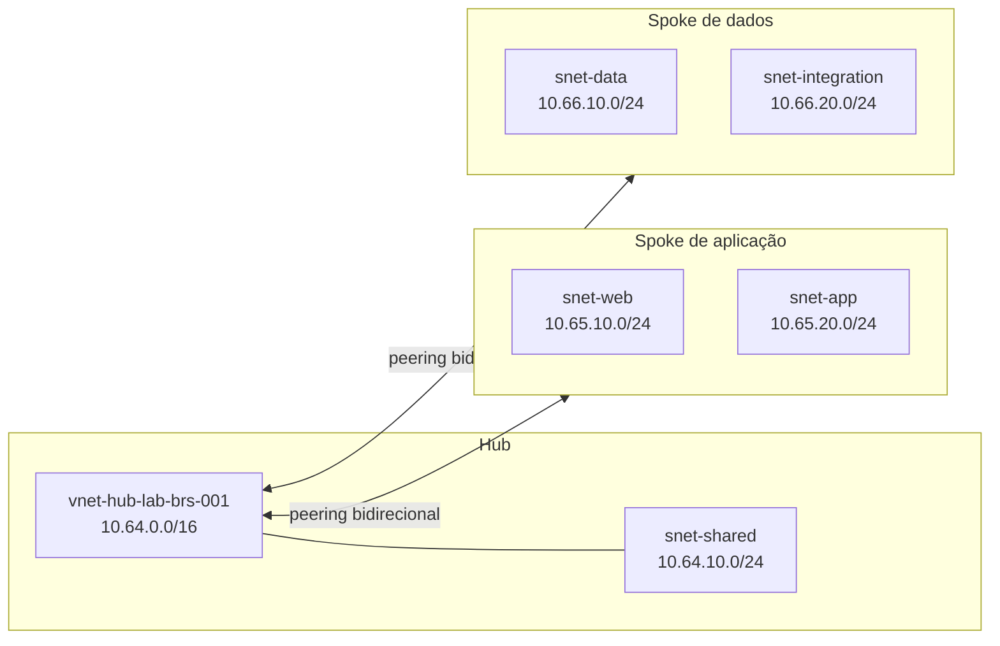

## Introdução

Uma aplicação começou pequena, ganhou uma VNet, depois outra equipe criou a segunda e, quando alguém percebeu, cada ambiente tinha sua própria cópia de tudo. Conectividade, DNS, segurança e acesso híbrido passaram a ser resolvidos de formas diferentes. A rede ainda funcionava, mas qualquer mudança exigia uma expedição arqueológica pelo portal.

O padrão **hub and spoke** organiza esse crescimento. Uma rede virtual central, o hub, concentra a conectividade compartilhada. Redes virtuais periféricas, os spokes, isolam aplicações, domínios ou ambientes. A separação reduz o acoplamento e cria um ponto previsível para serviços comuns, sem transformar todas as cargas em vizinhas de porta.

Nesta parte, construiremos somente a fundação: uma VNet hub, duas VNets spoke, subnets, peerings bidirecionais, um plano de endereçamento e a estrutura inicial do Terraform. O hub ficará propositalmente vazio. Firewall, NVA, VPN Gateway, ExpressRoute, Bastion, Network Security Groups (NSGs) e políticas de rota não entram agora. As subnets ficarão sem filtros associados até a próxima parte. Tentar instalar todos os móveis antes de levantar as paredes costuma produzir uma arquitetura interessante, mas não no bom sentido.

O [repositório do laboratório](https://github.com/tkusal/Laborat-rio-Azure-com-Terraform-Projetando-uma-rede-hub-and-spoke) contém exatamente o código apresentado e os arquivos auxiliares para reproduzir o cenário em um fork.

## Resultado esperado

Ao final, o Terraform descreverá 15 recursos:

- três grupos de recursos;
- três VNets, uma hub e duas spokes;
- cinco subnets;
- quatro links direcionais de VNet peering.

Os dois spokes terão peering com o hub, mas não terão peering direto entre si. Também não haverá trânsito spoke a spoke pelo hub, porque VNet peering não é transitivo e o hub ainda não terá um componente de encaminhamento. Nesta etapa, o objetivo é validar a base de conectividade, não prometer um caminho que ainda não existe.

## Pré-requisitos e ambiente testado

Este conteúdo pressupõe que você já entende o papel de uma VNet e já executou `terraform apply` em outro laboratório. Para acompanhar, você precisa de:

- uma assinatura do Azure destinada a estudos;
- permissão para criar grupos de recursos, VNets, subnets e peerings;
- [Azure CLI](https://learn.microsoft.com/pt-br/cli/azure/install-azure-cli) instalada e autenticada;
- [Terraform](https://developer.hashicorp.com/terraform/install) `1.15.8`;
- provider AzureRM `4.79.0`;
- Git para trabalhar com seu fork.

O código foi formatado e validado localmente com essas versões. Nenhum `terraform apply` foi executado durante a preparação do artigo e nenhum recurso real foi criado.

Os comandos de terminal deste artigo usam PowerShell, mas o código Terraform funciona em Windows, Linux e macOS, nas arquiteturas para as quais a HashiCorp publica o binário. Em Bash, substitua `Set-Location` por `cd` e `Copy-Item` por `cp`.

> [!IMPORTANT]
> Confirme a assinatura e o tenant antes de gerar o plano. Nomes de laboratório não impedem que recursos sejam criados na assinatura errada. O Azure não reconhece a intenção carinhosa por trás do sufixo `lab`.

## Arquitetura

### Como o padrão funciona

O hub é a VNet central. Em uma arquitetura completa, ele pode hospedar serviços compartilhados de conectividade e operação. Os spokes hospedam as cargas e preservam limites próprios de endereçamento e administração.

O peering conecta duas VNets pela rede de backbone do Azure. Para cada relacionamento, o Terraform cria dois recursos, um em cada direção. Por isso, dois spokes resultam em quatro links: hub para aplicação, aplicação para hub, hub para dados e dados para hub.



O desenho mostra conectividade hub a spoke. Ele não mostra uma seta entre os spokes porque essa comunicação ainda não existe. Se o spoke de aplicação precisar alcançar o spoke de dados em uma parte futura, será necessário definir explicitamente o caminho e o controle de tráfego.

### Por que usar

Hub and spoke faz sentido quando várias cargas precisam compartilhar conectividade, quando equipes querem limites de rede claros ou quando a plataforma precisa crescer sem colocar tudo na mesma VNet. O padrão também favorece responsabilidades distintas: uma equipe de plataforma pode cuidar do hub enquanto equipes de produto administram os próprios spokes dentro de regras acordadas.

O principal ganho nesta parte é previsibilidade. Cada VNet recebe um bloco conhecido, cada subnet tem um propósito e cada peering possui um nome que informa origem e destino. Isso parece burocracia até o primeiro incidente com vinte redes chamadas `vnet-prod-final-2`.

### Quando não vale a pena

Uma única carga pequena, sem serviços compartilhados e sem perspectiva real de expansão, pode funcionar melhor em uma VNet bem segmentada. Hub and spoke adiciona peerings, decisões de IPAM e operação distribuída. Criar um hub vazio só para marcar uma caixa de arquitetura não gera valor.

Também vale avaliar outras topologias quando o requisito principal é isolamento total entre unidades independentes ou conectividade gerenciada em escala muito maior. O padrão é uma ferramenta, não uma cerimônia obrigatória.

### Recursos e nomenclatura

O laboratório usa abreviações recomendadas pelo Cloud Adoption Framework:

| Tipo | Prefixo | Exemplo |
| --- | --- | --- |
| Resource group | `rg` | `rg-network-hub-lab-brs-001` |
| Virtual network | `vnet` | `vnet-hub-lab-brs-001` |
| Subnet | `snet` | `snet-web-lab-brs-001` |
| VNet peering | `peer` | `peer-hub-to-app-lab-brs-001` |

O restante do nome combina função, ambiente, código regional e instância. `brs` representa Brazil South e `001` permite uma segunda instância sem inventar um sufixo durante um incidente.

Cada VNet fica em seu próprio resource group. Para um laboratório, um único grupo seria suficiente, mas a separação demonstra o limite administrativo que costuma existir entre conectividade central e workloads. Ela também deixa visível que peering pode conectar VNets em grupos de recursos distintos.

Os três nomes são `rg-network-hub-lab-brs-001`, `rg-network-app-lab-brs-001` e `rg-network-data-lab-brs-001`.

Região real e código curto ficam lado a lado no arquivo de variáveis. O Azure não verifica se `brs` corresponde a `brazilsouth`, portanto essa coerência faz parte da revisão:

```hcl title="Trecho de environments/lab/terraform.tfvars.example"
location      = "brazilsouth"
location_code = "brs"
```

## Plano de IPs (IPAM)

**IP Address Management (IPAM)** é a disciplina de planejar, registrar e controlar os endereços usados pela organização. Aqui reservamos o superbloco `10.64.0.0/12` como referência de planejamento. Ele não é criado como recurso no Azure.

| Uso | CIDR | Capacidade e decisão |
| --- | --- | --- |
| Superbloco planejado | `10.64.0.0/12` | Contém 16 blocos `/16` |
| VNet hub | `10.64.0.0/16` | Espaço amplo para a evolução do hub |
| Subnet compartilhada do hub | `10.64.10.0/24` | 256 endereços, 251 utilizáveis no Azure |
| Spoke de aplicação | `10.65.0.0/16` | Isola o domínio da aplicação |
| Subnet web | `10.65.10.0/24` | Camada de entrada da aplicação |
| Subnet app | `10.65.20.0/24` | Camada de processamento |
| Spoke de dados | `10.66.0.0/16` | Isola dados e integrações |
| Subnet data | `10.66.10.0/24` | Serviços da camada de dados |
| Subnet integration | `10.66.20.0/24` | Integrações privadas futuras |
| Reserva para novos spokes | `10.67.0.0/16` a `10.79.0.0/16` | Treze blocos `/16` livres |

Os blocos `/16` são maiores do que este laboratório precisa. A escolha é intencional: a VNet ganha espaço para várias subnets sem precisar ser renumerada a cada nova camada. As subnets `/24` oferecem um tamanho fácil de operar em estudos e deixam intervalos entre usos.

O Azure reserva os cinco endereços das extremidades de cada subnet IPv4. Em `10.64.10.0/24`, são `10.64.10.0` para a rede, `10.64.10.1` para o gateway padrão, `10.64.10.2` e `10.64.10.3` para mapear os endereços do DNS do Azure, além de `10.64.10.255` como endereço de broadcast da rede. Restam 251 endereços atribuíveis a recursos.

Esse plano não deve ser copiado cegamente para produção. Antes de adotar `10.64.0.0/12`, compare o intervalo com datacenters, filiais, outras nuvens, redes de parceiros e VNets existentes. Um bloco privado também pode estar ocupado em outro lugar da empresa.

As VNets conectadas por peering não podem ter espaços de endereço sobrepostos. Se o hub usar `10.64.0.0/16` e um spoke usar `10.64.20.0/24`, o bloco do spoke estará contido no hub e o peering não será válido. Prefixos diferentes no texto não significam redes diferentes na prática. CIDR é preciso, às vezes de um jeito pouco diplomático.

## Início do repositório

### Estrutura de pastas

O módulo reutilizável fica separado do módulo raiz do ambiente. Assim, o ambiente decide nomes, endereços e tags, enquanto o módulo implementa VNet e subnets.

```text
.
|-- .github/workflows/terraform-check.yml
|-- environments/
|   `-- lab/
|       |-- backend.tf
|       |-- main.tf
|       |-- outputs.tf
|       |-- providers.tf
|       |-- terraform.tfvars.example
|       |-- variables.tf
|       `-- versions.tf
|-- modules/
|   `-- virtual-network/
|       |-- main.tf
|       |-- outputs.tf
|       `-- variables.tf
|-- .gitignore
|-- LICENSE
`-- README.md
```

O workflow executa somente formatação, inicialização sem backend e validação. Não há deploy automático.

### Terraform e provider com versões fixadas

O arquivo `environments/lab/versions.tf` impede que uma atualização silenciosa altere o comportamento do laboratório:

```hcl title="environments/lab/versions.tf"
terraform {
  required_version = "= 1.15.8"

  required_providers {
    azurerm = {
      source  = "hashicorp/azurerm"
      version = "= 4.79.0"
    }
  }
}
```

Fixar a versão no código e manter `.terraform.lock.hcl` no Git torna a seleção reproduzível. Atualizações continuam possíveis, mas passam a ser uma decisão revisável. Em módulos raiz de produção, é comum usar `~> 1.15.0` para aceitar versões `1.15.x`. Isso não instala correções automaticamente, apenas permite que uma versão de patch compatível seja usada depois de instalada e testada.

Na data deste artigo, AzureRM `5.0.1` já estava disponível. Mantivemos `4.79.0` porque esta versão foi usada na validação completa do laboratório e a major 5 trouxe mudanças de comportamento. Em v4.x, `resource_provider_registrations` usava `legacy` por padrão; em v5.0 ou superior, o padrão passou a `none`. Uma migração para v5 deve seguir o guia oficial de atualização e uma nova rodada de testes.

O provider usa a assinatura informada por variável e escolhe explicitamente o conjunto `core` de resource providers. Isso evita depender do padrão `legacy` da major 4:

```hcl title="environments/lab/providers.tf"
provider "azurerm" {
  features {}

  subscription_id                 = var.subscription_id
  resource_provider_registrations = "core"
}
```

`subscription_id` não é segredo, mas define o destino da operação e merece validação. O arquivo `terraform.tfvars.example` contém apenas valores substituíveis. O `.gitignore` bloqueia `*.tfvars`, states e planos salvos, pois esses arquivos podem revelar dados sensíveis.

O AzureRM também aceita `ARM_SUBSCRIPTION_ID` quando `subscription_id` não é definido no bloco do provider. O laboratório mantém a variável explícita para deixar o destino visível durante o estudo. Em uma futura automação de CI, adapte o provider para usar a variável de ambiente e não grave esse valor em arquivos do pipeline.

### Backend local no laboratório

```hcl title="environments/lab/backend.tf"
terraform {
  backend "local" {
    path = "terraform.tfstate"
  }
}
```

O backend local reduz as dependências para quem está estudando. Ele também tem limitações importantes: o state fica preso à máquina e não oferece a colaboração segura esperada por uma equipe. Em produção, use um backend remoto com controle de acesso, criptografia, versionamento e locking. O state é parte do sistema, não um recibo descartável do último comando.

### Módulo de rede

O módulo recebe um mapa de subnets e cria cada uma com `for_each`:

```hcl title="modules/virtual-network/main.tf"
resource "azurerm_virtual_network" "this" {
  name                = var.name
  resource_group_name = var.resource_group_name
  location            = var.location
  address_space       = var.address_space
  tags                = var.tags
}

resource "azurerm_subnet" "this" {
  for_each = var.subnets

  name                 = each.value.name
  resource_group_name  = var.resource_group_name
  virtual_network_name = azurerm_virtual_network.this.name
  address_prefixes     = each.value.address_prefixes
}
```

Subnets não aceitam tags como VNets e resource groups. As tags comuns são aplicadas somente aos recursos que oferecem esse campo.

### Convenção de tags

O ambiente combina cinco tags obrigatórias com um mapa opcional:

```hcl title="Trecho de environments/lab/main.tf"
common_tags = merge(
  {
    environment = var.environment
    owner       = var.owner
    cost-center = var.cost_center
    managed-by  = "terraform"
    project     = "azure-hub-spoke-lab"
  },
  var.extra_tags
)
```

`environment` separa o ciclo de vida, `owner` aponta a responsabilidade, `cost-center` ajuda a alocação financeira, `managed-by` evita edição manual acidental e `project` agrupa o laboratório. `extra_tags` permite atender uma política local sem alterar o módulo.

> [!NOTE]
> Para as VNets e os resource groups desta fundação, o limite é de 50 pares de tags por item. O código usa cinco, mas políticas podem acrescentar outras. Famílias diferentes podem ter regras próprias.

### Peering nos dois sentidos

No módulo raiz, o mapa `local.networks` contém as chaves `hub`, `spoke_app` e `spoke_data`. O `for_each` cria uma instância do módulo para cada entrada:

```hcl title="Trecho de environments/lab/main.tf"
module "virtual_network" {
  source   = "../../modules/virtual-network"
  for_each = local.networks

  name                = each.value.vnet_name
  resource_group_name = azurerm_resource_group.network[each.key].name
  location            = azurerm_resource_group.network[each.key].location
  address_space       = each.value.address_space
  subnets             = each.value.subnets
  tags                = merge(local.common_tags, { network-role = each.value.role })
}
```

Por isso, `module.virtual_network["hub"]` aponta para a instância central e `module.virtual_network["spoke_app"]` aponta para o primeiro spoke. Com essa origem esclarecida, este é um dos quatro recursos de peering:

```hcl title="Trecho de environments/lab/main.tf"
resource "azurerm_virtual_network_peering" "hub_to_app" {
  name                      = "peer-hub-to-app-${var.environment}-${var.location_code}-001"
  resource_group_name       = module.virtual_network["hub"].resource_group_name
  virtual_network_name      = module.virtual_network["hub"].name
  remote_virtual_network_id = module.virtual_network["spoke_app"].id

  allow_virtual_network_access = true
  allow_forwarded_traffic      = false
  allow_gateway_transit        = false
  use_remote_gateways          = false
}
```

As opções de tráfego encaminhado e gateway permanecem desativadas porque os componentes correspondentes estão fora desta parte. Declarar `false` torna a intenção legível e evita que alguém interprete a base como uma topologia completa.

## Validar o resultado

Faça um fork, clone o repositório e crie seu arquivo local de variáveis:

```powershell
git clone https://github.com/<SEU-USUARIO>/Laborat-rio-Azure-com-Terraform-Projetando-uma-rede-hub-and-spoke.git
Set-Location Laborat-rio-Azure-com-Terraform-Projetando-uma-rede-hub-and-spoke
Copy-Item environments/lab/terraform.tfvars.example environments/lab/terraform.tfvars
```

Edite `terraform.tfvars`, informe `subscription_id` e `owner`, autentique a Azure CLI e confirme o contexto:

```powershell
az login
az account set --subscription "<SUBSCRIPTION_ID>"
az account show --query "{nome:name, subscriptionId:id, tenantId:tenantId}" --output table
```

Então formate, inicialize, valide e gere o plano:

```powershell
terraform fmt -check -recursive .
Set-Location environments/lab
terraform init
terraform validate
terraform plan -out=plan.tfplan
terraform show plan.tfplan
```

O plano esperado contém três resource groups, três VNets, cinco subnets e quatro peerings. Revise os 15 recursos, os CIDRs, a região, as tags e a assinatura. Este artigo não orienta executar `terraform apply`. Um plano válido prova que o Terraform entendeu a configuração, não que você entendeu custos, políticas e impactos.

## Riscos, segurança e reversão

VNet peering pode gerar cobrança por transferência de dados quando cargas reais começarem a trocar tráfego. Não use valores antigos de uma tabela ou captura de tela. Consulte a [Calculadora de Preços do Azure](https://azure.microsoft.com/pt-br/pricing/calculator/) para a região e o volume do seu cenário.

States e planos podem conter dados sensíveis. Mantenha `terraform.tfstate`, `*.tfvars` e `*.tfplan` fora do Git. Em produção, restrinja também o acesso ao backend remoto e registre quem pode alterar a rede.

Como nenhum recurso é criado pelos comandos deste artigo, a reversão local consiste em excluir o plano salvo e, se desejar, a pasta `.terraform`. Se você optar depois por aplicar o laboratório por conta própria, o README traz uma sequência separada para revisar e executar `terraform destroy`. Confirme a assinatura e todos os recursos antes de destruir qualquer coisa.

## O que vem na parte 2

A parte 2 evolui essa fundação com NSGs nas quatro subnets de workload, regras explícitas e associações gerenciadas pelo Terraform. A parte 3 tratará da inspeção central com Azure Firewall e das políticas de rota que direcionam o tráfego por ele. A conectividade híbrida por VPN ou ExpressRoute fica para um capítulo futuro, com seus próprios requisitos e validações.

## Referências

- [Topologia hub and spoke no Azure](https://learn.microsoft.com/pt-br/azure/networking/design-guide/hub-spoke)
- [Visão geral do VNet peering](https://learn.microsoft.com/pt-br/azure/virtual-network/virtual-network-peering-overview)
- [VNets e subnets no guia de design](https://learn.microsoft.com/pt-br/azure/networking/design-guide/vnets-subnets)
- [Endereços reservados em subnets do Azure](https://learn.microsoft.com/pt-br/azure/virtual-network/virtual-networks-faq)
- [Abreviações de recursos do Cloud Adoption Framework](https://learn.microsoft.com/pt-br/azure/cloud-adoption-framework/ready/azure-best-practices/resource-abbreviations)
- [Limites e recomendações para tags do Azure](https://learn.microsoft.com/pt-br/azure/azure-resource-manager/management/tag-resources)
- [Backend local do Terraform](https://developer.hashicorp.com/terraform/language/backend/local)
- [Restrições de versão do Terraform](https://developer.hashicorp.com/terraform/language/expressions/version-constraints)
- [Provider AzureRM 4.79.0](https://registry.terraform.io/providers/hashicorp/azurerm/4.79.0/docs)
- [Changelog do AzureRM 5.0.1](https://github.com/hashicorp/terraform-provider-azurerm/blob/main/CHANGELOG.md)

## Conclusão

Uma topologia hub and spoke começa antes do primeiro peering. Ela começa com limites claros, nomes previsíveis e endereços que não disputarão o mesmo espaço meses depois.

Nesta parte, definimos um hub, dois spokes, cinco subnets, quatro links direcionais e treze blocos `/16` reservados para expansão. Também separamos módulo e ambiente, fixamos versões, padronizamos tags e mantivemos o state local apenas para reduzir a barreira do laboratório.

O próximo passo não é aplicar por reflexo. Gere o plano, conte os recursos, confira a assinatura e explique o caminho de cada conexão. Se a arquitetura só funciona quando ninguém faz perguntas, ainda não terminou de ser desenhada.
