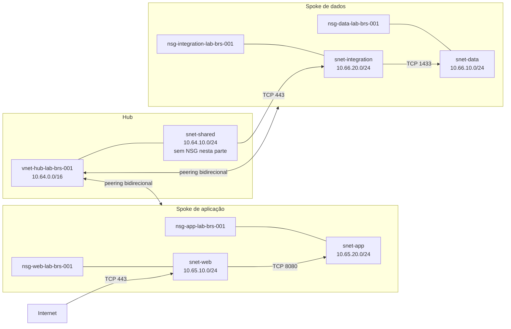

## Introdução

Na [parte 1 desta série](/posts/rede-hub-and-spoke-azure-terraform-parte-1/), criamos a base da topologia: três VNets, cinco subnets e quatro links direcionais de peering. O plano de endereçamento está organizado e cada spoke conversa com o hub, mas as subnets de workload ainda aceitam as regras padrão do Azure.

Esse é o ponto que corrigiremos agora. Vamos adicionar um Network Security Group (NSG) para cada subnet de workload, declarar somente os fluxos necessários e associar tudo pelo Terraform. A topologia continua sem máquinas virtuais, firewall, conectividade híbrida ou rotas personalizadas. Segurança de rede não melhora quando misturamos quatro mudanças grandes e depois tentamos descobrir qual delas bloqueou a porta 443.

O [repositório desta parte](https://github.com/tkusal/Lab-Azure-com-Terraform-NSGs-e-regras-de-seguran-a-Parte-2) parte do código publicado no primeiro laboratório. Terraform e AzureRM continuam fixados em `1.15.8` e `4.79.0`, respectivamente. O backend permanece local e as cinco tags comuns também não mudam.

## Arquitetura desta parte

Um NSG é uma lista de regras que permite ou nega tráfego de entrada e saída. Cada regra compara protocolo, endereços, portas e direção. O Azure processa as prioridades do menor número para o maior e encerra a avaliação na primeira correspondência.

Um NSG pode ser associado a uma subnet, a uma interface de rede, ou aos dois níveis. Na subnet, a política alcança todos os recursos conectados a ela. Na interface, a política atende exceções de uma carga específica. Quando os dois níveis são usados, o tráfego precisa passar pelas duas avaliações, o que aumenta a precisão e também a chance de alguém investigar a regra errada durante um incidente.

Neste laboratório, cada subnet representa uma camada com um contrato único. Por isso, a associação será feita na subnet. Todas as cargas futuras da camada web recebem a mesma política, assim como as cargas de aplicação, dados e integração. Não há uma exceção por interface que justifique outro NSG.



Serão criados oito recursos Terraform: quatro `azurerm_network_security_group` e quatro `azurerm_subnet_network_security_group_association`. As regras ficam como blocos internos dos NSGs, portanto não aparecem como endereços de recursos separados no plano.

Os nomes seguem a convenção da primeira parte, agora com o prefixo recomendado `nsg`: `nsg-web-lab-brs-001`, `nsg-app-lab-brs-001`, `nsg-data-lab-brs-001` e `nsg-integration-lab-brs-001`.

A `snet-shared` fica sem NSG nesta etapa. Ela continua vazia e ainda não possui um contrato de tráfego que permita escrever regras honestas. Associar um NSG cheio de suposições apenas trocaria uma lacuna visível por uma configuração que parece segura. Antes de colocar qualquer serviço nessa subnet, sua função e sua política precisam ser definidas.

Por isso, a saída de `snet-shared` ainda segue as regras padrão do Azure. No fluxo HTTPS mostrado no diagrama, o controle depende exclusivamente da regra de entrada de `nsg-integration-lab-brs-001`. Quando a subnet compartilhada receber um serviço e um NSG, o mesmo fluxo deverá ser permitido também na saída dela.

## Regras de segurança

Todo NSG do laboratório recebe uma regra final de negação de entrada e outra de saída com prioridade `4096`. Elas são necessárias porque o Azure inclui regras padrão que permitem tráfego dentro da marca `VirtualNetwork` e saída para a Internet. As regras personalizadas são avaliadas antes das padrões, que usam prioridades a partir de `65000`.

O Azure aceita prioridades de `100` a `4096` para regras personalizadas. Portanto, `4096` é literalmente o último slot disponível antes das regras padrão entrarem em cena. As liberações começam em `100`, deixando espaço entre elas e a negação final para requisitos futuros sem exigir uma renumeração coletiva. Em uma rede real, vale reservar faixas por finalidade e registrar essa convenção. Números aleatórios funcionam até o dia em que duas equipes escolhem `237` pelo mesmo motivo místico.

| NSG | Prioridade | Direção | Protocolo | Origem | Destino | Porta de destino | Ação |
| --- | ---: | --- | --- | --- | --- | --- | --- |
| `web` | 100 | Entrada | TCP | `Internet` | `10.65.10.0/24` | 443 | Permitir |
| `web` | 4096 | Entrada | Qualquer | Qualquer | Qualquer | Qualquer | Negar |
| `web` | 100 | Saída | TCP | `10.65.10.0/24` | `10.65.20.0/24` | 8080 | Permitir |
| `web` | 4096 | Saída | Qualquer | Qualquer | Qualquer | Qualquer | Negar |
| `app` | 100 | Entrada | TCP | `10.65.10.0/24` | `10.65.20.0/24` | 8080 | Permitir |
| `app` | 4096 | Entrada | Qualquer | Qualquer | Qualquer | Qualquer | Negar |
| `app` | 4096 | Saída | Qualquer | Qualquer | Qualquer | Qualquer | Negar |
| `data` | 100 | Entrada | TCP | `10.66.20.0/24` | `10.66.10.0/24` | 1433 | Permitir |
| `data` | 4096 | Entrada | Qualquer | Qualquer | Qualquer | Qualquer | Negar |
| `data` | 4096 | Saída | Qualquer | Qualquer | Qualquer | Qualquer | Negar |
| `integration` | 100 | Entrada | TCP | `10.64.10.0/24` | `10.66.20.0/24` | 443 | Permitir |
| `integration` | 4096 | Entrada | Qualquer | Qualquer | Qualquer | Qualquer | Negar |
| `integration` | 100 | Saída | TCP | `10.66.20.0/24` | `10.66.10.0/24` | 1433 | Permitir |
| `integration` | 4096 | Saída | Qualquer | Qualquer | Qualquer | Qualquer | Negar |

`source_port_range` é `*` em todas as regras deste laboratório. A porta de origem escolhida pelo cliente é efêmera, normalmente uma porta alta e dinâmica, portanto não deve ser confundida com a porta conhecida do serviço no destino. O campo usa `optional(string, "*")` em `variables.tf` e pode ser omitido de cada regra sem mudar esse comportamento.

A entrada HTTPS da Internet demonstra a borda lógica da camada web. Ela não cria um endereço público, um balanceador ou uma rota até a subnet. Um NSG filtra um caminho existente, não fabrica conectividade. Sem um componente de entrada, o pacote continua sem ter como chegar ao endereço privado.

> [!IMPORTANT]
> O fluxo web para app precisa ser permitido na saída de `snet-web` e na entrada de `snet-app`, pois há um NSG em cada ponta. Permitir um lado não garante a passagem pelo outro. A mesma lógica vale para integração e dados.

O retorno de uma conexão aceita não exige regras espelhadas. NSGs mantêm estado e reconhecem o fluxo de resposta, inclusive quando a resposta volta da porta 8080 ou 1433 para a porta efêmera que iniciou a conexão.

> [!WARNING]
> A negação na prioridade `4096` também bloqueia tráfego entre interfaces na mesma subnet quando nenhuma liberação anterior corresponder. Duas VMs em `snet-web`, por exemplo, não poderão conversar livremente apenas por compartilharem o mesmo prefixo. Esse isolamento é intencional no laboratório. Em um ambiente que exija comunicação interna, crie liberações específicas de saída e entrada com origem e destino no prefixo da própria subnet, limitadas aos protocolos e às portas necessários.

A camada de aplicação não recebe uma liberação para o spoke de dados. Os peerings atuais não fornecem trânsito spoke a spoke e uma regra de NSG não altera roteamento. Esse caminho será tratado quando houver inspeção central e políticas de rota.

> [!NOTE]
> Application Security Groups (ASGs) podem agrupar interfaces de rede por função, como `web` ou `api`, e servir como origem ou destino de regras sem manter listas de IPs. Eles complementam NSGs quando as cargas existem e mudam de endereço com frequência. Neste laboratório ainda não há interfaces para agrupar, então os ASGs ficam apenas como opção de evolução.

## Módulo Terraform de NSG

O novo módulo fica em `modules/network-security-group/`, ao lado do módulo de VNet. Ele recebe nome, grupo de recursos, região, tags e um mapa de regras. O bloco `dynamic` transforma cada item do mapa em uma regra interna do NSG:

```hcl title="modules/network-security-group/main.tf"
resource "azurerm_network_security_group" "this" {
  name                = var.name
  resource_group_name = var.resource_group_name
  location            = var.location
  tags                = var.tags

  dynamic "security_rule" {
    for_each = var.security_rules

    content {
      name                       = security_rule.key
      description                = security_rule.value.description
      priority                   = security_rule.value.priority
      direction                  = security_rule.value.direction
      access                     = security_rule.value.access
      protocol                   = security_rule.value.protocol
      source_port_range          = security_rule.value.source_port_range
      destination_port_range     = security_rule.value.destination_port_range
      source_address_prefix      = security_rule.value.source_address_prefix
      destination_address_prefix = security_rule.value.destination_address_prefix
    }
  }
}
```

O módulo usa as propriedades no singular, como `source_address_prefix` e `destination_address_prefix`, porque cada regra do laboratório possui um único prefixo em cada lado. Se uma política precisar reunir vários endereços ou CIDRs na mesma regra, adapte o contrato do módulo e o bloco dinâmico para as propriedades plurais `source_address_prefixes` e `destination_address_prefixes`.

As validações de `variables.tf` rejeitam direção, ação, protocolo e prioridade fora dos valores aceitos. Outra validação combina direção e prioridade para impedir duplicatas no mesmo conjunto. Entrada e saída podem usar a mesma prioridade, mas duas regras de entrada no mesmo NSG não podem disputar o mesmo número.

Para não repetir os CIDRs em `local.network_security_groups`, o módulo de VNet passa a exportar o prefixo de cada subnet já declarada na parte 1:

```hcl title="Trecho de modules/virtual-network/outputs.tf"
output "subnet_prefixes" {
  description = "Mapa de prefixos IPv4 das subnets."
  value       = { for key, subnet in azurerm_subnet.this : key => one(subnet.address_prefixes) }
}
```

O uso de `one` expressa uma restrição consciente deste laboratório: cada subnet possui exatamente um prefixo IPv4. Uma futura topologia dual stack precisará de um output em lista e das propriedades plurais das regras.

No módulo raiz, `local.network_security_groups` guarda a configuração das quatro camadas. Este recorte mostra a camada web:

```hcl title="Trecho de environments/lab/main.tf"
network_security_groups = {
  web = {
    name        = "nsg-web-${var.environment}-${var.location_code}-001"
    network_key = "spoke_app"
    subnet_key  = "web"
    rules = {
      allow-https-from-internet = {
        description                = "Permite HTTPS da Internet para a camada web."
        priority                   = 100
        direction                  = "Inbound"
        access                     = "Allow"
        protocol                   = "Tcp"
        destination_port_range     = "443"
        source_address_prefix      = "Internet"
        destination_address_prefix = module.virtual_network["spoke_app"].subnet_prefixes["web"]
      }
    }
  }
}
```

As demais regras seguem o mesmo padrão para `app`, `data` e `integration`. Alterar um prefixo em `local.networks` atualiza a subnet e as referências dos NSGs no mesmo plano. Essa referência não cria um ciclo, pois o módulo de VNet não depende da configuração dos NSGs.

O `for_each` cria uma instância do módulo para cada chave. `network_key` aponta para uma das instâncias do módulo de VNet herdado da parte 1, enquanto `subnet_key` seleciona o ID exportado por essa instância:

```hcl title="Trecho de environments/lab/main.tf"
module "network_security_group" {
  source   = "../../modules/network-security-group"
  for_each = local.network_security_groups

  name                = each.value.name
  resource_group_name = module.virtual_network[each.value.network_key].resource_group_name
  location            = var.location
  security_rules      = each.value.rules
  tags                = local.common_tags
}

resource "azurerm_subnet_network_security_group_association" "this" {
  for_each = local.network_security_groups

  subnet_id                 = module.virtual_network[each.value.network_key].subnet_ids[each.value.subnet_key]
  network_security_group_id = module.network_security_group[each.key].id
}
```

As referências aos IDs criam dependências implícitas. Terraform sabe que precisa conhecer a subnet e o NSG antes de criar a associação, sem um `depends_on` adicional.

A configuração completa passa de 15 para 23 recursos gerenciados: os 15 da fundação, quatro NSGs e quatro associações. Em um diretório sem state, o plano mostra `23 to add`. Ao continuar com o state local da parte 1, a expectativa é `8 to add`, sem recriar os 15 recursos já registrados. Não copie state para o Git e não tente resolver a diferença importando recursos às cegas.

## Validação

Partindo do repositório da parte 2, crie apenas o arquivo local de variáveis:

```powershell
Copy-Item environments/lab/terraform.tfvars.example environments/lab/terraform.tfvars
```

Edite `subscription_id` e `owner`. Os comandos usam PowerShell. Em Bash, use `cp` no lugar de `Copy-Item` e `cd` no lugar de `Set-Location`.

Formate o código, inicialize o diretório e valide a configuração:

```powershell
terraform fmt -recursive .
Set-Location environments/lab
terraform init
terraform validate
terraform plan -out=plan.tfplan
terraform show plan.tfplan
```

Antes de considerar qualquer aplicação fora deste artigo, confira:

- a assinatura e a região selecionadas;
- a ausência de substituições ou exclusões dos 15 recursos da parte 1;
- os quatro nomes de NSG e os quatro IDs de subnet associados;
- as prioridades `100` e `4096` em suas respectivas direções;
- os CIDRs, protocolos e portas de cada liberação;
- a contagem esperada de 23 recursos na configuração, ou oito adições sobre o state anterior;
- a ausência de credenciais, state e planos no diff do Git.

Não execute `terraform apply`. O plano é o artefato de revisão desta parte. Ele mostra a intenção calculada pelo Terraform, mas não substitui uma análise de impacto feita no contexto da assinatura.

## Riscos, segurança e reversão

Uma negação explícita de saída pode interromper atualização de pacotes, telemetria, acesso a APIs e resolução de nomes personalizada quando cargas forem implantadas. Libere somente destinos comprovadamente necessários, de preferência com marcas de serviço mantidas pela Microsoft quando o destino for um serviço do Azure. Não abra `Internet` na saída apenas para fazer um teste passar.

O Azure DNS fornecido pela plataforma possui comportamento especial e, por padrão, não é filtrado por NSGs, a menos que a regra use a marca `AzurePlatformDNS`. Se a arquitetura adotar DNS próprio, documente os endereços e portas antes de bloquear a saída. Sondas de um Azure Load Balancer também exigirão uma liberação apropriada quando esse componente existir.

NSGs não têm cobrança direta separada, mas os recursos que usam a rede e a transferência por peering podem gerar custos. Consulte a [Calculadora de Preços do Azure](https://azure.microsoft.com/pt-br/pricing/calculator/) para o cenário real.

Como esta parte termina no plano, a reversão local consiste em remover o arquivo `plan.tfplan` e descartar o diretório de trabalho quando ele não for mais necessário. Se uma equipe aplicar mudanças por conta própria, deve gerar e revisar um plano de reversão específico. Remover uma associação sem entender o tráfego não é uma estratégia de recuperação, é apenas devolver a rede ao estado permissivo anterior.

## O que vem na parte 3

A parte 3 adicionará inspeção central de tráfego com Azure Firewall e políticas de rota para direcionar os fluxos por ele. A conectividade híbrida por VPN ou ExpressRoute fica para uma parte futura, pois precisa de decisões próprias de endereçamento, disponibilidade e operação.

## Referências

- [Visão geral dos grupos de segurança de rede](https://learn.microsoft.com/pt-br/azure/virtual-network/network-security-groups-overview?wt.mc_id=studentamb_365381)
- [Como os NSGs filtram o tráfego de rede](https://learn.microsoft.com/pt-br/azure/virtual-network/network-security-group-how-it-works?wt.mc_id=studentamb_365381)
- [NSGs e ASGs no guia de design de rede](https://learn.microsoft.com/pt-br/azure/networking/design-guide/network-application-security-groups?wt.mc_id=studentamb_365381)
- [Visão geral das marcas de serviço](https://learn.microsoft.com/pt-br/azure/virtual-network/service-tags-overview?wt.mc_id=studentamb_365381)
- [Visão geral do endereço IP 168.63.129.16 do Azure](https://learn.microsoft.com/pt-br/azure/virtual-network/what-is-ip-address-168-63-129-16?wt.mc_id=studentamb_365381)
- [Associação entre subnet e NSG no AzureRM 4.79.0](https://registry.terraform.io/providers/hashicorp/azurerm/4.79.0/docs/resources/subnet_network_security_group_association)
- [Meta-argumento for_each do Terraform](https://developer.hashicorp.com/terraform/language/meta-arguments/for_each)

## Conclusão

A fundação da parte 1 agora recebe limites de tráfego verificáveis. Quatro NSGs protegem as subnets de workload, regras específicas descrevem os fluxos permitidos e quatro associações garantem que a política alcance toda carga futura de cada camada.

O ganho principal não está na quantidade de regras, mas na intenção explícita. Web fala com app pela porta definida, integração fala com dados pela porta definida e o restante é negado. Quando um novo fluxo aparecer, ele precisará chegar com origem, destino, protocolo e justificativa. A reunião pode até ficar cinco minutos mais longa, mas o incidente costuma ficar algumas horas mais curto.
