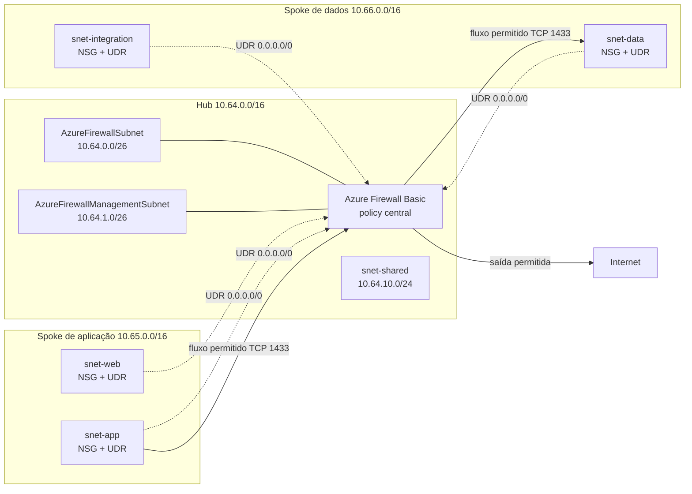

## Introdução

Na [parte 1 desta série](/posts/rede-hub-and-spoke-azure-terraform-parte-1/), criamos três VNets, cinco subnets e quatro links direcionais de peering. Na [parte 2](/posts/rede-hub-and-spoke-azure-terraform-parte-2/), associamos NSGs às quatro subnets de workload e trocamos permissões amplas por fluxos explícitos.

Essa base filtra pacotes em cada subnet, mas ainda não decide por onde eles passam. Também não existe um ponto central de inspeção e política para o tráfego entre spokes ou para a saída à Internet. Um NSG responde se um pacote pode entrar ou sair daquela subnet. Ele não transforma o hub em roteador, não entende FQDNs de aplicação e não reúne a decisão em um único serviço.

Nesta parte, adicionaremos um Azure Firewall Basic ao hub e duas tabelas de rotas definidas pelo usuário, também chamadas de User-Defined Routes (UDRs). As quatro subnets de workload usarão o IP privado do firewall como próximo salto para a rota padrão. Também abriremos um fluxo controlado de aplicação para dados e uma saída limitada para atualizações do Windows.

O laboratório continua sem máquinas virtuais, VPN Gateway, ExpressRoute, Bastion, DNAT de entrada ou inspeção TLS. O objetivo é descrever e revisar a camada de inspeção com `terraform plan`, sem executar `terraform apply` durante a preparação deste conteúdo.

## Arquitetura com inspeção central

### Azure Firewall e NSG não fazem o mesmo trabalho

O NSG permanece próximo da carga. Ele aplica regras de camada 3 e 4, usando origem, destino, protocolo, porta e direção. No nosso desenho, cada subnet de workload conserva seu próprio contrato. A camada web pode falar com a camada de aplicação na porta 8080, por exemplo, enquanto o restante continua negado.

O Azure Firewall fica no hub e avalia o tráfego que as rotas enviam até ele. Além de regras de rede, ele aceita regras de aplicação baseadas em FQDN e tags mantidas pela Microsoft. A Firewall Policy concentra essas decisões em um recurso reutilizável e o firewall se torna o ponto onde os fluxos encaminhados podem gerar logs e métricas. A retenção desses registros ainda exige Diagnostic Settings e um destino, como Log Analytics. Essa integração não entra no laboratório para não misturar inspeção com uma nova camada de observabilidade.

Os dois controles trabalham em sequência. O NSG precisa liberar o pacote na subnet de origem, a UDR precisa apontar o caminho correto, o peering precisa aceitar tráfego encaminhado e a policy do firewall precisa permitir o destino. Na chegada, o NSG da subnet de destino também participa da avaliação. Quando uma dessas peças discorda, o pacote não negocia. Ele só para.



As linhas tracejadas representam a decisão de roteamento das UDRs. As linhas sólidas mostram fluxos permitidos pela policy. A aplicação continua enviando o pacote ao IP privado do banco de dados, não ao firewall como um proxy explícito. A infraestrutura do Azure consulta a tabela de rotas da subnet e entrega o pacote ao firewall como próximo salto antes de encaminhá-lo ao destino original.

### Subnets reservadas para a SKU Basic

O firewall não pode ocupar `snet-shared`. O Azure exige uma subnet chamada exatamente `AzureFirewallSubnet`, com prefixo mínimo `/26`. O nome não é convenção nossa, é parte do contrato do serviço. Uma subnet dedicada também preserva os endereços necessários para escala e separa o appliance gerenciado de outros serviços do hub.

Há um detalhe específico da SKU Basic: ela também exige `AzureFirewallManagementSubnet`, igualmente com tamanho mínimo `/26`, e uma configuração de IP público para o plano de gerenciamento. Portanto, esta etapa cria duas subnets e dois IPs públicos Standard com alocação estática. Usar Basic reduz o custo relativo do laboratório, mas não remove os requisitos operacionais da SKU.

Os novos recursos são:

- `AzureFirewallSubnet` e `AzureFirewallManagementSubnet` no hub;
- dois IPs públicos, um para dados e outro para gerenciamento;
- um Azure Firewall com SKU Basic;
- uma Firewall Policy Basic;
- um rule collection group com coleções de rede e aplicação;
- duas route tables, uma por spoke;
- quatro associações entre route table e subnet.

## Ajuste no plano de IPs

O hub já usa `10.64.0.0/16`, enquanto `snet-shared` ocupa `10.64.10.0/24`. Reservaremos `10.64.0.0/26` para dados do firewall e `10.64.1.0/26` para gerenciamento. Os blocos não se sobrepõem e deixam intervalos livres para outros componentes especializados.

| Rede ou subnet | CIDR | Função nesta parte |
| --- | --- | --- |
| VNet hub | `10.64.0.0/16` | Serviços centrais de rede |
| **`AzureFirewallSubnet`** | `10.64.0.0/26` | Plano de dados do Azure Firewall |
| **`AzureFirewallManagementSubnet`** | `10.64.1.0/26` | Gerenciamento exigido pela SKU Basic |
| `snet-shared` | `10.64.10.0/24` | Serviços compartilhados futuros |
| Spoke de aplicação | `10.65.0.0/16` | Domínio da aplicação |
| `snet-web` | `10.65.10.0/24` | Camada web |
| `snet-app` | `10.65.20.0/24` | Camada de aplicação |
| Spoke de dados | `10.66.0.0/16` | Dados e integrações |
| `snet-data` | `10.66.10.0/24` | Camada de dados |
| `snet-integration` | `10.66.20.0/24` | Integrações privadas |

Um `/26` contém 64 endereços. Como o Azure reserva cinco endereços em cada subnet IPv4, restam 59 utilizáveis pelo serviço. Reduzir o bloco para economizar endereços faria o deploy falhar. A economia seria parecida com remover a escada de incêndio para ganhar alguns metros no corredor.

Em produção, reserve também espaço para `GatewaySubnet`, `AzureBastionSubnet` e DNS Resolver antes de preencher o hub. Eles não serão criados aqui, mas cada serviço tem requisitos próprios de nome e tamanho. Planejar o intervalo não obriga a contratar o serviço, só evita uma renumeração quando ele se tornar necessário.

## Rotas e regras de firewall

### Como a UDR força o caminho

Cada route table recebe uma rota `0.0.0.0/0` com `next_hop_type = "VirtualAppliance"`. O próximo salto é o IP privado exportado pelo módulo do firewall. Associamos `rt-spoke-app-lab-brs-001` a `snet-web` e `snet-app`. A tabela `rt-spoke-data-lab-brs-001` atende `snet-data` e `snet-integration`.

A rota padrão cobre destinos que não possuem uma rota mais específica. Como os spokes não têm peering direto e peering não é transitivo, o caminho até o outro spoke passa pelo próximo salto no hub. Para a Internet, a mesma rota impede que a carga use a saída padrão da plataforma sem inspeção.

`AzureFirewallSubnet`, `AzureFirewallManagementSubnet` e `snet-shared` não recebem essa UDR. Associar a rota ao plano de dados do firewall poderia devolver o tráfego ao próprio firewall e formar um loop. A subnet de gerenciamento precisa alcançar a infraestrutura da plataforma pelo caminho previsto pelo serviço. Já `snet-shared` permanece fora porque continua vazia e ainda não possui contrato de tráfego.

Os quatro peerings também mudam `allow_forwarded_traffic` de `false` para `true`. Sem essa opção, um peering poderia aceitar tráfego originado na VNet remota, mas rejeitar pacotes encaminhados pelo firewall. A rota desenha o caminho e o peering autoriza o tipo de tráfego que passa nele.

### Política mínima e negação padrão

A Firewall Policy combina uma precedência fixa por tipo com prioridades numéricas. O Azure Firewall sempre avalia DNAT, depois regras de rede e, por último, regras de aplicação, independentemente das prioridades atribuídas às coleções. Dentro de cada tipo, grupos e coleções com números menores são processados primeiro. O laboratório não possui DNAT e usa uma coleção de rede na prioridade 100 e uma coleção de aplicação na prioridade 200. Mesmo que esses dois números fossem invertidos, a coleção de rede continuaria sendo avaliada antes da coleção de aplicação.

Se nenhuma regra permitir o fluxo, o Azure Firewall nega por padrão. Não precisamos criar uma regra decorativa de `deny any any` para obter esse comportamento.

| Prioridade | Coleção e regra | Protocolo | Origem | Destino | Ação |
| ---: | --- | --- | --- | --- | --- |
| 100 | `allow-east-west` / `allow-app-to-data` | TCP 1433 | `10.65.20.0/24` | `10.66.10.0/24` | Permitir |
| 200 | `allow-system-updates` / `allow-windows-update` | HTTPS 443 | `10.65.0.0/16`, `10.66.0.0/16` | Tag FQDN `WindowsUpdate` | Permitir |
| Padrão | Sem correspondência | Qualquer | Qualquer | Qualquer | Negar |

### Regras de NSG adicionadas nesta parte

A policy central não substitui os controles distribuídos da parte 2. Estas são as liberações acrescentadas aos NSGs para que o pacote alcance o firewall e seja aceito também na subnet de destino:

| NSG | Prioridade | Regra | Direção | Protocolo e porta | Origem | Destino |
| --- | ---: | --- | --- | --- | --- | --- |
| `nsg-web` | 110 e 120 | `allow-windows-update-http` e `allow-windows-update-https` | Saída | TCP 80 e 443 | `10.65.10.0/24` | `Internet` |
| `nsg-app` | 100 | `allow-data-outbound` | Saída | TCP 1433 | `10.65.20.0/24` | `10.66.10.0/24` |
| `nsg-app` | 110 e 120 | `allow-windows-update-http` e `allow-windows-update-https` | Saída | TCP 80 e 443 | `10.65.20.0/24` | `Internet` |
| `nsg-data` | 110 | `allow-app-inbound` | Entrada | TCP 1433 | `10.65.20.0/24` | `10.66.10.0/24` |
| `nsg-data` | 110 e 120 | `allow-windows-update-http` e `allow-windows-update-https` | Saída | TCP 80 e 443 | `10.66.10.0/24` | `Internet` |
| `nsg-integration` | 110 e 120 | `allow-windows-update-http` e `allow-windows-update-https` | Saída | TCP 80 e 443 | `10.66.20.0/24` | `Internet` |

O fluxo entre spokes demonstra a inspeção leste-oeste: `snet-app` alcança `snet-data` somente em TCP 1433. Tanto o Azure Firewall quanto os NSGs são stateful e reconhecem o retorno de uma conexão permitida. Portanto, não precisamos liberar portas efêmeras de resposta nos NSGs. As UDRs nos dois spokes continuam essenciais para que ida e volta atravessem o firewall, que precisa observar as duas direções do fluxo para preservar o estado da sessão.

A regra de atualização usa a tag FQDN `WindowsUpdate`, mantida pela Microsoft. Ela evita gravar uma lista de domínios que envelheceria antes do próximo café. A própria documentação alerta que uma tag FQDN pode autorizar endpoints HTTP necessários mesmo quando a regra declara HTTPS. Por isso, os NSGs liberam TCP 80 e 443 para a marca de serviço `Internet`; a Firewall Policy continua restringindo o destino aos endpoints da tag.

O laboratório usa o DNS fornecido pelo Azure. O endereço virtual `168.63.129.16` possui tratamento especial e não segue a UDR padrão até o firewall. Criar uma regra de DNS na policy daria uma sensação de controle sem colocar o pacote naquele caminho. Uma implementação com inspeção central de DNS deve habilitar o DNS Proxy e configurar os spokes para consultá-lo, o que merece uma alteração separada e testes próprios.

Não criamos coleções de NAT ou DNAT. O IP público do firewall atende o serviço e a saída controlada, mas não publica uma carga privada. Entrada da Internet, tradução de destino e inspeção TLS permanecem fora do escopo.

## Módulos Terraform

### Módulo de firewall

O diretório `modules/firewall/` contém `main.tf`, `variables.tf` e `outputs.tf`. Ele cria dois `azurerm_public_ip` com `for_each`, a policy, o rule collection group e o firewall. As coleções chegam como mapas, enquanto nome e tier da SKU chegam por variáveis. Assim, o ambiente declara suas escolhas sem escondê-las dentro do recurso.

```hcl title="Trecho de modules/firewall/main.tf"
resource "azurerm_firewall" "this" {
  name                = var.name
  resource_group_name = var.resource_group_name
  location            = var.location
  sku_name            = var.sku_name
  sku_tier            = var.sku_tier
  firewall_policy_id  = azurerm_firewall_policy.this.id
  tags                = var.tags

  ip_configuration {
    name                 = "data-ip-configuration"
    subnet_id            = var.firewall_subnet_id
    public_ip_address_id = azurerm_public_ip.this["data"].id
  }

  management_ip_configuration {
    name                 = "management-ip-configuration"
    subnet_id            = var.management_subnet_id
    public_ip_address_id = azurerm_public_ip.this["management"].id
  }
}
```

No ambiente do laboratório, o módulo recebe `sku_name = "AZFW_VNet"` e `sku_tier = "Basic"`. A Firewall Policy usa a mesma variável `sku_tier`, evitando uma combinação incompatível entre uma policy Basic e um firewall de outro tier. As validações de `variables.tf` limitam os valores ao conjunto aceito pelo provider.

O output `private_ip_address` lê o endereço da primeira configuração de dados. Esse valor alimenta o módulo de rotas, criando uma dependência implícita. Terraform sabe que não pode concluir o próximo salto antes de conhecer o IP do firewall.

### Módulo de route table

O diretório `modules/route-table/` também segue a divisão em `main.tf`, `variables.tf` e `outputs.tf`. A rota fica embutida em `azurerm_route_table`, enquanto as associações usam `for_each` sobre o mapa de subnets:

```hcl title="modules/route-table/main.tf"
resource "azurerm_route_table" "this" {
  name                = var.name
  resource_group_name = var.resource_group_name
  location            = var.location
  tags                = var.tags

  route {
    name                   = "default-via-azure-firewall"
    address_prefix         = "0.0.0.0/0"
    next_hop_type          = "VirtualAppliance"
    next_hop_in_ip_address = var.next_hop_ip_address
  }
}

resource "azurerm_subnet_route_table_association" "this" {
  for_each = var.subnet_ids

  subnet_id      = each.value
  route_table_id = azurerm_route_table.this.id
}
```

No ambiente, `local.route_tables` liga cada spoke às suas subnets. O `for_each` cria duas instâncias do módulo e a compreensão de mapa seleciona os IDs exportados pelo módulo de VNet:

```hcl title="Trecho de environments/lab/main.tf"
module "route_table" {
  source   = "../../modules/route-table"
  for_each = local.route_tables

  name                 = each.value.name
  resource_group_name  = module.virtual_network[each.value.network_key].resource_group_name
  location             = var.location
  next_hop_ip_address  = module.firewall.private_ip_address
  subnet_ids = {
    for subnet_key in each.value.subnet_keys :
    subnet_key => module.virtual_network[each.value.network_key].subnet_ids[subnet_key]
  }
  tags = local.common_tags
}
```

A configuração completa passa de 23 para 36 recursos. Em um diretório sem state, o plano esperado é `36 to add`. Ao continuar com o state local da parte 2, espere `13 to add` e `8 to change`: os quatro NSGs recebem novas liberações e os quatro peerings passam a aceitar tráfego encaminhado. Recriações ou exclusões dos 23 recursos anteriores merecem investigação antes de qualquer decisão.

## Validação e custo

Partindo do repositório da parte 3, crie somente o arquivo local de variáveis:

```powershell
Copy-Item environments/lab/terraform.tfvars.example environments/lab/terraform.tfvars
```

Edite `subscription_id` e `owner`. Em Bash, use `cp` no lugar de `Copy-Item` e `cd` no lugar de `Set-Location`. Depois formate, inicialize, valide e gere o plano:

```powershell
terraform fmt -check -recursive .
Set-Location environments/lab
terraform init
terraform validate
terraform plan -out=plan.tfplan
terraform show plan.tfplan
```

Antes de aceitar o plano como evidência desta etapa, confira:

- as duas subnets `/26` com os nomes reservados exatos;
- os dois IPs públicos Standard e estáticos;
- a SKU Basic no firewall e na Firewall Policy;
- a rota `0.0.0.0/0` apontando para o IP privado do firewall;
- as quatro associações somente nas subnets de workload;
- `allow_forwarded_traffic = true` nos quatro peerings;
- as liberações correspondentes nos NSGs e na policy;
- a ausência de NAT, DNAT, VPN, ExpressRoute, Bastion e inspeção TLS;
- a assinatura, a região e as tags antes de considerar qualquer ação futura.

Não execute `terraform apply` como parte deste artigo. O workflow herdado também continua limitado a `fmt`, `init -backend=false` e `validate`, sem credenciais de deploy e sem criação automática de recursos.

O aviso de custo desta parte é mais sério que nas duas anteriores. O Azure Firewall gera cobrança contínua por hora enquanto permanece provisionado, mesmo quando nenhum pacote atravessa o serviço. Há também cobrança relacionada ao processamento de dados e aos IPs públicos conforme o cenário. Consulte a [Calculadora de Preços do Azure](https://azure.microsoft.com/pricing/calculator/?wt.mc_id=studentamb_365381) para a região e as condições atuais, sem confiar em valores copiados de um artigo antigo.

Se você aplicar o laboratório por conta própria depois de uma revisão independente, destrua os recursos assim que terminar os testes. Confirme a assinatura e leia o plano de destruição antes de aprová-lo. Automatizar a criação e esquecer o firewall ligado é uma forma bastante eficiente de transformar aprendizado em linha recorrente na fatura.

## O que vem na parte 4

A parte 4 adicionará conectividade híbrida ao hub por VPN ou ExpressRoute. O próximo capítulo tratará essa decisão com os requisitos de gateway, rotas e disponibilidade que ela exige.

## Referências

- [Topologia hub and spoke no Azure](https://learn.microsoft.com/azure/networking/design-guide/hub-spoke?wt.mc_id=studentamb_365381)
- [Azure Firewall Basic](https://learn.microsoft.com/azure/firewall/overview?wt.mc_id=studentamb_365381#azure-firewall-basic)
- [Requisitos de subnets em uma arquitetura hub and spoke segura](https://learn.microsoft.com/azure/networking/cross-service-scenarios/design-secure-hub-spoke-network?wt.mc_id=studentamb_365381)
- [Rotas de tráfego de rede virtual](https://learn.microsoft.com/azure/virtual-network/virtual-networks-udr-overview?wt.mc_id=studentamb_365381)
- [Processamento de regras da Firewall Policy](https://learn.microsoft.com/azure/firewall/policy-rule-sets?wt.mc_id=studentamb_365381)
- [Tags FQDN do Azure Firewall](https://learn.microsoft.com/azure/firewall/fqdn-tags?wt.mc_id=studentamb_365381)
- [Visão geral dos grupos de segurança de rede](https://learn.microsoft.com/azure/virtual-network/network-security-groups-overview?wt.mc_id=studentamb_365381)
- [Azure Firewall no AzureRM 4.79.0](https://registry.terraform.io/providers/hashicorp/azurerm/4.79.0/docs/resources/firewall)
- [Rule collection group no AzureRM 4.79.0](https://registry.terraform.io/providers/hashicorp/azurerm/4.79.0/docs/resources/firewall_policy_rule_collection_group)
- [Route table no AzureRM 4.79.0](https://registry.terraform.io/providers/hashicorp/azurerm/4.79.0/docs/resources/route_table)

## Conclusão

O hub agora deixa de ser apenas o ponto comum dos peerings e passa a concentrar a inspeção dos caminhos escolhidos. As UDRs enviam o tráfego dos spokes ao IP privado do Azure Firewall, a policy permite somente os fluxos declarados e os NSGs continuam protegendo cada subnet nas duas pontas.

O resultado mais importante é um caminho verificável. Uma comunicação entre aplicação e dados precisa concordar com NSG, rota, peering e Firewall Policy. Isso adiciona peças, mas também transforma uma permissão espalhada em uma decisão rastreável. Quando a rede disser não, pelo menos teremos uma lista curta e honesta de lugares para investigar.
