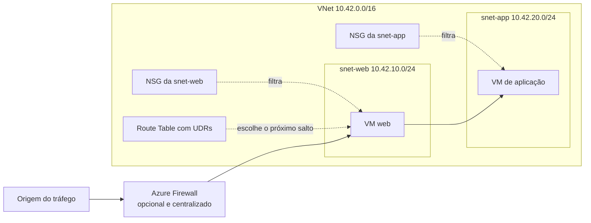
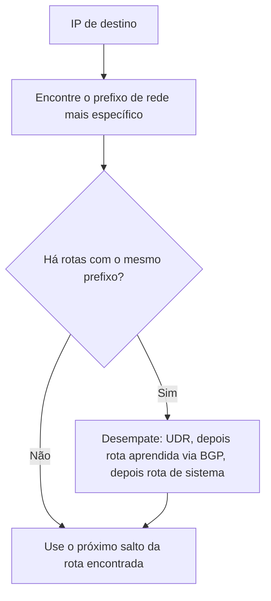
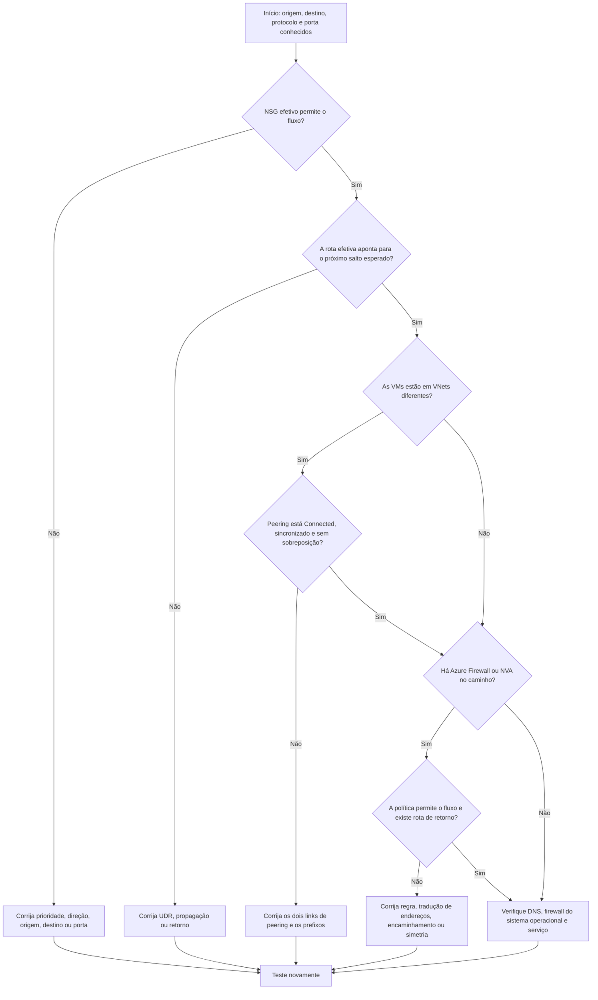

Uma máquina virtual não consegue conversar com outra. A reação natural é abrir o portal, encarar quinze opções de rede e clicar em alguma coisa até o ícone ficar verde. É uma estratégia parecida com apertar todos os botões do elevador para chegar mais rápido: movimenta bastante, mas não melhora o diagnóstico.

Quatro componentes explicam boa parte da conectividade básica no Azure: **Virtual Network (VNet)**, **subnet**, **Network Security Group (NSG)** e **Route Table**, também chamada de tabela de rotas quando contém rotas definidas pelo usuário, as **User Defined Routes (UDRs)**.

Neste artigo, você vai entender a função de cada peça, planejar faixas de IP, criar um laboratório com Azure CLI e seguir uma ordem previsível quando duas VMs se recusarem a conversar.

## Resultado esperado e ambiente do laboratório

Ao final, você terá uma VNet `10.42.0.0/16` com uma subnet privada `10.42.10.0/24`, um NSG associado à subnet e uma Route Table com uma rota de descarte para a internet. O laboratório não cria VMs, NAT Gateway, IP público ou Azure Firewall.

Você precisa de:

- uma assinatura do Azure destinada a estudos;
- Azure CLI atualizada ou o modo Bash do Azure Cloud Shell;
- permissão **Network Contributor** e permissão para criar o grupo de recursos;
- uma região autorizada pela sua organização.

> [!IMPORTANT]
> Desde as versões de API posteriores a 31 de março de 2026, novas subnets são privadas por padrão e uma VM não recebe saída pública implícita. Uma rota com próximo salto `Internet` também não cria **Source Network Address Translation (SNAT)**, a troca do IP privado de origem por um endereço válido para a saída. Quando necessário, configure um método explícito, como NAT Gateway, regras de saída de um Load Balancer, Azure Firewall ou IP público diretamente associado.

## Diagramas: como as peças se encaixam

Pense na VNet como o terreno de um condomínio. As subnets são as ruas, o NSG é a portaria e a Route Table é o aplicativo de mapas. O mapa escolhe o caminho, mas não convence o porteiro a liberar a entrada. Se a rua termina em um muro, gritar “mas o GPS mandou virar aqui” também não ajuda.


A ilustração reforça a analogia. O diagrama abaixo separa as responsabilidades técnicas, porque servidor nenhum aceita “eu achei que a portaria resolvia” como configuração válida.



O Azure cria rotas de sistema automaticamente. Em redes híbridas, um gateway também pode aprender caminhos por **Border Gateway Protocol (BGP)**, protocolo usado por roteadores para anunciar quais redes conseguem alcançar. Você não precisa configurar BGP neste laboratório. Por enquanto, basta saber que ele pode acrescentar rotas à disputa.

Quando várias rotas alcançam o mesmo destino, a seleção acontece assim:



Existem exceções ligadas à própria VNet, a conexões privadas entre VNets chamadas de **peerings** e a **pontos de extremidade de serviço (service endpoints)**, que conectam a subnet a serviços compatíveis. Consulte as **rotas efetivas** da interface de rede, ou **NIC**, a placa virtual do recurso. O portal mostra a placa; a rota efetiva conta por onde o pacote realmente vai passear.

## VNet: o espaço privado da aplicação

A **Virtual Network**, ou VNet, é uma rede lógica isolada em uma região do Azure. Ela define um ou mais espaços de endereçamento e permite conectar recursos entre si, com outras VNets, com redes locais ou com a internet por componentes apropriados.

Duas subnets na mesma VNet não formam uma barreira de segurança automática. Por padrão, os recursos podem se comunicar. Se web, aplicação e banco precisam de políticas diferentes, desenhe a separação com NSGs, rotas e, quando necessário, inspeção centralizada.

Escolha blocos que não colidam com:

- outras VNets que poderão usar peering;
- redes do escritório ou datacenter conectadas por VPN ou ExpressRoute;
- outras nuvens que participarão da arquitetura;
- faixas reservadas para crescimento.

Renumerar uma rede em produção é possível, mas tem o charme de trocar o encanamento com o prédio ocupado.

## Subnet: uma divisão com propósito

Uma **subnet** é uma faixa menor dentro do espaço da VNet. A NIC de uma VM conecta-se a uma subnet, e é na subnet que você associa a Route Table e, normalmente, o NSG compartilhado pela camada.

Separe subnets por função ou requisito de segurança, não por gosto por listas longas. Camadas web, aplicação, dados e componentes de plataforma podem precisar de regras, rotas e tamanhos diferentes. Alguns serviços exigem nomes e prefixos dedicados, como `AzureFirewallSubnet` para Azure Firewall e `GatewaySubnet` para VPN Gateway ou ExpressRoute Gateway.

Em IPv4, o Azure reserva cinco endereços de cada subnet: os quatro primeiros e o último. Uma `/24` contém 256 endereços, mas oferece 251 para recursos. Dimensione também para atualizações, expansão automática e instâncias temporárias.

## Exemplos de endereçamento CIDR

**Classless Inter-Domain Routing (CIDR)** combina o endereço da rede com o tamanho do prefixo. Quanto maior o número depois da barra, menor a faixa. Uma `/16` é maior que uma `/24`, apesar de o número parecer querer pregar uma peça no iniciante.

| Uso | CIDR | Total de endereços | Disponíveis para recursos no Azure |
| --- | --- | ---: | ---: |
| VNet do laboratório | `10.42.0.0/16` | 65.536 | Divididos entre as subnets |
| Camada web | `10.42.10.0/24` | 256 | 251 |
| Camada de aplicação | `10.42.20.0/24` | 256 | 251 |
| Camada de dados | `10.42.30.0/24` | 256 | 251 |
| Azure Firewall futuro | `10.42.100.0/26` | 64 | 59 |

As quatro subnets cabem dentro de `10.42.0.0/16` e não se sobrepõem. O espaço restante permite crescer sem trocar todos os IPs. Requisitos de tamanho variam por serviço e variante de capacidade, portanto valide a documentação antes da implantação.

Se o datacenter já usa `10.42.20.0/24`, criar `10.42.0.0/16` no Azure causa sobreposição porque a faixa menor está contida na maior.

## NSG: quem pode falar, com quem e em qual porta

O **Network Security Group** é um filtro de tráfego com regras de entrada e saída. Ele não lê intenção, cargo no LinkedIn nem a mensagem “é urgente” enviada no chat. Cada regra considera origem, porta de origem, destino, porta de destino e protocolo, e então permite ou nega o fluxo.

Regras personalizadas usam prioridades de `100` a `4096`. **O menor número tem a maior prioridade.** O processamento para na primeira correspondência, portanto uma negação `200` vence uma permissão `300`. Criar outra regra lá embaixo para “compensar” a primeira é negociação com uma porta automática.

O NSG tem memória boa, característica chamada de **stateful**. Se deixou você sair para comprar pão, abre a porta para a resposta da mesma viagem. Não é preciso criar uma regra só para o retorno. Isso não autoriza uma visita nova iniciada do outro lado: acompanhar você até a portaria não transforma o padeiro em morador.


### NSG na NIC ou na subnet?

Você pode associar NSGs à subnet, à NIC ou a ambas:

- na entrada, o Azure processa primeiro o NSG da subnet e depois o NSG da NIC;
- na saída, processa primeiro o NSG da NIC e depois o NSG da subnet;
- quando existem nos dois níveis, o tráfego precisa ser permitido por ambos;
- uma negação relevante em qualquer nível bloqueia o novo fluxo.

Use o NSG da subnet para políticas comuns e o da NIC apenas para exceções justificáveis. Dois níveis significam dois porteiros olhando a lista. Regras espalhadas por dezenas de NICs viram caça ao tesouro, com uma madrugada no portal como prêmio.

As regras padrão incluem permissões para tráfego da VNet e uma negação final de entrada. Regras personalizadas são avaliadas antes delas. Além disso, uma regra de saída `AllowInternetOutBound` não fornece conectividade pública sozinha: ainda é preciso rota válida e um método de saída explícito.

## Rotas: para onde o pacote deve ir

Uma rota responde a duas perguntas: qual é o prefixo de destino e qual é o próximo salto. O pacote não fareja o destino nem pede informação no posto. O Azure cria rotas de sistema para a própria VNet, para a internet e para outros recursos de rede habilitados.

Uma **User Defined Route (UDR)** altera esse caminho. Ela pode enviar tráfego a um Azure Firewall, passar por uma **Network Virtual Appliance (NVA)**, appliance virtual que funciona como roteador ou firewall, ou descartar uma faixa com `None`. UDR bem planejada é GPS. UDR errada é placa apontando para um terreno vazio.

A Route Table é associada a uma ou mais subnets, não à VNet inteira e nem diretamente à NIC. Para cada pacote que sai da subnet, o Azure procura o prefixo mais específico. Uma rota `10.42.20.0/24` vence uma rota `10.42.0.0/16` para o destino `10.42.20.7`. Somente quando os prefixos são iguais a origem da rota desempata, normalmente na ordem UDR, BGP e rota de sistema.

> [!WARNING]
> Uma UDR não é uma regra de firewall. Apontar `0.0.0.0/0` para um appliance também não garante conectividade. O appliance precisa existir, encaminhar pacotes, permitir o fluxo e possuir um caminho de retorno coerente.

## Quando usar o quê: NSG vs Route Table vs Azure Firewall

NSG, UDR e Azure Firewall não são três tamanhos da mesma fechadura. Um filtra, outro escolhe o caminho e o terceiro inspeciona de forma centralizada. O Firewall também entende **Fully Qualified Domain Names (FQDNs)**, nomes completos como `api.exemplo.com`.

| Componente | Pergunta principal | Escopo comum | Use quando | Não use como substituto de |
| --- | --- | --- | --- | --- |
| NSG | Este fluxo pode passar? | Subnet e, excepcionalmente, NIC | Você precisa filtrar IP, porta e protocolo de forma distribuída | Roteamento, inspeção por FQDN ou proteção de aplicação web |
| Route Table com UDR | Por qual próximo salto o pacote deve seguir? | Subnet | Você precisa forçar passagem por firewall ou NVA, usar gateway ou descartar uma faixa | Controle stateful ou análise de conteúdo |
| Azure Firewall | O tráfego central deve ser inspecionado e registrado? | VNet central com subnet dedicada | Você precisa de políticas centralizadas, regras de rede e aplicação, FQDN, inteligência contra ameaças ou recursos Premium | Segmentação básica que um NSG resolve com menor complexidade |

Os três podem trabalhar juntos: a UDR leva o pacote ao Firewall, ele inspeciona, e o NSG limita cada camada. Duplicar regras produz três porteiros com três planilhas diferentes. Defina quem decide o quê.

## Comandos prontos em Azure CLI

O cenário cria uma rede privada e adiciona uma UDR `0.0.0.0/0` com próximo salto `None`. Essa rota descarta tráfego destinado à internet de forma explícita. Ela serve para tornar o efeito da Route Table fácil de observar e não é uma receita universal para produção. Copie os comandos, mas não desligue o cérebro no modo automático: confirme assinatura, região e nomes antes de executar.

Substitua `<SUBSCRIPTION_ID>` e confirme a região:

```bash title="Definir o contexto do laboratório"
SUBSCRIPTION_ID="<SUBSCRIPTION_ID>"
RESOURCE_GROUP="rg-redes-iniciantes"
LOCATION="brazilsouth"
VNET_NAME="vnet-lab-redes"
SUBNET_NAME="snet-app"
NSG_NAME="nsg-snet-app"
ROUTE_TABLE_NAME="rt-snet-app"

az account set --subscription "$SUBSCRIPTION_ID"

az account show \
  --query "{assinatura:name, subscriptionId:id, tenantId:tenantId}" \
  --output table
```

Pare se a assinatura ou o tenant não forem os esperados. Em seguida, crie os componentes:

```bash title="Criar VNet, NSG, Route Table e subnet"
az group create \
  --name "$RESOURCE_GROUP" \
  --location "$LOCATION" \
  --tags environment=lab managed-by=azure-cli

az network vnet create \
  --resource-group "$RESOURCE_GROUP" \
  --name "$VNET_NAME" \
  --location "$LOCATION" \
  --address-prefixes 10.42.0.0/16

az network nsg create \
  --resource-group "$RESOURCE_GROUP" \
  --name "$NSG_NAME" \
  --location "$LOCATION"

az network nsg rule create \
  --resource-group "$RESOURCE_GROUP" \
  --nsg-name "$NSG_NAME" \
  --name allow-https-from-vnet \
  --priority 200 \
  --direction Inbound \
  --access Allow \
  --protocol Tcp \
  --source-address-prefixes VirtualNetwork \
  --source-port-ranges "*" \
  --destination-address-prefixes "*" \
  --destination-port-ranges 443

az network route-table create \
  --resource-group "$RESOURCE_GROUP" \
  --name "$ROUTE_TABLE_NAME" \
  --location "$LOCATION"

az network route-table route create \
  --resource-group "$RESOURCE_GROUP" \
  --route-table-name "$ROUTE_TABLE_NAME" \
  --name drop-internet \
  --address-prefix 0.0.0.0/0 \
  --next-hop-type None

az network vnet subnet create \
  --resource-group "$RESOURCE_GROUP" \
  --vnet-name "$VNET_NAME" \
  --name "$SUBNET_NAME" \
  --address-prefixes 10.42.10.0/24 \
  --network-security-group "$NSG_NAME" \
  --route-table "$ROUTE_TABLE_NAME"

az network vnet subnet update \
  --resource-group "$RESOURCE_GROUP" \
  --vnet-name "$VNET_NAME" \
  --name "$SUBNET_NAME" \
  --default-outbound false
```

A atualização da subnet deixa a saída privada explícita em uma operação separada. Mesmo com o novo padrão, fazemos isso porque a versão da API, a interface usada pela CLI para conversar com o Azure, pode variar entre ambientes. Declarar a intenção é mais previsível do que depender de um comportamento implícito. A regra HTTPS é didática e explicita a intenção, embora o tráfego interno já possa ser alcançado pela regra padrão `AllowVNetInBound`. Em produção, crie regras apenas quando elas expressarem uma política necessária. Regra decorativa é só mais uma linha para investigar quando tudo estiver vermelho.

Valide as associações e não apenas o retorno `Succeeded`:

```bash title="Validar a configuração"
az network vnet subnet show \
  --resource-group "$RESOURCE_GROUP" \
  --vnet-name "$VNET_NAME" \
  --name "$SUBNET_NAME" \
  --query "{prefixo:addressPrefix, saidaPadrao:defaultOutboundAccess, nsg:networkSecurityGroup.id, routeTable:routeTable.id}" \
  --output json

az network nsg rule list \
  --resource-group "$RESOURCE_GROUP" \
  --nsg-name "$NSG_NAME" \
  --query "[].{nome:name, prioridade:priority, direcao:direction, acao:access, porta:destinationPortRange}" \
  --output table

az network route-table route list \
  --resource-group "$RESOURCE_GROUP" \
  --route-table-name "$ROUTE_TABLE_NAME" \
  --output table
```

Quando houver uma VM em execução, substitua os valores e consulte os controles efetivos da NIC:

```bash title="Consultar NSGs e rotas efetivas de uma NIC"
az network nic list-effective-nsg \
  --resource-group "<RESOURCE_GROUP_DA_VM>" \
  --name "<NIC_NAME>" \
  --output json

az network nic show-effective-route-table \
  --resource-group "<RESOURCE_GROUP_DA_VM>" \
  --name "<NIC_NAME>" \
  --output table
```

## Checklist de erros comuns

Use a lista antes de abrir uma regra `Any` e declarar vitória. Esse tipo de vitória costuma durar até a primeira auditoria.

- [ ] **NSG na NIC vs subnet:** verifique os dois níveis e as duas direções. O fluxo precisa ser permitido por ambos.
- [ ] **CIDR sobreposto em peering:** compare todos os prefixos. `10.0.0.0/16` contém `10.0.1.0/24`, embora os textos pareçam diferentes.
- [ ] **Rota de sistema vs UDR:** procure o prefixo mais específico. Em empate, UDR normalmente vence BGP e sistema. Consulte as rotas efetivas.
- [ ] **Ordem do NSG:** menor número tem maior prioridade, e a primeira correspondência encerra a avaliação.
- [ ] **Peering transitivo:** se A conecta a B e B conecta a C, A não ganha acesso a C. Rede não funciona por amizade em comum.
- [ ] **Saída privada esquecida:** NSG permitindo internet e rota `Internet` não criam SNAT. Configure saída explícita.
- [ ] **DNS confundido com rede:** compare o teste por IP com o teste por nome antes de culpar “a nuvem”.
- [ ] **Aplicação ignorada:** confirme processo, firewall do sistema operacional e endereço de escuta. A portaria aberta não faz a loja abrir.

## Fluxograma de troubleshooting: por que minhas VMs não se comunicam?

Esta é uma ordem de investigação, não uma representação literal de todas as etapas internas do pacote. Teste sempre IP, protocolo e porta específicos. O fluxograma evita o método esotérico de alterar três coisas, reiniciar a VM e atribuir a cura à última delas.



O Network Watcher pode testar o fluxo de IP e mostrar o próximo salto. Rotas e NSGs efetivos são especialmente úteis porque combinam configurações da subnet, NIC, sistema e conectividade híbrida.

## Mini-glossário: redes traduzidas para o dia a dia

Se a documentação parece uma reunião em que todos combinaram usar siglas para economizar vogais, esta tabela devolve as peças ao mundo real.

| Termo | Tradução prática |
| --- | --- |
| VNet | O terreno privado onde suas ruas de rede existem |
| Subnet | Uma rua ou setor reservado para um tipo de recurso |
| NIC | A porta de rede do recurso, com seus endereços IP |
| NSG | A portaria que permite ou nega por origem, destino, protocolo e porta |
| CIDR | A forma compacta de escrever onde uma rede começa e qual é seu tamanho |
| Route Table | A coleção de instruções de caminho associada à subnet |
| UDR | Uma instrução de rota criada por você para alterar o caminho padrão |
| Next hop | O próximo ponto para o qual o pacote será entregue |
| Peering | Uma conexão privada direta entre duas VNets, sem transitividade automática |
| BGP | O protocolo pelo qual roteadores anunciam uns aos outros quais redes conseguem alcançar |
| Azure Firewall | Um posto central de inspeção com políticas e registros avançados |
| NVA | Um appliance virtual de rede, como firewall ou roteador de um fornecedor |
| SNAT | A troca do IP privado de origem por um endereço válido para sair da rede |

## Guia rápido de custos

A VNet não tem cobrança própria, e NSGs e UDRs não implantam capacidade computacional cobrada por hora. A fatura, porém, não aceita “era só um teste” como cupom de desconto. O custo aparece nos serviços e no tráfego que você conecta à rede.

Observe principalmente:

- volume e direção dos dados em VNet peering, inclusive cobrança nos dois lados conforme o tipo de peering;
- transferência entre regiões, zonas e saída para a internet;
- horas de implantação e volume processado por Azure Firewall, NAT Gateway, gateways de VPN, ExpressRoute, Bastion e appliances;
- SKU, a edição do serviço, e recursos do Azure Firewall, como capacidades Premium;
- quantidade e tipo de endereços IP públicos;
- ingestão, retenção e consulta de logs no Azure Monitor e em workspaces do Log Analytics;
- região, moeda, contrato e benefícios aplicáveis à assinatura.

Não memorize um valor visto em uma captura de tela antiga, principalmente se ela veio acompanhada de “na minha época era assim”. Para números atuais, configure região, SKU e volume na [Calculadora de Preços oficial do Azure](https://azure.microsoft.com/pricing/calculator/?wt.mc_id=studentamb_365381) e confira também a [página de preços da Virtual Network](https://azure.microsoft.com/pricing/details/virtual-network/?wt.mc_id=studentamb_365381).

## Segurança, impacto e reversão

Antes de mudar NSGs ou rotas em produção, registre o fluxo esperado e consulte a configuração efetiva. Produção é um péssimo escape room. Uma UDR errada pode desviar uma subnet inteira. Uma negação de alta prioridade pode interromper novas conexões, enquanto sessões stateful existentes ainda permanecem por algum tempo e fazem parecer que a regra nova “não pegou”.

Para remover o laboratório, primeiro liste o conteúdo e confirme a assinatura:

```bash title="Revisar e remover o laboratório"
az account show \
  --query "{assinatura:name, subscriptionId:id, tenantId:tenantId}" \
  --output table

az resource list \
  --resource-group "$RESOURCE_GROUP" \
  --query "[].{nome:name, tipo:type, localizacao:location}" \
  --output table

az group delete \
  --name "$RESOURCE_GROUP" \
  --yes
```

Excluir o grupo remove todos os recursos contidos nele. Não execute o último comando se a listagem mostrar algo que precise ser preservado. O `--yes` pula a pergunta do Azure, não a responsabilidade de quem apertou Enter.

## Referências

**Conceitos e planejamento**

- [Visão geral da Azure Virtual Network](https://learn.microsoft.com/azure/virtual-network/virtual-networks-overview?wt.mc_id=studentamb_365381)
- [Virtual networks e subnets](https://learn.microsoft.com/azure/networking/design-guide/vnets-subnets?wt.mc_id=studentamb_365381)
- [Visão geral dos Network Security Groups](https://learn.microsoft.com/azure/virtual-network/network-security-groups-overview?wt.mc_id=studentamb_365381)
- [Roteamento de tráfego em redes virtuais](https://learn.microsoft.com/azure/virtual-network/virtual-networks-udr-overview?wt.mc_id=studentamb_365381)
- [Visão geral do peering de redes virtuais](https://learn.microsoft.com/azure/virtual-network/virtual-network-peering-overview?wt.mc_id=studentamb_365381)
- [Acesso de saída padrão no Azure](https://learn.microsoft.com/azure/virtual-network/ip-services/default-outbound-access?wt.mc_id=studentamb_365381)
- [O que é o Azure Firewall?](https://learn.microsoft.com/azure/firewall/overview?wt.mc_id=studentamb_365381)

**Operação e diagnóstico**

- [Criar e gerenciar tabelas de rotas](https://learn.microsoft.com/azure/virtual-network/manage-route-table?wt.mc_id=studentamb_365381)
- [Diagnosticar um problema de roteamento de VM](https://learn.microsoft.com/azure/virtual-network/diagnose-network-routing-problem?wt.mc_id=studentamb_365381)
- [Referência da Azure CLI para VNet](https://learn.microsoft.com/cli/azure/network/vnet?view=azure-cli-latest&wt.mc_id=studentamb_365381)
- [Referência da Azure CLI para subnets](https://learn.microsoft.com/cli/azure/network/vnet/subnet?view=azure-cli-latest&wt.mc_id=studentamb_365381)

## Conclusão

VNet define o espaço, subnet organiza, NSG filtra e rota escolhe o caminho. Azure Firewall entra quando a inspeção precisa ser centralizada e mais profunda. Essa separação de responsabilidades elimina boa parte da confusão.

Quando duas VMs não se comunicarem, resista ao ritual de liberar tudo para `Any`. Defina o fluxo, consulte NSGs e rotas efetivos, valide o peering e só então investigue o firewall e o sistema operacional. Rede fica bem menos misteriosa quando cada componente responde a uma pergunta por vez.

Agora é sua vez: execute o laboratório, consulte os NSGs e as rotas efetivas e tente prever o resultado antes de alterar uma regra. Se o pacote obedecer à sua previsão, compartilhe este artigo com alguém que ainda culpa “a rede” por reflexo.
