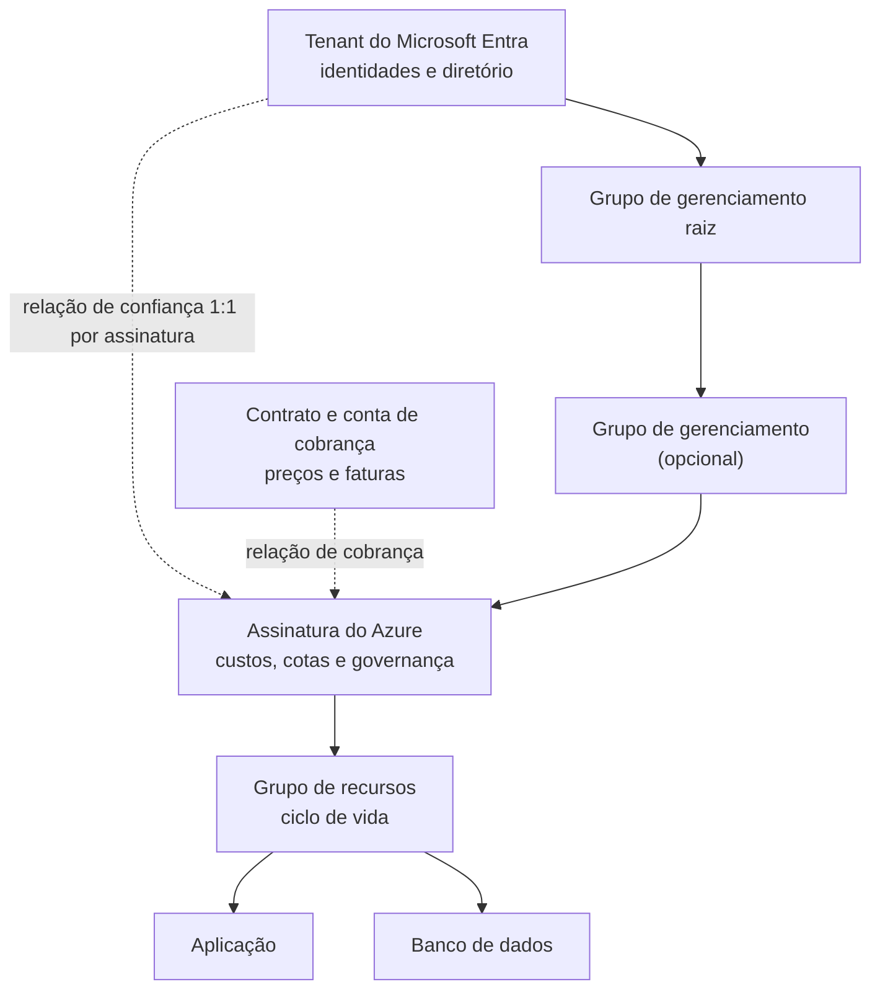

Uma equipe recebe a missão de colocar uma nova aplicação no Azure. A reunião começa bem, até surgirem três perguntas:

- “Vamos criar isso em qual tenant?”
- “Precisamos de outra assinatura?”
- “Não basta abrir um grupo de recursos?”

Os três termos aparecem próximos no portal, mas representam limites diferentes. O tenant do Microsoft Entra ID é o diretório de identidades no qual a assinatura do Azure confia; a assinatura delimita recursos, governança e consumo; e o grupo de recursos reúne componentes com um ciclo de vida operacional comum.

Imagine a aplicação como uma nova cafeteria de uma rede. O tenant reúne as identidades que podem receber acesso aos recursos por meio do RBAC do Azure. A assinatura estabelece em qual centro de custo e sob quais regras a operação acontece. O grupo de recursos reúne os equipamentos que serão administrados como uma unidade. A analogia ajuda a começar, mas o Azure acrescenta relações de confiança, herança de permissões e efeitos de exclusão que precisam ser entendidos sem atalhos.

Ao final deste artigo, você será capaz de localizar cada camada, explicar o que ela controla e escolher onde separar ambientes e cargas de trabalho.

## Antes de subir o primeiro recurso

Este conteúdo considera:

- um tenant do Microsoft Entra ID já existente;
- pelo menos uma assinatura ativa do Azure;
- acesso ao [portal do Azure](https://portal.azure.com/) ou ao Azure Cloud Shell;
- função **Reader (Leitor)** para consultar o ambiente;
- função **Contributor (Colaborador)**, ou permissão equivalente, no escopo da assinatura para criar o grupo de recursos do laboratório opcional.

O laboratório usa o modo Bash do Azure Cloud Shell e cria somente um grupo de recursos vazio. Ele não provisiona máquinas virtuais, bancos de dados ou outros serviços cobrados. Os comandos não foram executados contra um tenant real durante esta revisão editorial; valide-os em uma assinatura de laboratório sujeita às políticas da sua organização.

> O portal pode traduzir os nomes das funções, enquanto a CLI e os arquivos de infraestrutura como código frequentemente usam os nomes em inglês. Use sempre uma conta de laboratório e aplique o princípio do menor privilégio.

## A visão de trinta segundos

| Camada | Pergunta que responde | O que delimita |
| --- | --- | --- |
| Tenant do Microsoft Entra | De qual diretório vêm as identidades autorizáveis? | Diretório, autenticação e relação de confiança |
| Assinatura do Azure | Onde os recursos serão governados e contabilizados? | Recursos, custos, cotas, políticas e acesso |
| Grupo de recursos | O que será administrado no mesmo ciclo de vida? | Implantação, operação e exclusão de recursos relacionados |

Uma assinatura confia em **um tenant do Microsoft Entra por vez**, enquanto um tenant pode estar associado a várias assinaturas. Dentro da assinatura, cada recurso pertence a um único grupo de recursos, embora possa se comunicar com recursos de outros grupos.

## Tenant: a fronteira de identidade

Um tenant, chamado de **locatário** em parte da documentação em português, é uma instância dedicada do [Microsoft Entra ID](/posts/identidade-na-nuvem-microsoft-entra-id-para-iniciantes/). No Azure, ele fornece o diretório cujas entidades de segurança podem receber atribuições de função nas assinaturas que confiam nele. O valor `tenantId` exibido por `az account show` identifica esse diretório.

Quando alguém tenta administrar uma máquina virtual pelo portal ou por uma automação, o Microsoft Entra ID autentica a identidade. O RBAC do Azure avalia então a atribuição de função, que combina uma entidade de segurança, uma função e um escopo.

Três funções internas aparecem com frequência:

- **Reader (Leitor)** visualiza os recursos, mas não faz alterações;
- **Contributor (Colaborador)** gerencia os recursos, mas não concede acesso pelo RBAC do Azure;
- **Owner (Proprietário)** gerencia os recursos e também pode atribuir funções.

Essas são funções do RBAC do Azure. Elas não devem ser confundidas com funções de diretório do Microsoft Entra, como Administrador Global.

Essa diferença explica duas situações comuns:

1. uma pessoa pode existir no tenant e não ter acesso a nenhuma assinatura do Azure;
2. uma pessoa externa pode ser convidada para o tenant e receber uma função em apenas um grupo de recursos.

Se a organização usa Microsoft 365, ela pode usar o mesmo tenant do Microsoft Entra para as identidades. Isso não cria uma assinatura do Azure nem transforma licenças do Microsoft 365 em crédito para recursos de infraestrutura: no Azure, a assinatura é o contêiner em que recursos são provisionados, governados e contabilizados por consumo.

Em cenários de serviços gerenciados entre organizações, o [Azure Lighthouse](https://learn.microsoft.com/azure/lighthouse/overview?wt.mc_id=studentamb_365381) permite delegar assinaturas ou grupos de recursos a identidades de um tenant de gerenciamento. Essa delegação não mescla os diretórios nem altera o tenant ao qual a assinatura do cliente está associada.

## Assinatura do Azure: governança, consumo e isolamento

A assinatura é o limite que reúne os recursos consumidos no Azure. Ela possui um identificador próprio, o `subscriptionId`, e está ligada tanto a um tenant, para confiança de identidade, quanto a um contrato de cobrança. Essas relações cumprem funções diferentes.

Na prática, a assinatura é um escopo importante para:

- analisar custos e configurar orçamentos e alertas com o [Microsoft Cost Management](https://learn.microsoft.com/azure/cost-management-billing/?wt.mc_id=studentamb_365381);
- aplicar Azure Policy, com definições como `Allowed locations` e `Require a tag on resources`, além de atribuições do RBAC do Azure;
- controlar cotas e limites de serviço;
- separar ambientes, equipes ou requisitos regulatórios;
- organizar recursos abaixo de um mesmo limite administrativo.

Criar mais de uma assinatura não significa criar mais de um tenant. Uma organização pode manter as identidades no mesmo diretório e separar, por exemplo:

```text title="Separação por ambiente"
sub-plataforma-prod
sub-plataforma-nao-prod
sub-conectividade
```

Essa divisão oferece isolamento mais forte entre produção e desenvolvimento do que apenas criar dois grupos de recursos. Uma política aplicada à assinatura de produção pode restringir regiões, tipos de recursos ou configurações sem afetar o laboratório. Orçamentos, cotas e delegações também podem ser tratados separadamente.

Não existe, entretanto, uma estrutura universal. Uma assinatura por pequena aplicação pode multiplicar processos e permissões sem benefício real. A decisão deve considerar criticidade, responsabilidade operacional, limites de escala, conformidade e modelo de custos.

## Grupo de recursos: uma unidade de ciclo de vida

Um grupo de recursos é um contêiner do Azure Resource Manager dentro de uma assinatura. O critério mais útil para decidir o que colocar nele é simples:

> Esses recursos devem ser implantados, alterados e removidos juntos?

Se a resposta for sim, eles provavelmente compartilham um grupo de recursos. A aplicação da nossa cafeteria poderia começar assim:

```text title="Grupos por responsabilidade e ciclo de vida"
rg-cafeteria-prod-app
rg-cafeteria-prod-data
rg-cafeteria-prod-monitoring
```

Separar aplicação, dados e monitoramento pode fazer sentido quando cada parte tem responsáveis, permissões ou ciclos de retenção diferentes. Um banco de dados que precisa sobreviver à substituição da aplicação não deveria ser excluído junto com ela por conveniência estética.

Alguns fatos evitam armadilhas:

- cada recurso pertence a apenas um grupo de recursos;
- recursos de grupos diferentes podem se comunicar;
- um grupo pode conter recursos implantados em regiões diferentes;
- a região do grupo determina onde seus metadados são armazenados, não obriga todos os recursos a usar essa região;
- excluir o grupo inicia a exclusão dos recursos contidos nele.

> [!WARNING]
> **Herança de tags:** marcas aplicadas ao grupo de recursos não são herdadas automaticamente pelos recursos contidos nele. Use o Azure Policy para exigir tags ou copiar valores para os recursos com o efeito `modify`.

O último ponto transforma o grupo de recursos em uma excelente unidade para laboratórios descartáveis e em uma fronteira perigosa quando recursos com retenções diferentes são misturados.

## Como as camadas se relacionam

O tenant não deve ser entendido apenas como uma pasta acima da assinatura. Ele fornece o diretório de identidades com o qual a assinatura mantém uma relação de confiança. A cobrança também se relaciona com a assinatura, mas por outro caminho.

Embora o foco seja a tríade principal, ambientes com várias assinaturas acrescentam os **grupos de gerenciamento (Management Groups)**. Eles fornecem um escopo de governança acima das assinaturas: atribuições do Azure Policy e do RBAC do Azure aplicadas ao grupo podem ser herdadas pelas assinaturas, pelos grupos de recursos e pelos recursos descendentes. Assim, a organização mantém controles consistentes sem repetir cada configuração em todas as assinaturas.



Linhas contínuas representam a hierarquia de gerenciamento. Linhas pontilhadas representam relações de confiança ou cobrança.

Todo diretório possui um grupo de gerenciamento raiz. Grupos adicionais são opcionais e merecem um artigo próprio quando a organização precisa desenhar governança para muitas assinaturas.

Nos escopos do Azure Resource Manager, a ordem é:

```text title="Escopos de gerenciamento"
grupo de gerenciamento → assinatura → grupo de recursos → recurso
```

Configurações aplicadas em níveis superiores podem alcançar os descendentes. Uma atribuição de função na assinatura, por exemplo, pode conceder acesso aos seus grupos de recursos e recursos. Por isso, conceder **Owner (Proprietário)** no topo “para resolver rápido” amplia a superfície de risco muito além do recurso que motivou o chamado.

A mesma hierarquia orienta a infraestrutura como código. Arquivos Bicep usam `targetScope` para declarar se uma implantação começa no tenant, no grupo de gerenciamento, na assinatura ou no grupo de recursos. O escopo padrão é o grupo de recursos; para criar grupos, políticas ou atribuições no nível da assinatura, por exemplo:

```bicep title="Definir a assinatura como escopo de implantação"
targetScope = 'subscription'
```

Os outros valores são `tenant`, `managementGroup` e `resourceGroup`. Modelos ARM oferecem os mesmos níveis de implantação, mas nem todo tipo de recurso pode ser criado em qualquer escopo, e a identidade que executa a implantação precisa ter as permissões correspondentes.

## Um cenário: da pressa à arquitetura

A equipe da cafeteria poderia colocar produção e testes na mesma assinatura e no mesmo grupo de recursos. Tecnicamente, muitos serviços funcionariam. Operacionalmente, a equipe criaria quatro problemas:

1. custos de teste e produção seriam mais difíceis de separar;
2. permissões temporárias de desenvolvimento alcançariam recursos críticos;
3. uma política específica de produção não teria um limite claro;
4. a exclusão do laboratório poderia atingir dados que deveriam permanecer.

Uma organização possível seria:


O tenant continua único porque a organização quer identidades e políticas de acesso centralizadas. As assinaturas separam produção de não produção. Os grupos de recursos, por sua vez, acompanham ciclos de vida diferentes dentro de cada ambiente.

Essa estrutura não é uma receita obrigatória. É uma decisão justificável para o cenário: identidade comum, isolamento administrativo entre ambientes e proteção do ciclo de vida dos dados.

O desenho também está alinhado aos [princípios de Azure Landing Zones do Cloud Adoption Framework](https://learn.microsoft.com/azure/cloud-adoption-framework/ready/landing-zone/design-principles?wt.mc_id=studentamb_365381), que tratam assinaturas como unidades de gerenciamento e recomendam separar ambientes de aplicação, como desenvolvimento, teste e produção. Isso não significa criar uma assinatura para cada recurso: uma zona de destino de aplicação pode usar uma ou mais assinaturas conforme os requisitos de escala, segurança e limites de serviço.

Com o desenho definido, o próximo passo é confirmar se a CLI está apontando para o tenant e a assinatura planejados antes de criar qualquer estrutura.

## Confira o contexto antes de executar qualquer comando

IDs são mais seguros do que nomes de exibição para automações. Duas assinaturas podem ter nomes parecidos, mas seus identificadores são únicos.

No Azure Cloud Shell, liste os contextos aos quais sua identidade tem acesso:

```bash title="Listar tenants e assinaturas disponíveis"
az account list \
  --all \
  --query "[].{assinatura:name, subscriptionId:id, tenantId:tenantId, estado:state}" \
  --output table
```

Defina explicitamente a assinatura do laboratório. Substitua o valor indicado:

```bash title="Selecionar e validar a assinatura"
SUBSCRIPTION_ID="<SUBSCRIPTION_ID>"

az account set --subscription "$SUBSCRIPTION_ID"

az account show \
  --query "{assinatura:name, subscriptionId:id, tenantId:tenantId}" \
  --output table
```

Pare se o `subscriptionId` ou o `tenantId` retornado não corresponder ao ambiente autorizado. Trocar o contexto antes de validar é uma das maneiras mais simples de criar um recurso no cliente, ambiente ou centro de custo errado.

## Crie um grupo de recursos de laboratório

Escolha um nome e uma região permitidos pela sua organização:

```bash title="Criar um grupo de recursos vazio"
RESOURCE_GROUP="<RESOURCE_GROUP>"
LOCATION="<AZURE_REGION>"

az group create \
  --name "$RESOURCE_GROUP" \
  --location "$LOCATION" \
  --tags environment=lab managed-by=manual
```

O comando não cria uma “subdivisão de identidade”. Ele cria um escopo de gerenciamento na assinatura atualmente selecionada. As identidades continuam vindo do tenant, e o acesso dependerá das atribuições do RBAC.

Valide o resultado e registre os identificadores:

```bash title="Validar o grupo criado"
az group show \
  --name "$RESOURCE_GROUP" \
  --query "{nome:name, localizacao:location, estado:properties.provisioningState, id:id}" \
  --output json
```

O campo `id` deve seguir esta estrutura:

```text
/subscriptions/<SUBSCRIPTION_ID>/resourceGroups/<RESOURCE_GROUP>
```

Esse caminho evidencia a hierarquia: o grupo de recursos está dentro de uma assinatura específica.

## Segurança, impacto e reversão

Antes de adotar a estrutura em produção:

- atribua funções no menor escopo que atenda à necessidade;
- evite usar contas de Administrador Global para tarefas rotineiras do Azure;
- aplique políticas e bloqueios somente após avaliar a herança e o impacto;
- separe recursos com ciclos de retenção diferentes;
- configure orçamentos e alertas de custo no Microsoft Cost Management;
- valide se um tipo de recurso suporta movimentação antes de reorganizá-lo;
- trate IDs de tenant e assinatura como identificadores operacionais, não como credenciais secretas.

Mover recursos entre grupos ou assinaturas pode exigir dependências adicionais e bloquear temporariamente os grupos de origem e destino para alterações. Planeje e valide a operação em vez de presumir que ela equivale a arrastar um arquivo entre pastas.

Para remover **somente o grupo vazio criado no laboratório**, confirme novamente o contexto e o nome:

```bash title="Revisar o alvo antes da exclusão"
az account show \
  --query "{assinatura:name, subscriptionId:id, tenantId:tenantId}" \
  --output table

az resource list \
  --resource-group "$RESOURCE_GROUP" \
  --output table
```

Se a listagem não estiver vazia, não prossiga até identificar cada recurso e seu requisito de retenção. Quando o alvo estiver correto:

```bash title="Excluir o grupo de laboratório"
az group delete \
  --name "$RESOURCE_GROUP" \
  --yes
```

Excluir um grupo de recursos é uma operação destrutiva e tenta excluir tudo o que está dentro dele. Em produção, um bloqueio contra exclusão pode reduzir acidentes, mas não substitui permissões mínimas, revisão de mudança e backups testados.

## Erros de interpretação que custam caro

### “Vou criar outro tenant para separar produção”

Outro tenant cria uma nova fronteira de identidade e aumenta a complexidade de colaboração, administração e automação. Se o objetivo é separar custo, cotas, políticas ou operação, assinaturas distintas no mesmo tenant costumam ser o primeiro desenho a avaliar.

### “Grupo de recursos serve apenas para organizar a tela”

Ele é um escopo real do Azure Resource Manager. Permissões, políticas, bloqueios, implantações e exclusões podem operar nesse nível.

## Um checklist para decidir

Antes de criar qualquer camada, responda:

**Tenant**

- As identidades pertencem à mesma organização e fronteira de confiança?
- Há uma exigência real de isolamento de diretório?
- Como serão administrados acessos de emergência e convidados?

**Assinatura**

- Produção precisa de isolamento administrativo em relação a desenvolvimento?
- Custos, cotas, políticas ou conformidade exigem separação?
- Quem será responsável pelo consumo e pelas permissões?

**Grupo de recursos**

- Os recursos compartilham implantação e exclusão?
- Dados e aplicação têm a mesma retenção?
- A equipe precisa delegar acesso apenas a essa carga?

Se a justificativa for apenas “fica mais bonito no portal”, volte ao problema. Uma boa hierarquia não é a que tem mais camadas; é a que torna acesso, custo e mudança previsíveis.

## Referências

**Identidade e acesso**

- [O que é o Microsoft Entra?](https://learn.microsoft.com/entra/fundamentals/what-is-entra?wt.mc_id=studentamb_365381)
- [Assinaturas, licenças, contas e locatários para ofertas de nuvem da Microsoft](https://learn.microsoft.com/microsoft-365/enterprise/subscriptions-licenses-accounts-and-tenants-for-microsoft-cloud-offerings?view=o365-worldwide&wt.mc_id=studentamb_365381)
- [Entender o escopo do RBAC do Azure](https://learn.microsoft.com/azure/role-based-access-control/scope-overview?wt.mc_id=studentamb_365381)
- [Funções internas do Azure](https://learn.microsoft.com/azure/role-based-access-control/built-in-roles?wt.mc_id=studentamb_365381)
- [O que é o Azure Lighthouse?](https://learn.microsoft.com/azure/lighthouse/overview?wt.mc_id=studentamb_365381)

**Governança e arquitetura**

- [Relação de faturamento e cliente](https://learn.microsoft.com/azure/cost-management-billing/understand/understand-billing-tenant-relationship?wt.mc_id=studentamb_365381)
- [O que é o Azure Resource Manager?](https://learn.microsoft.com/azure/azure-resource-manager/management/overview?wt.mc_id=studentamb_365381)
- [O que são grupos de gerenciamento do Azure?](https://learn.microsoft.com/azure/governance/management-groups/overview?wt.mc_id=studentamb_365381)
- [Princípios de design de zonas de destino do Azure](https://learn.microsoft.com/azure/cloud-adoption-framework/ready/landing-zone/design-principles?wt.mc_id=studentamb_365381)
- [Gerenciar a governança de marcas com o Azure Policy](https://learn.microsoft.com/azure/governance/policy/tutorials/govern-tags?wt.mc_id=studentamb_365381)

**Automação e operação**

- [Implantações de grupo de recursos com arquivos Bicep](https://learn.microsoft.com/azure/azure-resource-manager/bicep/deploy-to-resource-group?wt.mc_id=studentamb_365381)
- [Mover recursos do Azure para um novo grupo de recursos ou assinatura](https://learn.microsoft.com/azure/azure-resource-manager/management/move-resource-group-and-subscription?wt.mc_id=studentamb_365381)
- [Obter IDs de assinatura e locatário no portal do Azure](https://learn.microsoft.com/azure/azure-portal/get-subscription-tenant-id?wt.mc_id=studentamb_365381)

## Conclusão

Tenant, assinatura e grupo de recursos formam relações complementares:

- o tenant do Microsoft Entra fornece o diretório de identidades no qual a assinatura confia;
- a assinatura delimita recursos, governança, cotas e consumo;
- o grupo de recursos reúne componentes com um ciclo de vida operacional coerente.

Na história da cafeteria, a melhor decisão não foi criar mais pastas. Foi separar as perguntas: **quem pode entrar, onde a operação será controlada e o que deve mudar junto**. Quando essas respostas estão claras, a hierarquia deixa de ser burocracia e passa a funcionar como uma proteção para pessoas, orçamento e produção.
