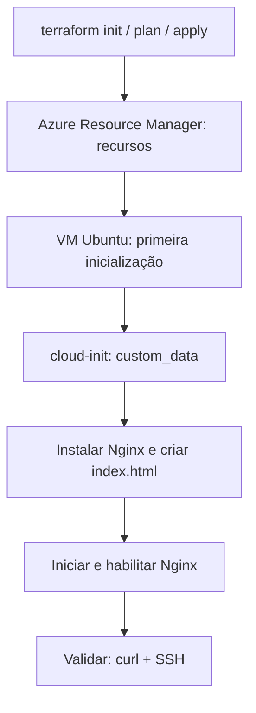

## Introdução

A primeira VM pelo portal costuma dar certo. A segunda também, até alguém perguntar qual imagem você escolheu, quem liberou o SSH e como aquele Nginx foi instalado. O histórico do navegador ainda não virou documentação de infraestrutura.

Quando essas decisões ficam na memória de quem clicou, repetir o ambiente vira uma tarefa artesanal. As diferenças acumuladas de tamanho, rede e configuração entre o ambiente esperado e o real são chamadas de **configuration drift**.

Infrastructure as Code, ou **IaC**, registra a infraestrutura em arquivos revisáveis e versionáveis. Neste laboratório, o Terraform descreve os recursos do Azure, enquanto o cloud-init prepara o Ubuntu na primeira inicialização, até servir uma página pelo Nginx.

Todo o código utilizado neste artigo está disponível no [repositório do laboratório no GitHub](https://github.com/tkusal/VM-Linux-no-Azure-com-Terraform-e-Cloud-Init).

### O que você precisa saber antes

Este guia é para quem já criou uma VM pelo portal, conhece o básico de SSH e portas TCP e está começando com Terraform. CIDR e NSG serão explicados durante o laboratório.

Os comandos locais usam **PowerShell no Windows**. Em Bash, adapte as atribuições e troque `Copy-Item` por `cp` e `curl.exe` por `curl`; HCL e YAML permanecem iguais.

### Resultado esperado

Após `terraform apply` e a configuração inicial, você terá uma VM Ubuntu com Nginx na porta 80 e SSH por chave, sem cliques no portal. Ao terminar, remova o laboratório com `terraform destroy`.

O foco é Azure Compute Infrastructure: provisionamento, inicialização e ciclo de vida de uma VM. O exemplo usa HTTP público e uma única instância, sem alta disponibilidade. Não é uma arquitetura de produção.

Para acesso administrativo sem IP público na VM, considere [Azure Bastion](https://learn.microsoft.com/en-us/azure/bastion/bastion-overview?wt.mc_id=studentamb_365381). Sua configuração e avaliação de custo ficam fora deste laboratório.

## Fundamentos: o que faz o Terraform e o que faz o cloud-init

O Terraform lê arquivos em HCL, uma linguagem de configuração, e usa um **provider**, o componente que conversa com a API do serviço. Aqui, `azurerm` conecta o Terraform ao Azure Resource Manager, a camada de gerenciamento dos recursos do Azure.

| Ferramenta | Responsabilidade neste laboratório                                     |
| ---------- | ---------------------------------------------------------------------- |
| Terraform  | Criar grupo de recursos, rede, regras, IP, interface e VM              |
| cloud-init | Instalar pacotes, escrever a página e iniciar o Nginx dentro do Ubuntu |

O cloud-init já vem integrado à imagem escolhida. Não instalaremos Terraform dentro da VM. Ele roda no seu computador e envia a descrição da infraestrutura ao Azure.



Existe uma diferença entre a infraestrutura estar criada e a aplicação estar pronta. O Azure pode informar sucesso antes de o cloud-init terminar. Por isso, o teste HTTP faz parte do procedimento, conforme a [documentação de custom data](https://learn.microsoft.com/en-us/azure/virtual-machines/custom-data?wt.mc_id=studentamb_365381).

### Pré-requisitos e ambiente de referência

- Assinatura Azure de laboratório, com permissão Contributor no escopo necessário. Como criaremos um grupo de recursos, somente acesso a um grupo existente não basta.
- Providers de recursos `Microsoft.Compute` e `Microsoft.Network` já registrados na assinatura. Se necessário, peça o registro ao administrador.
- Terraform CLI `1.15.8`, Azure CLI instalada e PowerShell com `ssh` e `curl.exe` disponíveis.
- Par de chaves SSH local: a pública vai para a VM; a privada permanece com você. O exemplo usa `~/.ssh/id_ed25519.pub`.
- Quota e disponibilidade para o tamanho de VM na região escolhida.

Usaremos ED25519, um dos [formatos de chave suportados pelo Azure](https://learn.microsoft.com/en-us/azure/virtual-machines/linux/mac-create-ssh-keys?wt.mc_id=studentamb_365381). Se ainda não tiver esse par, gere-o localmente:

```powershell
ssh-keygen -t ed25519
```

Proteja a chave privada com uma frase secreta. Aceite o caminho padrão somente se não houver uma chave existente nesse local; não sobrescreva uma chave em uso.

O código foi formatado e validado localmente com Terraform `1.15.8` e AzureRM [`5.3.0`](https://github.com/hashicorp/terraform-provider-azurerm/releases/tag/v5.3.0), em Windows. **Nenhum recurso Azure foi provisionado durante a preparação deste artigo.** A validação local não comprova disponibilidade regional nem o funcionamento do servidor na nuvem.

## Provisionando a base de rede e o resource group com Terraform

Use os arquivos do repositório ou crie a pasta `vmlinux` com os exemplos abaixo. O Terraform carrega todos os `.tf` do diretório como uma configuração.

```text
vmlinux/
  providers.tf
  variables.tf
  network.tf
  vm.tf
  outputs.tf
  cloud-init.yaml
  terraform.tfvars.example
  .gitignore
  .terraform.lock.hcl
  LICENSE
  README.md
```

### Provider e autenticação

O arquivo `providers.tf` fixa a versão do provider. O registro automático de providers de recursos fica desativado, evitando que a configuração tente habilitar serviços na assinatura durante o planejamento. Esse comportamento é documentado no [provider AzureRM](https://registry.terraform.io/providers/hashicorp/azurerm/5.3.0/docs).

```hcl title="providers.tf"
# Educational example. Replace placeholders in terraform.tfvars.example locally.
terraform {
  required_version = ">= 1.15.8, < 2.0.0"

  required_providers {
    azurerm = {
      source  = "hashicorp/azurerm"
      version = "5.3.0"
    }
  }
}

provider "azurerm" {
  features {}

  subscription_id                 = var.subscription_id
  tenant_id                       = var.tenant_id
  resource_provider_registrations = "none"
}
```

Autentique a Azure CLI e confira o contexto. Substitua os identificadores entre sinais de menor e maior pelos valores da sua assinatura, apenas no ambiente local:

```powershell
az login --tenant "<TENANT_ID>"
az account set --subscription "<SUBSCRIPTION_ID>"
az account show --query "{subscription:name,id:id,tenant:tenantId}" --output table
az provider show --namespace Microsoft.Compute --query registrationState --output tsv
az provider show --namespace Microsoft.Network --query registrationState --output tsv
```

Os dois últimos comandos devem retornar `Registered`. A autenticação via Service Principal é uma alternativa para automações futuras, fora do escopo deste laboratório.

Consulte o uso e os limites de cota antes do `apply`:

```powershell
az vm list-usage --location brazilsouth --output table
```

Compare uso e limite de vCPUs regional e da família da VM, conforme as [cotas do Azure](https://learn.microsoft.com/en-us/azure/virtual-machines/quotas?wt.mc_id=studentamb_365381). Use a mesma região de `location`. Cota suficiente não garante capacidade disponível para o tamanho escolhido.

### Variáveis e valores locais

`variables.tf` declara as entradas. `location` escolhe a região, `prefix` organiza os nomes e os CIDRs representam faixas de endereços de rede. A subnet precisa estar contida na VNet e não deve conflitar com redes que você pretende conectar depois.

```hcl title="variables.tf"
# Educational example. No real identifiers or private keys belong in this file.
variable "subscription_id" {
  type        = string
  description = "Azure subscription ID. Replace <SUBSCRIPTION_ID> locally."
}

variable "tenant_id" {
  type        = string
  description = "Microsoft Entra tenant ID. Replace <TENANT_ID> locally."
}

variable "location" {
  type        = string
  description = "Azure region. Check VM size availability and your quota."
  default     = "brazilsouth"
}

variable "prefix" {
  type        = string
  description = "Short prefix for a dedicated lab, not an existing environment."
  default     = "rookie-vm-lab"

  validation {
    condition     = can(regex("^[a-z][a-z0-9-]{1,19}$", var.prefix))
    error_message = "Use 2 to 20 lowercase letters, digits or hyphens; start with a letter."
  }
}

variable "vnet_cidr" {
  type        = string
  description = "Private IPv4 network range."
  default     = "10.42.0.0/16"
}

variable "subnet_cidr" {
  type        = string
  description = "Subnet range, contained within vnet_cidr."
  default     = "10.42.1.0/24"
}

variable "admin_source_cidr" {
  type        = string
  description = "Your current public IPv4 address followed by /32."

  validation {
    condition     = can(cidrnetmask(var.admin_source_cidr)) && endswith(var.admin_source_cidr, "/32")
    error_message = "Use a single valid IPv4 address with /32, not 0.0.0.0/0."
  }
}

variable "ssh_public_key_path" {
  type        = string
  description = "Public key path only. Example: ~/.ssh/id_ed25519.pub."
}

variable "vm_size" {
  type        = string
  description = "Example VM size; availability and pricing vary by subscription and region."
  default     = "Standard_B2s"
}

variable "image_version" {
  type        = string
  description = "Use a specific image version when a fixed base image is required."
  default     = "latest"
}
```

Agora salve `terraform.tfvars.example`:

```hcl title="terraform.tfvars.example"
# Educational example. Copy to terraform.tfvars and replace placeholders locally.
# Never commit the populated terraform.tfvars file.
subscription_id     = "<SUBSCRIPTION_ID>"
tenant_id           = "<TENANT_ID>"
location            = "brazilsouth"
prefix              = "rookie-vm-lab"
vnet_cidr           = "10.42.0.0/16"
subnet_cidr         = "10.42.1.0/24"
admin_source_cidr   = "<YOUR_PUBLIC_IPV4>/32"
ssh_public_key_path = "~/.ssh/id_ed25519.pub"
vm_size             = "Standard_B2s"
image_version       = "latest"
```

Copie o exemplo localmente:

```powershell
Copy-Item terraform.tfvars.example terraform.tfvars
```

Edite a cópia e substitua todos os placeholders. Em `admin_source_cidr`, use seu IPv4 público de saída seguido de `/32`, que representa um único endereço. Não use o IP privado do notebook. Se estiver conectado por VPN, considere o endereço de saída dessa conexão.

Para consultar o IPv4 de saída no PowerShell, use o serviço externo [ifconfig.me](https://ifconfig.me/):

```powershell
curl.exe -4 --fail --silent --show-error https://ifconfig.me/ip
```

Em Bash:

```bash
curl -4 --fail --silent --show-error https://ifconfig.me/ip
```

Copie o endereço retornado e acrescente `/32`. `-4` força IPv4, e `/ip` retorna somente o endereço. Siga as políticas da sua organização para consultas externas; proxies ou VPNs com rotas diferentes podem apresentar um IP distinto do usado pelo SSH.

Adapte o caminho da chave pública. `Standard_B2s` é um exemplo sujeito a disponibilidade na assinatura e região, sem promessa de menor preço.

### Rede e regras de entrada

Um Network Security Group, ou **NSG**, filtra tráfego conforme origem, destino, protocolo e porta. Para acesso pela internet, liberamos SSH somente do seu `/32` e HTTP na porta 80. As regras padrão do NSG continuam existindo, inclusive as que permitem tráfego interno da VNet.

```hcl title="network.tf"
# Educational example. Public HTTP is intentional; SSH is restricted to your IPv4 /32.
locals {
  tags = {
    project     = "azure-vm-terraform-cloudinit"
    environment = "lab"
    managed_by  = "terraform"
  }
}

resource "azurerm_resource_group" "lab" {
  name     = "rg-${var.prefix}"
  location = var.location
  tags     = local.tags
}

resource "azurerm_virtual_network" "lab" {
  name                = "vnet-${var.prefix}"
  location            = azurerm_resource_group.lab.location
  resource_group_name = azurerm_resource_group.lab.name
  address_space       = [var.vnet_cidr]
  tags                = local.tags
}

resource "azurerm_subnet" "web" {
  name                            = "snet-web"
  resource_group_name             = azurerm_resource_group.lab.name
  virtual_network_name            = azurerm_virtual_network.lab.name
  address_prefixes                = [var.subnet_cidr]
  default_outbound_access_enabled = false
}

resource "azurerm_network_security_group" "web" {
  name                = "nsg-${var.prefix}"
  location            = azurerm_resource_group.lab.location
  resource_group_name = azurerm_resource_group.lab.name
  tags                = local.tags

  security_rule {
    name                       = "AllowSshFromAdmin"
    priority                   = 100
    direction                  = "Inbound"
    access                     = "Allow"
    protocol                   = "Tcp"
    source_port_range          = "*"
    destination_port_range     = "22"
    source_address_prefix      = var.admin_source_cidr
    destination_address_prefix = "*"
  }

  security_rule {
    name                       = "AllowHttpFromInternet"
    priority                   = 110
    direction                  = "Inbound"
    access                     = "Allow"
    protocol                   = "Tcp"
    source_port_range          = "*"
    destination_port_range     = "80"
    source_address_prefix      = "Internet"
    destination_address_prefix = "*"
  }
}

resource "azurerm_public_ip" "web" {
  name                = "pip-${var.prefix}"
  location            = azurerm_resource_group.lab.location
  resource_group_name = azurerm_resource_group.lab.name
  allocation_method   = "Static"
  sku                 = "Standard"
  tags                = local.tags
}

resource "azurerm_network_interface" "web" {
  name                = "nic-${var.prefix}"
  location            = azurerm_resource_group.lab.location
  resource_group_name = azurerm_resource_group.lab.name
  tags                = local.tags

  ip_configuration {
    name                          = "primary"
    subnet_id                     = azurerm_subnet.web.id
    private_ip_address_allocation = "Dynamic"
    public_ip_address_id          = azurerm_public_ip.web.id
  }
}

resource "azurerm_network_interface_security_group_association" "web" {
  network_interface_id      = azurerm_network_interface.web.id
  network_security_group_id = azurerm_network_security_group.web.id
}
```

O grupo `rg-rookie-vm-lab` deve ser exclusivo deste exercício. Prefixos como `vnet`, `nsg` e `nic` indicam a função do recurso. A NIC é a interface que conecta a VM à subnet e recebe a associação com o IP público e o NSG.

O IP usa SKU `Standard` com alocação `Static`. A subnet desativa a saída implícita com `default_outbound_access_enabled = false`, mas a VM possui uma saída explícita pelo IP público associado à NIC. Isso permite baixar pacotes, mantendo as regras padrão de saída do NSG. Veja a [documentação de conectividade de saída](https://learn.microsoft.com/en-us/azure/virtual-network/ip-services/default-outbound-access?wt.mc_id=studentamb_365381).

## Criando a VM Linux com autenticação por chave SSH

Salve o arquivo `vm.tf` completo. Ele referencia o YAML que criaremos na próxima seção, portanto espere concluir todos os arquivos antes de validar:

```hcl title="vm.tf"
# Educational example. Only the public SSH key is passed to Azure.
resource "azurerm_linux_virtual_machine" "web" {
  name                            = "vm-${var.prefix}"
  computer_name                   = "vm-${var.prefix}"
  location                        = azurerm_resource_group.lab.location
  resource_group_name             = azurerm_resource_group.lab.name
  size                            = var.vm_size
  admin_username                  = "azureuser"
  disable_password_authentication = true
  network_interface_ids           = [azurerm_network_interface.web.id]
  custom_data                     = filebase64("${path.module}/cloud-init.yaml")
  tags                            = local.tags

  admin_ssh_key {
    username   = "azureuser"
    public_key = file(pathexpand(var.ssh_public_key_path))
  }

  os_disk {
    name                 = "osdisk-${var.prefix}"
    caching              = "ReadWrite"
    storage_account_type = "StandardSSD_LRS"
  }

  source_image_reference {
    publisher = "Canonical"
    offer     = "ubuntu-24_04-lts"
    sku       = "server"
    version   = var.image_version
  }

  boot_diagnostics {}

  # Attach the NSG before boot so the VM starts with its inbound rules in place.
  depends_on = [azurerm_network_interface_security_group_association.web]
}
```

A imagem é Ubuntu Server 24.04 LTS, geração 2, arquitetura x64. A combinação `Canonical:ubuntu-24_04-lts:server` segue o [catálogo oficial da Canonical](https://ubuntu.com/azure/docs/azure-how-to/instances/find-ubuntu-images/). Escolhemos uma LTS conhecida, sem depender de ela ser a mais recente.

`latest` facilita o laboratório, mas pode resolver para uma imagem diferente em outra data. Para repetir uma base específica, configure `image_version` com uma versão disponível na região. Os pacotes instalados pelo Ubuntu também evoluem: infraestrutura reproduzível não significa sistema idêntico byte a byte.

`file(pathexpand(...))` expande `~` e lê apenas a chave pública. Não existe senha de administrador no exemplo, e `disable_password_authentication = true` desabilita autenticação SSH por senha. Nunca coloque a chave privada em HCL, YAML ou outputs.

O bloco vazio `boot_diagnostics` habilita diagnóstico de inicialização com armazenamento gerenciado. `depends_on` garante que a associação do NSG seja criada antes da VM. As demais dependências já são inferidas pelas referências entre recursos.

Em `outputs.tf`, exponha apenas os valores necessários para validar e limpar:

```hcl title="outputs.tf"
# Educational example. Outputs contain no private keys or passwords.
output "public_ip_address" {
  description = "Public IPv4 address used for HTTP and SSH validation."
  value       = azurerm_public_ip.web.ip_address
}

output "resource_group_name" {
  description = "Dedicated resource group to check before and after cleanup."
  value       = azurerm_resource_group.lab.name
}
```

## Automatizando com cloud-init: Nginx na primeira inicialização

Crie `cloud-init.yaml` no mesmo diretório:

```yaml title="cloud-init.yaml"
#cloud-config
# Educational example. Never put secrets in custom_data; base64 is not encryption.
package_update: true
packages:
  - nginx

write_files:
  - path: /var/www/html/index.html
    owner: root:root
    permissions: '0644'
    # Write after packages are installed, before runcmd runs.
    defer: true
    content: |
      <!doctype html>
      <html lang="en">
        <head>
          <meta charset="utf-8">
          <meta name="viewport" content="width=device-width, initial-scale=1">
          <title>RookieOps Azure VM Lab</title>
        </head>
        <body>
          <h1>RookieOps: Nginx is ready!</h1>
          <p>Provisioned with Terraform. Configured with cloud-init.</p>
        </body>
      </html>

runcmd:
  - [nginx, -t]
  - [systemctl, enable, --now, nginx]
```

A primeira linha identifica o documento como configuração do cloud-init. `package_update` atualiza o índice de pacotes, sem solicitar uma atualização completa do sistema. `packages` instala o Nginx e suas dependências.

`write_files` cria a página, legível pelo servidor e alterável somente pelo administrador. Com `defer: true`, a gravação espera a instalação dos pacotes. Os comandos de `runcmd` verificam a configuração e habilitam o Nginx agora e nos próximos boots.

O módulo `runcmd` pertence ao estágio _config_, mas ali apenas grava um script. Quem o executa é `scripts_user`, no estágio _final_. Na configuração padrão do Ubuntu, a ordem nesse estágio é `package_update_upgrade_install`, `write_files_deferred` e depois `scripts_user`: pacotes, página e comandos. Veja a [referência de módulos](https://docs.cloud-init.io/en/latest/reference/modules.html#runcmd).

No Ubuntu, instalar o pacote Nginx normalmente já inicia e habilita o serviço, conforme os scripts do pacote e as políticas locais. Não é garantia geral do `apt`. Mantemos `systemctl enable --now nginx` explícito, mesmo com o serviço ativo. Veja a [política Debian para serviços](https://www.debian.org/doc/debian-policy/ch-opersys.html#starting-system-services).

No Terraform, `filebase64()` lê o YAML e o codifica para `custom_data`, como a API espera. Base64 não oferece sigilo. Não inclua tokens, senhas ou chaves privadas nesse conteúdo.

Os módulos usados aqui executam uma vez por instância, durante sua configuração inicial. O cloud-init também tem etapas executadas em outros boots, mas reiniciar a VM não reaplica automaticamente esta receita. A Custom Script Extension é outro mecanismo do Azure para executar scripts e não é usada neste exemplo.

Alterar `custom_data` neste recurso força a substituição da VM, conforme a [referência de `azurerm_linux_virtual_machine`](https://registry.terraform.io/providers/hashicorp/azurerm/5.3.0/docs/resources/linux_virtual_machine). Revise o plano antes de confirmar qualquer mudança no YAML: o disco do sistema deste laboratório é descartável.

## Validação e diagnóstico de falhas

Com todos os arquivos salvos e o `terraform.tfvars` preenchido, execute:

```powershell
terraform init
terraform fmt -check -recursive
terraform validate
terraform plan
terraform apply
```

`init` instala o provider e cria `.terraform.lock.hcl`, que deve ser versionado. `validate` verifica a configuração local. O plano consulta o Azure e mostra o que pretende alterar; não testa a instalação do Nginx.

Para um diretório novo e sem recursos anteriores, espere oito recursos Terraform a criar. O disco do sistema faz parte da definição da VM. No `apply`, confira novamente assinatura, região, regras e ações antes de responder `yes`. Não usamos aprovação automática.

### Confirmando o resultado

Obtenha o IP, conecte por SSH e aguarde o cloud-init:

```powershell
$publicIp = terraform output -raw public_ip_address
$sshKeyPath = Join-Path $env:USERPROFILE '.ssh\id_ed25519'
ssh -i "$sshKeyPath" "azureuser@$publicIp" 'sudo cloud-init status --wait --long'
curl.exe --fail --show-error --include --connect-timeout 5 --max-time 15 "http://$publicIp"
ssh -i "$sshKeyPath" "azureuser@$publicIp"
```

No PowerShell do Windows, `Join-Path` monta o caminho a partir de `$env:USERPROFILE`, sem depender da expansão de `~` em comandos externos. Em Bash, use `~/.ssh/id_ed25519` no argumento `-i`.

Use a chave privada correspondente à pública cadastrada. Na primeira conexão, confira a identidade do servidor antes de aceitar sua chave de host. Se o SSH ainda não estiver disponível, aguarde brevemente e tente novamente.

Os critérios são: cloud-init concluído sem erros, HTTP `200` com a frase `RookieOps: Nginx is ready!` e login como `azureuser`. Uma página padrão do Nginx comprova o servidor HTTP, mas não comprova que sua página personalizada foi escrita.

Dentro da sessão SSH, estes comandos ajudam a localizar falhas:

```bash
sudo cloud-init status --long
sudo cloud-init schema --system
sudo tail -n 100 /var/log/cloud-init-output.log
sudo tail -n 100 /var/log/cloud-init.log
sudo nginx -t
systemctl is-active nginx
systemctl is-enabled nginx
sudo ss -ltnp 'sport = :80'
curl --fail --show-error http://127.0.0.1
exit
```

| Sintoma                               | O que conferir primeiro                                                              |
| ------------------------------------- | ------------------------------------------------------------------------------------ |
| SSH expira                            | IP público atual, origem `/32`, associação do NSG e eventual VPN                     |
| `Permission denied (publickey)`       | Usuário `azureuser` e correspondência entre as chaves                                |
| HTTP falha, mas funciona dentro da VM | Regra de entrada TCP/80, IP usado e firewall local                                   |
| cloud-init registra erro de YAML      | Indentação com espaços, primeira linha e resultado de `schema`                       |
| Instalação do pacote falha            | DNS, acesso aos repositórios e logs do gerenciador de pacotes                        |
| VM não é criada                       | Permissões, Azure Policy, registro de providers, quota, imagem e tamanho disponíveis |

Leia o erro antes de repetir o `apply`: corrigir HCL não resolve automaticamente um pacote que falhou dentro de uma VM já criada. Uma alteração manual por SSH pode ajudar no diagnóstico, mas deve voltar ao código para não virar mais uma configuração esquecida.

Se o SSH não funcionar, Boot diagnostics permite investigar a inicialização. A [Serial Console](https://learn.microsoft.com/en-us/troubleshoot/azure/virtual-machines/linux/serial-console-linux?wt.mc_id=studentamb_365381) é outra opção, mas o login interativo requer uma conta local com senha e permissões adequadas. Este laboratório não cria essa conta, portanto a console não é um acesso alternativo pronto para uso.

## Terraform state, variáveis sensíveis e boas práticas

O arquivo `terraform.tfstate` relaciona os endereços do código aos recursos existentes. Sem ele, o Terraform perde o vínculo necessário para gerenciar o que criou. Não apague o state para tentar corrigir um erro e não o envie ao Git.

State e planos salvos podem conter dados sensíveis. `sensitive = true` oculta valores em parte das saídas, mas não os criptografa no armazenamento. `terraform.tfvars` também é texto simples: ficar fora do Git evita exposição acidental no repositório, não substitui proteção de acesso. Veja as [orientações da HashiCorp sobre dados sensíveis](https://developer.hashicorp.com/terraform/language/manage-sensitive-data).

Neste exemplo, os IDs identificam o contexto e não são credenciais. Nenhum segredo é necessário nos arquivos. Para trabalho em equipe, adote posteriormente um backend remoto em Azure Storage com controle de acesso e bloqueio de state.

Use este `.gitignore` desde o começo:

```text title=".gitignore"
# Terraform cache and local state
.terraform/
terraform.tfstate.d/
*.tfstate
*.tfstate.*
.terraform.tfstate.lock.info

# Local input values and backend settings
*.tfvars
*.tfvars.json
*.tfbackend
!*.tfvars.example
!*.tfvars.json.example
!*.tfbackend.example

# Saved plans can contain sensitive values; use the .tfplan extension
*.tfplan
*.tfplan.*
*.plan
*.plan.*
tfplan
tfplan.*
plan.out

# Terraform crash reports and local overrides
crash.log
crash.*.log
override.tf
override.tf.json
*_override.tf
*_override.tf.json

# Local credentials and environment settings
.terraformrc
terraform.rc
.terraform.d/
.azure/
.ssh/
.env
.env.*
!.env.example
*.pem
*.key
*.pfx
*.p12
id_rsa
id_dsa
id_ecdsa
id_ecdsa_sk
id_ed25519
id_ed25519_sk

# Editor and operating system files
.vscode/
.idea/
*.swp
*.swo
*~
.DS_Store
Thumbs.db
Desktop.ini

# Keep the provider lock file and example inputs in version control
!.terraform.lock.hcl
```

Mantenha `.tf`, YAML, o arquivo de exemplo e `.terraform.lock.hcl` no versionamento. O fluxo recorrente é formatar com `terraform fmt`, validar, revisar o plano e só então aplicar. A chave privada continua fora desse fluxo.

## Limpeza dos recursos e cuidados com custo

VM, disco, IP público e tráfego podem gerar cobrança. Consulte a [calculadora oficial do Azure](https://azure.microsoft.com/en-us/pricing/calculator/?wt.mc_id=studentamb_365381) antes de criar o ambiente. Desligar o Ubuntu não equivale a remover recursos, e desalocar a VM não elimina a cobrança do disco.

O IPv4 público **Standard/Static** usado aqui tem cobrança por hora, mesmo com a VM desligada ou desalocada e mesmo sem associação. Para encerrar essa cobrança, exclua o recurso de IP público, como faz o `terraform destroy` deste laboratório. Consulte as [regras oficiais de cobrança de IPs](https://azure.microsoft.com/en-us/pricing/details/ip-addresses/?wt.mc_id=studentamb_365381).

Antes da limpeza, salve o nome do grupo: os outputs serão removidos.

```powershell
$resourceGroup = terraform output -raw resource_group_name
terraform plan -destroy
terraform destroy
az group exists --name $resourceGroup
terraform state list
```

Revise o plano e confirme a destruição somente do laboratório. O resultado esperado é `false` para a existência do grupo e nenhuma entrada no state. Se houver erro ou interrupção, investigue os recursos restantes antes de considerar a limpeza concluída.

`destroy` remove a VM e o disco do sistema, portanto qualquer arquivo criado ali será perdido. Não misture recursos manuais nesse grupo. O Terraform não descobre automaticamente tudo que você criou por fora, e exclusões de grupos exigem cuidado adicional.

Antes de executar, confirme:

- assinatura, permissões, providers registrados e quota;
- custo estimado, região e tamanho escolhidos;
- chave pública correta, SSH restrito e ausência de segredos;
- conteúdo HTTP apenas demonstrativo, sem dados pessoais;
- state preservado até a limpeza terminar e recursos removidos verificados no Azure.

## Referências

- [Microsoft Learn: VM Linux com Terraform](https://learn.microsoft.com/en-us/azure/virtual-machines/linux/quick-create-terraform?wt.mc_id=studentamb_365381).
- [HashiCorp: recurso Linux VM no AzureRM 5.3.0](https://registry.terraform.io/providers/hashicorp/azurerm/5.3.0/docs/resources/linux_virtual_machine).
- [Microsoft Learn: cloud-init no Azure](https://learn.microsoft.com/en-us/azure/virtual-machines/linux/using-cloud-init?wt.mc_id=studentamb_365381).
- [cloud-init: referência de módulos](https://docs.cloud-init.io/en/latest/reference/modules.html).
- [Canonical: imagens Ubuntu no Azure](https://ubuntu.com/azure/docs/azure-how-to/instances/find-ubuntu-images/).

## Conclusão

Agora as decisões sobre a VM, sua rede e a configuração inicial estão registradas em arquivos revisáveis. O exercício termina quando você verifica o Nginx, entende onde procurar uma falha e confirma a remoção dos recursos.

Como próximo passo, experimente mudar apenas a página no YAML e observar o plano de substituição, sem aplicá-lo. Entender o impacto de uma mudança antes de executá-la é uma habilidade útil muito além deste primeiro servidor.
